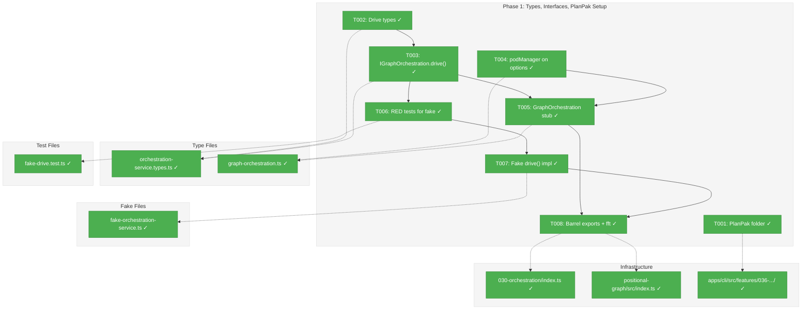
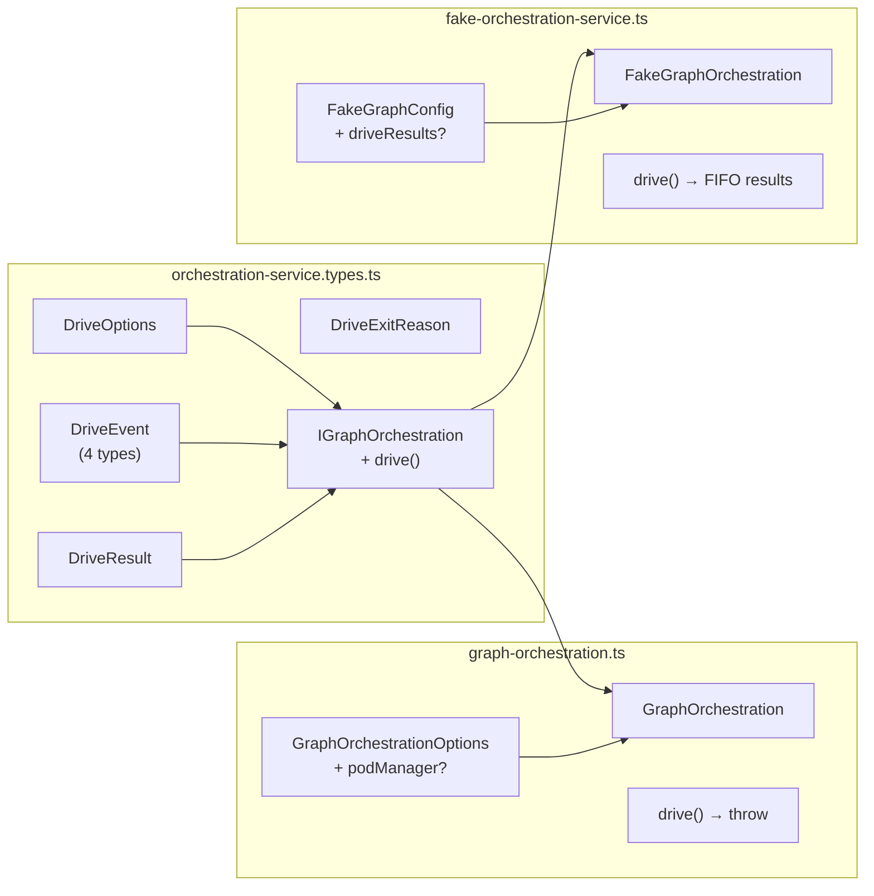
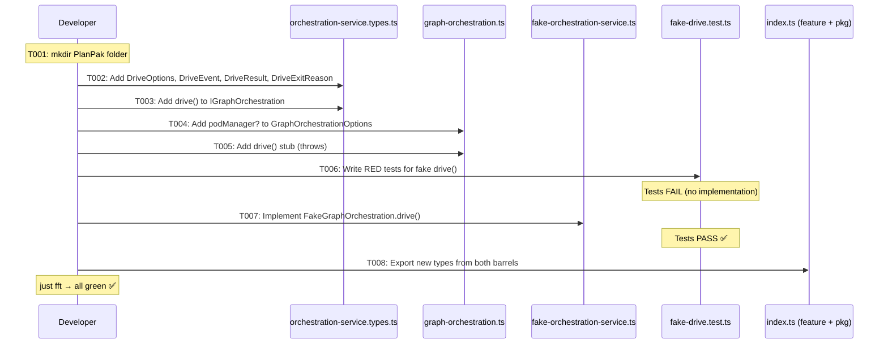

# Phase 1: Types, Interfaces, and PlanPak Setup – Tasks & Alignment Brief

**Spec**: [cli-orchestration-driver-spec.md](../../cli-orchestration-driver-spec.md)
**Plan**: [cli-orchestration-driver-plan.md](../../cli-orchestration-driver-plan.md)
**Date**: 2026-02-17

---

## Executive Briefing

### Purpose

This phase establishes the contract for `drive()` — the persistent polling loop on `IGraphOrchestration`. All subsequent phases depend on these types and interfaces being in place and compiling cleanly. This is the foundation that Phase 4 (implementation) and Phase 5 (CLI wiring) build on.

### What We're Building

Type definitions and interface extensions that formalize how `drive()` communicates:
- **DriveOptions**: Configuration for the polling loop (delays, max iterations, event callback)
- **DriveEvent**: Status updates emitted during driving (4 types: iteration, idle, status, error — no agent events per ADR-0012)
- **DriveResult**: What `drive()` returns when it exits (exit reason, iteration count, total actions)
- **FakeGraphOrchestration.drive()**: Test double with configurable results and call history
- **PlanPak folder**: `apps/cli/src/features/036-cli-orchestration-driver/` ready for Phase 5

### User Value

No user-visible change yet — this is plumbing. But it unblocks all 4 remaining phases and lets multiple contributors work in parallel on prompts, status view, and drive logic.

### Example

```typescript
// After Phase 1, this compiles:
const handle: IGraphOrchestration = await service.get(ctx, 'my-graph');
const result: DriveResult = await handle.drive({
  maxIterations: 50,
  actionDelayMs: 100,
  idleDelayMs: 10_000,
  onEvent: (event: DriveEvent) => console.log(event.type, event.message),
});
// result.exitReason === 'complete' | 'failed' | 'max-iterations'
```

---

## Objectives & Scope

### Objective

Define the `drive()` contract on `IGraphOrchestration`, add supporting types (`DriveOptions`, `DriveEvent`, `DriveResult`, `DriveExitReason`), implement the fake with test helpers, add optional `podManager` to `GraphOrchestrationOptions`, create the PlanPak feature folder, and ensure `just fft` passes cleanly.

### Goals

- ✅ Define `DriveOptions`, `DriveEvent`, `DriveResult`, `DriveExitReason` types
- ✅ Add `drive()` method signature to `IGraphOrchestration`
- ✅ Add `podManager?: IPodManager` to `GraphOrchestrationOptions` (optional in Phase 1)
- ✅ Add `drive()` stub to `GraphOrchestration` (throws not-implemented — Phase 4 fills it in)
- ✅ Implement `FakeGraphOrchestration.drive()` with `setDriveResult()` and `getDriveHistory()` helpers
- ✅ Write RED-then-GREEN tests for the fake
- ✅ Update barrel exports at feature and package level
- ✅ Create PlanPak feature folder for Phase 5
- ✅ `just fft` clean

### Non-Goals

- ❌ Implementing `drive()` logic (Phase 4)
- ❌ Prompt templates or AgentPod changes (Phase 2)
- ❌ `formatGraphStatus()` (Phase 3)
- ❌ CLI command registration (Phase 5)
- ❌ Making `podManager` required (stays optional permanently — `drive()` throws at runtime if missing, DYK#2)
- ❌ Updating `OrchestrationService` / `OrchestrationServiceDeps` / DI container (not needed — podManager is optional permanently)
- ❌ Updating existing test files that construct `GraphOrchestration` (not needed — podManager is optional)

---

## Pre-Implementation Audit

### Summary

| File | Action | Origin | Modified By | Recommendation |
|------|--------|--------|-------------|----------------|
| `apps/cli/src/features/036-cli-orchestration-driver/` | CREATE | Plan 036 | — | keep-as-is |
| `packages/positional-graph/src/features/030-orchestration/orchestration-service.types.ts` | MODIFY | Plan 030 P7 | Plan 030 P7 only | cross-plan-edit |
| `packages/positional-graph/src/features/030-orchestration/graph-orchestration.ts` | MODIFY | Plan 030 P7 | Plan 030 P7, Plan 035 P2 | cross-plan-edit |
| `packages/positional-graph/src/features/030-orchestration/fake-orchestration-service.ts` | MODIFY | Plan 030 P7 | Plan 030 P7 | cross-plan-edit |
| `packages/positional-graph/src/features/030-orchestration/index.ts` | MODIFY | Plan 030 P1 | Plans 030 P2-P7, Plan 035 P2 | cross-plan-edit |
| `packages/positional-graph/src/index.ts` | MODIFY | Plan 030 | Plans 030, 032, 035 | cross-plan-edit |
| `test/unit/positional-graph/features/030-orchestration/fake-drive.test.ts` | CREATE | Plan 036 | — | keep-as-is |

### Per-File Detail

#### `orchestration-service.types.ts`
- **Duplication check**: No `DriveOptions`, `DriveEvent`, `DriveResult`, or `DriveExitReason` types exist anywhere in the codebase. Clean addition.
- **Compliance**: ADR-0012 requires DriveEvent to contain exactly 4 orchestration-domain types (iteration, idle, status, error). Zero agent events. The 4 planned types are all orchestration-domain — compliant as designed.

#### `graph-orchestration.ts`
- **Compliance**: ADR-0004 — `GraphOrchestrationOptions` uses options-object pattern (6 deps). Adding `podManager?: IPodManager` as optional 7th follows established pattern. Interface-only import (not concrete `PodManager`).

#### `fake-orchestration-service.ts`
- **Compliance**: Adding `drive()` to `IGraphOrchestration` will break compilation until the fake is updated. Tasks T003 (interface) and T007 (fake implementation) should be done atomically or in quick succession.

#### `fake-drive.test.ts`
- **Duplication check**: Existing `fake-orchestration-service.test.ts` tests `run()` and `getReality()` only. No overlap with drive()-specific fake behavior. Clean addition.

### Compliance Check

No violations found. Three informational notes:

| Severity | File | Rule/ADR | Finding | Note |
|----------|------|----------|---------|------|
| INFO | `orchestration-service.types.ts` | ADR-0012 | DriveEvent union must contain only orchestration-domain types | Verify at implementation |
| INFO | `graph-orchestration.ts` | ADR-0012 | Adding `podManager` creates orchestration→pod interface dependency | Accepted per plan Finding 01 |
| INFO | `fake-orchestration-service.ts` | TypeScript | Interface change breaks compilation until fake updated | Implement T003+T007 together |

---

## Requirements Traceability

### Coverage Matrix

| AC | Description | Flow Summary | Files in Flow | Tasks | Status |
|----|-------------|-------------|---------------|-------|--------|
| AC-P1-1 | `drive()` on `IGraphOrchestration` | Define on interface → stub on GraphOrchestration → implement on fake → export from barrels | `orchestration-service.types.ts`, `graph-orchestration.ts`, `fake-orchestration-service.ts`, `030-orchestration/index.ts`, `positional-graph/src/index.ts` | T003, T005, T007, T008 | ✅ Complete |
| AC-P1-2 | `DriveEvent` has exactly 4 types | Define union type → export from barrels | `orchestration-service.types.ts`, `030-orchestration/index.ts`, `positional-graph/src/index.ts` | T002, T008 | ✅ Complete |
| AC-P1-3 | `FakeGraphOrchestration` implements `drive()` | Interface requires → fake implements with helpers → tests validate | `orchestration-service.types.ts`, `fake-orchestration-service.ts`, `fake-drive.test.ts` | T002, T006, T007 | ✅ Complete |
| AC-P1-4 | `GraphOrchestrationOptions` includes `podManager` | Add optional field → constructor stores | `graph-orchestration.ts` | T004 | ✅ Complete (optional — no cascade) |
| AC-P1-5 | `just fft` clean | All above compiles + tests pass | All files | T008 | ✅ Complete (depends on all prior) |

### Gaps Found

All gaps from requirements flow analysis have been resolved:

- **Gap 1** (GraphOrchestration needs drive() stub): Resolved by adding **T005**
- **Gaps 2-4** (podManager cascade to OrchestrationService, DI, tests): Resolved by making `podManager` **optional** in Phase 1 — no cascade needed. Phase 4 promotes to required.
- **Gap 5** (Package barrel re-export): Resolved by expanding **T008** scope to include `packages/positional-graph/src/index.ts`

### Orphan Files

| File | Task(s) | Assessment |
|------|---------|------------|
| `apps/cli/src/features/036-cli-orchestration-driver/` | T001 | Infrastructure — empty PlanPak folder for Phase 5 |

---

## Architecture Map

### Component Diagram
<!-- Status: grey=pending, orange=in-progress, green=completed, red=blocked -->
<!-- Updated by plan-6 during implementation -->



### Task-to-Component Mapping

<!-- Status: ⬜ Pending | 🟧 In Progress | ✅ Complete | 🔴 Blocked -->

| Task | Component(s) | Files | Status | Comment |
|------|-------------|-------|--------|---------|
| T001 | PlanPak Setup | `apps/cli/src/features/036-cli-orchestration-driver/` | ✅ Complete | Create empty feature folder |
| T002 | Type Definitions | `orchestration-service.types.ts` | ✅ Complete | DriveOptions, DriveEvent, DriveResult, DriveExitReason |
| T003 | Interface Extension | `orchestration-service.types.ts` | ✅ Complete | Add drive() to IGraphOrchestration |
| T004 | Constructor Options | `graph-orchestration.ts` | ✅ Complete | Optional podManager on GraphOrchestrationOptions |
| T005 | Stub Implementation | `graph-orchestration.ts` | ✅ Complete | drive() throws not-implemented |
| T006 | RED Tests | `fake-drive.test.ts` | ✅ Complete | Fake drive() behavior tests |
| T007 | Fake Implementation | `fake-orchestration-service.ts` | ✅ Complete | setDriveResult(), getDriveHistory() |
| T008 | Exports + Validation | `index.ts` (feature + package) | ✅ Complete | Barrel re-exports + just fft |

---

## Tasks

| Status | ID | Task | CS | Type | Dependencies | Absolute Path(s) | Validation | Subtasks | Notes |
|--------|------|------|-----|------|-------------|-------------------|------------|----------|-------|
| [x] | T001 | Create PlanPak feature folder `apps/cli/src/features/036-cli-orchestration-driver/` with `.gitkeep` | 1 | Setup | – | `/home/jak/substrate/033-real-agent-pods/apps/cli/src/features/036-cli-orchestration-driver/` | Directory exists with `.gitkeep` | – | plan-scoped |
| [x] | T002 | Define `DriveOptions`, `DriveEvent` (discriminated union), `DriveResult`, `DriveExitReason` types in `orchestration-service.types.ts`. `DriveEvent` is a proper discriminated union with typed payloads per variant: `iteration` carries `OrchestrationRunResult`, `error` carries `error?: unknown`, `idle` and `status` are message-only. `DriveEventType` derived via `DriveEvent['type']`. | 2 | Core | – | `/home/jak/substrate/033-real-agent-pods/packages/positional-graph/src/features/030-orchestration/orchestration-service.types.ts` | Types compile. DriveEvent is discriminated union with 4 variants. Consumers can narrow via `event.type` with full type safety. DriveExitReason: `complete \| failed \| max-iterations`. DriveOptions: `maxIterations?`, `actionDelayMs?`, `idleDelayMs?`, `onEvent?` | – | cross-plan-edit, Per Workshop 01 Part 5+8, ADR-0012, DYK#1 |
| [x] | T003 | Add `drive(options?: DriveOptions): Promise<DriveResult>` to `IGraphOrchestration` interface | 1 | Core | T002 | `/home/jak/substrate/033-real-agent-pods/packages/positional-graph/src/features/030-orchestration/orchestration-service.types.ts` | Interface compiles with drive() method | – | cross-plan-edit |
| [x] | T004 | Add `podManager?: IPodManager` (optional) to `GraphOrchestrationOptions` and store in constructor | 1 | Core | – | `/home/jak/substrate/033-real-agent-pods/packages/positional-graph/src/features/030-orchestration/graph-orchestration.ts` | Field exists on options type, constructor stores it. Optional permanently — `drive()` throws at runtime if missing. No cascade to service/DI/tests ever. | – | cross-plan-edit, Finding 01, DYK#2 |
| [x] | T005 | Add `drive()` stub to `GraphOrchestration` class that throws `Error('drive() not implemented — see Phase 4')` | 1 | Core | T003, T004 | `/home/jak/substrate/033-real-agent-pods/packages/positional-graph/src/features/030-orchestration/graph-orchestration.ts` | Class compiles, implements IGraphOrchestration including drive() | – | cross-plan-edit, Gap 1 fix |
| [x] | T006 | Write RED tests for `FakeGraphOrchestration.drive()`: returns configured DriveResult, tracks call history, default result when none configured | 2 | Test | T003 | `/home/jak/substrate/033-real-agent-pods/test/unit/positional-graph/features/030-orchestration/fake-drive.test.ts` | Tests written and failing (no implementation yet). Includes 5-field Test Doc block. | – | plan-scoped |
| [x] | T007 | Implement `FakeGraphOrchestration.drive()` with test helpers: `setDriveResult()`, `getDriveHistory()`. Extend `FakeGraphConfig` with optional `driveResults` | 2 | Core | T006 | `/home/jak/substrate/033-real-agent-pods/packages/positional-graph/src/features/030-orchestration/fake-orchestration-service.ts` | All tests from T006 pass. Fake supports configurable drive results and call tracking. | – | cross-plan-edit |
| [x] | T008 | Update barrel exports: add `DriveOptions`, `DriveEvent`, `DriveResult`, `DriveExitReason`, `DriveEventType` to feature barrel (`030-orchestration/index.ts`) and package barrel (`positional-graph/src/index.ts`). Run `just fft`. | 1 | Integration | T005, T007 | `/home/jak/substrate/033-real-agent-pods/packages/positional-graph/src/features/030-orchestration/index.ts`, `/home/jak/substrate/033-real-agent-pods/packages/positional-graph/src/index.ts` | All new types exported from both barrels. `just fft` passes clean (lint + format + test). | – | cross-plan-edit, Gap 5 fix |

---

## Alignment Brief

### Critical Findings Affecting This Phase

| Finding | Title | Constraint | Tasks |
|---------|-------|-----------|-------|
| Finding 01 | GraphOrchestration lacks podManager access | Must add `podManager` to `GraphOrchestrationOptions`. Made optional in Phase 1 to avoid cascade. | T004 |
| Finding 02 | FakeGraphOrchestration must implement drive() | Adding drive() to interface requires fake implementation. | T006, T007 |
| Finding 06 | stopReason mapping is exhaustive | DriveExitReason maps cleanly from OrchestrationStopReason. No additional mapping layer needed. | T002 |

### ADR Decision Constraints

- **ADR-0012: Workflow Domain Boundaries** — DriveEvent MUST have exactly 4 orchestration-domain types. Zero agent events, zero pod events. Constrains: T002. The litmus test: "Can I define DriveEvent without importing anything from agent or pod domains?" Answer must be yes.
- **ADR-0004: DI Container Architecture** — `GraphOrchestrationOptions` uses options-object pattern. Adding `podManager` follows same pattern. Constrains: T004.
- **ADR-0009: Module Registration Functions** — No new module registration needed in Phase 1 (podManager is optional, no DI changes). Phase 4 will update registrations.

### PlanPak Placement Rules

| Classification | Files | Rule |
|---------------|-------|------|
| plan-scoped | T001 folder, T006 test | New files in PlanPak feature folder or test conventions |
| cross-plan-edit | T002-T005, T007-T008 | Edits to existing 030-orchestration files (plan that owns them is 030) |

### Invariants & Guardrails

- DriveEvent is **orchestration-domain only** — no imports from agent/pod/event domains
- `podManager` is **optional** in Phase 1 — becomes required in Phase 4
- `GraphOrchestration.drive()` is a **stub** — throws not-implemented until Phase 4
- All type properties are `readonly` (immutability pattern from existing codebase)

### Inputs to Read

Before implementing, read these files in full:
- `/home/jak/substrate/033-real-agent-pods/packages/positional-graph/src/features/030-orchestration/orchestration-service.types.ts` (current types)
- `/home/jak/substrate/033-real-agent-pods/packages/positional-graph/src/features/030-orchestration/graph-orchestration.ts` (current class + options)
- `/home/jak/substrate/033-real-agent-pods/packages/positional-graph/src/features/030-orchestration/fake-orchestration-service.ts` (current fake)
- `/home/jak/substrate/033-real-agent-pods/packages/positional-graph/src/features/030-orchestration/index.ts` (barrel)
- `/home/jak/substrate/033-real-agent-pods/packages/positional-graph/src/index.ts` (package barrel)
- Workshop 01 Part 8: `docs/plans/036-cli-orchestration-driver/workshops/01-cli-driver-experience-and-validation.md` lines 750-826

### Visual Alignment: System Flow



### Visual Alignment: Implementation Sequence



### Test Plan (Full TDD)

**Policy**: Fakes over mocks — no `vi.mock`/`jest.mock`. All test doubles implement real interfaces.

#### Test File: `fake-drive.test.ts`

```
Test Doc:
- Why: Validate FakeGraphOrchestration.drive() contract before Phase 4 relies on it
- Contract: Fake returns configured DriveResults in FIFO order; tracks call history
- Usage Notes: Use setDriveResult() to queue results; getDriveHistory() to inspect calls
- Quality Contribution: Catches fake/real parity drift when Phase 4 implements real drive()
- Worked Example: setDriveResult({exitReason:'complete',iterations:3,totalActions:5}) → drive() returns that result
```

| Test | Rationale | Expected |
|------|-----------|----------|
| `returns configured DriveResult` | Core contract — fake must return what you tell it | `drive()` returns the queued result |
| `returns results in FIFO order` | Multiple calls return sequential results (last repeats) | Call 1 → result A, call 2 → result B, call 3 → result B |
| `tracks call history with options` | Test introspection — verify drive was called with correct options | `getDriveHistory()` returns array of passed options |
| `throws when no result configured` | Fail-fast — forgetting setup doesn't silently pass | `drive()` throws `Error('No DriveResult configured on FakeGraphOrchestration')` |

### Step-by-Step Implementation Outline

1. **T001**: `mkdir -p apps/cli/src/features/036-cli-orchestration-driver && touch .gitkeep`
2. **T002**: Add type definitions after the existing `FakeGraphConfig` in `orchestration-service.types.ts`:
   - `DriveExitReason` = `'complete' | 'failed' | 'max-iterations'`
   - `DriveResult` = `{ readonly exitReason: DriveExitReason; readonly iterations: number; readonly totalActions: number }`
   - `DriveEvent` as a **proper discriminated union** (not flat `data?: unknown`):
     ```typescript
     type DriveEvent =
       | { readonly type: 'iteration'; readonly message: string; readonly data: OrchestrationRunResult }
       | { readonly type: 'idle'; readonly message: string }
       | { readonly type: 'status'; readonly message: string }
       | { readonly type: 'error'; readonly message: string; readonly error?: unknown };
     ```
   - `DriveEventType` = `DriveEvent['type']` (derived, not separate)
   - `DriveOptions` = `{ readonly maxIterations?: number; readonly actionDelayMs?: number; readonly idleDelayMs?: number; readonly onEvent?: (event: DriveEvent) => void | Promise<void> }`
3. **T003**: Add `drive(options?: DriveOptions): Promise<DriveResult>` to `IGraphOrchestration` interface
4. **T004**: Import `IPodManager` in `graph-orchestration.ts`, add `podManager?: IPodManager` to `GraphOrchestrationOptions`, store in constructor as `this.podManager`
5. **T005**: Add `async drive(options?: DriveOptions): Promise<DriveResult> { throw new Error('drive() not implemented — see Phase 4'); }` to `GraphOrchestration` class
6. **T006**: Create `fake-drive.test.ts` with 4 tests per test plan (all RED)
7. **T007**: Add `driveResults?` to `FakeGraphConfig`, implement `drive()` with FIFO queue + default, add `setDriveResult()` and `getDriveHistory()` helpers
8. **T008**: Add `export type { DriveOptions, DriveEvent, DriveResult, DriveExitReason, DriveEventType }` to feature barrel; re-export from package barrel. Run `just fft`.

### Commands to Run

```bash
# Run tests (unit only, fast feedback)
cd /home/jak/substrate/033-real-agent-pods
pnpm test -- --run test/unit/positional-graph/features/030-orchestration/fake-drive.test.ts

# Full quality gate
just fft

# Type check only (quick compile check)
pnpm typecheck
```

### Risks & Unknowns

| Risk | Severity | Mitigation |
|------|----------|------------|
| Adding drive() to interface breaks downstream TypeScript compilation | Medium | T005 adds stub immediately — compile stays green |
| podManager optional → forgetting to wire in DI | Low | `drive()` throws clear error at runtime if podManager not provided |
| FakeGraphConfig extension breaks existing tests | Low | `driveResults` is optional — existing configs unchanged |

### Ready Check

- [x] ADR constraints mapped to tasks (ADR-0012 → T002, ADR-0004 → T004)
- [ ] Inputs read (implementer reads files before starting)
- [ ] All gaps resolved (T005 for stub, T008 for package barrel, optional podManager)
- [ ] `just fft` baseline green before changes

---

## Phase Footnote Stubs

_Footnotes added during implementation by plan-6a._

| Footnote | Task | Description |
|----------|------|-------------|
| | | |

---

## Evidence Artifacts

- **Execution log**: `docs/plans/036-cli-orchestration-driver/tasks/phase-1-types-interfaces-and-planpak-setup/execution.log.md` (created by plan-6)
- **Test output**: Captured in execution log after `just fft`

---

## Discoveries & Learnings

_Populated during implementation by plan-6. Log anything of interest to your future self._

| Date | Task | Type | Discovery | Resolution | References |
|------|------|------|-----------|------------|------------|
| 2026-02-17 | T006 | gotcha | `buildFakeReality` not available via package import (`@chainglass/positional-graph`) — ESM-only package, no CJS entry | Used direct relative import matching existing test file patterns | log#task-t006 |

**Types**: `gotcha` | `research-needed` | `unexpected-behavior` | `workaround` | `decision` | `debt` | `insight`

**What to log**:
- Things that didn't work as expected
- External research that was required
- Implementation troubles and how they were resolved
- Gotchas and edge cases discovered
- Decisions made during implementation
- Technical debt introduced (and why)
- Insights that future phases should know about

_See also: `execution.log.md` for detailed narrative._

---

## Directory Layout

```
docs/plans/036-cli-orchestration-driver/
  ├── cli-orchestration-driver-plan.md
  ├── cli-orchestration-driver-spec.md → ../033-real-agent-pods/spec-b-...
  ├── workshops/
  │   ├── 01-cli-driver-experience-and-validation.md
  │   └── 02-workflow-domain-boundaries.md
  └── tasks/
      └── phase-1-types-interfaces-and-planpak-setup/
          ├── tasks.md              ← this file
          ├── tasks.fltplan.md      ← generated by /plan-5b
          └── execution.log.md     ← created by /plan-6
```
