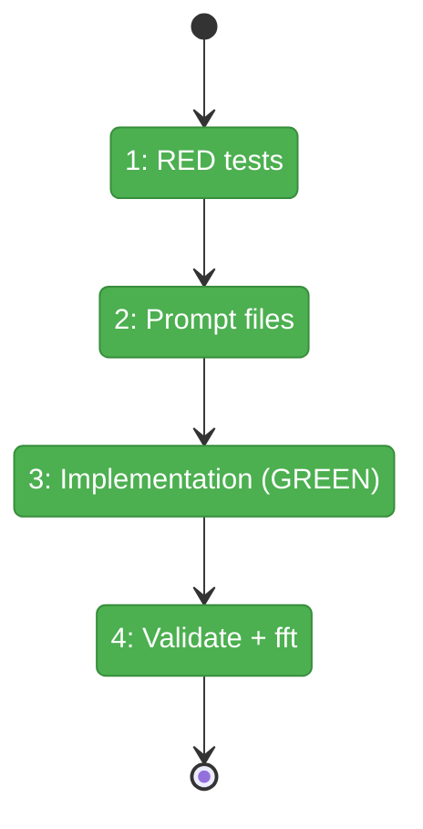
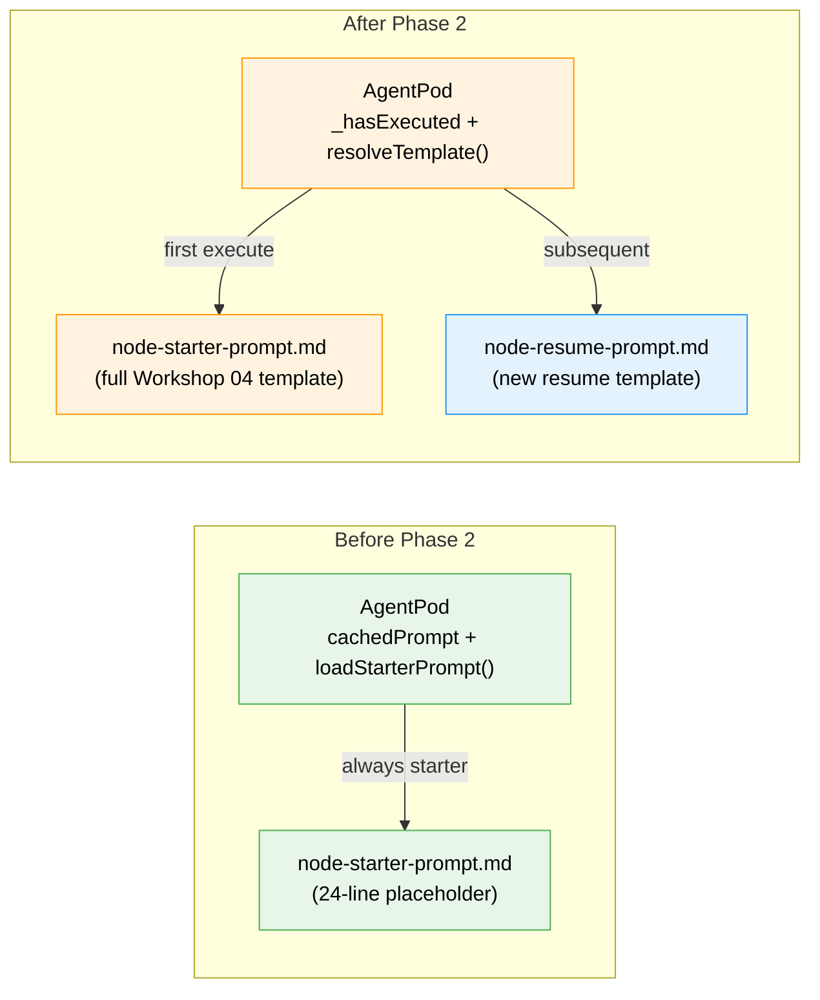

# Flight Plan: Phase 2 — Prompt Templates and AgentPod Selection

**Plan**: [cli-orchestration-driver-plan.md](../../cli-orchestration-driver-plan.md)
**Phase**: Phase 2: Prompt Templates and AgentPod Selection
**Generated**: 2026-02-17
**Status**: Complete ✅

---

## Departure → Destination

**Where we are**: AgentPod has a 24-line placeholder prompt with no placeholders, no protocol instructions, and a module-level cache. Agents get generic instructions that don't tell them which graph, node, or work unit they're operating on. There's no resume prompt — only a deprecated `resumeWithAnswer()` that builds an ad-hoc string.

**Where we're going**: By the end of this phase, agents receive a full protocol manual (~110 lines) with their specific assignment resolved from `{{placeholders}}`. Resumed agents get a focused continuation prompt. The selection logic (`_hasExecuted`) correctly picks starter vs resume, even for inherited sessions.

---

## Flight Status

**Legend**: grey = pending | yellow = active | red = blocked/needs input | green = done

---

## Stages

- [x] **Stage 1: Write RED tests** — template resolution (4 tests) + prompt selection (3 tests) in `prompt-selection.test.ts`
- [x] **Stage 2: Create prompt files** — replace `node-starter-prompt.md`, create `node-resume-prompt.md` from Workshop 04
- [x] **Stage 3: Implement in AgentPod** — `resolveTemplate()`, `_hasExecuted`, remove cache, add `loadResumePrompt()` → tests GREEN
- [x] **Stage 4: Validate** — `just fft` clean, existing pod tests still pass

---

## Acceptance Criteria

- [x] Starter prompt has {{graphSlug}}, {{nodeId}}, {{unitSlug}} placeholders (AC-13)
- [x] Starter prompt contains full protocol (accept, read, work, save, complete) (AC-14)
- [x] Starter prompt includes question protocol (AC-15) and error handling (AC-16)
- [x] Template resolved before passing to agent (AC-17)
- [x] Resume prompt exists (AC-18) with continuation instructions (AC-19)
- [x] First execute → starter, subsequent → resume (AC-20)
- [x] Inherited session, first execute → starter (AC-20)
- [x] `just fft` clean

---

## Goals & Non-Goals

**Goals**:
- Replace starter prompt with full Workshop 04 template
- Create resume prompt from Workshop 04
- Implement template resolution and prompt selection in AgentPod
- Remove module-level prompt cache
- `just fft` clean

**Non-Goals**:
- Modifying `resumeWithAnswer()` (deprecated)
- Adding new prompt types
- Caching prompts
- DI container changes
- Modifying existing test files

---

## Architecture: Before & After

**Legend**: existing (green) | changed (orange) | new (blue)

---

## Checklist

- [x] T001: Write RED template resolution tests (CS-2)
- [x] T002: Write RED prompt selection tests (CS-2)
- [x] T003: Replace node-starter-prompt.md (CS-2)
- [x] T004: Create node-resume-prompt.md (CS-1)
- [x] T005: Implement resolveTemplate() + _hasExecuted in AgentPod (CS-3)
- [x] T006: Refactor + just fft (CS-1)

---

## PlanPak

Active — prompt files are cross-plan-edits to `030-orchestration/`. Test file is plan-scoped.
