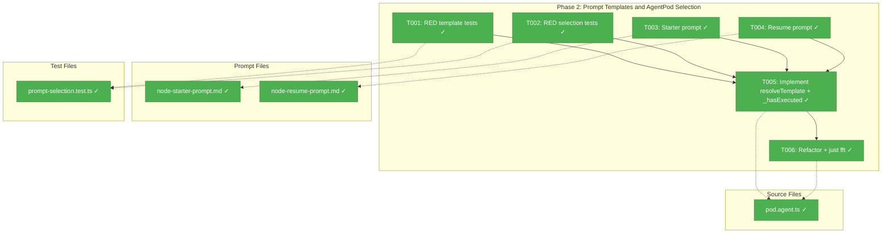
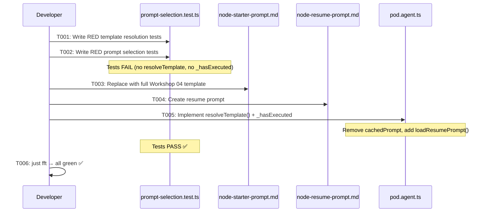

# Phase 2: Prompt Templates and AgentPod Selection – Tasks & Alignment Brief

**Spec**: [cli-orchestration-driver-spec.md](../../cli-orchestration-driver-spec.md)
**Plan**: [cli-orchestration-driver-plan.md](../../cli-orchestration-driver-plan.md)
**Date**: 2026-02-17

---

## Executive Briefing

### Purpose

This phase replaces the 24-line placeholder starter prompt with the full Workshop 04 template, creates the resume prompt, and implements prompt selection logic in AgentPod. After this, agents receive proper instructions for their workflow tasks — including CLI commands, the 5-step protocol, question handling, and error handling — with all placeholders resolved to the specific graph/node/unit they're working on.

### What We're Building

- **Starter prompt**: Full ~110-line template with `{{graphSlug}}`, `{{nodeId}}`, `{{unitSlug}}` placeholders. Teaches agents the 5-step protocol (accept → read → work → save → complete), question protocol, and error handling.
- **Resume prompt**: ~50-line template for agents resuming after a pause. Teaches them to check for answers, continue work, and complete.
- **Template resolution**: `resolveTemplate()` method on AgentPod that replaces all `{{placeholders}}` before passing to the agent.
- **Prompt selection**: `_hasExecuted` flag on AgentPod — first `execute()` → starter, subsequent → resume. Inherited sessions get starter too (agent needs to learn ITS task).

### User Value

Agents now receive actionable, context-specific instructions instead of generic placeholder text. They know which graph, node, and work unit they're operating on, and have a complete protocol reference for all workflow operations.

### Example

**Before** (placeholder):
```
You are an agent operating within a structured workflow system...
```

**After** (resolved starter):
```
# Workflow Agent Instructions

## Your Assignment
- **Graph**: my-pipeline
- **Node**: spec-writer
- **Work Unit**: generate-spec

## Step 1: Accept Your Assignment
cg wf node accept my-pipeline spec-writer
...
```

---

## Objectives & Scope

### Objective

Replace the placeholder starter prompt, create the resume prompt, implement template resolution and prompt selection logic in AgentPod, and ensure all existing tests continue to pass.

### Goals

- ✅ Replace `node-starter-prompt.md` with full Workshop 04 template (AC-13 through AC-16)
- ✅ Create `node-resume-prompt.md` with Workshop 04 resume template (AC-18, AC-19)
- ✅ Implement `resolveTemplate()` on AgentPod (AC-17)
- ✅ Implement `_hasExecuted` flag for starter vs resume selection (AC-20)
- ✅ Remove module-level prompt cache (Finding 03 — reload from disk each call)
- ✅ Write tests for template resolution and selection logic
- ✅ `just fft` clean

### Non-Goals

- ❌ Modifying `resumeWithAnswer()` (deprecated, handled by event system)
- ❌ Adding new prompt types (only starter + resume)
- ❌ Caching prompts (explicitly removed per Finding 03)
- ❌ Changing ODS, PodManager, or PodExecuteOptions (already correct)
- ❌ DI container changes (no new dependencies)
- ❌ Modifying existing pod.test.ts or pod-agent-wiring.test.ts

---

## Pre-Implementation Audit

### Summary

| File | Action | Origin | Modified By | Recommendation |
|------|--------|--------|-------------|----------------|
| `node-starter-prompt.md` | REPLACE | Plan 030 P4 | — | cross-plan-edit |
| `node-resume-prompt.md` | CREATE | — | — | keep-as-is |
| `pod.agent.ts` | MODIFY | Plan 030 P4 | Plan 035 P2 | cross-plan-edit |
| `prompt-selection.test.ts` | CREATE | — | — | keep-as-is |

### Per-File Detail

#### `node-starter-prompt.md`
- **Provenance**: Created by Plan 030, Phase 4, Task T001 (commit `2974085`). Never modified since.
- **Current content**: 24-line generic placeholder. No `{{placeholders}}`, no CLI commands, no protocol steps.
- **Duplication check**: `BootstrapPromptService` in `packages/workgraph/` has parallel prompt logic — different system (legacy), not imported by positional-graph. No conflict.

#### `pod.agent.ts`
- **Provenance**: Created Plan 030 P4. Modified Plan 035 P2 (rewired to `IAgentInstance`). This will be the third cross-plan modification.
- **Current structure**: Module-level `cachedPrompt` + `loadStarterPrompt()` (lines 17-38). `execute()` calls `loadStarterPrompt()` at line 54. No `_hasExecuted`, no `resolveTemplate()`.
- **Risk**: `pod.test.ts` lines 137-147 check `prompt.length > 0` — will still pass (prompt is loaded from replaced file). No breakage.

#### `prompt-selection.test.ts`
- **Duplication check**: Existing `pod.test.ts` tests prompt loading at integration level (`prompt.length > 0`). New test file covers template resolution and selection logic specifically — no overlap.

### Compliance Check

No violations found.

| Severity | File | Rule/ADR | Finding |
|----------|------|----------|---------|
| INFO | `node-starter-prompt.md` | ADR-0012 | Question protocol in prompt must reference CLI commands only, not event handler internals |
| INFO | `pod.agent.ts` | R-TEST-007 | Tests must use `FakeAgentInstance`, not `vi.mock()` |

---

## Requirements Traceability

### Coverage Matrix

| AC | Description | Flow Summary | Files in Flow | Tasks | Status |
|----|-------------|-------------|---------------|-------|--------|
| AC-13 | Starter prompt has {{placeholders}} | node-starter-prompt.md ← pod.agent.ts reads | 2 | T003, T001 | ✅ Complete |
| AC-14 | Full protocol (accept, read, work, save, complete) | node-starter-prompt.md content | 1 | T003 | ✅ Complete |
| AC-15 | Question protocol | node-starter-prompt.md content | 1 | T003 | ✅ Complete |
| AC-16 | Error handling | node-starter-prompt.md content | 1 | T003 | ✅ Complete |
| AC-17 | Template resolved before passing to agent | pod.agent.ts (resolveTemplate → agentInstance.run) | 1 | T001, T005 | ✅ Complete |
| AC-18 | Resume prompt exists | node-resume-prompt.md | 1 | T004 | ✅ Complete |
| AC-19 | Resume prompt has get-answer, continue, complete | node-resume-prompt.md content | 1 | T004 | ✅ Complete |
| AC-20 | First→starter, subsequent→resume, inherited→starter | pod.agent.ts (_hasExecuted flag) | 1 | T002, T005 | ✅ Complete |

### Gaps Found

None — all 8 acceptance criteria have complete file coverage.

### Key Flow Verification

- `PodExecuteOptions.graphSlug` already exists (`pod.types.ts:38`) — no change needed
- ODS already passes `graphSlug` in execute options (`ods.ts:121`) — no change needed
- `loadStarterPrompt()` is module-internal (not exported) — no external callers break when cache removed
- `resumeWithAnswer()` is deprecated — unchanged by this phase

---

## Architecture Map

### Component Diagram



### Task-to-Component Mapping

| Task | Component(s) | Files | Status | Comment |
|------|-------------|-------|--------|---------|
| T001 | Template Resolution Tests | `prompt-selection.test.ts` | ✅ Complete | RED: {{placeholders}} resolved, no {{ remains |
| T002 | Selection Logic Tests | `prompt-selection.test.ts` | ✅ Complete | RED: first→starter, second→resume, inherited→starter |
| T003 | Starter Prompt | `node-starter-prompt.md` | ✅ Complete | Full Workshop 04 template with 3 placeholders |
| T004 | Resume Prompt | `node-resume-prompt.md` | ✅ Complete | Workshop 04 resume template with 2 placeholders |
| T005 | AgentPod Implementation | `pod.agent.ts` | ✅ Complete | resolveTemplate(), _hasExecuted, remove cache |
| T006 | Validation | `pod.agent.ts`, `prompt-selection.test.ts` | ✅ Complete | just fft clean |

---

## Tasks

| Status | ID | Task | CS | Type | Dependencies | Absolute Path(s) | Validation | Subtasks | Notes |
|--------|------|------|-----|------|-------------|-------------------|------------|----------|-------|
| [x] | T001 | Write RED tests for template resolution: all `{{graphSlug}}`, `{{nodeId}}`, `{{unitSlug}}` resolved; no `{{` remains in output; correct values substituted. Use `FakeAgentInstance` to capture prompt passed to `run()`. | 2 | Test | – | `/home/jak/substrate/033-real-agent-pods/test/unit/positional-graph/features/030-orchestration/prompt-selection.test.ts` | Tests written and failing. Includes 5-field Test Doc block. | – | plan-scoped, AC-13, AC-17 |
| [x] | T002 | Write RED tests for prompt selection (`_hasExecuted`): first execute → starter prompt (contains "Accept Your Assignment"), second execute → resume prompt (contains "Resume Instructions"), inherited session first execute → still starter. | 2 | Test | – | `/home/jak/substrate/033-real-agent-pods/test/unit/positional-graph/features/030-orchestration/prompt-selection.test.ts` | Tests written and failing. 3 scenarios covered. | – | plan-scoped, AC-20, Finding 04 |
| [x] | T003 | Replace `node-starter-prompt.md` with full Workshop 04 starter template. Must contain: 3 placeholders (`{{graphSlug}}`, `{{nodeId}}`, `{{unitSlug}}`), 5-step protocol, question protocol, error handling, rules. | 2 | Core | – | `/home/jak/substrate/033-real-agent-pods/packages/positional-graph/src/features/030-orchestration/node-starter-prompt.md` | File contains all Workshop 04 sections. `{{graphSlug}}` appears in CLI command examples. No hardcoded graph/node values. | – | cross-plan-edit, AC-13 through AC-16, Per Workshop 04 |
| [x] | T004 | Create `node-resume-prompt.md` per Workshop 04 resume template. Must contain: 2 placeholders (`{{graphSlug}}`, `{{nodeId}}`), check-for-answers, continue-work, save-and-complete sections. | 1 | Core | – | `/home/jak/substrate/033-real-agent-pods/packages/positional-graph/src/features/030-orchestration/node-resume-prompt.md` | File exists with resume instructions. `{{graphSlug}}` and `{{nodeId}}` present. | – | plan-scoped (new), AC-18, AC-19, Per Workshop 04 |
| [x] | T005 | Implement `resolveTemplate()` and `_hasExecuted` selection in AgentPod. Remove module-level `cachedPrompt`. Add `loadResumePrompt()`. In `execute()`: select prompt via `_hasExecuted`, resolve template, set flag, pass to agent. | 3 | Core | T001, T002, T003, T004 | `/home/jak/substrate/033-real-agent-pods/packages/positional-graph/src/features/030-orchestration/pod.agent.ts` | All tests from T001-T002 pass. Module-level cache gone. Both prompts loaded from disk each call. `_hasExecuted` starts false, set true after first execute. | – | cross-plan-edit, Finding 03, Finding 04 |
| [x] | T006 | Refactor and verify. Run `just fft`. Ensure existing `pod.test.ts` and `pod-agent-wiring.test.ts` still pass. | 1 | Integration | T005 | `/home/jak/substrate/033-real-agent-pods/packages/positional-graph/src/features/030-orchestration/pod.agent.ts`, `/home/jak/substrate/033-real-agent-pods/test/unit/positional-graph/features/030-orchestration/prompt-selection.test.ts` | `just fft` passes clean. All existing pod tests green. | – | |

---

## Alignment Brief

### Phase 1 Review Summary

**Deliverables available from Phase 1:**
- `DriveOptions`, `DriveEvent` (discriminated union, 4 variants), `DriveResult`, `DriveExitReason`, `DriveEventType` — all exported from feature and package barrels
- `IGraphOrchestration.drive()` method signature
- `GraphOrchestrationOptions.podManager?: IPodManager` (optional permanently)
- `FakeGraphOrchestration.drive()` with `setDriveResult()` / `getDriveHistory()` helpers
- PlanPak folder `apps/cli/src/features/036-cli-orchestration-driver/`

**Key lessons from Phase 1:**
- ESM import gotcha: `buildFakeReality` not available via package import — use direct relative imports in tests
- Optional fields avoid cascade — design validated
- Tasks done atomically to keep compilation green (T003+T007 in Phase 1 → T003+T004+T005 in this phase)

**Phase 2 does NOT depend on Phase 1 deliverables** except:
- The PlanPak folder exists (T001 Phase 1)
- `PodExecuteOptions.graphSlug` is confirmed available (verified in Phase 1 requirements flow)

### Critical Findings Affecting This Phase

| Finding | Title | Constraint | Tasks |
|---------|-------|-----------|-------|
| Finding 03 | Prompt caching must be removed | Module-level `cachedPrompt` must go. Reload from disk each `execute()` call. No caching — development iteration. | T005 |
| Finding 04 | `_hasExecuted` is correct prompt discriminator | `sessionId` alone cannot distinguish inherited-session-first-run from same-node-resume. `_hasExecuted` flag on the pod instance is correct. | T002, T005 |
| Finding 05 | Prompt .md files may not be in dist/ | Existing `node-starter-prompt.md` already works in built CLI — file resolution pattern is proven. Follow same pattern for resume. | T004 |

### ADR Decision Constraints

- **ADR-0012: Workflow Domain Boundaries** — Prompts are pod-domain. `resolveTemplate()` is pod-internal logic. Starter prompt's question protocol must reference CLI commands only, not event handler internals. Constrains: T003, T005.
- **ADR-0004**: No DI changes in this phase. N/A.

### PlanPak Placement Rules

| Classification | Files | Rule |
|---------------|-------|------|
| plan-scoped | T001/T002 test, T004 resume prompt | New files |
| cross-plan-edit | T003 starter prompt, T005 pod.agent.ts | Edits to Plan 030 P4 files |

### Invariants & Guardrails

- `resolveTemplate()` is a private method — not exported, not in barrel
- `_hasExecuted` starts `false`, set to `true` after first `execute()` call — never reset
- Both prompts loaded from disk every call — no caching
- `resumeWithAnswer()` is unchanged (deprecated, separate concern)
- Existing `pod.test.ts` must remain green

### Inputs to Read

Before implementing, read these files in full:
- `/home/jak/substrate/033-real-agent-pods/packages/positional-graph/src/features/030-orchestration/pod.agent.ts` (current implementation)
- `/home/jak/substrate/033-real-agent-pods/packages/positional-graph/src/features/030-orchestration/pod.types.ts` (PodExecuteOptions — verify graphSlug)
- `/home/jak/substrate/033-real-agent-pods/packages/positional-graph/src/features/030-orchestration/node-starter-prompt.md` (current placeholder)
- `/home/jak/substrate/033-real-agent-pods/docs/plans/033-real-agent-pods/workshops/04-node-starter-and-resume-prompts.md` (Workshop 04 — lines 118-230 for starter, 277-325 for resume, 374-380 for resolution, 560-590 for selection)
- `/home/jak/substrate/033-real-agent-pods/test/unit/positional-graph/features/030-orchestration/pod.test.ts` (existing tests — ensure no breakage)

### Visual Alignment: Implementation Sequence



### Test Plan (Full TDD)

**Policy**: Fakes over mocks — no `vi.mock`/`jest.mock`. Use `FakeAgentInstance` from `@chainglass/shared`.

#### Test File: `prompt-selection.test.ts`

```
Test Doc:
- Why: Validate prompt template resolution and starter/resume selection before agents run real tasks
- Contract: resolveTemplate replaces all {{placeholders}}; _hasExecuted discriminates starter vs resume
- Usage Notes: Tests construct AgentPod directly with FakeAgentInstance to capture prompt passed to run()
- Quality Contribution: Catches placeholder leaks (unresolved {{...}}) and wrong prompt selection
- Worked Example: AgentPod('node-1', fakeInstance, 'unit-1').execute({graphSlug:'g1',...}) → prompt contains 'g1', 'node-1', 'unit-1'
```

| Test | AC | Rationale | Expected |
|------|----|-----------|----------|
| `resolves all {{graphSlug}} placeholders` | AC-13, AC-17 | Core contract — agent receives context-specific instructions | Prompt contains literal graphSlug value, no `{{graphSlug}}` remains |
| `resolves all {{nodeId}} placeholders` | AC-13, AC-17 | Node identity must be resolved | Prompt contains literal nodeId value |
| `resolves all {{unitSlug}} placeholders` | AC-13, AC-17 | Unit identity must be resolved | Prompt contains literal unitSlug value |
| `no unresolved {{...}} remain after resolution` | AC-17 | Safety check — catches missed placeholders | No `{{` substring in resolved output |
| `first execute uses starter prompt` | AC-20 | Selection logic — fresh pod gets full protocol | Prompt contains "Accept Your Assignment" |
| `second execute uses resume prompt` | AC-20 | Selection logic — resumed pod gets continuation | Prompt contains "Resume Instructions" |
| `inherited session, first execute uses starter` | AC-20 | Critical edge case — inherited session ≠ resume | Pod with pre-existing sessionId still gets starter on first execute |

### Step-by-Step Implementation Outline

1. **T001**: Create `prompt-selection.test.ts`. Write 4 template resolution tests using `FakeAgentInstance` to capture prompt. All RED (no `resolveTemplate` exists).
2. **T002**: Add 3 prompt selection tests to the same file. All RED (no `_hasExecuted` exists).
3. **T003**: Replace `node-starter-prompt.md` content with Workshop 04 starter template (lines 119-230). Verify 3 placeholders present.
4. **T004**: Create `node-resume-prompt.md` with Workshop 04 resume template (lines 278-325). Verify 2 placeholders present.
5. **T005**: Modify `pod.agent.ts`:
   - Remove `let cachedPrompt` and cache logic in `loadStarterPrompt()`
   - Make `loadStarterPrompt()` read from disk each call
   - Add `loadResumePrompt()` function
   - Add `private _hasExecuted = false` to `AgentPod`
   - Add `private resolveTemplate(template: string, options: PodExecuteOptions): string`
   - Update `execute()`: select template via `_hasExecuted`, resolve, set flag, pass to agent
6. **T006**: Run `just fft`. Verify existing tests pass. Clean up any lint issues.

### Commands to Run

```bash
# Run just the new tests (fast feedback)
cd /home/jak/substrate/033-real-agent-pods
pnpm test -- --run test/unit/positional-graph/features/030-orchestration/prompt-selection.test.ts

# Run all pod-related tests (check no breakage)
pnpm test -- --run test/unit/positional-graph/features/030-orchestration/pod.test.ts test/unit/positional-graph/features/030-orchestration/pod-agent-wiring.test.ts test/unit/positional-graph/features/030-orchestration/prompt-selection.test.ts

# Full quality gate
just fft
```

### Risks & Unknowns

| Risk | Severity | Mitigation |
|------|----------|------------|
| Prompt .md not copied to dist/ for built CLI | Medium | Existing prompt works today (Finding 05). Follow same resolution pattern. |
| Removing cache increases disk I/O | Low | Prompts are small files. Intentional per Finding 03. |
| Existing pod.test.ts prompt assertion breaks | Low | Test checks `prompt.length > 0` — still true with new content |
| Pod destroyed + recreated → _hasExecuted resets → double-accept | Low | Edge case: agent gets starter prompt again, tries `accept` on already-accepted node. Event validation should reject gracefully. Needs manual validation at some stage (DYK#2). |

### Ready Check

- [x] ADR constraints mapped to tasks (ADR-0012 → T003, T005)
- [ ] Inputs read (implementer reads files before starting)
- [ ] All gaps resolved (no gaps found in requirements flow)
- [ ] `just fft` baseline green before changes

---

## Phase Footnote Stubs

_Footnotes added during implementation by plan-6a._

| Footnote | Task | Description |
|----------|------|-------------|
| | | |

---

## Evidence Artifacts

- **Execution log**: `docs/plans/036-cli-orchestration-driver/tasks/phase-2-prompt-templates-and-agentpod-selection/execution.log.md` (created by plan-6)
- **Test output**: Captured in execution log after `just fft`

---

## Discoveries & Learnings

_Populated during implementation by plan-6. Log anything of interest to your future self._

| Date | Task | Type | Discovery | Resolution | References |
|------|------|------|-----------|------------|------------|
| | | | | | |

**Types**: `gotcha` | `research-needed` | `unexpected-behavior` | `workaround` | `decision` | `debt` | `insight`

**What to log**:
- Things that didn't work as expected
- External research that was required
- Implementation troubles and how they were resolved
- Gotchas and edge cases discovered
- Decisions made during implementation
- Technical debt introduced (and why)
- Insights that future phases should know about

_See also: `execution.log.md` for detailed narrative._

---

## Directory Layout

```
docs/plans/036-cli-orchestration-driver/
  ├── cli-orchestration-driver-plan.md
  ├── cli-orchestration-driver-spec.md → ../033-real-agent-pods/spec-b-...
  ├── workshops/
  │   ├── 01-cli-driver-experience-and-validation.md
  │   └── 02-workflow-domain-boundaries.md
  └── tasks/
      ├── phase-1-types-interfaces-and-planpak-setup/
      │   ├── tasks.md              ✅ Complete
      │   ├── tasks.fltplan.md      ✅ Complete
      │   └── execution.log.md     ✅ Complete
      └── phase-2-prompt-templates-and-agentpod-selection/
          ├── tasks.md              ← this file
          ├── tasks.fltplan.md      ← generated by /plan-5b
          └── execution.log.md     ← created by /plan-6
```
