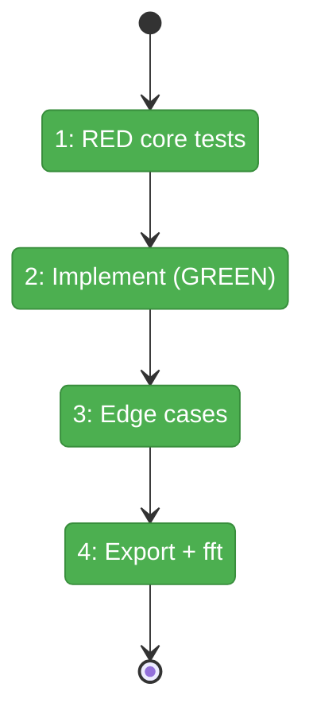
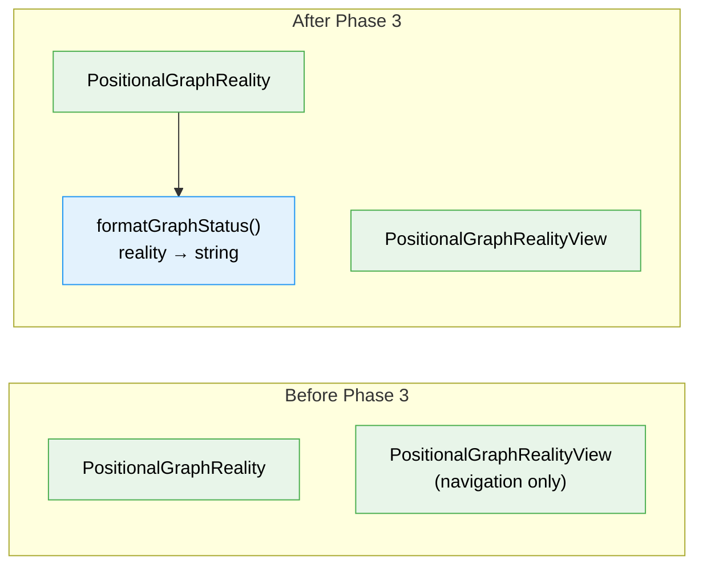

# Flight Plan: Phase 3 — Graph Status View

**Plan**: [cli-orchestration-driver-plan.md](../../cli-orchestration-driver-plan.md)
**Phase**: Phase 3: Graph Status View
**Generated**: 2026-02-17
**Status**: Complete ✅

---

## Departure → Destination

**Where we are**: The orchestration engine can `run()` and soon `drive()`, but there's no visual representation of graph progress. Users and logs have no way to see at a glance which nodes are done, running, paused, or waiting.

**Where we're going**: A pure function `formatGraphStatus(reality)` that renders a compact, readable graph status view — one line per graph line, status glyphs for each node, serial/parallel separators, and a progress summary. Phase 4's `drive()` will emit this after each iteration.

---

## Flight Status

---

## Stages

- [ ] **Stage 1: Write RED core tests** — all 6 glyphs, serial/parallel separators, progress line, log-friendly
- [ ] **Stage 2: Implement formatGraphStatus()** — pure function, all core tests GREEN
- [ ] **Stage 3: Edge case tests** — single node, all-complete, all-failed, empty, restart-pending
- [ ] **Stage 4: Export and validate** — barrel export + `just fft` clean

---

## Acceptance Criteria

- [x] Pure function: `PositionalGraphReality` in, `string` out
- [x] All 6 status glyphs render correctly (✅❌🔶⏸️⬜⚪)
- [x] Serial (`→`) and parallel (`│`) separators based on execution mode
- [x] Progress line shows `N/M complete` with failure count if any
- [x] No event-domain concepts leak
- [x] Log-friendly: no ANSI codes
- [x] `just fft` clean

---

## Checklist

- [x] T001: Write RED core tests for formatGraphStatus() (CS-3)
- [x] T002: Implement formatGraphStatus() (CS-2)
- [x] T003: Write edge case tests (CS-1)
- [x] T004: Barrel export + gallery script + just fft (CS-1)

---

## Architecture: Before & After

---

## PlanPak

`reality.format.ts` is plan-scoped (new file in `030-orchestration/`). Barrel export is a cross-plan-edit.
