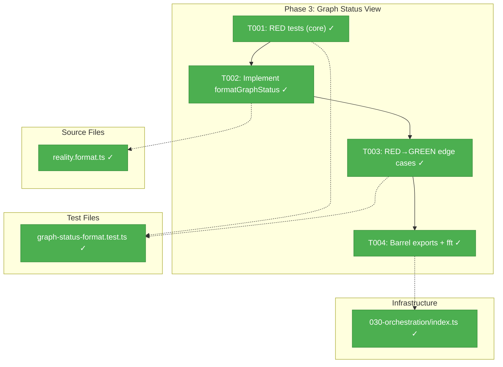

# Phase 3: Graph Status View – Tasks & Alignment Brief

**Spec**: [cli-orchestration-driver-spec.md](../../cli-orchestration-driver-spec.md)
**Plan**: [cli-orchestration-driver-plan.md](../../cli-orchestration-driver-plan.md)
**Date**: 2026-02-17

---

## Executive Briefing

### Purpose

This phase creates `formatGraphStatus()` — a pure function that renders a visual snapshot of graph progress from `PositionalGraphReality`. It's the status view that `drive()` (Phase 4) will emit after each iteration so users and logs can see which nodes are running, complete, failed, or waiting.

### What We're Building

A single pure function: `formatGraphStatus(reality: PositionalGraphReality): string` that renders:
- Graph name and status header
- One line per graph line, nodes shown left-to-right with status glyphs
- Serial (`→`) and parallel (`│`) separators between nodes
- Progress line (`N/M complete`, with failure count if any)

### User Value

Both CLI and web users get a compact, readable view of graph progress — at a glance, you can see which nodes are done, running, paused, or waiting. Log-friendly (no ANSI codes).

### Example

```
Graph: my-pipeline (in_progress)
─────────────────────────────
  Line 0: ✅ get-spec
  Line 1: ✅ spec-builder → ✅ spec-reviewer
  Line 2: 🔶 coder │ 🔶 tester │ 🔶 alignment-tester
  Line 3: ⚪ pr-preparer → ⚪ pr-creator
─────────────────────────────
  Progress: 3/8 complete
```

---

## Objectives & Scope

### Objective

Implement `formatGraphStatus()` as a pure function that renders graph state from a `PositionalGraphReality` snapshot, using 6 status glyphs and line-aware formatting.

### Goals

- ✅ Pure function: `PositionalGraphReality` → `string`
- ✅ 6 status glyphs: ✅ complete, ❌ failed, 🔶 running, ⏸️ paused, ⬜ ready, ⚪ not eligible
- ✅ Serial (`→`) and parallel (`│`) separators based on `node.execution`
- ✅ Progress line with completion count and failure note
- ✅ Graph-domain only — no event, agent, or pod concepts (ADR-0012)
- ✅ Log-friendly — no ANSI codes
- ✅ Full test coverage including edge cases
- ✅ Exported from barrel, `just fft` clean

### Non-Goals

- ❌ ANSI color codes or terminal formatting (glyphs carry meaning)
- ❌ Interactive or updating display (pure function, stateless)
- ❌ Event details (no question IDs, no "waiting for answer")
- ❌ Agent or pod information (graph-domain only)
- ❌ Integration with `drive()` (Phase 4 will call this function)

---

## Pre-Implementation Audit

### Summary

| File | Action | Origin | Modified By | Recommendation |
|------|--------|--------|-------------|----------------|
| `reality.format.ts` | CREATE | Plan 036 P3 | — | keep-as-is |
| `030-orchestration/index.ts` | MODIFY | Plan 030 P1 | Plans 030-036 | cross-plan-edit |
| `graph-status-format.test.ts` | CREATE | Plan 036 P3 | — | keep-as-is |

### Per-File Detail

#### `reality.format.ts`
- **Duplication check**: Zero existing graph formatting utilities in codebase. `PositionalGraphRealityView` has navigation methods but no formatting.
- **Placement**: Workshop 01 Part 3 specifies this exact path. Lives in `packages/positional-graph/` (not CLI) because web uses it too.
- **ADR-0012**: Pure function, graph-domain only. Input: `PositionalGraphReality`. No event/agent/pod imports.

#### `graph-status-format.test.ts`
- **Duplication check**: No existing format tests. 15 test files exist in the directory — naming follows `{concept}.test.ts` convention.
- **Fixtures**: `buildFakeReality()` from `fake-onbas.ts` is the established fixture builder.

### Compliance Check

No violations. ADR-0012 enforced by design: pure function, graph-domain types only, no event/agent imports.

---

## Requirements Traceability

### Coverage Matrix

| AC | Description | Flow Summary | Files in Flow | Tasks | Status |
|----|-------------|-------------|---------------|-------|--------|
| AC-P3-1 | Pure function: `PositionalGraphReality` → `string` | reality.format.ts | 1 | T002 | ✅ Complete |
| AC-P3-2 | All 6 status glyphs render correctly | Test all 8 ExecutionStatus values → 6 glyphs | 2 | T001, T003 | ✅ Complete |
| AC-P3-3 | Serial (→) and parallel (│) separators | `NodeReality.execution` field drives separator | 2 | T001, T002 | ✅ Complete |
| AC-P3-4 | Progress line N/M complete with failure count | `completedCount`, `totalNodes`, `blockedNodeIds` | 2 | T001, T003 | ✅ Complete |
| AC-P3-5 | No event-domain concepts leak | Import check: only `reality.types.ts` | 1 | T002, T004 | ✅ Complete |
| AC-P3-6 | Log-friendly: no ANSI codes | Test assertion: no `\x1b[` in output | 1 | T001 | ✅ Complete |
| AC-P3-7 | `just fft` clean | All files compile + tests pass | 3 | T004 | ✅ Complete |

### Gaps Found

None — all 7 ACs have complete file coverage.

### Key Data Path Verification

- `PositionalGraphReality.lines: readonly LineReality[]` — iterable ✅
- `LineReality.nodeIds: readonly string[]` — nodes per line ✅
- `PositionalGraphReality.nodes: ReadonlyMap<string, NodeReality>` — lookup by nodeId ✅
- `NodeReality.execution: 'serial' | 'parallel'` — separator discriminator ✅
- `NodeReality.status: ExecutionStatus` + `NodeReality.ready: boolean` — glyph discriminator ✅
- `reality.completedCount`, `reality.totalNodes`, `reality.blockedNodeIds` — progress line ✅
- Use `PositionalGraphReality` directly, NOT `PositionalGraphRealityView` (unnecessary coupling) ✅

---

## Architecture Map

### Component Diagram



### Task-to-Component Mapping

| Task | Component(s) | Files | Status | Comment |
|------|-------------|-------|--------|---------|
| T001 | Core Tests | `graph-status-format.test.ts` | ✅ Complete | RED: all glyphs, separators, progress, log-friendly |
| T002 | Implementation | `reality.format.ts` | ✅ Complete | Pure function, GREEN |
| T003 | Edge Case Tests | `graph-status-format.test.ts` | ✅ Complete | RED→GREEN: single node, all-complete, all-failed, empty |
| T004 | Exports + Validation | `030-orchestration/index.ts` | ✅ Complete | Barrel export + just fft |

---

## Tasks

| Status | ID | Task | CS | Type | Dependencies | Absolute Path(s) | Validation | Subtasks | Notes |
|--------|------|------|-----|------|-------------|-------------------|------------|----------|-------|
| [x] | T001 | Write RED tests for `formatGraphStatus()`: all 6 status glyphs (8 ExecutionStatus values mapped), serial `→` vs parallel `│` separators, progress line `N/M complete`, failure count `(N failed)`, header with graphSlug+graphStatus, log-friendly (no ANSI). Use `buildFakeReality()` for all fixtures. | 3 | Test | – | `/home/jak/substrate/033-real-agent-pods/test/unit/positional-graph/features/030-orchestration/graph-status-format.test.ts` | Tests written and failing. Includes 5-field Test Doc. Covers: empty graph, single line, multi-line serial, multi-line parallel, all glyph variants. | – | plan-scoped, AC-P3-1 through AC-P3-6 |
| [x] | T002 | Implement `formatGraphStatus(reality: PositionalGraphReality): string` as a pure function. Iterate `reality.lines` in order, for each line iterate `nodeIds` and lookup via `reality.nodes.get()`. Glyph selection: switch on `status` + `ready`. Separator: skip for first node, then use `→` if next node is serial, `│` if parallel. Progress: `completedCount/totalNodes complete` + ` (N failed)` if `blockedNodeIds.length > 0`. | 2 | Core | T001 | `/home/jak/substrate/033-real-agent-pods/packages/positional-graph/src/features/030-orchestration/reality.format.ts` | All tests from T001 pass. Pure function, no side effects, no imports beyond reality.types. | – | plan-scoped (new file), AC-P3-1 through AC-P3-5 |
| [x] | T003 | Write RED→GREEN tests for edge cases: single-node line, all-complete graph, all-failed graph, mixed statuses, `⏸️` for `waiting-question` and `restart-pending`, `⬜` for `pending` + `ready: true`, empty graph (zero lines). | 1 | Test | T002 | `/home/jak/substrate/033-real-agent-pods/test/unit/positional-graph/features/030-orchestration/graph-status-format.test.ts` | All edge case tests pass. | – | plan-scoped, AC-P3-2, AC-P3-4 |
| [x] | T004 | Add `export { formatGraphStatus } from './reality.format.js'` to barrel. Create `scripts/graph-status-gallery.ts` with all 10 scenarios from Workshop 03. Run `just fft`. | 1 | Integration | T003 | `/home/jak/substrate/033-real-agent-pods/packages/positional-graph/src/features/030-orchestration/index.ts`, `/home/jak/substrate/033-real-agent-pods/scripts/graph-status-gallery.ts` | Exported from barrel. Gallery script runs via `npx tsx scripts/graph-status-gallery.ts`. `just fft` passes clean. | – | cross-plan-edit, AC-P3-7, Workshop 03 |

---

## Alignment Brief

### Prior Phases Review

**Phase 1** (Types, Interfaces, PlanPak Setup): Delivered `DriveOptions`, `DriveEvent` (discriminated union), `DriveResult`, `DriveExitReason` types. Added `drive()` to `IGraphOrchestration`. `FakeGraphOrchestration.drive()` with test helpers. Optional `podManager` on `GraphOrchestrationOptions`. All exported from barrels.

**Phase 2** (Prompt Templates): Replaced starter prompt with full Workshop 04 template (5-step protocol, 3 placeholders). Created resume prompt. Implemented `resolveTemplate()` and `_hasExecuted` selection on AgentPod. Removed module-level cache. 7 tests in `prompt-selection.test.ts`.

**Key lesson from Phase 1**: ESM import gotcha — `buildFakeReality` not available via `@chainglass/positional-graph` package import. Use direct relative imports in tests.

**Phase 3 builds upon**: `PositionalGraphReality` types (from Plan 030). Does NOT depend on Phase 1 or Phase 2 deliverables directly — uses only pre-existing types.

### Critical Findings Affecting This Phase

No plan-level critical findings directly affect Phase 3. The function consumes existing types only.

### ADR Decision Constraints

- **ADR-0012: Workflow Domain Boundaries** — `formatGraphStatus` MUST be graph-domain only. No imports from event, agent, or pod domains. Constrains: T002. Litmus test: "Can I explain this function without mentioning events, agents, or pods?" Answer must be yes.

### Invariants & Guardrails

- Pure function — no side effects, no I/O, no state
- Graph-domain only — imports only from `reality.types.ts`
- No ANSI codes — glyphs carry meaning, readable when piped to file
- Separator logic: right node's `execution` determines separator (skip for first node)
- `ready` ExecutionStatus maps to `⬜` (same as `pending` + `ready: true`)

### Glyph Mapping Reference

| Glyph | ExecutionStatus Values | Condition |
|-------|----------------------|-----------|
| ✅ | `complete` | — |
| ❌ | `blocked-error` | — |
| 🔶 | `starting`, `agent-accepted` | — |
| ⏸️ | `waiting-question`, `restart-pending` | — |
| ⬜ | `pending` (with `ready: true`), `ready` | `node.ready === true` |
| ⚪ | `pending` (with `ready: false`) | `node.ready === false` |

### Test Fixture Notes (`buildFakeReality()`)

| Field | Default | Test Impact |
|-------|---------|-------------|
| `execution` | `'serial'` | Must explicitly set `'parallel'` for `│` separator tests |
| `ready` | `n.status === 'ready'` | For `⬜` glyph: set `ready: true, status: 'pending'` |
| `status` | `'pending'` | Must explicitly set all other statuses |
| `graphStatus` | Inferred | Must set `'failed'` for failure progress test |

### Test Plan (Full TDD)

**Policy**: Fakes over mocks. Use `buildFakeReality()` for all fixtures.

#### Test File: `graph-status-format.test.ts`

```
Test Doc:
- Why: Validate graph status view renders correctly for all node states and graph layouts
- Contract: formatGraphStatus produces a log-friendly string with correct glyphs, separators, and progress
- Usage Notes: Uses buildFakeReality() to construct test fixtures. Set execution/ready/status explicitly.
- Quality Contribution: Catches glyph mapping errors, separator logic bugs, progress counting errors
- Worked Example: 2-line graph with 3 nodes → "Line 0: ✅ n1\n  Line 1: 🔶 n2 → ⚪ n3\n  Progress: 1/3 complete"
```

**T001 — Core tests:**

| Test | Rationale | Expected |
|------|-----------|----------|
| `renders header with graphSlug and status` | Header format | `Graph: my-pipeline (in_progress)` |
| `renders complete node as ✅` | Glyph mapping | `✅ node-1` |
| `renders blocked-error as ❌` | Glyph mapping | `❌ node-1` |
| `renders starting/agent-accepted as 🔶` | Glyph mapping | `🔶 node-1` |
| `renders waiting-question as ⏸️` | Glyph mapping | `⏸️ node-1` |
| `renders pending+ready as ⬜` | Ready flag | `⬜ node-1` |
| `renders pending+not-ready as ⚪` | Not ready | `⚪ node-1` |
| `serial nodes use → separator` | Layout | `✅ n1 → 🔶 n2` |
| `parallel nodes use │ separator` | Layout | `🔶 n1 │ 🔶 n2` |
| `progress line shows count` | Progress | `Progress: 2/5 complete` |
| `progress shows failure count` | Failure note | `Progress: 3/5 complete (1 failed)` |
| `no ANSI codes in output` | Log-friendly | No `\x1b[` in result |

**T003 — Edge case tests:**

| Test | Rationale | Expected |
|------|-----------|----------|
| `single-node line (no separator)` | No separator needed | `Line 0: ✅ n1` |
| `all-complete graph` | Terminal state | `Progress: N/N complete` |
| `all-failed graph` | Terminal failure | `Progress: 0/N complete (N failed)` |
| `empty graph (zero lines)` | Degenerate case | Header + separator + `Progress: 0/0 complete` |
| `restart-pending renders as ⏸️` | Paused variant | `⏸️ node-1` |

### Step-by-Step Implementation Outline

1. **T001**: Create `graph-status-format.test.ts` with ~12 core tests using `buildFakeReality()`. All RED.
2. **T002**: Create `reality.format.ts` with `formatGraphStatus()`. Iterate lines, map glyphs, format progress. All T001 tests GREEN.
3. **T003**: Add ~5 edge case tests. RED→GREEN (implementation should already handle most).
4. **T004**: Add export to `030-orchestration/index.ts`. Run `just fft`.

### Commands to Run

```bash
# Run just the new tests (fast feedback)
cd /home/jak/substrate/033-real-agent-pods
pnpm test -- --run test/unit/positional-graph/features/030-orchestration/graph-status-format.test.ts

# Full quality gate
just fft
```

### Risks & Unknowns

| Risk | Severity | Mitigation |
|------|----------|------------|
| `buildFakeReality()` defaults may surprise | Low | Explicitly set all fields in test fixtures |
| `ready` ExecutionStatus value not in Workshop glyph table | Low | Map to `⬜` (same as pending+ready) |
| Unicode glyph width varies across terminals | Low | Cosmetic only — function produces correct data |

### Ready Check

- [x] ADR constraints mapped to tasks (ADR-0012 → T002)
- [ ] Inputs read (implementer reads files before starting)
- [ ] All gaps resolved (no gaps found)
- [ ] `just fft` baseline green before changes

---

## Phase Footnote Stubs

_Footnotes added during implementation by plan-6a._

| Footnote | Task | Description |
|----------|------|-------------|
| | | |

---

## Evidence Artifacts

- **Execution log**: `docs/plans/036-cli-orchestration-driver/tasks/phase-3-graph-status-view/execution.log.md` (created by plan-6)

---

## Discoveries & Learnings

_Populated during implementation by plan-6._

| Date | Task | Type | Discovery | Resolution | References |
|------|------|------|-----------|------------|------------|
| 2026-02-17 | T004 | gotcha | biome `noControlCharactersInRegex` disallows `\x1b` in regex literals for ANSI check | Changed to `result.includes('\x1b[')` string check | log#task-t004 |

**Types**: `gotcha` | `research-needed` | `unexpected-behavior` | `workaround` | `decision` | `debt` | `insight`

---

## Directory Layout

```
docs/plans/036-cli-orchestration-driver/
  └── tasks/
      ├── phase-1-types-interfaces-and-planpak-setup/   ✅ Complete
      ├── phase-2-prompt-templates-and-agentpod-selection/   ✅ Complete
      └── phase-3-graph-status-view/
          ├── tasks.md              ← this file
          ├── tasks.fltplan.md      ← generated by /plan-5b
          └── execution.log.md     ← created by /plan-6
```
