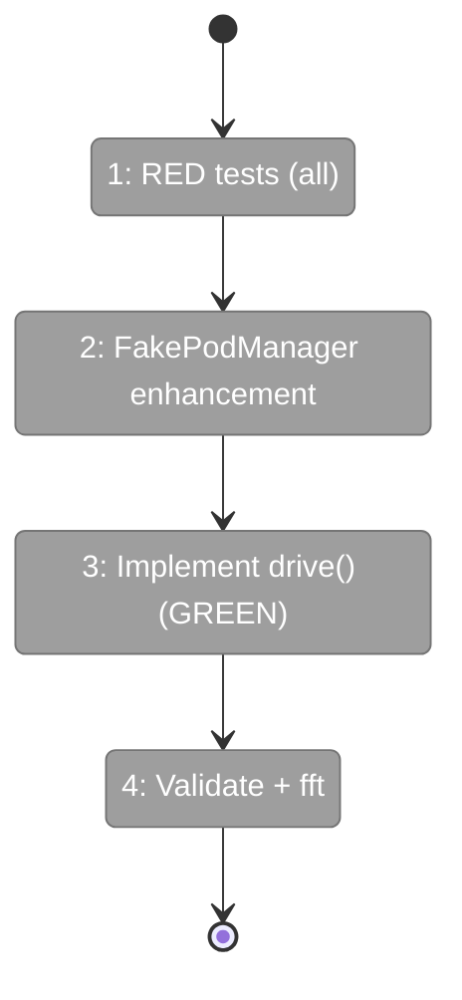
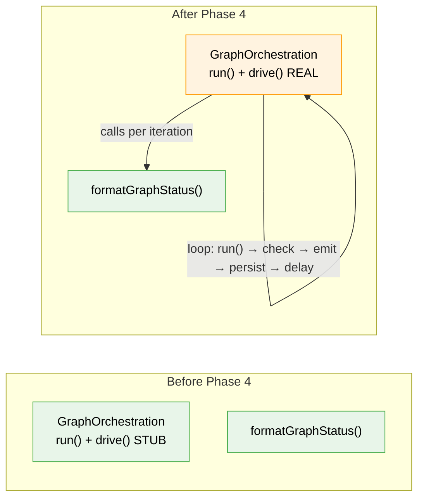

# Flight Plan: Phase 4 — drive() Implementation

**Plan**: [cli-orchestration-driver-plan.md](../../cli-orchestration-driver-plan.md)
**Phase**: Phase 4: drive() Implementation
**Generated**: 2026-02-17
**Status**: Ready for takeoff

---

## Departure → Destination

**Where we are**: `drive()` exists as a stub that throws "not implemented". Types are defined (Phase 1), prompts work (Phase 2), and `formatGraphStatus()` renders visual state (Phase 3). But there's no way to drive a graph to completion — only manual `run()` calls.

**Where we're going**: A working `drive()` that polls `run()` repeatedly until the graph completes, fails, or hits max iterations. Emits status events after each iteration. Persists sessions after actions. Agent-agnostic per ADR-0012.

---

## Flight Status

---

## Stages

- [ ] **Stage 1: Write all RED tests** — happy path, failures, delays, events, sessions (T001-T004)
- [ ] **Stage 2: Enhance FakePodManager** — add persistSessions tracking + write session RED tests (T005)
- [ ] **Stage 3: Implement drive()** — replace stub, all tests GREEN (T006)
- [ ] **Stage 4: Validate** — domain boundary check + `just fft` clean (T007)

---

## Acceptance Criteria

- [ ] drive() calls run() repeatedly until terminal stopReason (AC-22)
- [ ] Returns DriveResult with exitReason, iterations, totalActions
- [ ] Short delay after actions, long delay after no-action (AC-23)
- [ ] Exits on graph-complete or graph-failed (AC-24)
- [ ] Configurable max iterations (AC-25)
- [ ] Emits DriveEvent for orchestration status (AC-26)
- [ ] Agent-agnostic: no pod/agent/event knowledge (ADR-0012)
- [ ] `just fft` clean

---

## Checklist

- [ ] T001: RED happy path tests (CS-3)
- [ ] T002: RED failure path tests (CS-2)
- [ ] T003: RED delay strategy tests (CS-2)
- [ ] T004: RED event emission tests (CS-2)
- [ ] T005: FakePodManager enhancement + RED session tests (CS-2)
- [ ] T006: Implement GraphOrchestration.drive() (CS-3)
- [ ] T007: Refactor + domain boundary + just fft (CS-1)

---

## Architecture: Before & After

---

## PlanPak

`graph-orchestration.ts` is a cross-plan-edit. `drive.test.ts` is plan-scoped. `fake-pod-manager.ts` is a cross-plan-edit (GAP-1 enhancement).
