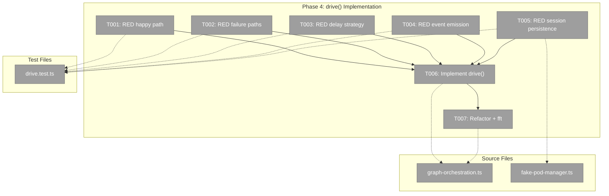

# Phase 4: drive() Implementation – Tasks & Alignment Brief

**Spec**: [cli-orchestration-driver-spec.md](../../cli-orchestration-driver-spec.md)
**Plan**: [cli-orchestration-driver-plan.md](../../cli-orchestration-driver-plan.md)
**Date**: 2026-02-17

---

## Executive Briefing

### Purpose

This phase implements the core `drive()` method on `GraphOrchestration` — the agent-agnostic polling loop that calls `run()` repeatedly until a graph reaches a terminal state. This is the engine that powers `cg wf run` (Phase 5) and will drive graphs in both CLI and web contexts.

### What We're Building

`GraphOrchestration.drive()` — a polling loop that:
- Loads sessions from disk at start
- Calls `run()` in a loop (settle → decide → act)
- Checks `stopReason` after each iteration to detect terminal states
- Uses configurable delays (100ms after actions, 10s after idle)
- Emits `DriveEvent` after each iteration (status view, iteration data, idle notifications)
- Persists sessions after action-producing iterations
- Guards against infinite loops via `maxIterations`
- Returns `DriveResult` with exit reason, iteration count, and total actions

### User Value

Graphs can now run to completion automatically. Before: one `run()` call at a time. After: `await handle.drive()` runs the entire graph, handling all iterations, delays, and status reporting.

### Example

```typescript
const handle = await service.get(ctx, 'my-pipeline');
const result = await handle.drive({
  maxIterations: 100,
  actionDelayMs: 100,
  idleDelayMs: 10_000,
  onEvent: async (event) => {
    if (event.type === 'status') console.log(event.message);
  },
});
// result = { exitReason: 'complete', iterations: 12, totalActions: 8 }
```

---

## Objectives & Scope

### Objective

Replace the `drive()` stub with a working polling loop implementation that satisfies all Phase 4 acceptance criteria while remaining agent-agnostic per ADR-0012.

### Goals

- ✅ drive() calls run() repeatedly until terminal stopReason
- ✅ Returns DriveResult with exitReason, iterations, totalActions
- ✅ Configurable delays (actionDelayMs, idleDelayMs)
- ✅ Exits on graph-complete or graph-failed
- ✅ Configurable max iterations guard (default 200)
- ✅ Emits DriveEvent (iteration, idle, status, error) via onEvent callback
- ✅ Session persistence after action-producing iterations
- ✅ Agent-agnostic: no pod/agent/event knowledge (ADR-0012)
- ✅ Full TDD with FakeONBAS/FakeODS/FakePodManager
- ✅ `just fft` clean

### Non-Goals

- ❌ DI wiring of podManager through OrchestrationService (Phase 5 — GAP-2)
- ❌ CLI command registration (Phase 5)
- ❌ Real agent testing (Phase 5 integration tests)
- ❌ ANSI terminal formatting (formatGraphStatus is log-friendly)
- ❌ Modifying run() itself (only calling it)

---

## Pre-Implementation Audit

### Summary

| File | Action | Origin | Modified By | Recommendation |
|------|--------|--------|-------------|----------------|
| `graph-orchestration.ts` | MODIFY | Plan 030 P7 | Plan 035 P2, Plan 036 P1 | cross-plan-edit |
| `drive.test.ts` | CREATE | Plan 036 P4 | — | keep-as-is |
| `fake-pod-manager.ts` | MODIFY | Plan 030 P4 | — | cross-plan-edit (GAP-1) |

### Per-File Detail

#### `graph-orchestration.ts`
- **Provenance**: Created Plan 030 P7. Modified Plan 035 P2 (ODS rewiring). Modified Plan 036 P1 (podManager + drive stub). This will be the 4th cross-plan modification.
- **Current stub** at L136-138: `throw new Error('drive() not implemented — see Phase 4 of Plan 036')`
- **Imports already present**: `DriveOptions`, `DriveResult` from types. `IPodManager` from pod-manager.types.
- **New import needed**: `formatGraphStatus` from `./reality.format.js`, `DriveEvent` from types.

#### `drive.test.ts`
- **Duplication check**: `fake-drive.test.ts` tests the FAKE. This tests the REAL implementation. No overlap.
- **Pattern**: Follow `graph-orchestration.test.ts` helper pattern (`makeHandle()`, `makeDeps()`, `FakeONBAS.setActions()`).

#### `fake-pod-manager.ts` (GAP-1 fix)
- **Provenance**: Created Plan 030 P4. Never modified by other plans.
- **Change**: Add `persistSessionsCalls` counter to track `persistSessions()` invocations.

### Compliance Check

No violations. ADR-0012 satisfied — drive() imports only graph-domain and pod-manager types (interface only, not concrete).

---

## Requirements Traceability

### Coverage Matrix

| AC | Description | Flow Summary | Files in Flow | Tasks | Status |
|----|-------------|-------------|---------------|-------|--------|
| AC-P4-1 | run() loop until terminal | drive() → loop { run() → check stopReason } | graph-orchestration.ts | T001, T006 | ✅ |
| AC-P4-2 | DriveResult returned | Accumulate iterations + totalActions, map exitReason | graph-orchestration.ts | T001, T002, T006 | ✅ |
| AC-P4-3 | Configurable delays | sleep(actionDelayMs) or sleep(idleDelayMs) based on actions | graph-orchestration.ts | T003, T006 | ✅ |
| AC-P4-4 | Exit on complete/failed | stopReason graph-complete → complete, graph-failed → failed | graph-orchestration.ts | T001, T002, T006 | ✅ |
| AC-P4-5 | Max iterations | options.maxIterations ?? 200 as loop guard | graph-orchestration.ts | T002, T006 | ✅ |
| AC-P4-6 | DriveEvent emission | onEvent callback with status/iteration/idle/error | graph-orchestration.ts | T004, T006 | ✅ |
| AC-P4-7 | Agent-agnostic | No agent/pod/event imports beyond IPodManager interface | graph-orchestration.ts | T007 | ✅ |
| AC-P4-8 | just fft clean | All files compile + tests pass | all | T007 | ✅ |
| Session persistence | persistSessions after actions | podManager?.persistSessions() conditional | graph-orchestration.ts, fake-pod-manager.ts | T005, T006 | ✅ |

### Gaps Found and Resolved

| Gap | Resolution | Task |
|-----|-----------|------|
| GAP-1: FakePodManager lacks persistSessions tracking | Add `persistSessionsCalls` counter | T005 |
| GAP-2: OrchestrationService.get() doesn't pass podManager | Phase 5 concern — not Phase 4 | N/A |
| GAP-3: drive() maxIterations vs run() maxIterations confusion | Use local `options.maxIterations ?? 200`, not `this.maxIterations` | T006 |
| GAP-4: loadSessions at drive() start | Call once before first run() | T005 |
| GAP-5: Error handling when run() throws | try/catch, emit error event, return failed | T002, T006 |

---

## Architecture Map

### Component Diagram



### Task-to-Component Mapping

| Task | Component(s) | Files | Status | Comment |
|------|-------------|-------|--------|---------|
| T001 | Happy Path Tests | `drive.test.ts` | ⬜ Pending | Graph completes after N iterations |
| T002 | Failure Path Tests | `drive.test.ts` | ⬜ Pending | graph-failed, max-iterations, run() throws |
| T003 | Delay Strategy Tests | `drive.test.ts` | ⬜ Pending | actionDelayMs vs idleDelayMs selection |
| T004 | Event Emission Tests | `drive.test.ts` | ⬜ Pending | DriveEvent types, graph status view |
| T005 | Session Persistence Tests | `drive.test.ts`, `fake-pod-manager.ts` | ⬜ Pending | persistSessions after actions, loadSessions at start |
| T006 | Implementation | `graph-orchestration.ts` | ⬜ Pending | Replace stub with real drive() |
| T007 | Validation | `graph-orchestration.ts` | ⬜ Pending | Domain boundary check + just fft |

---

## Tasks

| Status | ID | Task | CS | Type | Dependencies | Absolute Path(s) | Validation | Subtasks | Notes |
|--------|------|------|-----|------|-------------|-------------------|------------|----------|-------|
| [x] | T001 | Write RED tests for drive() happy path: graph completes after N run() iterations, returns `DriveResult` with `exitReason: 'complete'`, correct `iterations` count, correct `totalActions` sum. Configure `FakeONBAS.setActions()` to return start-node N times then no-action with `reason: 'graph-complete'`. Use `actionDelayMs: 0, idleDelayMs: 0` to avoid real delays. | 3 | Test | – | `/home/jak/substrate/033-real-agent-pods/test/unit/positional-graph/features/030-orchestration/drive.test.ts` | Tests written and failing. 5-field Test Doc block. | – | plan-scoped |
| [x] | T002 | Write RED tests for drive() failure paths: (a) `stopReason: 'graph-failed'` → `exitReason: 'failed'`; (b) max iterations exceeded → `exitReason: 'max-iterations'`; (c) `run()` throws → emit error event, return `exitReason: 'failed'`. | 2 | Test | – | `/home/jak/substrate/033-real-agent-pods/test/unit/positional-graph/features/030-orchestration/drive.test.ts` | Tests written and failing. 3 failure scenarios covered. | – | plan-scoped, GAP-5 |
| [x] | T003 | Write RED tests for drive() delay strategy: verify short delay path chosen after action-producing iteration, long delay path chosen after no-action iteration. Pass custom `actionDelayMs` and `idleDelayMs` in `DriveOptions`. Test via event emission order (iteration event vs idle event), not via actual timing. | 2 | Test | – | `/home/jak/substrate/033-real-agent-pods/test/unit/positional-graph/features/030-orchestration/drive.test.ts` | Tests verify correct delay path selection. | – | plan-scoped |
| [x] | T004 | Write RED tests for drive() event emission: (a) `onEvent` receives `status` event with `formatGraphStatus()` output after each iteration; (b) `iteration` event after action-producing run; (c) `idle` event after no-action run; (d) no agent events emitted. Capture events in array, assert on types and content. | 2 | Test | – | `/home/jak/substrate/033-real-agent-pods/test/unit/positional-graph/features/030-orchestration/drive.test.ts` | Tests verify all 4 DriveEvent types. | – | plan-scoped, ADR-0012 |
| [x] | T005 | Add `persistSessionsCalls` and `loadSessionsCalls` counters to `FakePodManager` (GAP-1). Write RED tests for session persistence: (a) `loadSessions()` called once at drive() start; (b) `persistSessions()` called after action-producing iterations; (c) `persistSessions()` NOT called after no-action iterations. | 2 | Test | – | `/home/jak/substrate/033-real-agent-pods/packages/positional-graph/src/features/030-orchestration/fake-pod-manager.ts`, `/home/jak/substrate/033-real-agent-pods/test/unit/positional-graph/features/030-orchestration/drive.test.ts` | FakePodManager enhanced. Session tests written and failing. | – | cross-plan-edit (GAP-1), GAP-4 |
| [x] | T006 | Implement `GraphOrchestration.drive()`: replace stub with polling loop. Import `formatGraphStatus`. Add local `sleep()`. Loop: loadSessions → { run() → check stopReason → emit events → persist if actions → delay → repeat }. Guard with `options.maxIterations ?? 200`. Use `options.onEvent?.()` with await. Wrap run() in try/catch for error event. Use `this.podManager?.loadSessions/persistSessions` with optional chaining. | 3 | Core | T001-T005 | `/home/jak/substrate/033-real-agent-pods/packages/positional-graph/src/features/030-orchestration/graph-orchestration.ts` | All tests from T001-T005 pass. drive() stub replaced. | – | cross-plan-edit, Finding 07 |
| [x] | T007 | Refactor + domain boundary check + `just fft`. Verify: drive() imports nothing from agent/event domains beyond `IPodManager` interface. ADR-0012 litmus test: "Can I explain drive() without mentioning agents?" | 1 | Integration | T006 | `/home/jak/substrate/033-real-agent-pods/packages/positional-graph/src/features/030-orchestration/graph-orchestration.ts` | `just fft` clean. drive() agent-agnostic. | – | ADR-0012 |

---

## Alignment Brief

### Prior Phases Summary

**Phase 1** (Types): `DriveOptions`, `DriveEvent` (discriminated union, 4 variants), `DriveResult`, `DriveExitReason` types. `drive()` on `IGraphOrchestration`. Optional `podManager` on `GraphOrchestrationOptions`. `FakeGraphOrchestration.drive()` with helpers. Barrel exports.

**Phase 2** (Prompts): Starter prompt with 5-step protocol and 3 placeholders. Resume prompt. `resolveTemplate()` and `_hasExecuted` on AgentPod. Module cache removed.

**Phase 3** (Graph Status View): `formatGraphStatus(reality)` pure function — 6 glyphs, serial/parallel separators, progress line. 20 tests. Gallery script.

**Key lessons**:
- ESM import gotcha: use direct relative imports in tests for `buildFakeReality`
- biome `noControlCharactersInRegex` disallows `\x1b` in regex
- Optional podManager avoids cascade — drive() uses optional chaining
- `onEvent` is async-capable: `void | Promise<void>`

### Critical Findings Affecting This Phase

| Finding | Title | Constraint | Tasks |
|---------|-------|-----------|-------|
| Finding 01 | GraphOrchestration lacks podManager | podManager is optional — drive() uses `this.podManager?.` | T005, T006 |
| Finding 06 | stopReason mapping exhaustive | `graph-complete` → `complete`, `graph-failed` → `failed`, `no-action` → keep polling | T001, T006 |
| Finding 07 | No shared sleep() utility | Define locally in graph-orchestration.ts | T006 |

### ADR Decision Constraints

- **ADR-0012**: drive() MUST be agent-agnostic. Litmus test: "Can I explain drive() without mentioning agents?" No imports from agent/event domains. `IPodManager` is acceptable (persistence interface). Constrains: T006, T007.

### Key Implementation Notes

1. **stopReason mapping**: `graph-complete` and `graph-failed` are terminal. `no-action` (without terminal reason) means idle — keep polling. Use `result.stopReason` directly, not `finalReality.isComplete`.

2. **maxIterations independence**: drive()'s `options.maxIterations ?? 200` is separate from run()'s `this.maxIterations` (default 100). Use a local variable, NOT the class field.

3. **Error handling**: Wrap `run()` in try/catch. On error: emit `{ type: 'error', message, error }`, return `{ exitReason: 'failed', ... }`.

4. **Session lifecycle**: `loadSessions()` once at start. `persistSessions()` after each action-producing iteration. Both via optional chaining.

5. **Event order per iteration**: `run()` → emit `status` (graph view) → emit `iteration` or `idle` → persist if actions → delay.

### Test Plan (Full TDD)

**Policy**: Fakes over mocks. Use FakeONBAS, FakeODS, FakeEHS, FakePodManager.

#### Test File: `drive.test.ts`

```
Test Doc:
- Why: Validate drive() polling loop correctness before CLI integration
- Contract: drive() calls run() repeatedly, emits events, persists sessions, exits on terminal state
- Usage Notes: Configure FakeONBAS.setActions() to queue run() responses. Use actionDelayMs:0/idleDelayMs:0 for fast tests.
- Quality Contribution: Catches loop logic errors, event emission gaps, session persistence bugs
- Worked Example: FakeONBAS returns start-node then graph-complete → drive() returns {exitReason:'complete', iterations:2, totalActions:1}
```

**Test helper pattern** (from `graph-orchestration.test.ts`):
- `makeHandle(deps, { maxIterations })` constructs `GraphOrchestration`
- `deps.onbas.setActions([...])` queues ONBAS responses
- `deps.ods.setResults([...])` queues ODS responses

| Test Group | Tests | AC |
|------------|-------|-----|
| Happy path | complete after N iterations, correct iterations/totalActions | AC-P4-1, 2, 4 |
| Failure | graph-failed exit, max-iterations exit, run() throws | AC-P4-2, 4, 5 |
| Delays | action → short delay path, no-action → long delay path | AC-P4-3 |
| Events | status event with graph view, iteration/idle events, error event | AC-P4-6 |
| Sessions | loadSessions at start, persistSessions after actions, not after idle | Session persistence |

### Commands to Run

```bash
# Run just drive tests (fast feedback)
pnpm test -- --run test/unit/positional-graph/features/030-orchestration/drive.test.ts

# Run all orchestration tests (check no breakage)
pnpm test -- --run test/unit/positional-graph/features/030-orchestration/

# Full quality gate
just fft
```

### Risks & Unknowns

| Risk | Severity | Mitigation |
|------|----------|------------|
| Infinite loop if stopReason never terminal | Medium | maxIterations guard (default 200) |
| drive() accidentally gains agent knowledge | Medium | ADR-0012 litmus test in T007 |
| Test delays slow down suite | Low | All tests use actionDelayMs:0, idleDelayMs:0 |
| FakePodManager enhancement breaks existing tests | Low | Adding a counter field — no API change |

### Ready Check

- [x] ADR constraints mapped to tasks (ADR-0012 → T006, T007)
- [ ] Inputs read (implementer reads files before starting)
- [ ] All gaps resolved (GAP-1 through GAP-5 addressed in tasks)
- [ ] `just fft` baseline green before changes

---

## Phase Footnote Stubs

| Footnote | Task | Description |
|----------|------|-------------|
| | | |

---

## Evidence Artifacts

- **Execution log**: `docs/plans/036-cli-orchestration-driver/tasks/phase-4-drive-implementation/execution.log.md`

---

## Discoveries & Learnings

_Populated during implementation by plan-6._

| Date | Task | Type | Discovery | Resolution | References |
|------|------|------|-----------|------------|------------|
| 2026-02-17 | T006 | gotcha | run() consumes multiple ONBAS actions per call — one drive() iteration can produce N actions. Test expectations must count drive() loops, not ONBAS decisions. | Fixed test expectations: iterations counts run() calls, totalActions sums result.actions.length | log#task-t006 |
| 2026-02-17 | T006 | decision | Session persistence must happen before terminal exit check, not after — otherwise the final action-producing iteration's sessions aren't persisted | Moved persistSessions before stopReason check in the loop | log#task-t006 |

**Types**: `gotcha` | `research-needed` | `unexpected-behavior` | `workaround` | `decision` | `debt` | `insight`

---

## Directory Layout

```
docs/plans/036-cli-orchestration-driver/
  └── tasks/
      ├── phase-1-types-interfaces-and-planpak-setup/   ✅ Complete
      ├── phase-2-prompt-templates-and-agentpod-selection/   ✅ Complete
      ├── phase-3-graph-status-view/   ✅ Complete
      └── phase-4-drive-implementation/
          ├── tasks.md              ← this file
          ├── tasks.fltplan.md      ← generated by /plan-5b
          └── execution.log.md     ← created by /plan-6
```
