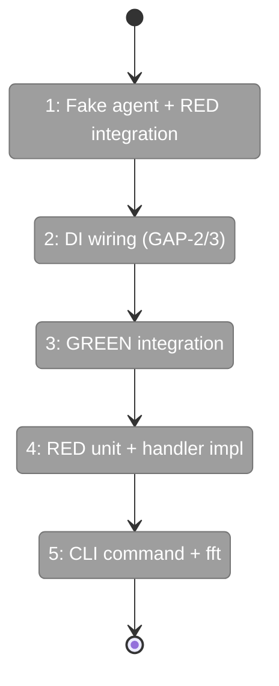
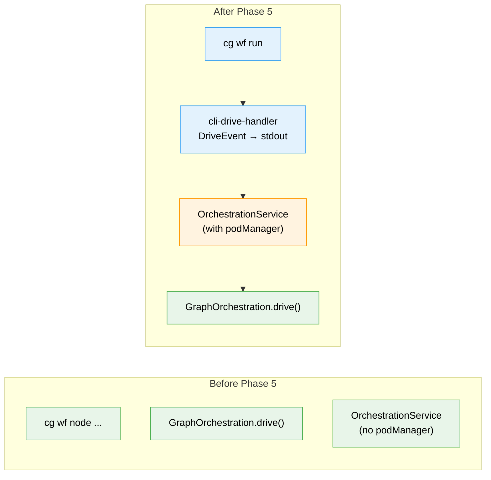

# Flight Plan: Phase 5 — CLI Command and Integration Tests

**Plan**: [cli-orchestration-driver-plan.md](../../cli-orchestration-driver-plan.md)
**Phase**: Phase 5: CLI Command and Integration Tests
**Generated**: 2026-02-17
**Status**: Ready for takeoff

---

## Departure → Destination

**Where we are**: `drive()` works (Phase 4), prompts work (Phase 2), status view works (Phase 3). But there's no CLI command to invoke drive(), no terminal output handler, and no integration test proving the full stack works end-to-end with fake agents.

**Where we're going**: `cg wf run my-pipeline` drives a graph to completion with live status output. Integration tests prove the full stack: DI → service → handle → drive → run → settle → ODS → pod → fake agent → events → complete. This is the final phase — Plan 036 is done after this.

---

## Flight Status

---

## Stages

- [ ] **Stage 1: Fake agent + RED integration tests** — OrchestrationFakeAgentInstance, 3 integration tests (T001-T004)
- [ ] **Stage 2: DI wiring** — podManager through OrchestrationService, orchestration in CLI container (T005)
- [ ] **Stage 3: GREEN integration** — Make integration tests pass with full stack (T002-T004 green)
- [ ] **Stage 4: Unit tests + handler** — RED unit tests, implement cli-drive-handler (T006-T007)
- [ ] **Stage 5: CLI command + validate** — Register `cg wf run`, `just fft` clean (T008-T009)

---

## Acceptance Criteria

- [ ] `cg wf run <slug>` command exists (AC-21)
- [ ] Driver loop calls run() repeatedly (AC-22)
- [ ] Exit 0 on graph-complete, exit 1 on failure (AC-24)
- [ ] `--max-iterations` flag works (AC-25)
- [ ] Status output to terminal (AC-26)
- [ ] Integration test proves full stack with fake agents
- [ ] `just fft` clean

---

## Checklist

- [ ] T001: OrchestrationFakeAgentInstance (CS-3)
- [ ] T002: RED integration — graph completion (CS-3)
- [ ] T003: RED integration — graph failure (CS-2)
- [ ] T004: RED integration — max iterations (CS-1)
- [ ] T005: DI wiring GAP-2 + GAP-3 (CS-2)
- [ ] T006: RED unit tests for handler (CS-2)
- [ ] T007: Implement cli-drive-handler (CS-2)
- [ ] T008: Register `cg wf run` command (CS-2)
- [ ] T009: Final `just fft` (CS-1)

---

## Architecture: Before & After

---

## PlanPak

`cli-drive-handler.ts` in `apps/cli/src/features/036-cli-orchestration-driver/`. Command registration and DI changes are cross-plan-edits.
