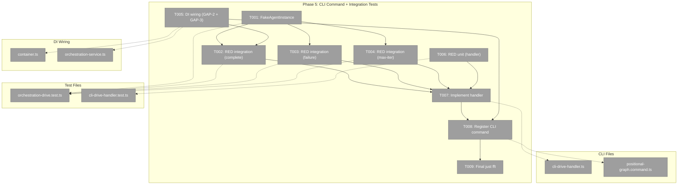

# Phase 5: CLI Command and Integration Tests – Tasks & Alignment Brief

**Spec**: [cli-orchestration-driver-spec.md](../../cli-orchestration-driver-spec.md)
**Plan**: [cli-orchestration-driver-plan.md](../../cli-orchestration-driver-plan.md)
**Date**: 2026-02-17

---

## Executive Briefing

### Purpose

This is the final phase — wiring everything together. We register the `cg wf run <slug>` CLI command, create the handler that maps `DriveEvent` → terminal output, wire podManager through the DI container, and prove the full stack works with integration tests using fake agents that drive a real graph to completion.

### What We're Building

- **`cg wf run <slug>`** CLI command with `--verbose` and `--max-iterations` options
- **CLI drive handler** that maps DriveEvent types to terminal output (status view, iteration info, idle notifications, errors) and returns exit code 0/1
- **Integration tests** proving the full stack: DI → service → handle → drive → run → settle → ODS → pod → fake agent → events → settle → complete
- **DI wiring** for podManager through OrchestrationService (GAP-2) and orchestration services into the CLI container (GAP-3)

### User Value

After this phase, users can run `cg wf run my-pipeline` and watch their graph execute to completion with live status updates in the terminal.

### Example

```bash
$ cg wf run my-pipeline --max-iterations 100

Graph: my-pipeline (in_progress)
─────────────────────────────
  Line 0: ✅ get-spec
  Line 1: 🔶 spec-builder → ⚪ spec-reviewer
─────────────────────────────
  Progress: 1/4 complete

# ... iterations continue ...

Graph: my-pipeline (complete)
─────────────────────────────
  Line 0: ✅ get-spec
  Line 1: ✅ spec-builder → ✅ spec-reviewer
─────────────────────────────
  Progress: 4/4 complete
```

---

## Objectives & Scope

### Objective

Register the `cg wf run` CLI command, create the terminal output handler, wire DI for orchestration, and validate the full stack with integration tests using fake agents.

### Goals

- ✅ `cg wf run <slug>` command registered on `wf` group
- ✅ CLI handler maps DriveEvent → terminal stdout/stderr
- ✅ Exit code 0 on complete, 1 on failed/max-iterations
- ✅ `--verbose` and `--max-iterations` flags
- ✅ podManager wired through OrchestrationService (GAP-2)
- ✅ Orchestration services registered in CLI DI container (GAP-3)
- ✅ Integration test: fake agents drive 2-line, 3-node graph to completion
- ✅ Integration test: graph failure exits correctly
- ✅ Integration test: max iterations exits correctly
- ✅ `just fft` clean

### Non-Goals

- ❌ Real agent testing (requires API keys, out of scope for Plan 036)
- ❌ Web integration (consumer-domain, future plan)
- ❌ Agent event wiring to terminal (OQ-01, deferred)
- ❌ `--stream` flag for raw event output (future enhancement)
- ❌ DI changes beyond what's needed for orchestration (no refactoring)

---

## Pre-Implementation Audit

### Summary

| File | Action | Origin | Modified By | Recommendation |
|------|--------|--------|-------------|----------------|
| `cli-drive-handler.ts` | CREATE | Plan 036 P5 | — | keep-as-is |
| `positional-graph.command.ts` | MODIFY | Pre-plan | Many plans | cross-plan-edit |
| `cli-drive-handler.test.ts` | CREATE | Plan 036 P5 | — | keep-as-is |
| `orchestration-drive.test.ts` | CREATE | Plan 036 P5 | — | keep-as-is |
| `container.ts` (positional-graph) | MODIFY | Plan 030 | Plan 035 | cross-plan-edit (GAP-2) |
| `orchestration-service.ts` | MODIFY | Plan 030 P7 | — | cross-plan-edit (GAP-2) |

### Key Gaps Found

| Gap | Severity | Description | Resolution |
|-----|----------|-------------|------------|
| GAP-2 | Medium | `OrchestrationService.get()` doesn't pass podManager to `GraphOrchestration` | T005: Add podManager to deps, pass in get() |
| GAP-3 | High | CLI production DI container doesn't register orchestration services | T005: Wire orchestration into CLI container |

### Compliance Check

No ADR violations. ADR-0012 compliant — CLI handler is consumer-domain, drive() remains agent-agnostic.

---

## Requirements Traceability

### Coverage Matrix

| AC | Description | Flow Summary | Files in Flow | Tasks | Status |
|----|-------------|-------------|---------------|-------|--------|
| AC-21 | `cg wf run <slug>` exists | Command registered on wf group | positional-graph.command.ts | T008 | ✅ |
| AC-22 | Driver loop calls run() repeatedly | Integration test proves multi-iteration | orchestration-drive.test.ts | T002 | ✅ |
| AC-24 | Exit 0 on complete, exit 1 on failure | Handler maps exitReason → exit code | cli-drive-handler.ts, cli-drive-handler.test.ts | T006, T007 | ✅ |
| AC-25 | --max-iterations flag | CLI option + passthrough to drive() | positional-graph.command.ts, cli-drive-handler.ts | T004, T008 | ✅ |
| AC-26 | Status output to terminal | Handler maps DriveEvent → stdout | cli-drive-handler.ts, cli-drive-handler.test.ts | T006, T007 | ✅ |
| AC-INT-1 | Full stack with fake agents | FakeAgentInstance + real graph + drive() | orchestration-drive.test.ts | T001, T002 | ✅ |
| AC-INT-2 | Graph failure exits correctly | Fake raises error event | orchestration-drive.test.ts | T003 | ✅ |
| AC-INT-3 | Max iterations exits correctly | Low maxIterations + idle | orchestration-drive.test.ts | T004 | ✅ |

### Gaps Found and Resolved

All gaps addressed in task table — GAP-2 and GAP-3 covered by T005.

---

## Architecture Map

### Component Diagram



### Task-to-Component Mapping

| Task | Component(s) | Files | Status | Comment |
|------|-------------|-------|--------|---------|
| T001 | Fake Agent | `orchestration-drive.test.ts` | ⬜ Pending | FakeAgentInstance that raises graph events |
| T002 | Integration Test | `orchestration-drive.test.ts` | ⬜ Pending | RED: full stack graph completion |
| T003 | Integration Test | `orchestration-drive.test.ts` | ⬜ Pending | RED: graph failure |
| T004 | Integration Test | `orchestration-drive.test.ts` | ⬜ Pending | RED: max iterations |
| T005 | DI Wiring | `container.ts`, `orchestration-service.ts` | ⬜ Pending | GAP-2 + GAP-3 fix |
| T006 | Unit Tests | `cli-drive-handler.test.ts` | ⬜ Pending | RED: DriveEvent → stdout mapping |
| T007 | Handler Implementation | `cli-drive-handler.ts` | ⬜ Pending | GREEN: maps events, returns exit code |
| T008 | CLI Registration | `positional-graph.command.ts` | ⬜ Pending | `cg wf run <slug>` |
| T009 | Validation | all | ⬜ Pending | just fft clean |

---

## Tasks

| Status | ID | Task | CS | Type | Dependencies | Absolute Path(s) | Validation | Subtasks | Notes |
|--------|------|------|-----|------|-------------|-------------------|------------|----------|-------|
| [ ] | T001 | Create `OrchestrationFakeAgentInstance` in integration test. On `run()`: mutate graph state to raise `node:accepted` + `node:completed` events so settle phase picks them up. Follow pattern from `test/e2e/positional-graph-orchestration-e2e.ts`. Must implement `IAgentInstance`. | 3 | Setup | – | `/home/jak/substrate/033-real-agent-pods/test/integration/orchestration-drive.test.ts` | Fake implements IAgentInstance, raises events when run() called | – | Per Workshop 01 Part 7 |
| [ ] | T002 | Write RED integration test: fake agents drive 2-line, 3-node graph to completion. Build real graph via `graphService.create()`, `addLine()`, `addNode()`. **Test graph**: Line 0 = `setup` (user-input), Line 1 = `worker-a` → `worker-b` (agent, serial). **Before calling drive()**: complete the user-input node on Line 0 (write output data + mark complete via graphService) — ONBAS won't action Line 1 until Line 0 is done. Construct orchestration stack manually (same as e2e). Call `handle.drive()`. Assert `exitReason: 'complete'`. | 3 | Test | T001, T005 | `/home/jak/substrate/033-real-agent-pods/test/integration/orchestration-drive.test.ts` | Test graph reaches graph-complete | – | Per Workshop 01 Part 9 |
| [ ] | T003 | Write RED integration test: fake agent raises `node:error` event. `drive()` returns `exitReason: 'failed'`. | 2 | Test | T001, T005 | `/home/jak/substrate/033-real-agent-pods/test/integration/orchestration-drive.test.ts` | drive() returns failed | – | |
| [ ] | T004 | Write RED integration test: idle graph + `maxIterations: 3` → `exitReason: 'max-iterations'`. | 1 | Test | T001 | `/home/jak/substrate/033-real-agent-pods/test/integration/orchestration-drive.test.ts` | drive() returns max-iterations | – | |
| [ ] | T005 | Wire orchestration into DI: (a) Add `podManager: IPodManager` to `OrchestrationServiceDeps`, pass in `get()` (GAP-2). (b) In `container.ts`, pass `podManager` to `OrchestrationService` factory. (c) In CLI container (`apps/cli/src/lib/container.ts`): register `ORCHESTRATION_DI_TOKENS.SCRIPT_RUNNER` → `FakeScriptRunner` (no real impl exists), register `ORCHESTRATION_DI_TOKENS.EVENT_HANDLER_SERVICE` → `EventHandlerService` (requires `NodeEventRegistry` + `registerCoreEventTypes`), then call `registerOrchestrationServices(childContainer)` (GAP-3). | 3 | Core | – | `/home/jak/substrate/033-real-agent-pods/packages/positional-graph/src/features/030-orchestration/orchestration-service.ts`, `/home/jak/substrate/033-real-agent-pods/packages/positional-graph/src/container.ts`, `/home/jak/substrate/033-real-agent-pods/apps/cli/src/lib/container.ts` | OrchestrationService resolvable from CLI DI container. `drive()` receives podManager. | – | cross-plan-edit, GAP-2 + GAP-3 |
| [ ] | T006 | Write RED unit tests for `cli-drive-handler`: DriveEvent→stdout mapping (status, iteration, idle, error), exit code 0 on 'complete', exit code 1 on 'failed'/'max-iterations'. Use `FakeGraphOrchestration` with `setDriveResult()`. | 2 | Test | – | `/home/jak/substrate/033-real-agent-pods/test/unit/cli/features/036-cli-orchestration-driver/cli-drive-handler.test.ts` | Tests written and failing | – | plan-scoped |
| [ ] | T007 | Create `cli-drive-handler.ts` in PlanPak feature folder. Maps DriveEvent → terminal output via `onEvent` callback. Returns exit code. Accepts verbose and maxIterations options. | 2 | Core | T006 | `/home/jak/substrate/033-real-agent-pods/apps/cli/src/features/036-cli-orchestration-driver/cli-drive-handler.ts` | All T006 tests pass | – | plan-scoped |
| [ ] | T008 | Register `cg wf run <slug>` command on `wf` group. Options: `--verbose`, `--max-iterations <n>`. Handler resolves OrchestrationService, calls `handle.drive()` via handler. Follow `wrapAction()` pattern. | 2 | Core | T007, T005 | `/home/jak/substrate/033-real-agent-pods/apps/cli/src/commands/positional-graph.command.ts` | Command registered, options parsed | – | cross-plan-edit |
| [ ] | T009 | Final `just fft` validation. All tests pass, lint clean, format clean. | 1 | Integration | T008 | all | `just fft` exit 0 | – | |

---

## Alignment Brief

### Prior Phases Summary

**Phase 1**: Types — `DriveOptions`, `DriveEvent` (discriminated union), `DriveResult`, `DriveExitReason`. `drive()` on `IGraphOrchestration`. Optional `podManager`. `FakeGraphOrchestration.drive()` with helpers. 4 tests.

**Phase 2**: Prompts — Full starter prompt with 5-step protocol + 3 placeholders. Resume prompt. `resolveTemplate()` + `_hasExecuted` on AgentPod. 7 tests.

**Phase 3**: Graph Status View — `formatGraphStatus()` pure function. 6 glyphs, serial/parallel separators, progress line. 20 tests. Gallery script.

**Phase 4**: drive() — Real polling loop on `GraphOrchestration`. Configurable delays, event emission, session persistence, max iterations guard. Error handling via try/catch. 19 tests.

**Key lessons**:
- ESM import gotcha: use direct relative imports for internal modules in tests
- `run()` consumes multiple ONBAS actions per call — one drive() iteration = one run() call
- Session persistence must happen before terminal exit check
- biome `noControlCharactersInRegex` disallows `\x1b` in regex
- `podManager` optional on type, drive() uses optional chaining

### Critical Findings Affecting This Phase

| Finding | Title | Constraint | Tasks |
|---------|-------|-----------|-------|
| Finding 01 | GraphOrchestration lacks podManager | Phase 1 made it optional. Phase 5 must wire it through DI. | T005 |
| Finding 08 | Test graphs built imperatively | `graphService.create()`, `addLine()`, `addNode()` — follow existing pattern | T002 |
| GAP-2 | podManager not in OrchestrationService | Must add to deps and pass in get() | T005 |
| GAP-3 | CLI DI missing orchestration services | Integration tests use manual stack (like e2e), CLI command may need manual stack too | T005, T008 |

### ADR Decision Constraints

- **ADR-0012**: CLI handler is consumer-domain. It maps DriveEvent → terminal output. Does NOT access orchestration internals. drive() remains agent-agnostic.
- **ADR-0004**: DI with `useFactory`, no decorators. OrchestrationService changes follow existing factory pattern.

### Integration Test Architecture

The integration tests construct the orchestration stack manually (same pattern as `test/e2e/positional-graph-orchestration-e2e.ts`):

```
Real graph on disk (graphService.create + addLine + addNode)
    ↓
OrchestrationService({ graphService, onbas, ods, ehs, podManager })
    ↓
handle = service.get(ctx, slug)
    ↓
result = handle.drive({ actionDelayMs: 0, idleDelayMs: 0 })
```

The `OrchestrationFakeAgentInstance` raises events by mutating graph state directly — simulating what a real agent would do via CLI commands.

### Test Plan

**Integration tests** (T002-T004): Real graph, real ONBAS/ODS/EHS, fake agents. Full stack validation.

**Unit tests** (T006): `FakeGraphOrchestration.setDriveResult()` for handler testing. No real orchestration needed.

### Commands to Run

```bash
# Integration tests
pnpm test -- --run test/integration/orchestration-drive.test.ts

# Unit tests
pnpm test -- --run test/unit/cli/features/036-cli-orchestration-driver/cli-drive-handler.test.ts

# Full quality gate
just fft
```

### Risks & Unknowns

| Risk | Severity | Mitigation |
|------|----------|------------|
| GAP-3: CLI DI missing orchestration | High | Integration tests bypass DI. CLI command may build stack manually. |
| FakeAgentInstance event-raising complexity | Medium | Follow e2e pattern (positional-graph-orchestration-e2e.ts) |
| positional-graph.command.ts is 2554 lines | Low | Clear insertion point — end of wf group |
| Integration test needs real filesystem | Low | Use temp directories (existing pattern) |

### Ready Check

- [x] ADR constraints mapped (ADR-0012 → T007, ADR-0004 → T005)
- [ ] Inputs read (implementer reads files before starting)
- [ ] All gaps resolved (GAP-2 → T005, GAP-3 → T005/T008)
- [ ] `just fft` baseline green before changes

---

## Phase Footnote Stubs

| Footnote | Task | Description |
|----------|------|-------------|
| | | |

---

## Evidence Artifacts

- **Execution log**: `docs/plans/036-cli-orchestration-driver/tasks/phase-5-cli-command-and-integration-tests/execution.log.md`

---

## Discoveries & Learnings

_Populated during implementation by plan-6._

| Date | Task | Type | Discovery | Resolution | References |
|------|------|------|-----------|------------|------------|
| | | | | | |

**Types**: `gotcha` | `research-needed` | `unexpected-behavior` | `workaround` | `decision` | `debt` | `insight`

---

## Directory Layout

```
docs/plans/036-cli-orchestration-driver/
  └── tasks/
      ├── phase-1-types-interfaces-and-planpak-setup/   ✅ Complete
      ├── phase-2-prompt-templates-and-agentpod-selection/   ✅ Complete
      ├── phase-3-graph-status-view/   ✅ Complete
      ├── phase-4-drive-implementation/   ✅ Complete
      └── phase-5-cli-command-and-integration-tests/
          ├── tasks.md              ← this file
          ├── tasks.fltplan.md      ← generated by /plan-5b
          └── execution.log.md     ← created by /plan-6
```
