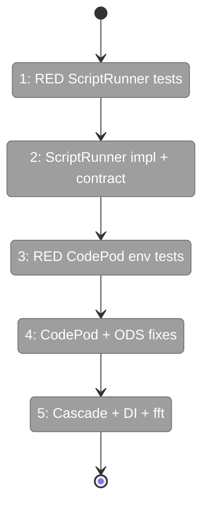

# Flight Plan: Phase 1 — CodePod Completion and ScriptRunner

**Plan**: [codepod-and-goat-integration-plan.md](../../codepod-and-goat-integration-plan.md)
**Phase**: Phase 1: CodePod Completion and ScriptRunner
**Generated**: 2026-02-18
**Status**: Ready for takeoff

---

## Departure → Destination

**Where we are**: CodePod runs an empty script (`script: ''`) with no graph context. No real ScriptRunner exists. ODS doesn't resolve script paths from work unit configs.

**Where we're going**: CodePod receives real script paths, passes full graph context as env vars, and executes scripts via a real subprocess runner. ODS loads work unit configs to resolve script paths. DI containers use real ScriptRunner.

---

## Flight Status

---

## Stages

- [ ] **Stage 1**: Write RED ScriptRunner tests (T001)
- [ ] **Stage 2**: Implement ScriptRunner + contract test (T002, T002b)
- [ ] **Stage 3**: Write RED CodePod env var tests (T003)
- [ ] **Stage 4**: Fix CodePod, PodManager, ODS (T004-T007) — tests GREEN
- [ ] **Stage 5**: Cascade test updates + DI registration + just fft (T008-T010)

---

## Acceptance Criteria

- [ ] CodePod receives scriptPath from PodCreateParams (AC-01)
- [ ] CodePod passes CG_GRAPH_SLUG, CG_NODE_ID, CG_WORKSPACE_PATH env vars (AC-02)
- [ ] INPUT_* env vars preserved (AC-03)
- [ ] Real ScriptRunner executes bash scripts (AC-04, AC-05, AC-06)
- [ ] ODS resolves script path via workUnitService (AC-07)
- [ ] CodePod stores unitSlug (AC-08)
- [ ] just fft clean (AC-31)

---

## Checklist

- [ ] T001: RED ScriptRunner tests (CS-2)
- [ ] T002: Implement ScriptRunner (CS-2)
- [ ] T002b: Contract test (CS-2)
- [ ] T003: RED CodePod env var tests (CS-2)
- [ ] T004: Update PodCreateParams (CS-1)
- [ ] T005: Fix CodePod constructor + env vars (CS-2)
- [ ] T006: Update PodManager (CS-1)
- [ ] T007: ODS + workUnitService (CS-2)
- [ ] T008: Cascade 29 test sites (CS-2)
- [ ] T009: DI registration (CS-1)
- [ ] T010: just fft (CS-1)

---

## PlanPak

`script-runner.ts` is plan-scoped (new file). All other changes are cross-plan-edits to Plan 030/035 files.
