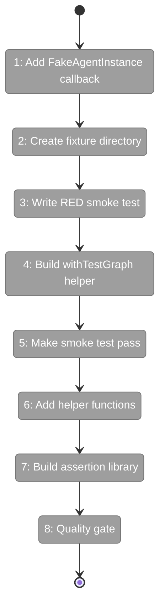
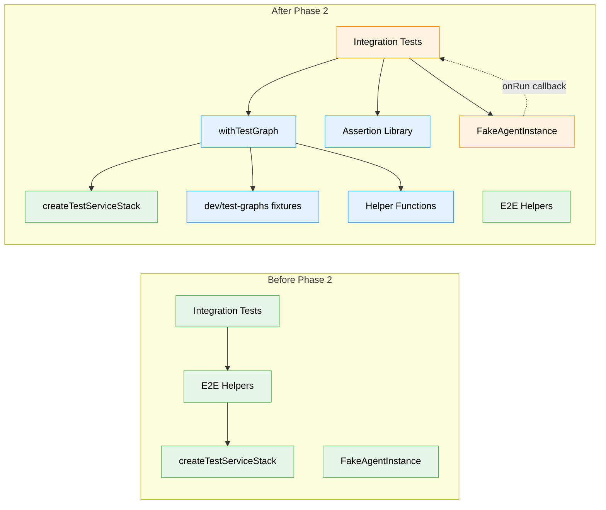

# Flight Plan: Phase 2 — Test Graph Infrastructure

**Plan**: [codepod-and-goat-integration-plan.md](../../codepod-and-goat-integration-plan.md)  
**Phase**: Phase 2: Test Graph Infrastructure  
**Generated**: 2025-02-18  
**Status**: Ready for takeoff

---

## Departure → Destination

**Where we are**: Phase 1 completed CodePod and ScriptRunner — code work units can now execute real bash scripts with full graph context (`CG_GRAPH_SLUG`, `CG_NODE_ID`, `CG_WORKSPACE_PATH` env vars). Scripts can call CLI commands like `cg wf node accept` to interact with the orchestration system. The foundation works, but there's no convenient way to test it.

**Where we're going**: By the end of this phase, integration tests can create test graphs in seconds using `withTestGraph()` — a helper that handles all the boilerplate (temp workspace creation, unit fixture copying, registration, cleanup). A developer can write a test that creates a graph fixture, drives it through the orchestration engine, and validates the results with purpose-built assertions like `assertGraphComplete()`. The infrastructure is reusable across Phases 3-4 and future agent testing.

---

## Flight Status

<!-- Updated by /plan-6 during implementation: class definitions change from pending → active → done or blocked -->

**Legend**: grey = pending | yellow = active | red = blocked/needs input | green = done

---

## Stages

<!-- Updated by /plan-6 during implementation: [ ] → [~] → [x] -->

- [ ] **Stage 1: Add FakeAgentInstance onRun callback** — enables agent simulation in tests by allowing callbacks to mutate graph state during agent execution (`packages/shared/src/features/034-agentic-cli/fakes/fake-agent-instance.ts`)
- [ ] **Stage 2: Create fixture directory structure** — establish `dev/test-graphs/` with README documenting fixture format (`dev/test-graphs/README.md`, `dev/test-graphs/shared/` directory)
- [ ] **Stage 3: Write RED smoke test** — create failing test that proves the full lifecycle: workspace creation, fixture copying, node validation, cleanup (`test/integration/test-graph-infrastructure.test.ts` — new file, `dev/test-graphs/smoke/units/ping/` — new fixture)
- [ ] **Stage 4: Build withTestGraph lifecycle helper** — implement core infrastructure that creates temp workspaces, wires real services with disk-reading loader, copies units, registers workspaces, and guarantees cleanup (`dev/test-graphs/shared/graph-test-runner.ts` — new file)
- [ ] **Stage 5: Make smoke test GREEN** — wire the helper and verify full lifecycle works (`test/integration/test-graph-infrastructure.test.ts`)
- [ ] **Stage 6: Add helper functions** — build `makeScriptsExecutable()` for chmod +x on .sh files and `completeUserInputNode()` for user-input node lifecycle simulation (`dev/test-graphs/shared/helpers.ts` — new file)
- [ ] **Stage 7: Build assertion library** — create graph-specific assertions for integration tests: `assertGraphComplete()`, `assertNodeComplete()`, `assertOutputExists()` (`dev/test-graphs/shared/assertions.ts` — new file)
- [ ] **Stage 8: Quality gate** — ensure all tests pass, lint clean (`just fft`)

---

## Acceptance Criteria

- [ ] Test graphs stored in `dev/test-graphs/` with documented structure (AC-09)
- [ ] `withTestGraph()` creates temp workspace and registers it via service (AC-10, AC-11)
- [ ] Work units copied to `.chainglass/units/` with correct structure (AC-12)
- [ ] `addNode()` validates units exist on disk (AC-13)
- [ ] Scripts made executable after copy (AC-14)
- [ ] FakeAgentInstance has optional onRun callback for agent simulation
- [ ] `just fft` clean (AC-31)

## Goals & Non-Goals

**Goals**:
- Build reusable test infrastructure for Phases 3-4
- Create `withTestGraph()` lifecycle helper with automatic cleanup
- Enable real work unit validation (disk-based loader instead of stub)
- Provide graph-specific assertions for integration tests
- Add FakeAgentInstance callback for agent simulation

**Non-Goals**:
- Actual test graph fixtures like simple-serial or parallel-fan-out (Phase 3)
- GOAT comprehensive test graph (Phase 4)
- Integration tests with drive() orchestration (Phase 3)
- Full orchestration stack in tests (deferred to Phase 3)
- Path aliases for imports (relative imports acceptable)
- Extracting `createOrchestrationStack()` to shared helpers (defer unless needed)

---

## Architecture: Before & After

**Legend**: existing (green, unchanged) | changed (orange, modified) | new (blue, created)

---

## Checklist

- [ ] T001: Add onRun callback to FakeAgentInstance (CS-2)
- [ ] T002: Create dev/test-graphs directory with README (CS-1)
- [ ] T003: Write RED smoke test proving lifecycle (CS-2)
- [ ] T004: Implement withTestGraph() helper (CS-3)
- [ ] T005: Make smoke test GREEN (CS-1)
- [ ] T006: Implement makeScriptsExecutable() (CS-1)
- [ ] T007: Implement assertion library (CS-1)
- [ ] T008: Implement completeUserInputNode() (CS-1)
- [ ] T009: just fft clean (CS-1)

---

## PlanPak

Active — plan-scoped files organized under:
- `dev/test-graphs/` — test infrastructure and fixtures
- Tests in `test/integration/` — plan-scoped integration tests
- Cross-plan-edit: `packages/shared/src/features/034-agentic-cli/fakes/fake-agent-instance.ts`
