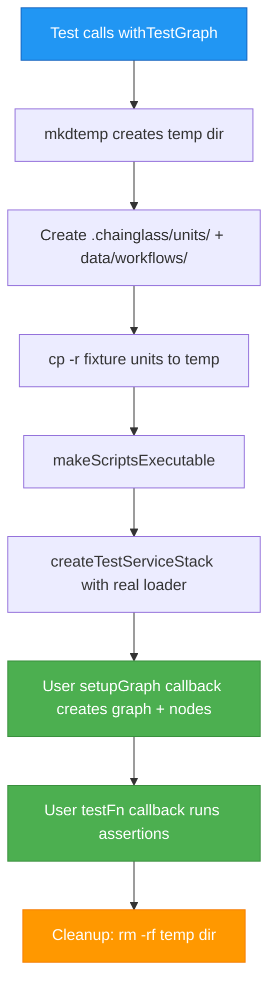
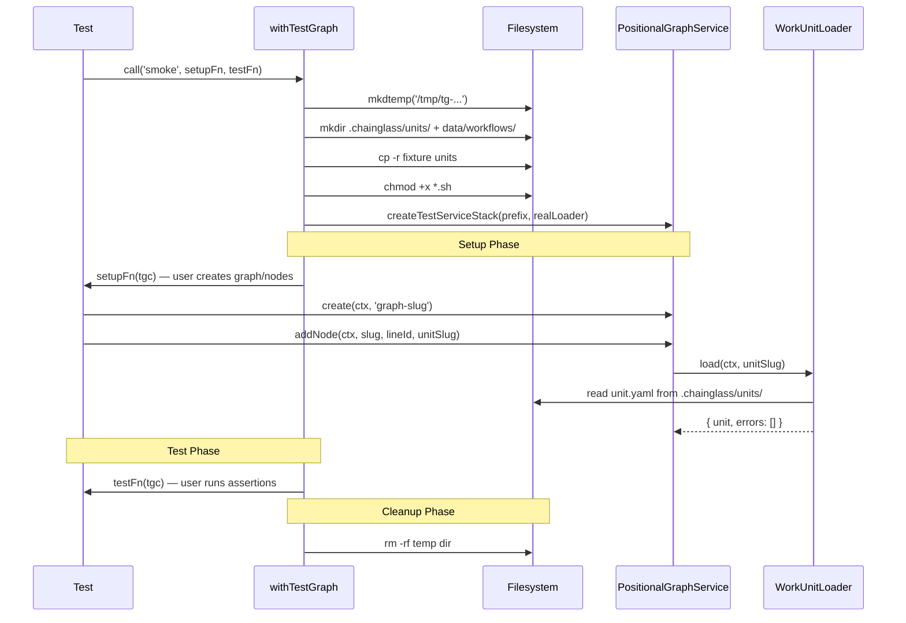

# Phase 2: Test Graph Infrastructure – Tasks & Alignment Brief

**Spec**: [codepod-and-goat-integration-spec.md](../../codepod-and-goat-integration-spec.md)
**Plan**: [codepod-and-goat-integration-plan.md](../../codepod-and-goat-integration-plan.md)
**Date**: 2026-02-18

---

## Executive Briefing

### Purpose

This phase builds the reusable test graph infrastructure that Phases 3 and 4 depend on. It creates the `withTestGraph()` helper — a lifecycle manager that creates temp workspaces, registers them, copies work unit fixtures, creates graphs, runs test callbacks, and cleans up. It also adds the `onRun` callback to `FakeAgentInstance` (needed for agent simulation in later phases) and builds graph-specific assertion and helper libraries.

### What We're Building

- **`withTestGraph()` helper**: Full lifecycle manager — mkdtemp → workspace add → copy units → setup graph → run test → remove workspace → cleanup
- **`FakeAgentInstance.onRun` callback**: Optional callback invoked during `run()` before returning result, enabling graph state mutation in integration tests
- **Helper functions**: `completeUserInputNode()` (raises accept/save/complete events), `makeScriptsExecutable()` (chmod +x on .sh files)
- **Assertion library**: `assertGraphComplete()`, `assertNodeComplete()`, `assertOutputExists()` — graph-specific assertions
- **Fixture catalogue**: `dev/test-graphs/README.md` documenting the fixture directory structure

### User Value

Future integration tests (Phases 3-4) can focus on graph scenarios rather than boilerplate setup/teardown. The GOAT integration test becomes a clear sequence of `withTestGraph()` + `drive()` + assertions, not 100 lines of workspace wiring.

### Example

**Before** (inline setup per test):
```typescript
const tmpDir = await mkdtemp('/tmp/test-');
await mkdir(tmpDir + '/.chainglass/units/', { recursive: true });
await cp('dev/test-graphs/simple-serial/units/', tmpDir + '/.chainglass/units/', { recursive: true });
await chmod(tmpDir + '/.chainglass/units/worker/scripts/simulate.sh', 0o755);
// ... 20 more lines of workspace registration, service creation, graph setup ...
```

**After** (with infrastructure):
```typescript
await withTestGraph('simple-serial', async ({ ctx, service, graph }) => {
  const handle = await orchestrationService.get(ctx, graph.slug);
  const result = await handle.drive({ onEvent: console.log });
  assertGraphComplete(ctx, service, graph.slug);
});
```

---

## Objectives & Scope

### Objective

Build the test graph infrastructure (helpers, assertions, lifecycle management) that Phases 3 and 4 consume. Prove the infrastructure works with a smoke test that creates a workspace, copies fixtures, adds nodes, and cleans up.

### Goals

- ✅ `FakeAgentInstance` has `onRun` callback (cross-plan-edit to @chainglass/shared)
- ✅ `dev/test-graphs/` directory structure with README catalogue
- ✅ `withTestGraph()` creates temp workspace, registers via service, copies units, creates graph, runs callback, cleans up
- ✅ `completeUserInputNode()` helper raises accept + saves outputs + raises completed events
- ✅ `makeScriptsExecutable()` recursively chmod +x on .sh files
- ✅ `assertGraphComplete()`, `assertNodeComplete()`, `assertOutputExists()` assertion library
- ✅ Smoke test proving infrastructure works end-to-end
- ✅ Real `IWorkUnitLoader` wired to read unit.yaml from disk (not default stub)

### Non-Goals

- ❌ Actual test graph fixtures (simple-serial, parallel-fan-out) — Phase 3
- ❌ GOAT graph — Phase 4
- ❌ Integration tests with drive() — Phase 3
- ❌ Full orchestration stack (ODS, ONBAS, PodManager) — Phase 3 concern
- ❌ Path alias (`@dev`) for imports — relative imports are acceptable
- ❌ Extracting `createOrchestrationStack()` to shared helpers — defer unless needed
- ❌ Agent-unit variants of FakeAgentInstance callbacks — deferred per Q8

---

## Pre-Implementation Audit

### Summary

| File | Action | Origin | Modified By | Recommendation |
|------|--------|--------|-------------|----------------|
| `packages/shared/.../fakes/fake-agent-instance.ts` | MODIFY | Plan 034 | Plans 035, 037 | cross-plan-edit: keep-as-is |
| `dev/test-graphs/README.md` | CREATE | New | — | plan-scoped: keep-as-is |
| `dev/test-graphs/shared/graph-test-runner.ts` | CREATE | New | — | ⚠️ reuse-existing: compose `createTestServiceStack()` |
| `dev/test-graphs/shared/helpers.ts` | CREATE | New | — | plan-scoped: keep-as-is |
| `dev/test-graphs/shared/assertions.ts` | CREATE | New | — | plan-scoped: keep-as-is |
| `test/integration/test-graph-infrastructure.test.ts` | CREATE | New | — | plan-scoped: keep-as-is |

### Key Finding: `withTestGraph()` Must Compose Existing Helpers

**CRITICAL**: `test/helpers/positional-graph-e2e-helpers.ts` already provides `createTestServiceStack()` which creates temp dirs, wires real adapters, and returns `PositionalGraphService` + `WorkspaceContext`. The `withTestGraph()` helper MUST import and compose this — not reinvent workspace creation.

**Additionally**: `createTestServiceStack(prefix, workUnitLoader?)` accepts an optional `IWorkUnitLoader`. For AC-13 (addNode validates units on disk), we must pass a real loader that reads `unit.yaml` from disk, not use the default stub that always succeeds.

### Key Finding: WorkspaceService Construction

`withTestGraph()` needs to call `workspaceService.add()` and `workspaceService.remove()` for workspace registration. `WorkspaceService` requires `IWorkspaceRegistryAdapter`, `IWorkspaceContextResolver`, and `IGitWorktreeResolver`. The real adapters from `@chainglass/workflow` should be used since AC-11 says "via service, not CLI subprocess".

### Compliance Check

| Severity | File | Rule/ADR | Violation | Suggested Fix |
|----------|------|----------|-----------|---------------|
| LOW | `dev/test-graphs/` | R-TEST-006 | Fixtures in `dev/` not `test/fixtures/` | Intentional deviation: fixtures contain executable scripts + setup code, shared across tests and demo. Documented in plan. |

---

## Requirements Traceability

### Coverage Matrix

| AC | Description | Flow Summary | Files in Flow | Tasks | Status |
|----|-------------|-------------|---------------|-------|--------|
| AC-09 | Test graphs in `dev/test-graphs/` | Directory + README created | README.md | T002 | ✅ Complete |
| AC-10 | `withTestGraph()` lifecycle | graph-test-runner.ts → createTestServiceStack → workspaceService.add → cp units → setupGraph → callback → remove → rm | graph-test-runner.ts, e2e-helpers.ts, workspace.service.ts | T004, T005 | ✅ Complete |
| AC-11 | Workspace via service not CLI | workspaceService.add(name, path) | graph-test-runner.ts, workspace.service.ts | T004 | ✅ Complete |
| AC-12 | Units copied to `.chainglass/units/` | cp -r from fixture to temp workspace | graph-test-runner.ts | T004 | ✅ Complete |
| AC-13 | `addNode()` validates units on disk | Real IWorkUnitLoader reads unit.yaml | graph-test-runner.ts (custom loader) | T004, T005 | ✅ Complete |
| AC-14 | Scripts made executable | makeScriptsExecutable globs *.sh + chmod +x | helpers.ts | T006 | ✅ Complete |
| onRun | FakeAgentInstance callback | onRun called in run() before returning | fake-agent-instance.ts | T001 | ✅ Complete |
| AC-31 | `just fft` clean | All files compile and test | all | T009 | ✅ Complete |

### Gaps Found and Resolved

- **GAP-1**: WorkspaceService construction deps → Task T004 explicitly wires real adapters or uses workspace service from existing container patterns
- **GAP-2**: `dev/` import paths → Relative imports from `test/integration/` to `dev/test-graphs/shared/` (ugly but functional)
- **GAP-3**: Default IWorkUnitLoader stub → Task T004 must pass a custom loader that reads from disk

### Orphan Files

None — all 6 task table files map to at least one AC.

---

## Architecture Map

### Component Diagram

```mermaid
flowchart TD
    classDef pending fill:#9E9E9E,stroke:#757575,color:#fff
    classDef inprogress fill:#FF9800,stroke:#F57C00,color:#fff
    classDef completed fill:#4CAF50,stroke:#388E3C,color:#fff
    classDef blocked fill:#F44336,stroke:#D32F2F,color:#fff

    style Phase fill:#F5F5F5,stroke:#E0E0E0
    style Infra fill:#F5F5F5,stroke:#E0E0E0
    style Tests fill:#F5F5F5,stroke:#E0E0E0

    subgraph Phase["Phase 2: Test Graph Infrastructure"]
        T001["T001: FakeAgentInstance onRun ✓"]:::completed
        T002["T002: dev/test-graphs/ directory ✓"]:::completed
        T003["T003: RED smoke test ✓"]:::completed
        T004["T004: withTestGraph() helper ✓"]:::completed
        T005["T005: Smoke test GREEN ✓"]:::completed
        T006["T006: makeScriptsExecutable ✓"]:::completed
        T007["T007: Assertion library ✓"]:::completed
        T008["T008: completeUserInputNode ✓"]:::completed
        T009["T009: just fft ✓"]:::completed

        T003 --> T004
        T004 --> T005
        T004 --> T006
        T004 --> T007
        T004 --> T008
        T005 --> T009
        T006 --> T009
        T007 --> T009
        T008 --> T009
    end

    subgraph Infra["Infrastructure Files"]
        F1["fake-agent-instance.ts ✓"]:::completed
        F2["dev/test-graphs/README.md ✓"]:::completed
        F3["dev/test-graphs/shared/graph-test-runner.ts ✓"]:::completed
        F4["dev/test-graphs/shared/helpers.ts ✓"]:::completed
        F5["dev/test-graphs/shared/assertions.ts ✓"]:::completed
    end

    subgraph Tests["Test Files"]
        F6["test/integration/test-graph-infrastructure.test.ts ✓"]:::completed
    end

    T001 -.-> F1
    T002 -.-> F2
    T003 -.-> F6
    T004 -.-> F3
    T005 -.-> F6
    T006 -.-> F4
    T007 -.-> F5
    T008 -.-> F4
```

<!-- Status: grey=pending, orange=in-progress, green=completed, red=blocked -->
<!-- Updated by plan-6 during implementation -->



### Task-to-Component Mapping

<!-- Status: ⬜ Pending | 🟧 In Progress | ✅ Complete | 🔴 Blocked -->

| Task | Component(s) | Files | Status | Comment |
|------|-------------|-------|--------|---------|
| T001 | FakeAgentInstance | fake-agent-instance.ts | ✅ Complete | Add onRun callback + setOnRun helper |
| T002 | Fixture Catalogue | dev/test-graphs/README.md | ✅ Complete | Directory structure + README |
| T003 | Smoke Test (RED) | test-graph-infrastructure.test.ts | ✅ Complete | Write failing test proving lifecycle |
| T004 | Graph Test Runner | graph-test-runner.ts | ✅ Complete | Core withTestGraph() implementation |
| T005 | Smoke Test (GREEN) | test-graph-infrastructure.test.ts | ✅ Complete | Make smoke test pass |
| T006 | Script Helpers | helpers.ts | ✅ Complete | makeScriptsExecutable() |
| T007 | Assertions | assertions.ts | ✅ Complete | assertGraphComplete, assertNodeComplete, assertOutputExists |
| T008 | Node Helpers | helpers.ts | ✅ Complete | completeUserInputNode() |
| T009 | Quality Gate | all | ✅ Complete | just fft clean |

---

## Tasks

| Status | ID | Task | CS | Type | Dependencies | Absolute Path(s) | Validation | Subtasks | Notes |
|--------|------|------|-----|------|-------------|-------------------|------------|----------|-------|
| [x] | T001 | Add `onRun` callback to `FakeAgentInstance`: Add optional `onRun?: (options: AgentRunOptions) => Promise<void>` to `FakeAgentInstanceOptions`. Call it in `run()` after event emission, before returning result. Add `setOnRun(fn)` test helper. Write RED test first: construct with onRun, call run(), assert callback was invoked with correct options. | 2 | Core | – | `/home/jak/substrate/033-real-agent-pods/packages/shared/src/features/034-agentic-cli/fakes/fake-agent-instance.ts`, `/home/jak/substrate/033-real-agent-pods/test/unit/shared/features/034-agentic-cli/fakes/fake-agent-instance.test.ts` | onRun callback invoked during run() with correct AgentRunOptions. Existing tests pass. | – | cross-plan-edit, Finding 05 |
| [x] | T002 | Create `dev/test-graphs/` directory structure: `mkdir -p dev/test-graphs/shared`. Create `dev/test-graphs/README.md` documenting the fixture catalogue format (directory convention, graph.setup.ts pattern, units/ structure, shared/ helpers). | 1 | Setup | – | `/home/jak/substrate/033-real-agent-pods/dev/test-graphs/README.md`, `/home/jak/substrate/033-real-agent-pods/dev/test-graphs/shared/` | Directory exists, README describes fixture format | – | plan-scoped, AC-09 |
| [x] | T003 | Write RED smoke test: `withTestGraph('smoke', setupFn, async (tgc) => { ... })` creates workspace, registers it, copies a minimal unit fixture, calls `service.addNode()` with the fixture unit slug, asserts node was added successfully, then cleans up (workspace removed, temp dir deleted). The test must fail because `withTestGraph` doesn't exist yet. Create a minimal unit fixture (`dev/test-graphs/smoke/units/ping/unit.yaml` — type: code, minimal config with `code.script: scripts/ping.sh`) and a trivial `ping.sh` (`#!/bin/bash\necho pong`). | 2 | Test | T002 | `/home/jak/substrate/033-real-agent-pods/test/integration/test-graph-infrastructure.test.ts`, `/home/jak/substrate/033-real-agent-pods/dev/test-graphs/smoke/units/ping/unit.yaml`, `/home/jak/substrate/033-real-agent-pods/dev/test-graphs/smoke/units/ping/scripts/ping.sh` | Test written and failing (withTestGraph not implemented) | – | RED, AC-10/11/12/13 |
| [x] | T004 | Implement `withTestGraph()` in `dev/test-graphs/shared/graph-test-runner.ts`. Lifecycle: (1) `mkdtemp` for temp workspace, (2) create `.chainglass/units/` and `.chainglass/data/workflows/` dirs, (3) `cp -r` units from `dev/test-graphs/<name>/units/` → temp `.chainglass/units/`, (4) `makeScriptsExecutable()` on copied units, (5) wire real `WorkUnitService` (or real `IWorkUnitLoader`) that reads from disk — pass to `createTestServiceStack()`, (6) call user's `setupGraph(tgc)` callback, (7) call `testFn(tgc)` in try/finally, (8) cleanup: remove temp dir. For workspace context: build `WorkspaceContext` with temp path (use `createTestWorkspaceContext` pattern from e2e-helpers). Export `TestGraphContext` interface with `{ ctx, service, workspacePath }`. **Extensibility for Phase 3**: Accept an optional `wiring?: (base: TestGraphContext) => Promise<T>` callback that attaches orchestration services. Phase 3 passes a wiring function that builds the orchestration stack on top of the base context, so `withTestGraph` doesn't need to change. Import `createTestServiceStack` from `test/helpers/positional-graph-e2e-helpers.ts`. **IWorkUnitLoader adapter**: `createTestServiceStack` accepts `IWorkUnitLoader` (narrow), not `IWorkUnitService` (broad). Wrap real `WorkUnitService` with adapter: `{ load: (ctx, slug) => workUnitService.load(ctx, slug) }`. | 3 | Core | T003 | `/home/jak/substrate/033-real-agent-pods/dev/test-graphs/shared/graph-test-runner.ts` | withTestGraph lifecycle works: creates temp workspace, copies units, wires service, runs callback, cleans up | – | plan-scoped, AC-10/11/12/13, compose existing helpers, Finding 03/04, DYK#2 adapter |
| [x] | T005 | Make smoke test GREEN: Wire `withTestGraph` in the smoke test. Verify: workspace created, unit copied, `addNode()` succeeds with real loader validation, cleanup removes temp dir. | 1 | Test | T004 | `/home/jak/substrate/033-real-agent-pods/test/integration/test-graph-infrastructure.test.ts` | Smoke test passes | – | GREEN |
| [x] | T006 | Implement `makeScriptsExecutable()` in `dev/test-graphs/shared/helpers.ts`: recursively glob `**/*.sh` under given directory, call `chmod(file, 0o755)` on each. Write a focused test (create temp dir with .sh file, call helper, verify executable bit). | 1 | Core | – | `/home/jak/substrate/033-real-agent-pods/dev/test-graphs/shared/helpers.ts` | .sh files made executable after calling helper | – | plan-scoped, AC-14 |
| [x] | T007 | Implement assertion library in `dev/test-graphs/shared/assertions.ts`: (1) `assertGraphComplete(service, ctx, slug)` — loads graph, asserts `isComplete === true`, (2) `assertNodeComplete(service, ctx, slug, nodeId)` — shows node, asserts status is `complete`, (3) `assertOutputExists(service, ctx, slug, nodeId, outputName)` — shows node, asserts output has value. All throw descriptive errors on failure. | 1 | Core | – | `/home/jak/substrate/033-real-agent-pods/dev/test-graphs/shared/assertions.ts` | Each assertion function throws descriptive error on failure, passes silently on success | – | plan-scoped, AC-26 prep |
| [x] | T008 | Implement `completeUserInputNode()` in `dev/test-graphs/shared/helpers.ts`: calls `service.raiseNodeEvent(ctx, slug, nodeId, 'node:accepted', {}, 'human')` → `service.saveOutputData(ctx, slug, nodeId, outputName, value)` for each output → `service.raiseNodeEvent(ctx, slug, nodeId, 'node:completed', {}, 'human')`. Parameters: `(service, ctx, graphSlug, nodeId, outputs: Record<string, unknown>)`. | 1 | Core | – | `/home/jak/substrate/033-real-agent-pods/dev/test-graphs/shared/helpers.ts` | Helper completes user-input node through full lifecycle (accepted → outputs → completed) | – | plan-scoped |
| [x] | T009 | Run `just fft`. Fix any lint/format issues. | 1 | Integration | T001, T005, T006, T007, T008 | all | `just fft` exit 0 | – | AC-31 |

---

## Alignment Brief

### Prior Phase Review

#### Phase 1: CodePod Completion and ScriptRunner

**A. Deliverables Created**:
- `packages/positional-graph/src/features/030-orchestration/script-runner.ts` — Real `ScriptRunner` class (spawn, kill, timeout)
- `packages/positional-graph/src/features/030-orchestration/pod.code.ts` — Fixed: `scriptPath`, `unitSlug` constructor params, `CG_GRAPH_SLUG/NODE_ID/WORKSPACE_PATH` env vars
- `packages/positional-graph/src/features/030-orchestration/pod-manager.types.ts` — `scriptPath` on `PodCreateParams` code variant
- `packages/positional-graph/src/features/030-orchestration/pod-manager.ts` — Passes `scriptPath + unitSlug` to CodePod
- `packages/positional-graph/src/features/030-orchestration/ods.ts` — `workUnitService` dep, async `buildPodParams`, script path resolution, fail-fast on load errors
- `packages/positional-graph/src/features/030-orchestration/ods.types.ts` — `workUnitService` on `ODSDependencies`
- `packages/positional-graph/src/features/030-orchestration/fake-pod-manager.ts` — `loadSessionsCalls + persistSessionsCalls` getters
- `apps/cli/src/lib/container.ts` — Real `ScriptRunner` replaces `FakeScriptRunner`
- `packages/positional-graph/src/container.ts` — Passes `workUnitService` to ODS
- `packages/positional-graph/package.json` — Subpath exports for 030-orchestration and 029-agentic-work-units
- `packages/positional-graph/src/features/029-agentic-work-units/index.ts` — Exported `FakeWorkUnitService`
- Tests: `script-runner.test.ts` (6), `script-runner.contract.test.ts` (4), pod.test.ts (+1 CG_* env test)
- 25 cascade call sites updated across 6 test files

**B. Lessons Learned**:
- `IWorkUnitLoader.load()` returns `NarrowWorkUnit` (no `code.script`). Must use `IWorkUnitService.load()` which returns full `WorkUnitInstance` including `code.script`.
- Plan estimated 25 cascade sites → actual was 29 (9 CodePod + 20 ODS)
- Code review found gaps: missing execution log entries, missing contract test artifact, CG_* env assertions, ODS fail-fast on errors, timeout enforcement

**C. Technical Discoveries**:
- `FakeWorkUnitService` must be configured with `addUnit({ type: 'code', slug, code: { script: '...' } })` for ODS tests with code nodes
- ScriptRunner uses `detached: true` + `process.kill(-pid)` for process group kill
- Timeout returns exit code 124
- ODS `buildPodParams` is now async (wraps `workUnitService.load()`)

**D. Dependencies Exported for This Phase**:
- Real `ScriptRunner` class — available via `@chainglass/positional-graph` 030-orchestration barrel
- `FakeWorkUnitService` — exported from `@chainglass/positional-graph/features/029-agentic-work-units`
- CodePod with `scriptPath` + `unitSlug` — constructor takes `(nodeId, runner, scriptPath, unitSlug)`
- ODS with `workUnitService` dep — resolves script path from work unit config

**E. Critical Findings Applied**:
- Finding 01 (CodePod cascade) → 9 sites updated
- Finding 02 (ODS cascade) → 20 sites updated
- Finding 07 (ODS + workUnitService acceptable per ADR-0012) → Implemented

**F. Incomplete/Blocked Items**:
- Code review requested changes (FT-001 through FT-007) — execution evidence, contract test naming, CG_* assertions, ODS fail-fast, timeout enforcement, script path containment. Some were addressed in follow-up commits.

**G. Test Infrastructure**:
- `test/unit/positional-graph/features/030-orchestration/script-runner.test.ts` — 6 tests
- `test/contracts/script-runner.contract.test.ts` — 4 contract tests
- `FakeWorkUnitService` configured with code units for ODS tests

**H. Technical Debt**:
- Execution log is sparse (header only — review finding F-001)
- Footnote ledger has placeholders only

**I. Architectural Decisions**:
- ODS depends on `IWorkUnitService` (not `IWorkUnitLoader`) — ADR-0012 compliant
- ScriptRunner uses `bash` only — scripts use shebangs for other runtimes
- Timeout hardcoded to 60s (configurable per-unit deferred)

---

### Critical Findings Affecting This Phase

| Finding | Constraint | Tasks |
|---------|-----------|-------|
| Finding 03 (Workspace API) | `workspaceService.add(name, path)` / `.remove(slug)` — not register/unregister | T004 |
| Finding 04 (No .chainglass/units/ helper) | `createTestServiceStack()` doesn't create units dir. Must mkdir explicitly. | T004 |
| Finding 05 (FakeAgentInstance no callback) | `run()` returns canned results only. Need `onRun` for graph state mutation. | T001 |

### ADR Decision Constraints

- **ADR-0012**: `withTestGraph()` is consumer-domain infrastructure. No domain boundary violations. Composes services from pod/orchestration/graph domains via injection.
- **ADR-0004**: No DI registration needed — `withTestGraph()` is a test helper, not a production service.

### PlanPak Placement Rules

- `dev/test-graphs/**` — plan-scoped (new): test infrastructure not imported by production code
- `fake-agent-instance.ts` — cross-plan-edit: modifying Plan 034 file
- `test/integration/test-graph-infrastructure.test.ts` — plan-scoped: test file

### Invariants & Guardrails

- `withTestGraph()` MUST clean up temp workspace in `finally` block — even if test throws
- `withTestGraph()` MUST use `createTestServiceStack()` from e2e-helpers — not reinvent service wiring
- Real `IWorkUnitLoader` (or `IWorkUnitService`) MUST be wired — default stub always succeeds and would make AC-13 vacuous
- `FakeAgentInstance.onRun` is optional and backward-compatible — existing tests must not break
- No `vi.mock` / `jest.mock` — fakes only

### Inputs to Read

- `test/helpers/positional-graph-e2e-helpers.ts` — `createTestServiceStack()` signature and behavior
- `test/e2e/positional-graph-orchestration-e2e.ts` — `createOrchestrationStack()` pattern (reference only for Phase 3)
- `packages/shared/src/features/034-agentic-cli/fakes/fake-agent-instance.ts` — current FakeAgentInstance (255 lines)
- `packages/positional-graph/src/features/029-agentic-work-units/fake-workunit.service.ts` — FakeWorkUnitService API

### Visual Alignment Aids

#### System Flow Diagram



#### Interaction Sequence



### Test Plan (Full TDD)

**Policy**: Fakes only. No vi.mock. Real filesystem for workspace lifecycle.

| Test File | Tests | What's Covered |
|-----------|-------|----------------|
| `fake-agent-instance.test.ts` (additions) | onRun callback invoked, onRun receives correct options, onRun is optional | FakeAgentInstance callback contract |
| `test-graph-infrastructure.test.ts` | Smoke: workspace created + unit copied + addNode succeeds + cleanup | Full withTestGraph lifecycle |

### Step-by-Step Implementation Order

```
T001 (FakeAgentInstance onRun — independent)
T002 (Directory structure — independent)
  T003 (RED: smoke test — needs T002 for fixture)
    T004 (withTestGraph implementation — makes T003 pass)
      T005 (GREEN: smoke test passes)
T006 (makeScriptsExecutable — independent, called by T004)
T007 (Assertion library — independent)
T008 (completeUserInputNode — independent)
  T009 (just fft — after all above)
```

Note: T001, T002, T006, T007, T008 are independent and can be implemented in any order. T003→T004→T005 is the critical TDD chain.

### Commands to Run

```bash
# FakeAgentInstance tests
pnpm test -- --run test/unit/shared/features/034-agentic-cli/fakes/fake-agent-instance.test.ts

# Smoke test (integration)
pnpm test -- --run test/integration/test-graph-infrastructure.test.ts

# Full quality gate
just fft
```

### Risks & Unknowns

| Risk | Severity | Mitigation |
|------|----------|------------|
| WorkspaceService construction complexity | Medium | Use createTestServiceStack pattern — it already wires real adapters. Build WorkspaceContext manually. |
| Real IWorkUnitLoader wiring | Medium | Use WorkUnitService from @chainglass/positional-graph (already exported). Or build a simple loader that reads unit.yaml via yaml-parser-adapter. |
| Import paths from test/ to dev/ | Low | Relative imports work. No alias needed. |
| FakeAgentInstance test file may not exist | Low | Check if test file exists; create if needed. |

### Ready Check

- [ ] ADR constraints mapped (ADR-0012 → T004 domain boundaries, ADR-0004 → N/A no DI)
- [ ] Inputs read (implementer reads files before starting)
- [ ] Phase 1 deliverables verified (ScriptRunner, CodePod, ODS all working)
- [ ] `just fft` baseline green

---

## Phase Footnote Stubs

| Footnote | Task | Description |
|----------|------|-------------|
| | | |

---

## Evidence Artifacts

- **Execution log**: `docs/plans/037-codepod-and-goat-integration/tasks/phase-2-test-graph-infrastructure/execution.log.md`

---

## Discoveries & Learnings

_Populated during implementation by plan-6. Log anything of interest to your future self._

| Date | Task | Type | Discovery | Resolution | References |
|------|------|------|-----------|------------|------------|
| | | | | | |

**Types**: `gotcha` | `research-needed` | `unexpected-behavior` | `workaround` | `decision` | `debt` | `insight`

_See also: `execution.log.md` for detailed narrative._

---

## Critical Insights (2026-02-18)

| # | Insight | Decision |
|---|---------|----------|
| 1 | EventSource `'user'` doesn't exist — valid values are agent/executor/orchestrator/human | Fixed T008: `'user'` → `'human'` in raiseNodeEvent calls |
| 2 | `createTestServiceStack` accepts `IWorkUnitLoader` (narrow), not `IWorkUnitService` (broad) — needs adapter wrapper | Added adapter pattern note to T004: `{ load: (ctx, slug) => wus.load(ctx, slug) }` |
| 3 | Phase 2 `TestGraphContext` is too narrow for Phase 3 (needs orchestration stack) | T004 accepts optional `wiring` callback for extensibility — Phase 3 composes on top |
| 4 | Workspace registration isn't exercised by smoke test (only needed for CLI resolution in Phase 3) | Keep registration in Phase 2 per AC-10/11 — not deferrable |
| 5 | E2E completes nodes via CLI subprocess, our helper uses programmatic raiseNodeEvent | Programmatic approach confirmed — mirrors web UI pattern (direct service calls as 'human' source) |

Action items: None — all decisions captured in task notes above.

---

## Directory Layout

```
docs/plans/037-codepod-and-goat-integration/
  ├── codepod-and-goat-integration-spec.md
  ├── codepod-and-goat-integration-plan.md
  ├── workshops/ (symlinks to 036)
  └── tasks/
      ├── phase-1-codepod-completion-and-scriptrunner/
      │   ├── tasks.md
      │   ├── tasks.fltplan.md
      │   └── execution.log.md
      └── phase-2-test-graph-infrastructure/
          ├── tasks.md              ← this file
          ├── tasks.fltplan.md      ← generated by /plan-5b
          └── execution.log.md     ← created by /plan-6
```
