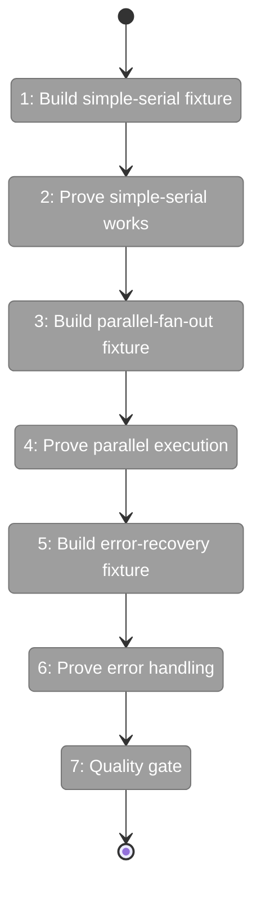
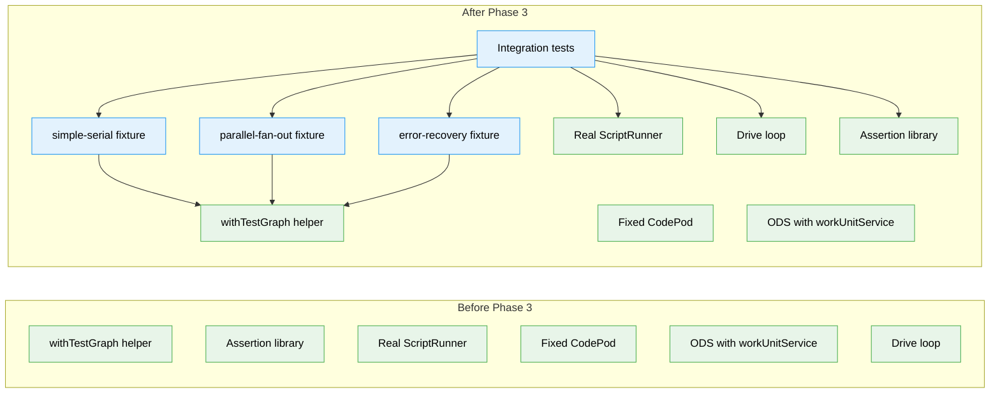

# Flight Plan: Phase 3 — Simple Test Graphs

**Plan**: [codepod-and-goat-integration-plan.md](../../codepod-and-goat-integration-plan.md)  
**Phase**: Phase 3: Simple Test Graphs  
**Generated**: 2024-02-20  
**Status**: Ready for takeoff

---

## Departure → Destination

**Where we are**: The orchestration pipeline has been built piece by piece across three plans — the drive loop exists, CodePod can execute scripts with full graph context (CG_* env vars), and Phase 2 created reusable test infrastructure (`withTestGraph` helper, assertions, and the FakeAgentInstance onRun callback). But none of this has been proven end-to-end. We have unit tests for individual components, but no integration test showing that a real graph can be created, driven to completion, and validated using simulation scripts that call real CLI commands.

**Where we're going**: By the end of this phase, we can say "the orchestration system works" with evidence. Three test graph fixtures (`simple-serial`, `parallel-fan-out`, `error-recovery`) will prove the pipeline drives graphs to completion. A developer can run `pnpm test -- --run test/integration/orchestration-drive.test.ts` and watch real scripts execute in real subprocesses, mutating real graph state on disk, driven by the real orchestration loop. Each graph returns `exitReason: 'complete'` or `'failed'` as expected.

---

## Flight Status

<!-- Updated by /plan-6 during implementation: [ ] → [~] → [x]. Use blocked for problems/input needed. -->

**Legend**: grey = pending | yellow = active | red = blocked/needs input | green = done

---

## Stages

<!-- Updated by /plan-6 during implementation: [ ] → [~] → [x] -->

- [ ] **Stage 1: Create simple-serial fixture** — two-node graph with user-input setup and code worker that calls CLI commands (`dev/test-graphs/simple-serial/units/`)
- [ ] **Stage 2: Write RED integration test for simple-serial** — wire orchestration stack, drive graph, assert completion (`test/integration/orchestration-drive.test.ts` — new file)
- [ ] **Stage 3: Make simple-serial test GREEN** — debug and fix until drive() completes the graph successfully (`test/integration/orchestration-drive.test.ts`)
- [ ] **Stage 4: Create parallel-fan-out fixture** — five-node graph with 3 parallel workers and combiner (`dev/test-graphs/parallel-fan-out/units/`)
- [ ] **Stage 5: Prove parallel execution works** — write and pass test showing all parallel nodes complete before combiner runs (`test/integration/orchestration-drive.test.ts`)
- [ ] **Stage 6: Create error-recovery fixture** — two-node graph where fail-node calls cg wf node error and exits non-zero (`dev/test-graphs/error-recovery/units/`)
- [ ] **Stage 7: Prove error handling works** — write and pass test showing drive() returns failed and node enters blocked-error (`test/integration/orchestration-drive.test.ts`)
- [ ] **Stage 8: Run quality gate** — execute just fft to validate all tests pass and lint is clean (all files)

---

## Acceptance Criteria

- [ ] `simple-serial` graph drives to completion with exitReason: 'complete'
- [ ] `parallel-fan-out` graph drives to completion with all parallel nodes executing
- [ ] `error-recovery` graph shows failure correctly with exitReason: 'failed'
- [ ] Graph status view shows correct glyphs for each status
- [ ] Simulation scripts call CLI commands with --workspace-path flag
- [ ] Error simulation script calls cg wf node error
- [ ] All tests pass with just fft clean

---

## Goals & Non-Goals

**Goals**:
- ✅ `simple-serial` fixture: user-input → code worker with simulation script
- ✅ `parallel-fan-out` fixture: user-input → 3 parallel code workers → combiner
- ✅ `error-recovery` fixture: user-input → fail-node with error script
- ✅ Integration test: simple-serial drives to completion
- ✅ Integration test: parallel-fan-out drives to completion
- ✅ Integration test: error-recovery shows failure correctly
- ✅ All simulation scripts call CLI with `--workspace-path "$CG_WORKSPACE_PATH"`
- ✅ Orchestration stack wired with real ScriptRunner (not fake)

**Non-Goals**:
- ❌ GOAT graph (Phase 4)
- ❌ Demo script (Phase 4)
- ❌ Agent-unit variants (deferred per Q8)
- ❌ `graph.setup.ts` auto-import pattern (graph setup done inline in tests)
- ❌ Extracting `createOrchestrationStack` to shared helper (inline wiring acceptable; extract if needed in Phase 4)
- ❌ Workspace registration via service (scripts use `--workspace-path` flag)
- ❌ Question/answer or manual-transition scenarios (Phase 4 GOAT)

---

## Architecture: Before & After

**Legend**: existing (green, unchanged) | changed (orange, modified) | new (blue, created)

---

## Checklist

- [ ] T001: Create simple-serial fixture with unit.yaml and simulate.sh (CS-2)
- [ ] T002: Write RED integration test for simple-serial (CS-3)
- [ ] T003: Make simple-serial integration test pass (CS-2)
- [ ] T004: Create parallel-fan-out fixture with 5 units (CS-2)
- [ ] T005: Write and pass parallel-fan-out integration test (CS-3)
- [ ] T006: Create error-recovery fixture with fail-node (CS-2)
- [ ] T007: Write and pass error-recovery integration test (CS-2)
- [ ] T008: Run just fft quality gate (CS-1)

---

## PlanPak

Active — files organized under `dev/test-graphs/<fixture-name>/` and `test/integration/`
