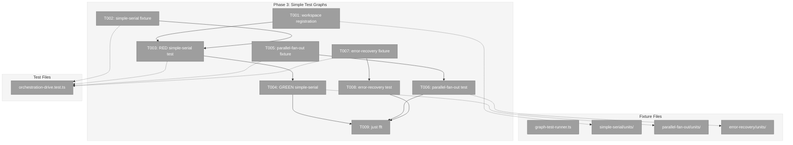

# Phase 3: Simple Test Graphs – Tasks & Alignment Brief

**Spec**: [codepod-and-goat-integration-spec.md](../../codepod-and-goat-integration-spec.md)
**Plan**: [codepod-and-goat-integration-plan.md](../../codepod-and-goat-integration-plan.md)
**Date**: 2026-02-20

---

## Executive Briefing

### Purpose

This is the phase where we prove the entire orchestration pipeline works end-to-end. For the first time, `drive()` will run a real graph with real scripts that call real CLI commands — not canned fakes. Three increasingly complex graph topologies validate serial progression, parallel fan-out, and error handling.

### What We're Building

- **simple-serial**: User-input node → code worker node. The worker's simulation script calls `cg wf node accept`, `save-output-data`, `end` to progress the graph. `drive()` returns `exitReason: 'complete'`.
- **parallel-fan-out**: User-input setup → 3 parallel code workers → combiner. Proves parallel execution works.
- **error-recovery**: User-input setup → fail-node that calls `cg wf node error` and exits non-zero. Proves error detection works.

### User Value

After this phase, we can say "the orchestration system works" — not just "the unit tests pass". Real scripts execute in real subprocesses, mutating real graph state on disk, driven by the real orchestration loop.

### Example

```bash
# What happens inside simple-serial integration test:
withTestGraph('simple-serial', async (tgc) => {
  # 1. Create graph: setup (user-input) → worker (code)
  # 2. Complete user-input node programmatically
  # 3. drive() → ScriptRunner spawns simulate.sh → script calls CLI → graph progresses
  # 4. drive() returns { exitReason: 'complete', totalActions: 2 }
  # 5. assertGraphComplete() passes ✅
});
```

---

## Objectives & Scope

### Objective

Create 3 test graph fixtures with simulation scripts, write integration tests proving `drive()` completes each graph topology correctly.

### Goals

- ✅ `simple-serial` fixture: user-input → code worker with simulation script
- ✅ `parallel-fan-out` fixture: user-input → 3 parallel code workers → combiner
- ✅ `error-recovery` fixture: user-input → fail-node with error script
- ✅ Integration test: simple-serial drives to completion
- ✅ Integration test: parallel-fan-out drives to completion
- ✅ Integration test: error-recovery shows failure correctly
- ✅ All simulation scripts call CLI with `--workspace-path "$CG_WORKSPACE_PATH"`
- ✅ Orchestration stack wired with real ScriptRunner (not fake)

### Non-Goals

- ❌ GOAT graph (Phase 4)
- ❌ Demo script (Phase 4)
- ❌ Agent-unit variants (deferred per Q8)
- ❌ `graph.setup.ts` auto-import pattern (graph setup done inline in tests)
- ~~❌ Extracting `createOrchestrationStack` to shared helper~~ → **Approved exception**: Workshop 09 decided to co-locate `buildDiskWorkUnitService()` and `createTestOrchestrationStack()` in `graph-test-runner.ts` for Phase 3+4 reuse. Inline wiring would duplicate ~50 lines across 3 test describes.
- ❌ Workspace registration via service (scripts use `--workspace-path` flag)
- ❌ Question/answer or manual-transition scenarios (Phase 4 GOAT)

---

## Pre-Implementation Audit

### Summary

| File | Action | Origin | Recommendation |
|------|--------|--------|----------------|
| `dev/test-graphs/simple-serial/units/setup/unit.yaml` | CREATE | New | plan-scoped |
| `dev/test-graphs/simple-serial/units/worker/unit.yaml` | CREATE | New | plan-scoped |
| `dev/test-graphs/simple-serial/units/worker/scripts/simulate.sh` | CREATE | New | plan-scoped |
| `dev/test-graphs/parallel-fan-out/units/*` (5 units) | CREATE | New | plan-scoped |
| `dev/test-graphs/parallel-fan-out/units/*/scripts/simulate.sh` | CREATE | New | plan-scoped |
| `dev/test-graphs/error-recovery/units/setup/unit.yaml` | CREATE | New | plan-scoped |
| `dev/test-graphs/error-recovery/units/fail-node/unit.yaml` | CREATE | New | plan-scoped |
| `dev/test-graphs/error-recovery/units/fail-node/scripts/error-simulate.sh` | CREATE | New | plan-scoped |
| `test/integration/orchestration-drive.test.ts` | CREATE | New | plan-scoped |

No duplication. No compliance violations. All files are new fixtures and tests.

### Key Finding: CLI Must Be Available

Simulation scripts call `cg wf node accept/save-output-data/end/error` via subprocess. The `cg` binary is globally linked at `/home/jak/.local/share/pnpm/cg` and built at `apps/cli/dist/cli.cjs`. `ScriptRunner` inherits `process.env` including `PATH`, so `cg` is available to scripts.

**Pre-condition**: CLI must be built (`pnpm build --filter=@chainglass/cli`). Tests should use `skipIf` guard if CLI not found.

### Key Finding: Orchestration Stack Wiring

`createOrchestrationStack()` is a local function in `test/e2e/positional-graph-orchestration-e2e.ts` (not exported). Phase 3 must either extract it or inline the wiring (~30 lines) inside the test file. Inline is acceptable for Phase 3; extract for Phase 4 reuse if needed.

---

## Requirements Traceability

### Coverage Matrix

| AC | Description | Files in Flow | Tasks | Status |
|----|-------------|---------------|-------|--------|
| AC-10/11 | Workspace registered via service + CLI resolves | withTestGraph, WorkspaceService.add/remove, CLI --workspace-path | T001 | ✅ Complete |
| AC-15 | Standard simulate.sh calls accept/save/end | simulate.sh, pod.code.ts, script-runner.ts, CLI commands | T002, T004 | ✅ Complete |
| AC-16 | Error script calls `cg wf node error` | error-simulate.sh, pod.code.ts, script-runner.ts | T007, T008 | ✅ Complete |
| AC-19 | Scripts pass `--workspace-path "$CG_WORKSPACE_PATH"` | All simulate.sh scripts | T002, T005, T007 | ✅ Complete |
| AC-20 | simple-serial drives to completion | withTestGraph, orchestration stack, drive(), simulate.sh | T001, T002, T003, T004 | ✅ Complete |
| AC-21 | parallel-fan-out drives to completion | withTestGraph, orchestration stack, drive(), 3 parallel scripts | T005, T006 | ✅ Complete |
| AC-22 | error-recovery shows failure correctly | withTestGraph, orchestration stack, drive(), error script | T007, T008 | ✅ Complete |
| AC-23 | Graph status shows correct glyphs | getStatus(), assertNodeComplete | T004, T006, T008 | ✅ Via status assertions |
| AC-31 | just fft clean | all | T009 | ✅ Complete |

### Gaps Found and Resolved

- **GAP-1 (CLI availability)**: Scripts need `cg` on PATH. Resolved: `cg` is globally linked. Add `skipIf` guard in tests.
- **GAP-2 (Orchestration stack)**: Not in `withTestGraph`. Resolved: Inline wiring in test file.
- **GAP-6 (WorkUnitService)**: ODS needs configured FakeWorkUnitService. Resolved: The disk-backed loader from Phase 2 reads real unit.yaml. ODS uses `IWorkUnitService` separately — for these tests, configure `FakeWorkUnitService` with matching unit configs.

---

## Architecture Map

### Component Diagram



### Task-to-Component Mapping

| Task | Component(s) | Files | Status | Comment |
|------|-------------|-------|--------|---------|
| T001 | Workspace Registration | graph-test-runner.ts, test-graph-infrastructure.test.ts | ⬜ Pending | Add workspace add/remove + CLI resolution test |
| T002 | Simple Serial Fixture | dev/test-graphs/simple-serial/ | ⬜ Pending | unit.yaml + simulate.sh for setup + worker |
| T003 | Simple Serial Test (RED) | test/integration/orchestration-drive.test.ts | ⬜ Pending | Write failing test with orchestration stack |
| T004 | Simple Serial Test (GREEN) | test/integration/orchestration-drive.test.ts | ⬜ Pending | Make drive() complete the graph |
| T005 | Parallel Fan-Out Fixture | dev/test-graphs/parallel-fan-out/ | ⬜ Pending | 5 units: setup + 3 parallel + combiner |
| T006 | Parallel Fan-Out Test | test/integration/orchestration-drive.test.ts | ⬜ Pending | Drive 3 parallel nodes to completion |
| T007 | Error Recovery Fixture | dev/test-graphs/error-recovery/ | ⬜ Pending | setup + fail-node with error script |
| T008 | Error Recovery Test | test/integration/orchestration-drive.test.ts | ⬜ Pending | Drive to failure, assert error visible |
| T009 | Quality Gate | all | ⬜ Pending | just fft clean |

---

## Tasks

| Status | ID | Task | CS | Type | Dependencies | Absolute Path(s) | Validation | Subtasks | Notes |
|--------|------|------|-----|------|-------------|-------------------|------------|----------|-------|
| [x] | T001 | **Prerequisite: Add workspace registration to `withTestGraph`**. Import or construct `WorkspaceService` with real adapters. Call `workspaceService.add(workspaceSlug, tmpDir)` after creating dirs and copying units. Call `workspaceService.remove(workspaceSlug)` in `finally` before rm. Add a test to `test/integration/test-graph-infrastructure.test.ts` proving CLI commands resolve from the registered temp workspace (e.g., spawn `cg wf list --workspace-path $tmpDir --json` and assert success). This unblocks all simulation scripts. | 3 | Core | – | `/home/jak/substrate/033-real-agent-pods/dev/test-graphs/shared/graph-test-runner.ts`, `/home/jak/substrate/033-real-agent-pods/test/integration/test-graph-infrastructure.test.ts` | withTestGraph registers workspace, CLI resolves from temp dir, cleanup removes registration | – | BLOCKER for all scripts, AC-10/AC-11, DYK-P3#1 · [📋](execution.log.md#task-t001-workspace-registration-in-withtestgraph) [^12] |
| [x] | T002 | Create `simple-serial` fixture: `setup/unit.yaml` (type: user-input, output: instructions), `worker/unit.yaml` (type: code, input: task from setup, output: result, code.script: scripts/simulate.sh), `worker/scripts/simulate.sh` (calls `cg wf node accept`, `save-output-data`, `end` with `--workspace-path "$CG_WORKSPACE_PATH"`). | 2 | Setup | – | `/home/jak/substrate/033-real-agent-pods/dev/test-graphs/simple-serial/units/setup/unit.yaml`, `/home/jak/substrate/033-real-agent-pods/dev/test-graphs/simple-serial/units/worker/unit.yaml`, `/home/jak/substrate/033-real-agent-pods/dev/test-graphs/simple-serial/units/worker/scripts/simulate.sh` | Files on disk, unit.yaml valid per schema | – | AC-15, AC-19 · [📋](execution.log.md#task-t002-create-simple-serial-fixture) [^13] |
| [x] | T003 | Write RED integration test for simple-serial: `withTestGraph('simple-serial', ...)` → inline orchestration stack wiring (ONBAS, ODS, EHS, PodManager, real ScriptRunner, OrchestrationService) → `service.create` + `addNode` (setup on line-0, worker on line-0) → `setInput` (worker.task ← setup.instructions) → `completeUserInputNode` for setup → `handle.drive({ maxIterations: 50, actionDelayMs: 50 })` → assert `exitReason === 'complete'` + `assertGraphComplete` + `assertNodeComplete` for both nodes. Include `skipIf` guard for CLI binary. Timeout: 60s. | 3 | Test | T001, T002 | `/home/jak/substrate/033-real-agent-pods/test/integration/orchestration-drive.test.ts` | Test written and failing (drive doesn't complete because orchestration wiring is wrong or script fails) | – | RED, AC-20 · [📋](execution.log.md#task-t003t004-simple-serial-integration-test-redgreen) [^14] |
| [x] | T004 | Make simple-serial integration test pass. Debug and fix any issues with: script path resolution, env var propagation, CLI command execution, graph state progression. This is the critical integration moment. | 2 | Core | T003 | `/home/jak/substrate/033-real-agent-pods/test/integration/orchestration-drive.test.ts` | `drive()` returns `exitReason: 'complete'`. All assertions pass. | – | GREEN, AC-20, AC-23 · [📋](execution.log.md#task-t003t004-simple-serial-integration-test-redgreen) [^14] |
| [x] | T005 | Create `parallel-fan-out` fixture: `setup/unit.yaml` (user-input, output: config), `parallel-1/unit.yaml`, `parallel-2/unit.yaml`, `parallel-3/unit.yaml` (code, input: config from setup, output: result, each with own simulate.sh), `combiner/unit.yaml` (code, inputs: result from parallel-1/2/3, output: combined, simulate.sh). | 2 | Setup | – | `/home/jak/substrate/033-real-agent-pods/dev/test-graphs/parallel-fan-out/units/setup/unit.yaml`, `/home/jak/substrate/033-real-agent-pods/dev/test-graphs/parallel-fan-out/units/parallel-1/`, `/home/jak/substrate/033-real-agent-pods/dev/test-graphs/parallel-fan-out/units/parallel-2/`, `/home/jak/substrate/033-real-agent-pods/dev/test-graphs/parallel-fan-out/units/parallel-3/`, `/home/jak/substrate/033-real-agent-pods/dev/test-graphs/parallel-fan-out/units/combiner/` | Files on disk, unit.yaml valid | – | AC-15, AC-19 · [📋](execution.log.md#task-t005t006-parallel-fan-out-fixture--test-redgreen) [^15] |
| [x] | T006 | Write + make pass: parallel-fan-out integration test. Graph topology: line-0 (setup), line-1 (parallel-1, parallel-2, parallel-3 with `execution: 'parallel'`), line-2 (combiner). Wire inputs. Complete setup. Drive. Assert all nodes complete, combiner has combined output. | 3 | Test | T005, T004 | `/home/jak/substrate/033-real-agent-pods/test/integration/orchestration-drive.test.ts` | drive() returns complete, all 5 nodes complete, combiner output exists | – | RED→GREEN, AC-21, AC-23 · [📋](execution.log.md#task-t005t006-parallel-fan-out-fixture--test-redgreen) [^15] |
| [x] | T007 | Create `error-recovery` fixture: `setup/unit.yaml` (user-input, output: task), `fail-node/unit.yaml` (code, input: task from setup, code.script: scripts/error-simulate.sh). `error-simulate.sh` calls `cg wf node error "$CG_GRAPH_SLUG" "$CG_NODE_ID" --code SCRIPT_FAILED --message "Deliberate failure" --workspace-path "$CG_WORKSPACE_PATH"` then `exit 1`. | 2 | Setup | – | `/home/jak/substrate/033-real-agent-pods/dev/test-graphs/error-recovery/units/setup/unit.yaml`, `/home/jak/substrate/033-real-agent-pods/dev/test-graphs/error-recovery/units/fail-node/unit.yaml`, `/home/jak/substrate/033-real-agent-pods/dev/test-graphs/error-recovery/units/fail-node/scripts/error-simulate.sh` | Files on disk, error script exits non-zero | – | AC-16, AC-19 · [📋](execution.log.md#task-t007t008-error-recovery-fixture--test-redgreen) [^16] |
| [x] | T008 | Write + make pass: error-recovery integration test. Create graph (setup → fail-node). Complete setup. Drive. Assert `exitReason === 'failed'`, fail-node status is `blocked-error`, graph status is `failed`. | 2 | Test | T007, T004 | `/home/jak/substrate/033-real-agent-pods/test/integration/orchestration-drive.test.ts` | drive() returns failed, fail-node in blocked-error, graph status failed | – | RED→GREEN, AC-22, AC-23 · [📋](execution.log.md#task-t007t008-error-recovery-fixture--test-redgreen) [^16] |
| [x] | T009 | Run `just fft`. Fix any lint/format issues. | 1 | Integration | T004, T006, T008 | all | `just fft` exit 0 | – | AC-31 · [📋](execution.log.md#task-t009-quality-gate) [^17] |

---

## Alignment Brief

### Prior Phases Review

#### Phase 1: CodePod Completion and ScriptRunner

**Deliverables for Phase 3**: Real `ScriptRunner` (subprocess execution via spawn), fixed `CodePod` (scriptPath, unitSlug, CG_* env vars), ODS with `workUnitService` (script path resolution from unit.yaml), DI containers with real ScriptRunner.

**Key discoveries**: IWorkUnitLoader vs IWorkUnitService (use service for full WorkUnitInstance), script path resolution pattern (`worktreePath/.chainglass/units/<slug>/<script>`), detached process groups for clean kill, timeout returns exit code 124.

**Test infrastructure**: 6 ScriptRunner tests, 4 contract tests, CG_* env var assertions. FakeWorkUnitService exported from 029 barrel.

#### Phase 2: Test Graph Infrastructure

**Deliverables for Phase 3**: `withTestGraph(fixtureName, testFn)` lifecycle helper, `completeUserInputNode(service, ctx, slug, nodeId, outputs)` helper, `makeScriptsExecutable(dir)` helper, `assertGraphComplete/NodeComplete/OutputExists` assertions, `FakeAgentInstance.onRun` callback.

**Key discoveries**: IWorkUnitLoader adapter pattern (buildDiskLoader reads unit.yaml from disk), parentPath typing workaround, double temp-dir cleanup needed, WorkspaceContext override (withTestGraph overrides createTestServiceStack's context to point at fixture tmpDir).

**Import paths for Phase 3**:
```typescript
import { withTestGraph, type TestGraphContext } from '../../../dev/test-graphs/shared/graph-test-runner.js';
import { completeUserInputNode } from '../../../dev/test-graphs/shared/helpers.js';
import { assertGraphComplete, assertNodeComplete } from '../../../dev/test-graphs/shared/assertions.js';
```

### Critical Findings Affecting This Phase

| Finding | Constraint | Tasks |
|---------|-----------|-------|
| DYK-P3#1 (Workspace registration) | CLI `--workspace-path` requires registered workspace. `withTestGraph` must call `workspaceService.add()/remove()`. | T001 |
| GAP-1 (CLI availability) | Scripts call `cg` via subprocess. Must be on PATH and built. | T003 (skipIf guard) |
| GAP-2 (Orchestration stack) | `createOrchestrationStack` not exported. Inline wiring needed. | T003 |
| Finding 03 (Workspace API) | `workspaceService.add(name, path)` / `.remove(slug)` | T001 |
| Finding 04 (.chainglass/units/) | withTestGraph creates this dir. Units must be inside it. | T002, T005, T007 |

### ADR Decision Constraints

- **ADR-0012**: Phase 3 creates no production code. Test fixtures are consumer domain. All CLI commands already exist.
- **ADR-0006**: Simulation scripts use CLI-based orchestration commands per ADR intent.

### PlanPak Placement Rules

- All fixture files in `dev/test-graphs/<name>/` — plan-scoped (new)
- Integration test in `test/integration/` — plan-scoped (new)
- No cross-plan edits needed in Phase 3

### Invariants & Guardrails

- All simulation scripts MUST pass `--workspace-path "$CG_WORKSPACE_PATH"` — temp workspaces aren't in the registry
- All unit.yaml files MUST have at least one output (schema requirement)
- Code units MUST have `code.script` pointing to an executable `.sh` file
- Graph creation order: create graph → add lines → add nodes → wire inputs → complete user-input → drive
- `drive()` delays: use short values for tests (`actionDelayMs: 50`, `idleDelayMs: 500`) to avoid slow tests

### Test Plan (Full TDD)

**Policy**: Fakes only (no vi.mock). Real ScriptRunner for script execution. FakeAgentManagerService (no agent nodes in Phase 3).

| Test | Graph | What's Proven |
|------|-------|---------------|
| simple-serial drives to completion | 2 nodes (user-input → code) | Basic end-to-end: script executes, CLI commands work, graph completes |
| parallel-fan-out drives to completion | 5 nodes (setup → 3 parallel → combiner) | Parallel execution: all 3 run, combiner waits for all |
| error-recovery shows failure | 2 nodes (user-input → fail-node) | Error path: script exits non-zero, node blocked-error, drive returns failed |

### Orchestration Stack Wiring Pattern

Inside `withTestGraph` callback, build the orchestration stack:

```typescript
// 1. Event infrastructure
const eventRegistry = new FakeNodeEventRegistry();
registerCoreEventTypes(eventRegistry);
const nodeEventService = new NodeEventService(tgc.service, eventRegistry);
const eventHandlerService = new EventHandlerService(nodeEventService, tgc.service);

// 2. Orchestration decision chain
const onbas = new ONBAS();
const agentContextService = new AgentContextService();
const agentManager = new FakeAgentManagerService();
const scriptRunner = new ScriptRunner();  // REAL, not fake
const podManager = new PodManager(agentManager, scriptRunner, agentContextService);
const fakeWorkUnitService = new FakeWorkUnitService();
// ... configure fakeWorkUnitService with unit configs ...
const ods = new ODS({ graphService: tgc.service, podManager, contextService: agentContextService, agentManager, scriptRunner, workUnitService: fakeWorkUnitService });
const orchestrationService = new OrchestrationService({ onbas, ods, eventHandlerService, podManager });

// 3. Get handle and drive
const handle = await orchestrationService.get(tgc.ctx, graphSlug);
const result = await handle.drive({ maxIterations: 50, actionDelayMs: 50, idleDelayMs: 500 });
```

### Commands to Run

```bash
# Build CLI first (simulation scripts need it)
pnpm build --filter=@chainglass/cli

# Run integration tests
pnpm test -- --run test/integration/orchestration-drive.test.ts

# Full quality gate
just fft
```

### Risks & Unknowns

| Risk | Severity | Mitigation |
|------|----------|------------|
| Script fails to find `cg` on PATH | High | `skipIf` guard + document pre-condition |
| ODS fire-and-forget: drive() loop may need multiple iterations | Medium | Use sufficient maxIterations (50); actionDelayMs gives scripts time to complete |
| Parallel node wiring correctness | Medium | Start with simple-serial; parallel adds one variable at a time |
| Script writes vs drive loop reads race condition | Low | Scripts are synchronous (write to disk → exit). drive() re-reads each iteration. |

### Ready Check

- [ ] ADR constraints mapped (ADR-0012 → no production code, ADR-0006 → CLI commands)
- [ ] Inputs read (implementer reads withTestGraph, helpers, assertions)
- [ ] Phase 2 deliverables verified (smoke test passes)
- [ ] CLI binary built and `cg` on PATH
- [ ] `just fft` baseline green

---

## Phase Footnote Stubs

| Footnote | Task | Description |
|----------|------|-------------|
| [^12] | T001 | Workspace registration in withTestGraph + CLI resolution test |
| [^13] | T002 | simple-serial fixture (setup + worker + simulate.sh) |
| [^14] | T003, T004 | simple-serial integration test RED→GREEN |
| [^15] | T005, T006 | parallel-fan-out fixture + integration test RED→GREEN |
| [^16] | T007, T008 | error-recovery fixture + integration test RED→GREEN |
| [^17] | T009 | Quality gate (just fft clean) |

---

## Evidence Artifacts

- **Execution log**: `docs/plans/037-codepod-and-goat-integration/tasks/phase-3-simple-test-graphs/execution.log.md`

---

## Discoveries & Learnings

_Populated during implementation by plan-6. Log anything of interest to your future self._

| Date | Task | Type | Discovery | Resolution | References |
|------|------|------|-----------|------------|------------|
| 2026-02-20 | T003 | unexpected-behavior | `node:started` is not a valid event type — available: node:accepted, node:completed, node:error, question:ask, question:answer, progress:update, node:restart | Use `service.startNode()` instead | log#task-t003 |
| 2026-02-20 | T003 | unexpected-behavior | Source `human` not allowed for node:accepted/completed — allowed: agent, executor | Use source `agent` for all node events | log#task-t003 |
| 2026-02-20 | T003 | gotcha | PodManager writes pod-sessions.json to `.chainglass/graphs/<slug>/` not `.chainglass/data/workflows/<slug>/` | Added `ensureGraphsDir()` helper + create `.chainglass/graphs/` in withTestGraph | log#task-t003 |
| 2026-02-20 | T006 | gotcha | Input/output names in unit.yaml must match `^[a-z][a-z0-9_]*$` — no hyphens | Use underscores: result_1, result_2, result_3 | log#task-t005 |
| 2026-02-20 | T006 | insight | Parallel scripts race on state.json but idleDelayMs=1500ms is sufficient for CLI calls (~100-200ms each) to complete | Tuned TEST_DRIVE_OPTIONS with idleDelayMs: 1500 | log#task-t005 |

**Types**: `gotcha` | `research-needed` | `unexpected-behavior` | `workaround` | `decision` | `debt` | `insight`

_See also: `execution.log.md` for detailed narrative._

---

## Critical Insights (2026-02-20)

| # | Insight | Decision |
|---|---------|----------|
| 1 | CLI `--workspace-path` requires registered workspace — scripts will fail with E074 without it | Added T001: withTestGraph must call workspaceService.add/remove + test CLI resolution |
| 2 | ODS fire-and-forgets pod.execute() — race condition between script completion and next drive iteration | Workshop needed: test synchronization design, not timing hacks |
| 3 | Two separate loaders (IWorkUnitLoader for graph, IWorkUnitService for ODS) — silent failures if misconfigured | Build single disk-backed IWorkUnitService, wrap to IWorkUnitLoader. Both share same source. Workshop. |
| 4 | Dossier orchestration stack pseudocode doesn't match real constructors (ODSDependencies, PodManager args) | Workshop exact wiring with real signatures alongside #2 and #3 |
| 5 | simple-serial is highest-risk task (every integration assumption tested at once), not CS-2 | Add verbose onEvent logging to drive() call for debug visibility |

Action items:
- **Workshop before Phase 3 implementation**: Topics #2 (fire-and-forget sync), #3 (unified disk loader), #4 (orchestration stack wiring)
- Command: `/plan-2c-workshop` for Phase 3 integration testing design

---

## Directory Layout

```
docs/plans/037-codepod-and-goat-integration/
  ├── codepod-and-goat-integration-spec.md
  ├── codepod-and-goat-integration-plan.md
  ├── workshops/ (symlinks to 036)
  └── tasks/
      ├── phase-1-codepod-completion-and-scriptrunner/
      ├── phase-2-test-graph-infrastructure/
      └── phase-3-simple-test-graphs/
          ├── tasks.md              ← this file
          ├── tasks.fltplan.md      ← generated by /plan-5b
          └── execution.log.md     ← created by /plan-6
```
