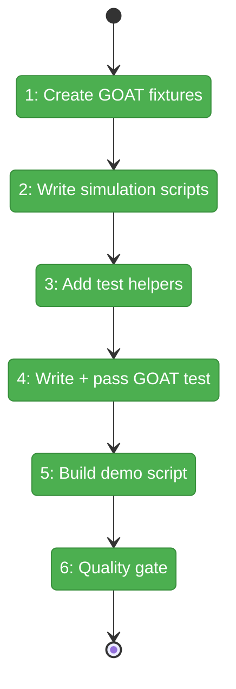
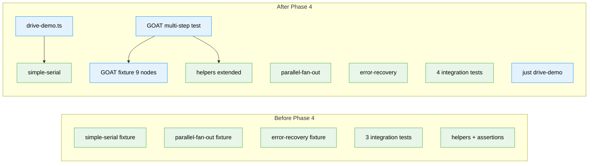

# Flight Plan: Phase 4 — GOAT Graph and Demo Script

**Plan**: [codepod-and-goat-integration-plan.md](../../codepod-and-goat-integration-plan.md)  
**Phase**: Phase 4: GOAT Graph and Demo Script  
**Generated**: 2026-02-20  
**Status**: Ready for takeoff

---

## Departure → Destination

**Where we are**: Phases 1-3 built the engine and proved it works for simple topologies. Serial graphs complete, parallel fan-out works, error detection catches failures. But we haven't tested manual transitions, question/answer flows, error recovery (retry), or multi-input aggregation. These are the hardest orchestration scenarios — the ones that break in real systems.

**Where we're going**: One graph. Nine nodes. Six lines. Every scenario. The GOAT graph exercises serial progression, parallel fan-out, manual transition gates, error + recovery with retry, question/answer cycles with pause/resume, and multi-input aggregation — all in a single test run with 4 drive() calls and 3 manual interventions between them. Plus a standalone demo script (`just drive-demo`) that anyone can run to see the system in action.

---

## Flight Status

**Legend**: grey = pending | yellow = active | red = blocked/needs input | green = done

---

## Stages

- [x] **Stage 1: Create GOAT fixture files** — 9 unit.yaml files across 6 graph lines: user-setup, serial-a/b, parallel-1/2/3, error-node, questioner, final-combiner
- [x] **Stage 2: Write simulation scripts** — 6 standard (accept/save/end) + 1 recovery (fail-first/succeed-retry) + 1 question (ask/check-answer/complete)
- [x] **Stage 3: Add test helpers and assertions** — clearErrorAndRestart, answerNodeQuestion, assertNodeFailed, assertNodeWaitingQuestion
- [x] **Stage 4: Write GOAT multi-step integration test** — 4 drive() calls: serial+parallel → trigger transition → error+recovery → question+answer → combiner → complete
- [x] **Stage 5: Build demo script and justfile recipe** — `scripts/drive-demo.ts` with formatGraphStatus visual output + `just drive-demo`
- [x] **Stage 6: Run quality gate** — `just fft` clean

---

## Acceptance Criteria

- [x] GOAT graph has 6 lines covering all scenarios (AC-24)
- [x] GOAT test drives through all 4 intervention steps (AC-25)
- [x] GOAT validates all nodes complete, outputs saved (AC-26)
- [x] Assertions reusable for code/agent variants (AC-27)
- [x] Question simulation script calls `cg wf node ask` (AC-17)
- [x] Recovery simulation script fails first, succeeds on retry (AC-18)
- [x] Demo script shows visual progression (AC-28, AC-30)
- [x] `just drive-demo` runs the demo (AC-29)
- [x] `just fft` clean (AC-31)

---

## Goals & Non-Goals

**Goals**:
- ✅ GOAT fixture: 6-line, 9-node graph with every scenario
- ✅ 4 simulation script variants (standard, error, question, recovery)
- ✅ Multi-step integration test with 4 drive() + 3 interventions
- ✅ Manual transition, error recovery, question/answer all proven
- ✅ `scripts/drive-demo.ts` + `just drive-demo`

**Non-Goals**:
- ❌ Agent-unit variants (deferred per Q8)
- ❌ Web UI or SSE integration
- ❌ Performance tuning
- ❌ New CLI commands

---

## Architecture: Before & After

**Legend**: existing (green) | new (blue)

---

## Checklist

- [x] T001: Create 9 GOAT unit.yaml files (CS-2)
- [x] T002: Create 6 standard simulation scripts (CS-2)
- [x] T003: Create error recovery + question scripts (CS-3)
- [x] T004: Add test helpers and assertions (CS-2)
- [x] T005: Write RED GOAT integration test (CS-4)
- [x] T006: Make GOAT test GREEN (CS-4)
- [x] T007: Create drive-demo.ts (CS-2)
- [x] T008: Add just drive-demo recipe (CS-1)
- [x] T009: Run just fft quality gate (CS-1)

---

## PlanPak

Active — files in `dev/test-graphs/goat/`, `scripts/`, `test/integration/`
