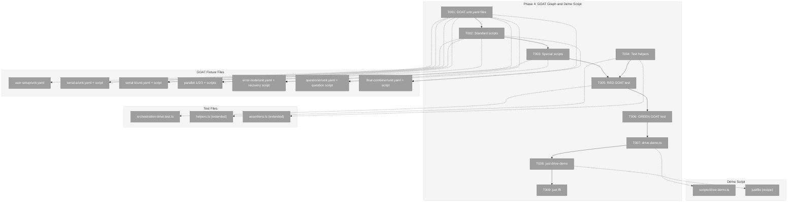
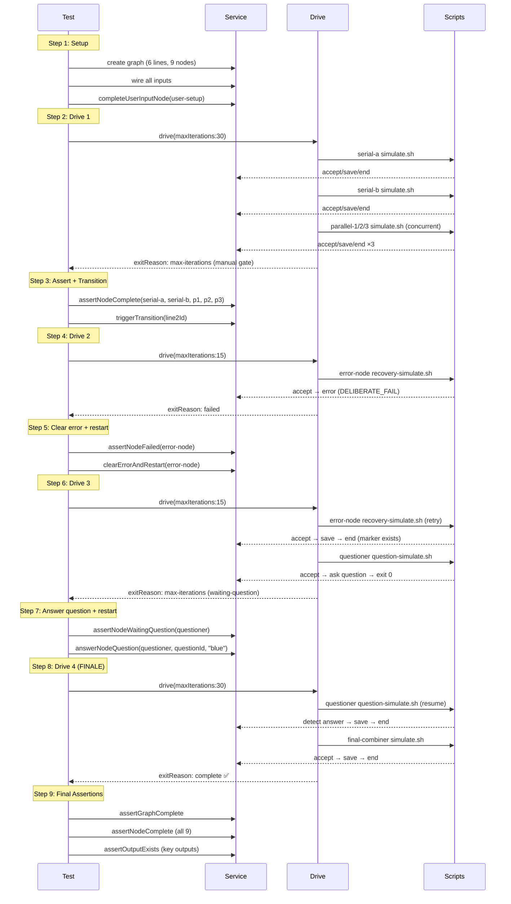

# Phase 4: GOAT Graph and Demo Script – Tasks & Alignment Brief

**Spec**: [codepod-and-goat-integration-spec.md](../../codepod-and-goat-integration-spec.md)
**Plan**: [codepod-and-goat-integration-plan.md](../../codepod-and-goat-integration-plan.md)
**Date**: 2026-02-20

---

## Executive Briefing

### Purpose

This is the culmination phase. Every layer of the orchestration system — event processing, node state machines, the drive loop, script execution, workspace management, CLI commands — gets exercised together in a single comprehensive graph. If this phase passes, we can say with confidence: "the orchestration system works."

### What We're Building

1. **The GOAT graph** — A 6-line, 9-node test fixture exercising every orchestration scenario in one graph:
   - Line 0: User-input setup (provides initial data)
   - Line 1: Two serial code workers (output wiring, sequential execution)
   - Line 2: Three parallel code workers (concurrent execution, fan-out)
   - Line 3: Error-recovery node (fails first run, succeeds on retry via marker file)
   - Line 4: Question-answer node (asks question, pauses, resumes after answer)
   - Line 5: Final combiner (multi-input aggregation from all upstream outputs)
   - **Manual transition** gate between Line 2→3 (drive idles, external trigger opens gate)

2. **Multi-step GOAT integration test** — 4 `drive()` calls with manual interventions between:
   - Drive 1: Serial + parallel nodes execute. Idles at manual transition.
   - Intervention: Trigger manual transition.
   - Drive 2: Error node runs and fails. Graph stuck at `blocked-error`.
   - Intervention: Raise `node:restart` to clear error.
   - Drive 3: Error node retries, succeeds. Questioner asks question, idles at `waiting-question`.
   - Intervention: Answer question + raise `node:restart`.
   - Drive 4: Questioner completes. Final combiner runs. Graph complete!

3. **Standalone demo script** — `scripts/drive-demo.ts` with `just drive-demo` that creates a simple-serial graph and visually shows drive loop progression (⚪ → 🔶 → ✅) using `formatGraphStatus`.

### User Value

After this phase, a developer can:
- Run `just drive-demo` to see the entire orchestration system in action
- Trust that serial, parallel, error, question, manual-transition, and aggregation all work
- Use the GOAT graph as a regression test for any future orchestration changes
- Clone the GOAT fixture pattern for real agent testing (swap `type: code` → `type: agent`)

### Example

```bash
$ just drive-demo

══════════════════════════════════════════════════
  drive() Demo — Real Graph Progression
══════════════════════════════════════════════════

  Creating workspace and graph...
  ✅ Graph created: 1 line, 2 nodes (setup → worker)
  ✅ User input provided

  Driving graph...
  → iteration 1: 1 action(s) — start-node(worker)
  ⏳ idle — waiting for scripts...
  → iteration 2: Graph complete

  Result: complete (3 iterations, 1 action)
══════════════════════════════════════════════════
```

---

## Objectives & Scope

### Objective

Build the GOAT graph fixture exercising all 8 orchestration scenarios, prove it works via multi-step integration test, and provide a visual demo script.

### Goals

- ✅ GOAT fixture: 6-line, 9-node graph with all scenario types
- ✅ 4 simulation script variants: standard, error, question, recovery
- ✅ Multi-step integration test: 4 drive() calls with 3 manual interventions
- ✅ Assertions validate every node complete, every output saved
- ✅ Manual transition trigger between Line 2→3
- ✅ Error clear + node restart flow
- ✅ Question/answer + node restart flow
- ✅ Multi-input aggregation on final combiner
- ✅ `scripts/drive-demo.ts` standalone visual demo
- ✅ `just drive-demo` justfile entry
- ✅ `just fft` clean

### Non-Goals

- ❌ Agent-unit variants (deferred per Q8 — code-unit only for now)
- ❌ `units-agent/` directory in GOAT fixture (add when real agent plan begins)
- ❌ `graph.setup.ts` auto-import pattern (graph setup done inline in test, same as Phase 3)
- ❌ Performance tuning of drive delays (test values sufficient)
- ❌ Web UI integration or SSE streaming
- ❌ New CLI commands (all needed commands already exist)
- ❌ Windows platform support for scripts

---

## Pre-Implementation Audit

### Summary

| File | Action | Origin | Recommendation |
|------|--------|--------|----------------|
| `dev/test-graphs/goat/units/user-setup/unit.yaml` | CREATE | New | plan-scoped |
| `dev/test-graphs/goat/units/serial-a/unit.yaml` + scripts | CREATE | New | plan-scoped |
| `dev/test-graphs/goat/units/serial-b/unit.yaml` + scripts | CREATE | New | plan-scoped |
| `dev/test-graphs/goat/units/parallel-1/unit.yaml` + scripts | CREATE | New | plan-scoped |
| `dev/test-graphs/goat/units/parallel-2/unit.yaml` + scripts | CREATE | New | plan-scoped |
| `dev/test-graphs/goat/units/parallel-3/unit.yaml` + scripts | CREATE | New | plan-scoped |
| `dev/test-graphs/goat/units/error-node/unit.yaml` + scripts | CREATE | New | plan-scoped |
| `dev/test-graphs/goat/units/questioner/unit.yaml` + scripts | CREATE | New | plan-scoped |
| `dev/test-graphs/goat/units/final-combiner/unit.yaml` + scripts | CREATE | New | plan-scoped |
| `test/integration/orchestration-drive.test.ts` | MODIFY | Phase 3 | Add GOAT describe block |
| `dev/test-graphs/shared/helpers.ts` | MODIFY | Phase 2 | Add triggerManualTransition, answerNodeQuestion helpers |
| `dev/test-graphs/shared/assertions.ts` | MODIFY | Phase 2 | Add assertNodeFailed assertion |
| `dev/test-graphs/README.md` | MODIFY | Phase 2 | Add GOAT entry to catalogue |
| `scripts/drive-demo.ts` | CREATE | New | plan-scoped |
| `justfile` | MODIFY | Pre-plan | Add drive-demo recipe |

No duplication. No compliance violations. All new files are fixtures, tests, or scripts.

### Key Finding: CLI Commands All Exist

All CLI commands needed by GOAT scripts are already implemented:
- `cg wf node accept/save-output-data/end` — standard flow (Phase 3 proven)
- `cg wf node error` — error reporting (Phase 3 proven)
- `cg wf node ask --type text --text "..."` — question asking
- `cg wf node answer <graph> <node> <questionId> <answer>` — question answering
- `cg wf node get-answer <graph> <node> <questionId>` — check if answer exists
- `cg wf node raise-event <graph> <node> node:restart --source orchestrator` — restart after error/question
- `cg wf trigger <graph> <lineId>` — manual transition trigger

### Key Finding: Event Source Rules

From Phase 3 discovery + Phase 4 research:
| Event | Allowed Sources | Used By |
|-------|----------------|---------|
| `node:accepted` | agent, executor | Standard scripts |
| `node:completed` | agent, executor | Standard scripts (via `endNode`) |
| `node:error` | agent, executor, orchestrator | Error scripts |
| `question:ask` | agent, executor | Question scripts (via `askQuestion`) |
| `question:answer` | human, orchestrator | Test interventions |
| `node:restart` | human, orchestrator | Test interventions (after error/question) |

---

## Requirements Traceability

### Coverage Matrix

| AC | Description | Files in Flow | Tasks | Status |
|----|-------------|---------------|-------|--------|
| AC-17 | Question simulation script calls `cg wf node ask` | questioner/scripts/question-simulate.sh | T003, T006 | ✅ |
| AC-18 | Recovery script fails first, succeeds on retry | error-node/scripts/recovery-simulate.sh | T003, T006 | ✅ |
| AC-24 | GOAT graph has 6 lines covering all scenarios | all GOAT unit.yaml files | T001, T002, T003 | ✅ |
| AC-25 | GOAT test drives through all 4 intervention steps | orchestration-drive.test.ts | T004, T005, T006 | ✅ |
| AC-26 | GOAT validates all nodes complete, outputs saved | orchestration-drive.test.ts + assertions.ts | T006 | ✅ |
| AC-27 | Assertions reusable for code/agent variants | assertions.ts helpers.ts | T004 | ✅ Via generic helpers |
| AC-28 | Demo script shows visual progression | scripts/drive-demo.ts | T007 | ✅ |
| AC-29 | `just drive-demo` runs demo | justfile | T008 | ✅ |
| AC-30 | Demo shows formatGraphStatus with real progression | scripts/drive-demo.ts + formatGraphStatus | T007 | ✅ |
| AC-31 | `just fft` clean | all | T009 | ✅ |

### Gaps Found and Resolved

- **GAP-1 (Manual transition helper)**: Test needs to call `service.triggerTransition()`. No existing helper. Resolution: Add to helpers.ts or inline in test.
- **GAP-2 (Question answer helper)**: Test needs `service.answerQuestion()` + `service.raiseNodeEvent(node:restart)`. No existing helper. Resolution: Add `answerNodeQuestion()` to helpers.ts.
- **GAP-3 (assertNodeFailed)**: Tests need to assert `blocked-error` status. No existing assertion. Resolution: Add to assertions.ts.

---

## Architecture Map

### Component Diagram



### Task-to-Component Mapping

| Task | Component(s) | Files | Status | Comment |
|------|-------------|-------|--------|---------|
| T001 | GOAT unit configs | dev/test-graphs/goat/units/*/unit.yaml | ✅ Complete | 9 unit.yaml files: 1 user-input + 8 code |
| T002 | Standard simulate.sh scripts | dev/test-graphs/goat/units/*/scripts/ | ✅ Complete | 6 standard scripts (serial-a/b, parallel-1/2/3, combiner) |
| T003 | Special scripts (error, question) | dev/test-graphs/goat/units/error-node/,questioner/ | ✅ Complete | recovery-simulate.sh + question-simulate.sh |
| T004 | Test helpers + assertions | dev/test-graphs/shared/{helpers,assertions}.ts | ✅ Complete | answerNodeQuestion, clearErrorAndRestart, assertNodeFailed |
| T005 | GOAT test structure (RED) | test/integration/orchestration-drive.test.ts | ✅ Complete | Multi-step drive with interventions |
| T006 | GOAT test GREEN | test/integration/orchestration-drive.test.ts | ✅ Complete | All 4 drive steps pass, DYK#1 disproved |
| T007 | Demo script | scripts/drive-demo.ts | ✅ Complete | Visual demo with simple-serial graph |
| T008 | Justfile recipe | justfile | ✅ Complete | `just drive-demo` entry |
| T009 | Quality gate | all | ✅ Complete | 3956 tests pass, `just fft` clean |

---

## Tasks

| Status | ID | Task | CS | Type | Dependencies | Absolute Path(s) | Validation | Subtasks | Notes |
|--------|------|------|-----|------|-------------|-------------------|------------|----------|-------|
| [x] | T001 | **Create all 9 GOAT unit.yaml files.** Create `dev/test-graphs/goat/units/` with: `user-setup/unit.yaml` (type: user-input, output: instructions), `serial-a/unit.yaml` (type: code, input: task, output: result), `serial-b/unit.yaml` (type: code, input: previous_work from serial-a, output: result), `parallel-1/unit.yaml` (type: code, input: config from serial-b, output: result), `parallel-2/unit.yaml` (same), `parallel-3/unit.yaml` (same), `error-node/unit.yaml` (type: code, input: data from parallel outputs, output: result), `questioner/unit.yaml` (type: code, input: data, output: result), `final-combiner/unit.yaml` (type: code, inputs: result from error-node + questioner, output: combined). All input/output names use underscores per schema. | 2 | Setup | – | `/home/jak/substrate/033-real-agent-pods/dev/test-graphs/goat/units/` (9 subdirs) | All unit.yaml files on disk, valid per schema | – | AC-24 |
| [x] | T002 | **Create standard simulation scripts** for serial-a, serial-b, parallel-1/2/3, and final-combiner. Each `scripts/simulate.sh`: `set -e`, accept, save-output-data, end with `--workspace-path "$CG_WORKSPACE_PATH"`. Same proven pattern from Phase 3. | 2 | Setup | T001 | `/home/jak/substrate/033-real-agent-pods/dev/test-graphs/goat/units/{serial-a,serial-b,parallel-1,parallel-2,parallel-3,final-combiner}/scripts/simulate.sh` | Scripts on disk, executable | – | AC-15, AC-19 |
| [x] | T003 | **Create special simulation scripts.** (a) `error-node/scripts/recovery-simulate.sh`: Uses workspace-scoped marker file `$CG_WORKSPACE_PATH/.chainglass/markers/$CG_NODE_ID-ran`. First run: accept, mkdir markers, touch marker, raise error `DELIBERATE_FAIL`, exit 1. Second run: accept, delete marker, save output, end. (b) `questioner/scripts/question-simulate.sh`: Uses workspace-scoped marker `$CG_WORKSPACE_PATH/.chainglass/markers/$CG_NODE_ID-asked`. First run: accept, mkdir markers, call `cg wf node ask --type text --text "What colour?"`, touch marker, exit 0. Second run (marker exists): accept, delete marker, save output with hardcoded answer, end. Both scripts use `--workspace-path "$CG_WORKSPACE_PATH"`. DYK#2: marker file avoids need for questionId lookup. DYK#4: workspace-scoped markers auto-cleanup with withTestGraph. | 3 | Setup | T001 | `/home/jak/substrate/033-real-agent-pods/dev/test-graphs/goat/units/error-node/scripts/recovery-simulate.sh`, `/home/jak/substrate/033-real-agent-pods/dev/test-graphs/goat/units/questioner/scripts/question-simulate.sh` | Error script fails first / succeeds second. Question script asks then completes on restart. | – | AC-17, AC-18, DYK#2, DYK#4 |
| [x] | T004 | **Add test helpers and assertions.** (a) Add `clearErrorAndRestart(service, ctx, graphSlug, nodeId)` to helpers.ts: calls `service.raiseNodeEvent(nodeId, 'node:restart', { reason: 'Error cleared' }, 'orchestrator')`. (b) Add `answerNodeQuestion(service, ctx, graphSlug, nodeId, questionId, answer)` to helpers.ts: calls `service.answerQuestion(...)` then `service.raiseNodeEvent(nodeId, 'node:restart', { reason: 'Question answered' }, 'orchestrator')`. (c) Add `assertNodeFailed(service, ctx, graphSlug, nodeId)` to assertions.ts: asserts `status === 'blocked-error'`. (d) Add `assertNodeWaitingQuestion(service, ctx, graphSlug, nodeId)` to assertions.ts: asserts `status === 'waiting-question'`. | 2 | Core | – | `/home/jak/substrate/033-real-agent-pods/dev/test-graphs/shared/helpers.ts`, `/home/jak/substrate/033-real-agent-pods/dev/test-graphs/shared/assertions.ts` | Helpers compile. Assertions throw on wrong status. | – | AC-25, AC-27 |
| [x] | T005 | **Write RED GOAT integration test.** Add `describe('goat')` block to `orchestration-drive.test.ts`. Inside `withTestGraph('goat', ...)`: (1) create 6-line graph — line 0 auto, line 1 auto, line 2 manual transition, line 3 auto, line 4 auto, line 5 auto. (2) Add 9 nodes to correct lines with correct execution modes (parallel-1/2/3 get `execution: 'parallel'`). (3) Wire all inputs. (4) Complete user-setup. (5) Drive 1 (maxIterations:20) → assert serial + parallel complete, drive exits `max-iterations` at manual gate. (6) Trigger transition on line 2. (7) Drive 2 (maxIterations:10) → assert error-node failed. (8) Clear error + restart. **VALIDATE**: Check node status after restart — if stuck at `restart-pending`, ONBAS doesn't handle it (DYK#1). If so, stop and workshop fix. (9) Drive 3 (maxIterations:15) → assert error-node recovered, questioner waiting-question. (10) Answer question via service + restart. (11) Drive 4 (maxIterations:15) → assert questioner complete, combiner complete, graph complete. Timeout: 120s. DYK#3: per-drive maxIterations avoids 30s+ idle at manual gate. | 4 | Test | T001, T002, T003, T004 | `/home/jak/substrate/033-real-agent-pods/test/integration/orchestration-drive.test.ts` | Test written and structured, fails (RED). | – | RED, AC-24, AC-25, DYK#1, DYK#3 |
| [x] | T006 | **Make GOAT test GREEN.** Debug and fix issues with: manual transition trigger API (lineId semantics — trigger the manual-transition line itself), error clear + restart flow (node:restart source must be 'orchestrator' or 'human'), question script marker-file detection, multi-input combiner wiring. **DYK#1 GATE**: If `restart-pending` is not picked up by ONBAS after `node:restart`, STOP and run `/plan-2c-workshop "ONBAS restart-pending handling"` — this is a production code fix to `030-orchestration/onbas.ts` that needs proper design. Assert after EACH drive: node statuses, exit reasons, intermediate states. Final assertions: all 9 nodes complete, key outputs saved, graph status `complete`. | 4 | Core | T005 | `/home/jak/substrate/033-real-agent-pods/test/integration/orchestration-drive.test.ts` | All 4 drive steps pass. `exitReason: 'complete'` on final drive. All assertions pass. | – | GREEN, AC-25, AC-26, DYK#1 |
| [x] | T007 | **Create `scripts/drive-demo.ts`.** Standalone TypeScript script that: (1) Uses `withTestGraph('simple-serial')` to set up workspace. (2) Creates graph, wires inputs, completes user-setup. (3) Builds orchestration stack with real ScriptRunner. (4) Calls `handle.drive()` with verbose `onEvent` logging — `status` events already contain `formatGraphStatus` output (DYK#5), so just print `event.message` for status type and log iteration/idle events. (5) Prints final result banner (exitReason, iterations, actions). Run via `npx tsx scripts/drive-demo.ts`. | 2 | Core | T006 | `/home/jak/substrate/033-real-agent-pods/scripts/drive-demo.ts` | `npx tsx scripts/drive-demo.ts` shows progression ⚪→🔶→✅ | – | AC-28, AC-30, DYK#5 |
| [x] | T008 | **Add `just drive-demo` to justfile.** Recipe: `drive-demo: npx tsx scripts/drive-demo.ts`. | 1 | Setup | T007 | `/home/jak/substrate/033-real-agent-pods/justfile` | `just drive-demo` runs demo successfully | – | AC-29 |
| [x] | T009 | **Run `just fft`. Fix any lint/format issues.** Biome clean, all tests pass including new GOAT test. | 1 | Integration | T006, T008 | all | `just fft` exit 0 | – | AC-31 |

---

## Alignment Brief

### Prior Phases Review

#### Phase 1: CodePod Completion and ScriptRunner

**Deliverables for Phase 4**: Real `ScriptRunner` (spawn with detached process groups), fixed `CodePod` (scriptPath, unitSlug, CG_* + INPUT_* env vars), ODS with `workUnitService` (script path resolution), DI containers with real ScriptRunner.

**Key APIs**:
- `ScriptRunner.run(options: ScriptRunOptions): Promise<ScriptRunResult>` — timeout returns exit 124
- `CodePod.execute(options: PodExecuteOptions)` — passes CG_GRAPH_SLUG, CG_NODE_ID, CG_WORKSPACE_PATH
- CodePod hardcoded 60s timeout — all GOAT scripts must complete within 60s
- Fire-and-forget: ODS calls `pod.execute()` without `await`

**Constraints**: Script path resolved as `join(ctx.worktreePath, '.chainglass', 'units', unitSlug, unit.code.script)`. GOAT fixtures must place scripts at this exact path.

#### Phase 2: Test Graph Infrastructure

**Deliverables for Phase 4**: `withTestGraph(fixtureName, testFn)`, `buildDiskWorkUnitService()`, `createTestOrchestrationStack()`, `completeUserInputNode()`, `ensureGraphsDir()`, `makeScriptsExecutable()`, `assertGraphComplete()`, `assertNodeComplete()`, `assertOutputExists()`.

**Key patterns**: Workspace registration via WorkspaceService.add/remove. Double temp-dir cleanup. `.chainglass/graphs/<slug>/` for PodManager separate from `.chainglass/data/workflows/<slug>/`.

#### Phase 3: Simple Test Graphs

**Deliverables for Phase 4**: 3 proven fixture patterns (simple-serial, parallel-fan-out, error-recovery), `TEST_DRIVE_OPTIONS` constant (maxIterations:100, actionDelayMs:50, idleDelayMs:1500), integration test patterns in `orchestration-drive.test.ts`.

**Critical Discoveries**:
1. `node:started` doesn't exist — use `service.startNode()`
2. Event source must be `agent`/`executor` for accepted/completed — not `human`
3. PodManager pod-sessions at `.chainglass/graphs/<slug>/` — call `ensureGraphsDir()` after create
4. Input/output names: underscores only (`^[a-z][a-z0-9_]*$`)
5. Parallel scripts race on state.json — `idleDelayMs:1500` is sufficient
6. CLI path must be repo-relative (use `import.meta.url` resolution)

### Critical Findings Affecting This Phase

| Finding | Constraint | Tasks |
|---------|-----------|-------|
| Fire-and-forget dispatch | drive() loop handles script completion via polling — don't await pods | T005, T006 |
| 60s CodePod timeout | All GOAT scripts must complete within 60s | T002, T003 |
| Manual transition lineId | `triggerTransition(ctx, slug, lineId)` takes the manual line's own lineId, not the line before | T005, T006 |
| node:restart sources | Only `human` or `orchestrator` allowed — use `'orchestrator'` in helpers | T004 |
| question:answer doesn't auto-restart | After answering, must explicitly raise `node:restart` | T003, T004, T006 |
| Recovery script marker files | Workspace-scoped: `$CG_WORKSPACE_PATH/.chainglass/markers/$CG_NODE_ID-ran` — auto-cleaned by withTestGraph (DYK#4) | T003, T005 |
| ONBAS restart-pending gap (DYK#1) | `visitNode()` default case ignores `restart-pending` — node may hang after `node:restart`. VALIDATE during T006, workshop if confirmed. | T005, T006 |
| Question script uses marker not get-answer (DYK#2) | `cg wf node get-answer` needs questionId which script doesn't have. Use marker file pattern instead. | T003 |
| Per-drive maxIterations (DYK#3) | Drive 1: 20, Drive 2: 10, Drive 3: 15, Drive 4: 15 — avoids 30s+ idle at manual gate | T005 |
| onEvent status has formatGraphStatus (DYK#5) | Drive's `onEvent` status message already contains formatted graph status — no need for direct `formatGraphStatus` call | T007 |

### ADR Decision Constraints

- **ADR-0012**: Phase 4 creates no production code. All files are fixtures, tests, and scripts. Domain boundaries respected.
- **ADR-0006**: GOAT simulation scripts use CLI-based orchestration commands per ADR intent.

### PlanPak Placement Rules

- All fixture files in `dev/test-graphs/goat/` — plan-scoped (new)
- Demo script in `scripts/` — plan-scoped (new)
- Integration test additions in `test/integration/` — extends existing Phase 3 file
- Helper/assertion additions in `dev/test-graphs/shared/` — extends existing Phase 2 files
- No cross-plan edits needed in Phase 4

### Invariants & Guardrails

- All simulation scripts MUST pass `--workspace-path "$CG_WORKSPACE_PATH"` — temp workspaces aren't in the registry by default (they ARE registered by withTestGraph, but scripts use the flag pattern)
- All unit.yaml files MUST have at least one output (schema requirement)
- Code units MUST have `code.script` pointing to an executable `.sh` file
- Input/output names: underscores only (`^[a-z][a-z0-9_]*$`)
- Slugs: hyphens allowed (`^[a-z][a-z0-9-]*$`)
- Graph creation order: create graph → addLines → addNodes → wireInputs → completeSetup → drive
- `ensureGraphsDir()` MUST be called after `service.create()` for each graph slug
- Recovery marker files at `/tmp/goat-*` must be cleaned before GOAT test runs

### GOAT Graph Topology — Exact Wiring

```
Line 0 (auto):     [user-setup]
                        ↓ instructions
Line 1 (auto):     [serial-a] → [serial-b]
                        ↓ task       ↓ previous_work → result
Line 2 (manual):   [parallel-1] | [parallel-2] | [parallel-3]
                        ↓ config (from serial-b.result)
                        all output: result
                    === MANUAL TRANSITION GATE ===
Line 3 (auto):     [error-node]
                        ↓ data (from parallel-1.result)
                        output: result
Line 4 (auto):     [questioner]
                        ↓ data (from error-node.result)
                        output: result
Line 5 (auto):     [final-combiner]
                        ↓ error_result (from error-node.result)
                        ↓ question_result (from questioner.result)
                        output: combined
```

### GOAT Test Sequence Diagram



### Test Plan (Full TDD)

**Policy**: Fakes only (no vi.mock). Real ScriptRunner for script execution. FakeAgentManagerService (no agent nodes in Phase 4).

| Test | Graph | What's Proven |
|------|-------|---------------|
| GOAT multi-step drive | 9 nodes, 6 lines | Serial, parallel, manual transition, error+recovery, question+answer, multi-input aggregation, full graph completion |
| drive-demo standalone | simple-serial (2 nodes) | Visual demo works, formatGraphStatus shows progression |

**GOAT Test Intermediate Assertions** (assert between each drive call):

| After | Assert |
|-------|--------|
| Drive 1 | serial-a complete, serial-b complete, parallel-1/2/3 complete, error-node pending, exitReason max-iterations |
| Transition | triggerTransition succeeds |
| Drive 2 | error-node blocked-error, exitReason failed |
| Clear error | node:restart raised successfully |
| Drive 3 | error-node complete, questioner waiting-question, exitReason max-iterations |
| Answer | answerQuestion + node:restart succeed |
| Drive 4 | questioner complete, final-combiner complete, graph complete, exitReason complete |

### Commands to Run

```bash
# Build CLI first (simulation scripts need it)
pnpm build --filter=@chainglass/cli

# Run integration tests (includes GOAT)
pnpm test -- --run test/integration/orchestration-drive.test.ts

# Run drive-demo
npx tsx scripts/drive-demo.ts
# OR
just drive-demo

# Full quality gate
just fft
```

### Risks & Unknowns

| Risk | Severity | Mitigation |
|------|----------|------------|
| GOAT multi-step debugging complexity | High | Assert after EACH drive call — pinpoints exactly where failure occurs |
| Recovery marker file persistence between test runs | Medium | ~~Clean /tmp/goat-* markers~~ Workspace-scoped markers auto-cleanup (DYK#4) |
| Question script get-answer detection | Medium | ~~Use get-answer~~ Use marker file pattern (DYK#2) — avoids questionId dependency |
| 4 drive() calls × idleDelayMs = slow test | Medium | Per-drive maxIterations tuning (DYK#3): 20/10/15/15 instead of 100 each |
| Manual transition lineId semantics | Medium | Phase 3 research confirmed: pass the manual line's own lineId |
| Drive 3 needs error-node to retry AND questioner to run | Medium | One drive handles both — error-node retries first (line 3), then questioner starts (line 4) |

### Ready Check

- [x] ADR constraints mapped (ADR-0012 → no production code, ADR-0006 → CLI commands)
- [x] Inputs read (all Phase 1-3 deliverables, workshops 05-09, e2e patterns)
- [x] Phase 3 deliverables verified (3 integration tests pass)
- [x] CLI binary built and `cg` on PATH
- [x] CLI commands verified (trigger, ask, answer, get-answer, raise-event all exist)
- [x] Event source rules mapped (node:restart → orchestrator/human)
- [x] `just fft` baseline green

---

## Critical Insights (DYK 2026-02-20)

| # | Insight | Decision |
|---|---------|----------|
| 1 | ONBAS `visitNode()` has no case for `restart-pending` — falls through to `default: null`. After `node:restart`, the node would hang. | VALIDATE during T006. If confirmed, STOP and workshop fix to `onbas.ts` (cross-plan-edit to 030-orchestration). |
| 2 | `cg wf node get-answer` requires exact `questionId` — no `latest` support. Script can't know questionId across invocations. | Use marker file pattern instead of get-answer. Same as recovery script. |
| 3 | Drive 1 idles 30+ seconds at manual transition gate (no `transition-blocked` exit reason). | Per-drive maxIterations: Drive 1=20, Drive 2=10, Drive 3=15, Drive 4=15. |
| 4 | Recovery marker files at `/tmp/goat-*` persist if test fails mid-way → flaky subsequent runs. | Use workspace-scoped markers: `$CG_WORKSPACE_PATH/.chainglass/markers/`. Auto-cleaned by withTestGraph. |
| 5 | `formatGraphStatus()` needs `PositionalGraphReality` which requires orchestration handle — but demo can't call mid-drive. | Drive's `onEvent` callback `status` type already contains formatted status string. Just print `event.message`. |

### Potential Workshop: ONBAS restart-pending handling

**Trigger**: During T006, if `node:restart` leaves node at `restart-pending` and ONBAS doesn't start it.

**Why workshop**: This is a production code change to `packages/positional-graph/src/features/030-orchestration/onbas.ts`. The fix seems simple (add `case 'restart-pending':` returning `start-node`), but:
- Could affect existing orchestration behavior
- Need to verify e2e test expectations
- May need an ADR entry (modifying Plan 030's core decision engine)

**If NOT needed**: ONBAS may handle it through a different mechanism (settle converting status, or reality builder mapping). Validate empirically.

---

| Footnote | Task | Description |
|----------|------|-------------|
| | | |

---

## Evidence Artifacts

- **Execution log**: `docs/plans/037-codepod-and-goat-integration/tasks/phase-4-goat-graph-and-demo-script/execution.log.md`

---

## Discoveries & Learnings

_Populated during implementation by plan-6. Log anything of interest to your future self._

| Date | Task | Type | Discovery | Resolution | References |
|------|------|------|-----------|------------|------------|
| 2026-02-20 | T006 | insight | DYK#1 DISPROVED: ONBAS handles restart-pending correctly — node goes to `ready` after restart event, not stuck at restart-pending. The settle/reality builder chain resolves it. | No workshop needed. clearErrorAndRestart works as designed. | log#task-t005-t006 |
| 2026-02-20 | T005 | insight | GOAT test takes ~52s wall time. Drive 1 uses all 20 maxIterations idle-polling at manual gate. Consider reducing to 15 in future. | Acceptable for now. 120s test timeout has headroom. | log#task-t005-t006 |
| 2026-02-20 | T005 | insight | Question event_id serves as questionId for answerQuestion. Found via getNodeEvents types filter. | Use event_id from question:ask events as questionId arg. | log#task-t005-t006 |

**Types**: `gotcha` | `research-needed` | `unexpected-behavior` | `workaround` | `decision` | `debt` | `insight`

_See also: `execution.log.md` for detailed narrative._

---

## Directory Layout

```
docs/plans/037-codepod-and-goat-integration/
  ├── codepod-and-goat-integration-spec.md
  ├── codepod-and-goat-integration-plan.md
  ├── workshops/ (08, 09 + symlinks to 036)
  └── tasks/
      ├── phase-1-codepod-completion-and-scriptrunner/
      ├── phase-2-test-graph-infrastructure/
      ├── phase-3-simple-test-graphs/
      └── phase-4-goat-graph-and-demo-script/
          ├── tasks.md              ← this file
          ├── tasks.fltplan.md      ← generated by /plan-5b
          └── execution.log.md     ← created by /plan-6
```
