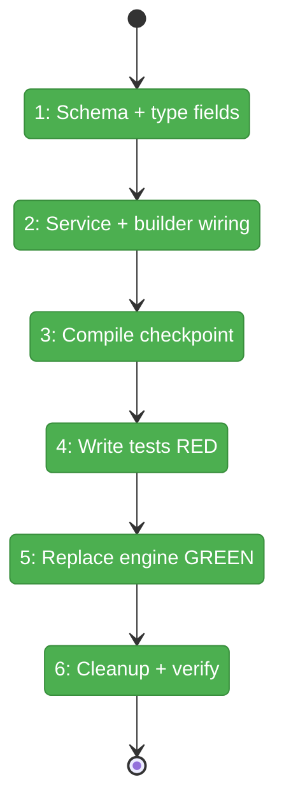
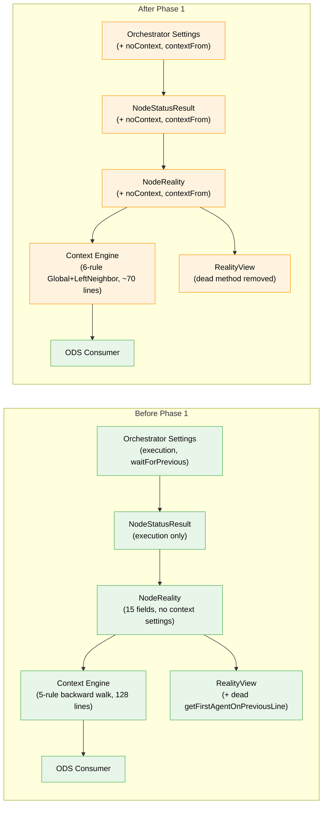

# Flight Plan: Phase 1 — Context Engine — Types, Schema, and Rules

**Plan**: [../../advanced-e2e-pipeline-plan.md](../../advanced-e2e-pipeline-plan.md)
**Phase**: Phase 1: Context Engine — Types, Schema, and Rules
**Generated**: 2026-02-21
**Status**: Complete

---

## Departure → Destination

**Where we are**: The orchestration engine has a 5-rule backward-walk context inheritance system that works for simple serial graphs, but produces wrong results when parallel agent nodes sit between a source and target node. The `NodeReality` type has no concept of `noContext` or `contextFrom` — there's no way to isolate a node's session or explicitly wire context to a specific predecessor.

**Where we're going**: By the end of this phase, the context engine will use 6 flat rules (Global Session + Left Neighbor) that correctly skip over parallel/isolated lines. A developer can set `noContext: true` on any node for a fresh session, or `contextFrom: '<nodeId>'` to inherit from a specific node. All 7 Workshop 03 scenarios will pass, and a reviewer on line 3 will correctly inherit from the spec-writer on line 1 — not from a parallel worker on line 2.

---

## Flight Status

<!-- Updated by /plan-6: pending → active → done. Use blocked for problems/input needed. -->

**Legend**: grey = pending | yellow = active | red = blocked/needs input | green = done

---

## Stages

<!-- Updated by /plan-6 during implementation: [ ] → [~] → [x] -->

- [x] **Stage 1: Add noContext and contextFrom to schema and types** — extend `NodeOrchestratorSettingsSchema` with two new fields, add matching optional fields to `NodeStatusResult` and `NodeReality` interfaces (`orchestrator-settings.schema.ts`, `positional-graph-service.interface.ts`, `reality.types.ts`)
- [x] **Stage 2: Wire fields through service and builder** — expose new fields in `getNodeStatus()` return value and map them in the reality builder (`positional-graph.service.ts`, `reality.builder.ts`)
- [x] **Stage 3: Compile checkpoint** — verify the full monorepo compiles with zero TypeScript errors after all pipeline changes
- [x] **Stage 4: Write failing tests for new 6-rule engine** — rewrite `agent-context.test.ts` entirely: 18 tests covering all 6 rules, 7 Workshop 03 scenarios, and edge cases. All must fail against old engine. (`agent-context.test.ts` — rewrite)
- [x] **Stage 5: Replace context engine** — swap `getContextSource()` body with the Global Session + Left Neighbor implementation from Workshop 03. All 18 tests must pass. (`agent-context.ts`)
- [x] **Stage 6: Cleanup and verification** — update `FakeAgentContextService`, delete dead `getFirstAgentOnPreviousLine()` method and its tests, run `just fft` for final quality gate (`fake-agent-context.ts`, `reality.view.ts`, `reality.test.ts`)

---

## Acceptance Criteria

- [x] Serial node at pos 0 inherits global agent session, skipping parallel/noContext lines (AC-1)
- [x] noContext: true → fresh session regardless of execution mode or position (AC-2)
- [x] contextFrom → inherit from specified node with runtime guard (AC-3)
- [x] Parallel pos > 0 → fresh session automatically (AC-4)
- [x] Serial pos > 0 → left walk, skip non-agents only (AC-5)
- [x] Left-hand rule absolute — serial inherits from left even if parallel/noContext (AC-6)
- [x] getFirstAgentOnPreviousLine() deleted (AC-7)

---

## Goals & Non-Goals

**Goals**:
- Add `noContext` and `contextFrom` as first-class orchestrator settings
- Thread both fields through the full pipeline: schema → service → interface → builder → types → engine
- Replace `getContextSource()` with 6-rule Global Session + Left Neighbor engine
- Write 18 exhaustive TDD tests (RED first, GREEN after)
- Update FakeAgentContextService for ODS test compatibility
- Delete dead backward-walk helper

**Non-Goals**:
- contextFromReady readiness gate (Phase 2)
- E2E test script or fixtures (Phase 3)
- Changes to ODS, ONBAS, or DI container (interface unchanged)
- CLI command changes (programmatic only)
- compactBefore node setting (future plan)

---

## Architecture: Before & After

**Legend**: existing (green, unchanged) | changed (orange, modified) | new (blue, created)

---

## Checklist

- [x] T001: Add noContext and contextFrom to NodeOrchestratorSettingsSchema (CS-1)
- [x] T002: Add noContext and contextFrom to NodeStatusResult interface (CS-1)
- [x] T003: Expose noContext and contextFrom in getNodeStatus() (CS-2)
- [x] T004: Add noContext and contextFrom to NodeReality interface (CS-1)
- [x] T005: Wire noContext and contextFrom in reality builder (CS-1)
- [x] T006: Compile checkpoint — pnpm tsc --noEmit (CS-1)
- [x] T007: Write 18 unit tests for new 6-rule engine — RED (CS-3)
- [x] T008: Replace getContextSource() with Workshop 03 implementation — GREEN (CS-2)
- [x] T009: Update FakeAgentContextService to match new rules (CS-1)
- [x] T010: Delete getFirstAgentOnPreviousLine() and its tests (CS-1)
- [x] T011: Full test suite + just fft quality gate (CS-1)

---

## PlanPak

Active — but no feature folder needed. All Phase 1 files are cross-plan-edits to existing `030-orchestration` module.
