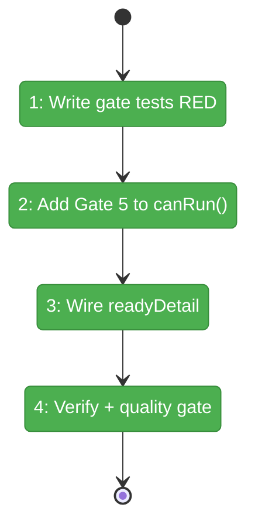

# Flight Plan: Phase 2 — Readiness Gate and Status Pipeline

**Plan**: [../../advanced-e2e-pipeline-plan.md](../../advanced-e2e-pipeline-plan.md)
**Phase**: Phase 2: Readiness Gate and Status Pipeline
**Generated**: 2026-02-21
**Status**: ✅ Complete

---

## Departure → Destination

**Where we are**: The context engine correctly resolves `contextFrom` at decision time (Phase 1), but ONBAS will start a node with `contextFrom: 'X'` even if node X hasn't completed yet. The `ReadinessDetail.contextFromReady` field is a stub (always undefined).

**Where we're going**: By the end of this phase, `canRun()` has a 5th gate that blocks nodes until their `contextFrom` target is complete. The `readyDetail.contextFromReady` boolean is populated throughout the pipeline. ONBAS never starts a node prematurely.

---

## Flight Status

---

## Stages

- [x] **Stage 1: Write failing gate tests** — 4 tests for contextFromReady in canRun(): incomplete target, complete target, no contextFrom, nonexistent target
- [x] **Stage 2: Add Gate 5 to canRun()** — insert between serial neighbor and inputs gates in input-resolution.ts
- [x] **Stage 3: Wire readyDetail** — compute contextFromReady in getNodeStatus(), pass through reality builder
- [x] **Stage 4: Verify and quality gate** — confirm agent-context runtime guard still works, run just fft

---

## Acceptance Criteria

- [x] contextFromReady gate prevents premature execution (AC-3)
- [x] Gate is transparent for nodes without contextFrom
- [x] Runtime guard in getContextSource handles edge cases (belt-and-suspenders from P1)
- [x] All 5 existing readiness gates still function correctly
- [x] just fft passes

---

## Checklist

- [x] T001: Write 4 gate tests RED (CS-2)
- [x] T002: Add Gate 5 to canRun() GREEN (CS-2)
- [x] T003: Compute contextFromReady in getNodeStatus() (CS-1)
- [x] T004: Wire contextFromReady in reality builder (CS-1)
- [x] T005: Verify runtime guard — 21 agent-context tests pass (CS-1)
- [x] T006: Full test suite + just fft (CS-1)
