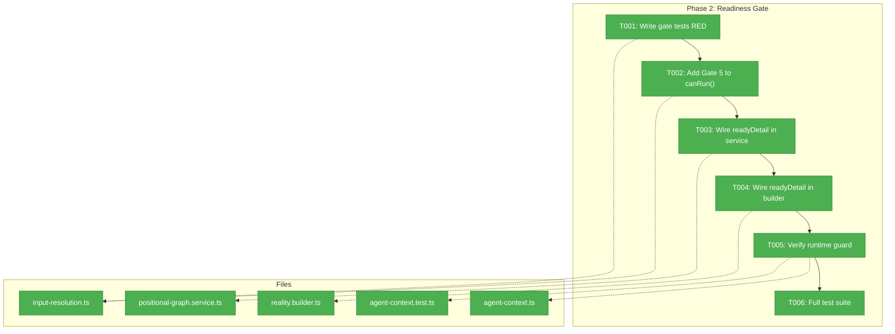

# Phase 2: Readiness Gate and Status Pipeline – Tasks & Alignment Brief

**Spec**: [../../advanced-e2e-pipeline-spec.md](../../advanced-e2e-pipeline-spec.md)
**Plan**: [../../advanced-e2e-pipeline-plan.md](../../advanced-e2e-pipeline-plan.md)
**Date**: 2026-02-21

---

## Executive Briefing

### Purpose
Phase 1 replaced the context engine with the Global Session + Left Neighbor model, and added `contextFrom` as a first-class setting. But a node with `contextFrom: 'X'` currently shows as `ready` even if node X hasn't completed — ONBAS would start it prematurely. This phase adds the missing readiness gate so scheduling is safe.

### What We're Building
A 5th readiness gate (`contextFromReady`) in the `canRun()` algorithm that prevents ONBAS from starting a node until its `contextFrom` target exists and is complete. The gate is transparent for nodes without `contextFrom`.

### User Value
Graph designers can wire `contextFrom` knowing that the system won't start the node before its context source is ready — no race conditions, no invalid session inheritance.

### Example
**Before**: Node R has `contextFrom: 'S'`. S is still running. ONBAS sees R as `ready` → starts R → R gets invalid context.
**After**: Node R has `contextFrom: 'S'`. S is still running. ONBAS sees R as `not ready` (contextFromReady=false) → waits → S completes → R becomes ready → correct context.

---

## Objectives & Scope

### Objective
Add `contextFromReady` as a 5th gate in the `canRun()` algorithm (between serial neighbor and inputs) so nodes with `contextFrom` are blocked until their target is complete.

### Goals
- ✅ Add `contextFromReady` gate to `canRun()` in `input-resolution.ts`
- ✅ Populate `contextFromReady` in `readyDetail` (both service and reality builder)
- ✅ Gate is transparent for nodes without `contextFrom` (always true)
- ✅ Write TDD tests proving the gate blocks/allows correctly
- ✅ Verify all 5 existing gates still function
- ✅ Verify the Phase 1 runtime guard in `getContextSource()` still works as belt-and-suspenders

### Non-Goals
- ❌ Changes to the context engine itself (Phase 1 complete)
- ❌ E2E test script or fixtures (Phase 3)
- ❌ Changes to ONBAS (it reads `ready` — the gate is upstream)
- ❌ `contextFrom` validation at `addNode()` time (runtime check is sufficient)
- ❌ UI/CLI exposure of `contextFromReady` status

---

## Pre-Implementation Audit

### Summary
| # | File | Action | Origin | Modified By | Recommendation |
|---|------|--------|--------|-------------|----------------|
| 1 | `input-resolution.ts` | Modify | Plan 030 | Plan 035 | cross-plan-edit |
| 2 | `positional-graph.service.ts` | Modify | Plan 026 | Plans 030,032,035,039-P1 | cross-plan-edit |
| 3 | `reality.builder.ts` | Modify | Plan 030 | Plans 035,039-P1 | cross-plan-edit |
| 4 | `reality.types.ts` | Already done | Plan 030 | Plans 032,035,039-P1 | no change needed — `contextFromReady?` stub already in `ReadinessDetail` |
| 5 | `agent-context.ts` | Verify only | Plan 030 | Plan 039-P1 | no code change — verify runtime guard |
| 6 | `agent-context.test.ts` | Verify only | Plan 030 | Plan 039-P1 | no code change — existing tests cover runtime guard |

### Compliance Check
No violations. All files are cross-plan-edits to existing `030-orchestration` module. `contextFromReady` stub already exists in `ReadinessDetail` from Phase 1 (T004).

---

## Requirements Traceability

### Coverage Matrix
| AC | Description | Flow Summary | Files in Flow | Tasks | Status |
|----|-------------|-------------|---------------|-------|--------|
| AC-3 | contextFrom input-gated: node not ready until target complete | canRun() → readyDetail → ready boolean | input-resolution.ts, service.ts, reality.builder.ts | T001-T004 | ✅ Complete — all 4 tasks done |
| AC-3 (belt) | Runtime guard returns `new` if contextFrom invalid | getContextSource() R2 guard | agent-context.ts | T005 (verify) | ✅ Verified — 21/21 pass |

### Gaps Found
No gaps — the gate touches 3 files (algorithm, service assembly, builder pass-through), all covered by tasks.

---

## Architecture Map

### Component Diagram



### Task-to-Component Mapping

| Task | Component(s) | Files | Status | Comment |
|------|-------------|-------|--------|---------|
| T001 | Test | input-resolution.ts (or new test) | ✅ Done | TDD RED: write failing gate tests |
| T002 | Algorithm | input-resolution.ts | ✅ Done | Add Gate 5 between serial and inputs |
| T003 | Service | positional-graph.service.ts | ✅ Done | Compute + expose contextFromReady |
| T004 | Builder | reality.builder.ts | ✅ Done | Pass through contextFromReady |
| T005 | Engine | agent-context.ts, agent-context.test.ts | ✅ Done | Verify belt-and-suspenders (no code changes) |
| T006 | Verification | All | ✅ Done | Full suite + just fft |

---

## Tasks

| Status | ID | Task | CS | Type | Dependencies | Absolute Path(s) | Validation | Subtasks | Notes |
|--------|------|------|-----|------|-------------|-------------------|-----------|----------|-------|
| [x] | T001 | Write tests for contextFromReady gate: (a) node with contextFrom targeting incomplete node → canRun=false, (b) targeting complete node → canRun=true, (c) no contextFrom → canRun=true (transparent), (d) contextFrom targeting nonexistent node → canRun=false | 2 | Test | – | `/home/jak/substrate/033-real-agent-pods/test/unit/positional-graph/can-run.test.ts` | Tests written and RED — fail because canRun() has no Gate 5 yet. Extend existing 338-line test file which already has service + fixture setup. | – | Plan 2.2; TDD RED; existing test file found |
| [x] | T002 | Add Gate 5 (`contextFromReady`) to `canRun()` in `input-resolution.ts` between Gate 3 (serial neighbor) and Gate 4 (inputs). Logic: if `nodeConfig.orchestratorSettings.contextFrom` is set, look up target node in `state.nodes` — if not found or status !== 'complete', return `canRun: false` with gate='contextFrom'. Also add `'contextFrom'` to `CanRunResult.gate` union in `positional-graph-service.interface.ts` line 225. | 2 | Core | T001 | `/home/jak/substrate/033-real-agent-pods/packages/positional-graph/src/services/input-resolution.ts`, `/home/jak/substrate/033-real-agent-pods/packages/positional-graph/src/interfaces/positional-graph-service.interface.ts` | Tests from T001 pass GREEN | – | Plan 2.3; TDD GREEN; 1-line type fix in interface |
| [x] | T003 | Compute `contextFromReady` in `getNodeStatus()` readyDetail assembly (~line 1100). Derive from: if no contextFrom → true; if contextFrom set → look up target in state, check status==='complete' | 1 | Core | T002 | `/home/jak/substrate/033-real-agent-pods/packages/positional-graph/src/services/positional-graph.service.ts` | `readyDetail.contextFromReady` populated correctly in getNodeStatus return | – | Plan 2.3 continued; ~line 1100 |
| [x] | T004 | Wire `contextFromReady` pass-through in reality builder — add `contextFromReady: ns.readyDetail.contextFromReady` to the readyDetail mapping (~line 68) | 1 | Core | T003 | `/home/jak/substrate/033-real-agent-pods/packages/positional-graph/src/features/030-orchestration/reality.builder.ts` | Reality snapshot includes contextFromReady from status | – | Plan 2.4 |
| [x] | T005 | Verify Phase 1 runtime guard: run `pnpm test -- --run agent-context` and confirm tests #6 (contextFrom non-agent) and #7 (contextFrom nonexistent) still pass. Also confirm self-reference guard test passes. No code changes. | 1 | Verify | T004 | `/home/jak/substrate/033-real-agent-pods/test/unit/positional-graph/features/030-orchestration/agent-context.test.ts` | 21 tests pass (including 3 contextFrom guard tests) | – | Plan 2.5; belt-and-suspenders |
| [x] | T006 | Run full test suite and quality gates | 1 | Verify | T005 | All files | `pnpm test` all pass; `just fft` passes; all 6 readiness gates function (5 existing + contextFromReady) | – | Plan 2.6; shakedown checkpoint |

---

## Alignment Brief

### Phase 1 Review

**Deliverables available**: `noContext` and `contextFrom` on schema → service → interface → builder → types → engine. New 6-rule `getContextSource()` with runtime guard for invalid contextFrom. `ReadinessDetail.contextFromReady?: boolean` stub. 21 passing context engine tests. `makeRealityFromLines()` test helper.

**Key discovery (DYK #2)**: `addNode()` was silently dropping new fields — fixed in Phase 1 T003. The cherry-pick pattern at ~line 710 now includes `noContext` and `contextFrom`.

**Phase 1 runtime guard**: `getContextSource()` R2 handles invalid `contextFrom` by returning `source: 'new'`. This is belt-and-suspenders — Phase 2's readiness gate is the primary protection (node never reaches the engine if target isn't complete).

### Critical Findings Affecting This Phase

| # | Finding | Constraint | Tasks |
|---|---------|-----------|-------|
| 03 | ReadinessDetail gap — 5 gates, none for contextFrom target completion | Must add 6th gate | T001-T004 |
| 09 | readyDetail computed at service.ts:1100 — context NOT factored into readiness | Insert after serialNeighborComplete | T003 |

### ADR Decision Constraints
- **ADR-0011**: First-class domain concepts — `contextFromReady` follows the pattern (type → test → implementation)
- **ADR-0012**: Workflow domain boundaries — readiness gate is Orchestration domain responsibility

### Invariants & Guardrails
- `canRun()` must remain a pure function (no I/O, no side effects)
- Existing 4 gates must continue to function identically
- `contextFromReady` must default to `true` when `contextFrom` is not set (transparent)
- The `CanRunResult` type may need a new `gate` value ('contextFrom')

### Test Plan (Full TDD — No Fakes, No Mocks)

Tests use the real `canRun()` function with constructed `NodeConfig`, `State`, `InputPack`, and `PositionalGraphDefinition` objects.

| # | Test Name | Fixtures | Expected |
|---|-----------|----------|----------|
| 1 | contextFrom targeting incomplete node → not ready | node R with contextFrom='S', S status='starting' | `canRun: false, gate: 'contextFrom'` |
| 2 | contextFrom targeting complete node → ready | same but S status='complete' | passes gate (may fail on later gate) |
| 3 | no contextFrom → gate transparent | node without contextFrom | passes gate |
| 4 | contextFrom targeting nonexistent node → not ready | contextFrom='ghost' | `canRun: false, gate: 'contextFrom'` |

### Implementation Outline

1. **T001**: Find existing `input-resolution.test.ts` (or create), add 4 gate tests. They must FAIL.
2. **T002**: In `canRun()`, after Gate 3 (serial neighbor, ~line 482), add Gate 5 check: read `nodeConfig.orchestratorSettings.contextFrom`, look up in `state.nodes`, check `status === 'complete'`. Return early if not ready.
3. **T003**: In `getNodeStatus()` readyDetail assembly (~line 1100), compute `contextFromReady` using same logic. Add to the readyDetail object.
4. **T004**: In `reality.builder.ts` readyDetail mapping (~line 68), add `contextFromReady: ns.readyDetail.contextFromReady`.
5. **T005**: Run `pnpm test -- --run agent-context` — 21 tests pass (no changes).
6. **T006**: Run `just fft` — all pass.

### Commands to Run

```bash
# Gate tests only (T001-T002)
pnpm test -- --run input-resolution

# Context engine verification (T005)
pnpm test -- --run agent-context

# Full suite + quality gate (T006)
just fft
```

### Risks & Unknowns

| Risk | Severity | Mitigation |
|------|----------|------------|
| `canRun()` doesn't receive `state` with enough detail to check target node | Medium | Verify `state.nodes` contains all nodes including the contextFrom target |
| `CanRunResult` type doesn't support `gate: 'contextFrom'` | Low | Check type definition; add if needed |
| Existing input-resolution tests may need fixture updates | Low | New fields have defaults; existing tests unaffected |

### Ready Check
- [x] ADR constraints mapped (ADR-0011, ADR-0012)
- [x] Critical findings referenced (03, 09)
- [x] Test plan with named tests
- [x] No time estimates — CS scores only
- [ ] **Awaiting GO from human sponsor**

---

## Phase Footnote Stubs

_Empty — populated by plan-6 during implementation via plan-6a._

| Footnote | Task | Description |
|----------|------|-------------|
| | | |

---

## Evidence Artifacts

- **Execution log**: `docs/plans/039-advanced-e2e-pipeline/tasks/phase-2-readiness-gate-and-status-pipeline/execution.log.md`

---

## Discoveries & Learnings

_Populated during implementation by plan-6. Log anything of interest to your future self._

| Date | Task | Type | Discovery | Resolution | References |
|------|------|------|-----------|------------|------------|
| 2026-02-21 | T006 | gotcha | `NodeStatusResult` has its own inline readyDetail type (line 257-264 of `positional-graph-service.interface.ts`), separate from `ReadinessDetail` in `reality.types.ts`. Both need updating when adding readiness gates. | Added `contextFromReady` to both the inline type and `ReadinessDetail`. Found via build error. | `positional-graph-service.interface.ts:257-264`, `reality.types.ts` |

**Types**: `gotcha` | `research-needed` | `unexpected-behavior` | `workaround` | `decision` | `debt` | `insight`

---

## Directory Layout

```
docs/plans/039-advanced-e2e-pipeline/
  ├── advanced-e2e-pipeline-spec.md
  ├── advanced-e2e-pipeline-plan.md
  ├── research-dossier.md
  ├── workshops/
  │   ├── 01-multi-line-qa-e2e-test-design.md
  │   ├── 02-context-backward-walk-scenarios.md  (DEPRECATED)
  │   └── 03-simplified-context-model.md
  └── tasks/
      ├── phase-1-context-engine-types-schema-and-rules/
      │   ├── tasks.md ✅
      │   ├── tasks.fltplan.md ✅
      │   └── execution.log.md ✅
      └── phase-2-readiness-gate-and-status-pipeline/
          ├── tasks.md                    ← this file
          ├── tasks.fltplan.md            ← generated by /plan-5b
          └── execution.log.md            ← created by /plan-6
```
