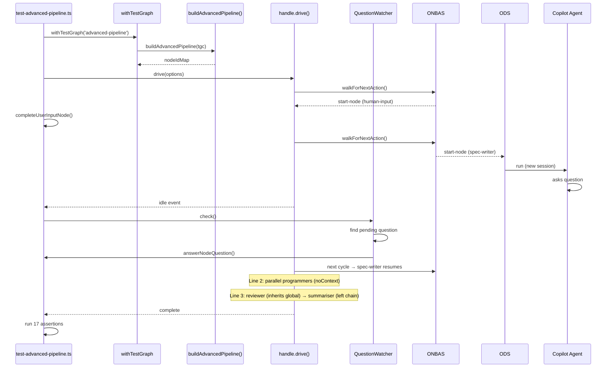

# Phase 3: E2E Test Fixtures and Script – Tasks & Alignment Brief

**Spec**: [../../advanced-e2e-pipeline-spec.md](../../advanced-e2e-pipeline-spec.md)
**Plan**: [../../advanced-e2e-pipeline-plan.md](../../advanced-e2e-pipeline-plan.md)
**Date**: 2026-02-21

---

## Executive Briefing

### Purpose
This phase builds the centrepiece E2E test — 6 fixture work units and a test script that wires them into a 4-line pipeline graph, drives orchestration with real Copilot agents, handles Q&A programmatically, and verifies context inheritance, isolation, and parallel execution. This is the proof that Phases 1-2 work end-to-end with real LLMs.

### What We're Building
- **6 work unit fixtures** in `dev/test-graphs/advanced-pipeline/units/` (human-input, spec-writer, programmer-a, programmer-b, reviewer, summariser)
- **1 test script** `scripts/test-advanced-pipeline.ts` with VerboseCopilotAdapter (event streaming), QuestionWatcher (scripted + interactive Q&A), graph builder, drive loop, 17 assertions, and rich terminal UX
- **1 justfile entry** for `just test-advanced-pipeline`

### User Value
A repeatable, human-watchable E2E test proving that Chainglass orchestration handles multi-agent workflows with Q&A, parallel fan-out, context isolation, and serial aggregation — the full shakedown before committing to the web world.

### Example
```
$ just test-advanced-pipeline

══ Chainglass Advanced Pipeline E2E ══
Line 0: [human-input] ✓
Line 1: [spec-writer] → Q&A: "What languages?" → "python and go" ✓
Line 2: [programmer-a] [programmer-b] ← parallel, fresh sessions ✓
Line 3: [reviewer] [summariser] ← context from spec-writer ✓

Session Chain: spec-writer = reviewer = summariser ✓
Isolation: programmer-a ≠ programmer-b ≠ spec-writer ✓
✅ ALL 17 ASSERTIONS PASSED
```

---

## Objectives & Scope

### Objective
Build the E2E test script and fixtures per Workshop 01, proving Phases 1-2 work with real agents.

### Goals
- ✅ Create 6 fixture work units with correct YAML schemas and prompt templates
- ✅ Build graph builder that wires 4 lines, 6 nodes, inputs, and `noContext` on parallel nodes
- ✅ Implement QuestionWatcher for scripted and interactive Q&A
- ✅ Implement drive loop with Q&A integration and phase banners
- ✅ Write 17 assertions per Workshop 01 matrix
- ✅ Support `--interactive` flag for human-in-the-loop mode

### Non-Goals
- ❌ Running with real agents (Phase 4)
- ❌ Prompt tuning or retry logic (Phase 4)
- ❌ Performance optimization
- ❌ CI integration (integration tests gated by env var)
- ❌ Changes to context engine or readiness gate (Phases 1-2 complete)

---

## Prior Phases Summary

### Phase 1 Deliverables
- `noContext` and `contextFrom` on schema → service → interface → builder → types
- New 6-rule `getContextSource()` (~95 lines) with self-reference guard
- `addNode()` fixed to persist new fields (DYK #2)
- 21 context engine tests, `makeRealityFromLines()` helper
- `getFirstAgentOnPreviousLine()` deleted

### Phase 2 Deliverables
- Gate 5 (`contextFromReady`) in `canRun()` — blocks until contextFrom target completes
- `contextFromReady` computed in `getNodeStatus()` and wired through reality builder
- `CanRunResult.gate` union extended with `'contextFrom'`
- 4 gate tests in `can-run.test.ts`
- DYK: `NodeStatusResult` has inline readyDetail type separate from `ReadinessDetail`

### What Phase 3 Builds Upon
- `addNode()` with `orchestratorSettings: { noContext: true, contextFrom: '...' }` (Phase 1)
- Context engine correctly resolves global session for reviewer, isolation for parallel workers (Phase 1)
- Readiness gate blocks contextFrom nodes until target completes (Phase 2)
- Existing infrastructure: `withTestGraph()`, `answerNodeQuestion()`, `completeUserInputNode()`, `VerboseCopilotAdapter` pattern, `assertGraphComplete()` etc.

---

## Pre-Implementation Audit

### Summary
| # | File | Action | Origin | Recommendation |
|---|------|--------|--------|----------------|
| 1 | `dev/test-graphs/advanced-pipeline/units/human-input/unit.yaml` | Create | New | plan-scoped |
| 2 | `dev/test-graphs/advanced-pipeline/units/spec-writer/unit.yaml` | Create | New | plan-scoped |
| 3 | `dev/test-graphs/advanced-pipeline/units/spec-writer/prompts/main.md` | Create | New | plan-scoped |
| 4 | `dev/test-graphs/advanced-pipeline/units/programmer-a/unit.yaml` | Create | New | plan-scoped |
| 5 | `dev/test-graphs/advanced-pipeline/units/programmer-a/prompts/main.md` | Create | New | plan-scoped |
| 6 | `dev/test-graphs/advanced-pipeline/units/programmer-b/unit.yaml` | Create | New | plan-scoped |
| 7 | `dev/test-graphs/advanced-pipeline/units/programmer-b/prompts/main.md` | Create | New | plan-scoped |
| 8 | `dev/test-graphs/advanced-pipeline/units/reviewer/unit.yaml` | Create | New | plan-scoped |
| 9 | `dev/test-graphs/advanced-pipeline/units/reviewer/prompts/main.md` | Create | New | plan-scoped |
| 10 | `dev/test-graphs/advanced-pipeline/units/summariser/unit.yaml` | Create | New | plan-scoped |
| 11 | `dev/test-graphs/advanced-pipeline/units/summariser/prompts/main.md` | Create | New | plan-scoped |
| 12 | `scripts/test-advanced-pipeline.ts` | Create | New | plan-scoped |
| 13 | `justfile` | Modify | Pre-plan | cross-plan-edit |

### Compliance Check
No violations. All new files follow existing `dev/test-graphs/` and `scripts/` conventions.

---

## Requirements Traceability

### Coverage Matrix
| AC | Description | Files in Flow | Tasks | Status |
|----|-------------|---------------|-------|--------|
| AC-8 | E2E completes with all 6 nodes complete | All fixtures + script | T001-T012 | ✅ |
| AC-9 | Session chain: spec-writer = reviewer = summariser | Script assertions | T011 | ✅ |
| AC-10 | Session isolation: prog-a ≠ prog-b ≠ spec-writer | Script assertions | T011 | ✅ |
| AC-11 | Q&A handshake works end-to-end | QuestionWatcher + script | T008, T010 | ✅ |
| AC-12 | Parallel nodes start after line 1 completes | Drive loop timing | T011 | ✅ |
| AC-13 | All agent nodes produce non-empty outputs | Script assertions | T011 | ✅ |

No gaps found.

---

## Tasks

| Status | ID | Task | CS | Type | Dependencies | Absolute Path(s) | Validation | Subtasks | Notes |
|--------|------|------|-----|------|-------------|-------------------|-----------|----------|-------|
| [ ] | T001 | Create human-input fixture: `unit.yaml` with type=user-input, outputs=[requirements] | 1 | Fixture | – | `/home/jak/substrate/033-real-agent-pods/dev/test-graphs/advanced-pipeline/units/human-input/unit.yaml` | YAML valid; `type: user-input`; outputs `requirements` | – | Plan 3.1 |
| [ ] | T002 | Create spec-writer fixture: `unit.yaml` + `prompts/main.md`. Inputs: requirements. Outputs: spec, language-1, language-2. **Prompt MUST include explicit `cg wf node ask` command template** instructing agent to ask about languages — without this, no Q&A event fires and the test hangs. | 2 | Fixture | – | `/home/jak/substrate/033-real-agent-pods/dev/test-graphs/advanced-pipeline/units/spec-writer/unit.yaml`, `.../prompts/main.md` | YAML valid; prompt references Q&A with `cg wf node ask` command; 3 outputs defined | – | Plan 3.2; DYK #5 |
| [ ] | T003 | Create programmer-a fixture: `unit.yaml` + `prompts/main.md`. Inputs: spec, language. Outputs: code, test-results, summary. | 1 | Fixture | – | `/home/jak/substrate/033-real-agent-pods/dev/test-graphs/advanced-pipeline/units/programmer-a/unit.yaml`, `.../prompts/main.md` | YAML valid; 2 inputs, 3 outputs | – | Plan 3.3 |
| [ ] | T004 | Create programmer-b fixture: mirror of programmer-a | 1 | Fixture | – | `/home/jak/substrate/033-real-agent-pods/dev/test-graphs/advanced-pipeline/units/programmer-b/unit.yaml`, `.../prompts/main.md` | Matches programmer-a structure | – | Plan 3.4 |
| [ ] | T005 | Create reviewer fixture: `unit.yaml` + `prompts/main.md`. Inputs from both programmers + spec. Outputs: review-a, review-b, metrics-a, metrics-b. | 2 | Fixture | – | `/home/jak/substrate/033-real-agent-pods/dev/test-graphs/advanced-pipeline/units/reviewer/unit.yaml`, `.../prompts/main.md` | YAML valid; 5 inputs, 4 outputs | – | Plan 3.5 |
| [ ] | T006 | Create summariser fixture: `unit.yaml` + `prompts/main.md`. Inputs from reviewer. Outputs: final-report, overall-pass, total-loc. | 1 | Fixture | – | `/home/jak/substrate/033-real-agent-pods/dev/test-graphs/advanced-pipeline/units/summariser/unit.yaml`, `.../prompts/main.md` | YAML valid; 4 inputs, 3 outputs | – | Plan 3.6 |
| [ ] | T007 | Write script §1-2: imports, constants, VerboseCopilotAdapter (extend from test-copilot-serial.ts pattern). **Use `withTestGraph` for workspace lifecycle only; build own real orchestration stack** with `AgentManagerService` + `VerboseCopilotAdapter` — do NOT use `createTestOrchestrationStack()` which wires FakeAgentManagerService. | 2 | Core | T001-T006 | `/home/jak/substrate/033-real-agent-pods/scripts/test-advanced-pipeline.ts` | `pnpm tsx scripts/test-advanced-pipeline.ts --help` runs without import errors | – | Plan 3.7; DYK #1 |
| [ ] | T008 | Write script §3: QuestionWatcher class — scripted + interactive modes. Monitors `reality.pendingQuestions`, matches answers, calls `answerNodeQuestion()`. `--interactive` flag triggers readline prompt. | 2 | Core | T007 | `/home/jak/substrate/033-real-agent-pods/scripts/test-advanced-pipeline.ts` | QuestionWatcher compiles; scripted mode returns correct answer for "language" match | – | Plan 3.8; Workshop 01 §3 |
| [ ] | T009 | Write script §4: `buildAdvancedPipeline()` graph builder — creates graph with 4 lines, 6 nodes, **wires all inputs via `service.setInput()` with `{ from_node, from_output }` pattern** (~15 setInput calls per Workshop 01 data flow diagram), sets `noContext: true` on parallel nodes, returns node ID map | 3 | Core | T007 | `/home/jak/substrate/033-real-agent-pods/scripts/test-advanced-pipeline.ts` | Graph builds with correct topology; noContext on programmer nodes; all inputs wired | – | Plan 3.9; DYK #2 |
| [ ] | T010 | Write script §5: drive loop with Q&A integration — drives via `handle.drive()`, on idle checks QuestionWatcher, answers questions, resumes, prints phase banners per line. **Human-input completed DURING drive** (let drive idle once, then complete externally via `completeUserInputNode()`, more realistic flow — matches website pattern). | 3 | Core | T008, T009 | `/home/jak/substrate/033-real-agent-pods/scripts/test-advanced-pipeline.ts` | Drive loop compiles; onEvent handler invokes QuestionWatcher.check() on idle; human-input completed during drive | – | Plan 3.10; DYK #3 |
| [ ] | T011 | Write script §6: 17 assertions per Workshop 01 matrix — exitReason, node statuses, output existence, session chain (1-0=3-0=3-1), session isolation (2-0≠2-1≠1-0), Q&A detection, line ordering, non-empty outputs | 2 | Core | T010 | `/home/jak/substrate/033-real-agent-pods/scripts/test-advanced-pipeline.ts` | 17 named assertions in code; session chain and isolation checks use `podManager.getSessionId()` | – | Plan 3.11; Workshop 01 assertion matrix |
| [ ] | T012 | Write script §7-8: output display + main entry point. Parse `--interactive` flag. Print graph topology at start, outputs at end, session chain summary. `withTestGraph('advanced-pipeline', ...)` lifecycle. | 1 | Core | T011 | `/home/jak/substrate/033-real-agent-pods/scripts/test-advanced-pipeline.ts` | Script runs end-to-end (fails on agent calls without token — structure valid) | – | Plan 3.12 |
| [ ] | T013 | Add `just test-advanced-pipeline` entry to justfile | 1 | Config | T012 | `/home/jak/substrate/033-real-agent-pods/justfile` | `just test-advanced-pipeline` runs `pnpm tsx scripts/test-advanced-pipeline.ts` | – | Plan 3.13 |

---

## Alignment Brief

### Critical Findings Affecting This Phase
| # | Finding | Constraint | Tasks |
|---|---------|-----------|-------|
| 08 | VerboseCopilotAdapter pattern in test-copilot-serial.ts (427 lines) | Reuse event streaming pattern; extend for per-node colour labels | T007 |
| 10 | Test helpers: makeNode, answerNodeQuestion, completeUserInputNode | Use existing helpers for Q&A and user-input completion | T008, T009 |
| 11 | unit.yaml pattern: slug, type, agent.prompt_template, inputs[], outputs[] | Follow exactly for fixture creation | T001-T006 |
| 12 | buildStack() wires full DI in 31 lines | Adapt for advanced pipeline (swap in CopilotAdapter) | T007 |

### DYK Insights (Pre-Implementation)

| # | Insight | Impact | Decision | Tasks |
|---|---------|--------|----------|-------|
| DYK-1 | `withTestGraph` → `createTestOrchestrationStack()` wires `FakeAgentManagerService`. We need real `AgentManagerService` + `VerboseCopilotAdapter`. | Critical | Use `withTestGraph` for workspace lifecycle only; build own real orchestration stack (adapted from test-copilot-serial.ts `buildStack()`). | T007 |
| DYK-2 | Input wiring API is `service.setInput(ctx, slug, nodeId, inputName, { from_node, from_output })`. Graph builder needs ~15 `setInput()` calls to wire all cross-node data flows per Workshop 01 data flow diagram. | High | Follow data flow diagram exactly. | T009 |
| DYK-3 | Human-input completion is an external action (like a human filling a form on a website). Drive idles (returns no-action) until someone completes it. | Medium | Let drive idle once, then complete human-input externally via `completeUserInputNode()`, then let drive continue. More realistic than pre-completing. | T010 |
| DYK-4 | Two parallel agents will interleave stdout. Each VerboseCopilotAdapter gets a unique colour + label prefix in its constructor. | Low | No extra work needed — adapter pattern already handles it. | T007 |
| DYK-5 | Spec-writer Q&A depends on agent calling `cg wf node ask` CLI command. If prompt doesn't instruct this explicitly, agent skips asking and test hangs. | Critical | Prompt in `prompts/main.md` MUST include exact `cg wf node ask` command template. | T002 |

### ADR Decision Constraints
- **ADR-0006**: CLI-based workflow orchestration — the E2E script exercises this exact architecture
- **ADR-0008**: Workspace-scoped storage — `withTestGraph` creates temp workspace following this model

### Invariants & Guardrails
- Fixtures must match existing unit.yaml schema exactly (slug, type, inputs, outputs, agent.prompt_template)
- Script must use `withTestGraph('advanced-pipeline', ...)` for lifecycle management
- Assertions must be structural only — never assert on LLM output content
- `VerboseCopilotAdapter` is the agent adapter (wraps Copilot SDK)
- Q&A uses existing `answerNodeQuestion()` helper (2-step: answer + restart)

### Key Integration Points



### Test Plan (No Fakes, No Mocks)
This phase creates the test script itself — it doesn't have unit tests. The script IS the test, run against real Copilot agents in Phase 4.

### Implementation Outline
1. **T001-T006**: Create 6 fixture directories with unit.yaml + prompts
2. **T007**: Script skeleton — imports, adapter, buildStack
3. **T008**: QuestionWatcher class
4. **T009**: Graph builder with full wiring
5. **T010**: Drive loop with Q&A hooks
6. **T011**: 17 assertions
7. **T012**: Main entry, output display, `--interactive` flag
8. **T013**: Justfile entry

### Commands to Run
```bash
# Verify script compiles (T007-T012)
pnpm tsx scripts/test-advanced-pipeline.ts --help

# Verify justfile entry (T013)
just test-advanced-pipeline --help

# Full quality gate
just fft
```

### Risks & Unknowns
| Risk | Severity | Mitigation |
|------|----------|------------|
| Graph builder input wiring complexity (cross-line references) | Medium | Follow Workshop 01 data flow diagram exactly |
| QuestionWatcher timing — idle event may fire before question is stored | Medium | Add small delay + retry in check() |
| VerboseCopilotAdapter may need updates for multi-agent parallelism | Low | Each agent gets own adapter instance with unique label |

### Ready Check
- [x] ADR constraints mapped (ADR-0006, ADR-0008)
- [x] Critical findings referenced (08, 10, 11, 12)
- [x] Implementation outline mapped 1:1 to tasks
- [x] No time estimates — CS scores only
- [ ] **Awaiting GO from human sponsor**

---

## Phase Footnote Stubs

_Empty — populated by plan-6 during implementation via plan-6a._

| Footnote | Task | Description |
|----------|------|-------------|
| | | |

---

## Evidence Artifacts

- **Execution log**: `docs/plans/039-advanced-e2e-pipeline/tasks/phase-3-e2e-test-fixtures-and-script/execution.log.md`

---

## Discoveries & Learnings

_Populated during implementation by plan-6. Log anything of interest to your future self._

| Date | Task | Type | Discovery | Resolution | References |
|------|------|------|-----------|------------|------------|
| | | | | | |

**Types**: `gotcha` | `research-needed` | `unexpected-behavior` | `workaround` | `decision` | `debt` | `insight`

---

## Directory Layout

```
docs/plans/039-advanced-e2e-pipeline/
  └── tasks/
      ├── phase-1-context-engine-types-schema-and-rules/ ✅
      ├── phase-2-readiness-gate-and-status-pipeline/ ✅
      └── phase-3-e2e-test-fixtures-and-script/
          ├── tasks.md                    ← this file
          ├── tasks.fltplan.md            ← generated by /plan-5b
          └── execution.log.md            ← created by /plan-6
```
