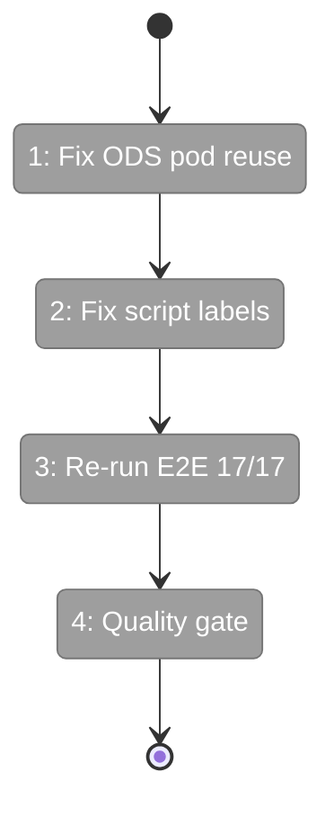
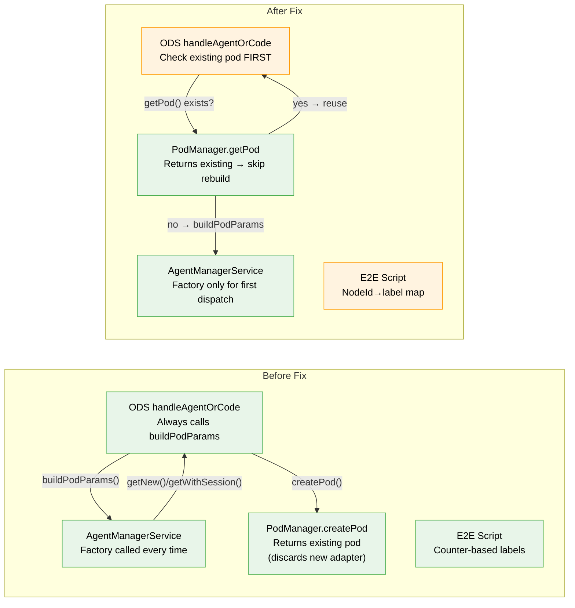

# Flight Plan: Phase 4 Subtask 001 — Fix Session Persistence Timing

**Plan**: [../../advanced-e2e-pipeline-plan.md](../../advanced-e2e-pipeline-plan.md)
**Phase**: Phase 4: Real Agent Verification and Polish → Subtask 001
**Generated**: 2026-02-21
**Status**: Ready for takeoff

---

## Departure → Destination

**Where we are**: The advanced pipeline E2E test runs end-to-end with real Copilot agents — all 6 nodes complete, Q&A works, outputs are produced. But 2 of 17 assertions fail: the adapter factory counter drifts on Q&A restarts (spec-writer consumes counter slots meant for other nodes), and session chain verification gives wrong results because labels are misattributed.

**Where we're going**: By the end of this subtask, ODS reuses existing pods on restart (no unnecessary factory calls), the E2E script labels match actual nodes, and all 17 assertions pass — proving context inheritance, isolation, and Q&A work correctly with real agents.

---

## Flight Status

**Legend**: grey = pending | yellow = active | red = blocked/needs input | green = done

---

## Stages

<!-- Updated by /plan-6 during implementation: [ ] → [~] → [x] -->

- [ ] **Stage 1: Fix ODS pod reuse on restart** — check for existing pod before calling buildPodParams; if pod exists, skip the agent factory and reuse it (`ods.ts` ~line 115)
- [ ] **Stage 2: Fix E2E script label assignment** — replace counter-based factory labels with a nodeId→label map so labels match actual dispatched nodes (`scripts/test-advanced-pipeline.ts`)
- [ ] **Stage 3: Re-run E2E with real agents** — `just test-advanced-pipeline` must show 17/17 assertions green
- [ ] **Stage 4: Full quality gate** — `just fft` passes with zero regressions

---

## Acceptance Criteria

- [ ] ODS does not call buildPodParams or adapter factory when restarting a node that already has a pod
- [ ] E2E script labels match actual node names in all output lines
- [ ] Session chain: spec-writer = reviewer = summariser (same session ID)
- [ ] Isolation: programmer-a ≠ programmer-b ≠ spec-writer (different session IDs)
- [ ] 17/17 assertions pass, exit code 0

---

## Goals & Non-Goals

**Goals**:
- Fix pod reuse on Q&A restart in ODS (production bug)
- Fix adapter label assignment in E2E script (test bug)
- Achieve 17/17 on the advanced pipeline E2E

**Non-Goals**:
- Refactoring ODS fire-and-forget pattern (it works when pod is reused)
- Synchronous session persistence (not needed within a single drive)
- PodManager disk persistence changes (in-memory Map sufficient)
- Interactive mode testing (deferred until scripted mode passes)

---

## Architecture: Before & After

**Legend**: existing (green, unchanged) | changed (orange, modified) | new (blue, created)

---

## Checklist

- [ ] ST001: Fix ODS pod reuse on restart — skip buildPodParams if pod exists (CS-2)
- [ ] ST002: Fix E2E script label assignment — nodeId→label map (CS-2)
- [ ] ST003: Re-run E2E test → 17/17 (CS-2)
- [ ] ST004: Full quality gate — just fft (CS-1)

---

## PlanPak

Active — but no feature folder changes in this subtask. All edits are cross-plan-edits to existing `030-orchestration/ods.ts` and the E2E script.
