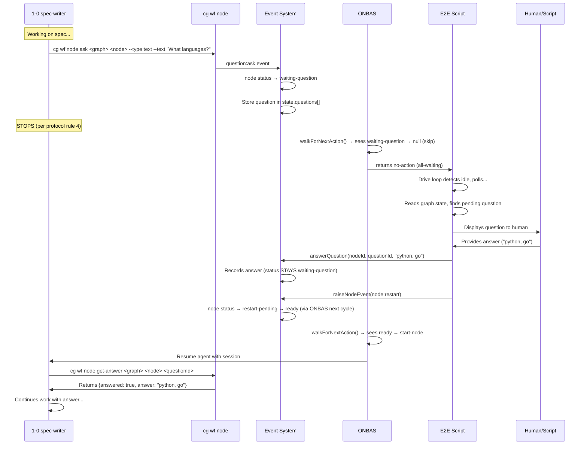
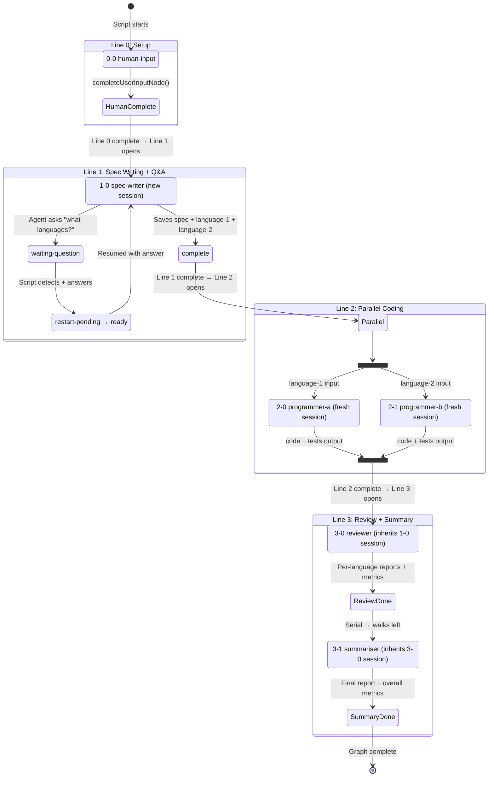

# Workshop: Multi-Line Q&A E2E Test Design

**Type**: Integration Pattern + State Machine + CLI Flow
**Plan**: 039-advanced-e2e-pipeline
**Created**: 2026-02-21T00:50:00Z
**Updated**: 2026-02-21T02:07:00Z
**Status**: Draft

**Related Documents**:
- [Workshop 03: Simplified Context Model](./03-simplified-context-model.md) — the new context engine this test validates
- [Workshop 02 (DEPRECATED)](./02-context-backward-walk-scenarios.md) — old backward walk analysis
- [ONBAS](../../../../packages/positional-graph/src/features/030-orchestration/onbas.ts) — line-by-line walk engine
- [ODS](../../../../packages/positional-graph/src/features/030-orchestration/ods.ts) — dispatch + session ID wiring
- [Node Starter Prompt](../../../../packages/positional-graph/src/features/030-orchestration/node-starter-prompt.md) — agent protocol
- [Existing Serial E2E](../../../../scripts/test-copilot-serial.ts) — production test to extend
- [Q&A Event Handlers](../../../../packages/positional-graph/src/features/032-node-event-system/event-handlers.ts) — question ask/answer/restart
- [Test Graph Runner](../../../../dev/test-graphs/shared/graph-test-runner.ts) — withTestGraph lifecycle
- [Helpers](../../../../dev/test-graphs/shared/helpers.ts) — completeUserInputNode, answerNodeQuestion

---

## Purpose

Design the centrepiece E2E test for the Chainglass workflow system. This test proves:
1. **Human input** (line 0) gates downstream execution
2. **Q&A loops** — agent asks a question, human answers, agent resumes
3. **Context isolation** — `noContext` nodes get fresh sessions (explicit opt-out)
4. **Global session** — line 3 reviewer inherits from the global agent (spec-writer on line 1), automatically skipping line 2
5. **Parallel fan-out** — two agents run concurrently on the same line
6. **Multi-output aggregation** — review node consumes outputs from parallel nodes
7. **Left-hand rule** — review → summary shares a conversation thread (serial on same line)

This becomes the repeatable, editable, human-watchable proof that the system works.

## Key Questions Addressed

- Q1: Does the global session model give reviewer context from spec-writer? → **YES, automatically** (Workshop 03)
- Q2: How do parallel nodes on line 2 get NO context? → **Set `noContext: true`** (parallel is scheduling only)
- Q3: How does the Q&A loop work end-to-end with real agents? → **3-phase handshake** (ask → answer → restart)
- Q4: Can line 2 parallel nodes wait for line 1 to complete? → **YES, ONBAS line ordering**
- Q5: Is there a construct to compact conversation before a node runs? → **Not yet, deferred**
- Q6: How should the test script be structured for iterability and nice UX? → **See Script Architecture**
- Q7: How do we properly use the fixture pattern? → **withTestGraph copies from dev/test-graphs/**
- Q7: How do we properly use the fixture pattern (repo → temp workspace)?

---

## Graph Topology

```
Line 0 ─ [0-0 human-input]        ← User provides app requirements
              │
              ▼
Line 1 ─ [1-0 spec-writer]        ← Reads human input, asks Q&A ("what languages?"),
              │                       writes spec + sets language-1, language-2 outputs
              │
         ╔════╧═══════════════╗    ← Context barrier: 2-0 and 2-1 get NO context from 1-0
         ▼                    ▼
Line 2 ─ [2-0 programmer-a]  [2-1 programmer-b]   ← Parallel, fresh sessions
         (language-1)         (language-2)             Each writes code in assigned language
         ╚════╤═══════════════╝
              │
              ▼  ← Context from 1-0 (SKIPS line 2)
Line 3 ─ [3-0 reviewer]           ← Reviews both programs, writes per-language reports
              │                       + data fields (loc, pass/fail, comments)
              ▼  ← Context from 3-0 (which inherited from 1-0)
         [3-1 summariser]          ← Collates into single report + overall metrics
```

### Node Summary

| Node | Line | Pos | Type | Execution | noContext | Context (per Workshop 03) | Key Behaviour |
|------|------|-----|------|-----------|----------|---------------------------|---------------|
| `0-0` human-input | 0 | 0 | user-input | serial | — | N/A (not an agent) | Provides app requirements |
| `1-0` spec-writer | 1 | 0 | agent | serial | no | **R3: global agent → new** (first eligible agent in graph) | Asks Q&A, writes spec, sets language params |
| `2-0` programmer-a | 2 | 0 | agent | parallel | **yes** | **R1: noContext → new** | Writes code in language-1 |
| `2-1` programmer-b | 2 | 1 | agent | parallel | **yes** | **R1: noContext → new** | Writes code in language-2 |
| `3-0` reviewer | 3 | 0 | agent | serial | no | **R5: no left neighbor → global** (spec-writer) | Reviews both, writes reports |
| `3-1` summariser | 3 | 1 | agent | serial | no | **R5: left neighbor → reviewer** | Collates final report |

---

## Context Model (Workshop 03 — Global Session + Left Neighbor)

The old 5-rule backward walk engine is being replaced. See [Workshop 03](./03-simplified-context-model.md) for the full design. Summary of rules:

| Rule | Condition | Result |
|------|-----------|--------|
| R0 | Not an agent | `not-applicable` |
| R1 | `noContext: true` | `new` (fresh session) |
| R2 | `contextFrom` set | `inherit` from specified node (input-gated + runtime guard) |
| R3 | I am the global agent (first non-noContext agent) | `new` |
| R4 | Parallel AND pos > 0 | `new` (independent worker) |
| R5 | Default | Serial: walk left (skip non-agents), else inherit from global |

**For this graph:**
- **spec-writer** (1-0) is the global agent → creates `sid-1`
- **programmer-a** (2-0) has `noContext` → creates `sid-2` (fresh, isolated)
- **programmer-b** (2-1) has `noContext` → creates `sid-3` (fresh, isolated)
- **reviewer** (3-0) is pos 0 on line 3, no left neighbor → inherits from global (spec-writer) → `sid-1`
- **summariser** (3-1) is pos 1 on line 3, walks left, finds reviewer → inherits from reviewer → `sid-1`

**Session chain: spec-writer → reviewer → summariser** (all `sid-1`). Parallel workers fully isolated. No backward walk. No code patches needed beyond implementing the new context engine.

### Why This Works Without "Context Skip"

Under the old model, reviewer's backward walk would find programmer-a (an agent on line 2) and inherit its session — wrong. We needed `noContext` walk-invisibility patches.

Under the new model, there IS no backward walk. Reviewer at pos 0 goes straight to the global agent (spec-writer). Line 2's parallel nodes are irrelevant — they don't participate in the global lookup because they have `noContext`.

### Why `noContext` Must Be Explicit (Not Implied by Parallel)

`parallel` is a scheduling concern: "run me concurrently with my neighbors." `noContext` is a context concern: "give me a fresh session." A parallel node at pos 0 WITHOUT `noContext` would inherit the global session — useful when parallel workers should share the main conversation. For THIS test, we want isolation, so we set both.

```typescript
if ('noContext' in node && (node as { noContext: unknown }).noContext === true) {
  return { source: 'new', reason: 'noContext flag set' };
}
```

### Q3: How Does the Q&A Loop Work End-to-End?

The Q&A protocol is a 3-phase handshake:



**For the E2E test script**, the flow is:

1. **Drive loop runs** — ONBAS starts spec-writer
2. **Agent asks question** — emits `question:ask` event via CLI
3. **Drive loop detects idle** (all-waiting) — polls graph state
4. **Script detects pending question** — reads `reality.pendingQuestions`
5. **Script answers** — calls `answerNodeQuestion()` helper (answer + restart)
6. **Drive loop resumes** — ONBAS sees restart-pending → ready → start-node
7. **Agent resumes** — reads answer via `cg wf node get-answer`

**Key insight:** The drive loop's `onEvent` callback sees `idle` events. The script must intercept these to check for pending questions and answer them programmatically.

---

### Q4: Can Line 2 Parallel Nodes Wait for Line 1?

**YES.** This is the default behaviour. ONBAS walks lines in order (onbas.ts line 35):

```typescript
for (const line of reality.lines) {
  // ... visit nodes on this line ...
  if (!line.isComplete) {
    return { type: 'no-action', reason: diagnoseStuckLine() };  // ← blocks here
  }
  // Only reaches next line when current line is complete
}
```

Line 2 nodes won't even be visited until line 1 is complete. **No configuration needed.**

**RESOLVED**: Line ordering is enforced by ONBAS. Line 2 waits for line 1 automatically.

---

### Q5: Is There a Compact-Before-Node Construct?

**NO.** Current findings:

| Component | compact() exists? | Node-level trigger? |
|-----------|-------------------|---------------------|
| `IAgentAdapter` | YES — `compact(sessionId)` | No |
| `IAgentInstance` | YES — `compact(options?)` | No |
| `NodeOrchestratorSettingsSchema` | — | No `compactBefore` field |
| `ODS.handleStartNode()` | — | No pre-execution compaction |

**compact() IS available** on both adapter and instance interfaces. The mechanism works (sends `/compact` command to reduce context). But there is NO node-level setting to trigger it automatically before execution.

**For this test:** Compaction is not needed — the conversations are short. But for production workflows with long context chains, we should add:

```typescript
// Proposed addition to NodeOrchestratorSettingsSchema
compactBefore: z.boolean().default(false)
```

And ODS would call `agentInstance.compact()` before `pod.execute()` when this flag is set.

**OPEN — Deferred to future plan.** Not required for the E2E test.

---

### Q6: Test Script UX Design

The existing `test-copilot-serial.ts` is a good starting point but needs significant upgrades for the centrepiece test. Design principles:

1. **Human-watchable** — rich terminal output, colour-coded phases, progress bars
2. **Editable** — fixture units in `dev/test-graphs/` (not inline), modify prompts and re-run
3. **Repeatable** — `withTestGraph` handles setup/teardown, no manual state
4. **Debuggable** — per-node event streaming, timing, tool call inspection
5. **Self-documenting** — graph topology printed at start, assertion summary at end

See [Script Architecture](#script-architecture) section below.

---

### Q7: Fixture Pattern (Repo → Temp Workspace)

**Already established** by `withTestGraph()` in `graph-test-runner.ts`:

```
dev/test-graphs/
  advanced-pipeline/          ← fixture name (in repo, version-controlled)
    units/
      human-input/
        unit.yaml
      spec-writer/
        unit.yaml
        prompts/main.md
      programmer-a/
        unit.yaml
        prompts/main.md
      programmer-b/
        unit.yaml
        prompts/main.md
      reviewer/
        unit.yaml
        prompts/main.md
      summariser/
        unit.yaml
        prompts/main.md
```

At runtime, `withTestGraph('advanced-pipeline', fn)`:
1. Creates temp dir: `/tmp/tg-advanced-pipeline-<ts>/`
2. Creates `.chainglass/units/`, `.chainglass/data/workflows/`, `.chainglass/graphs/`
3. Copies `dev/test-graphs/advanced-pipeline/units/` → temp `.chainglass/units/`
4. Makes `.sh` scripts executable
5. Registers workspace via WorkspaceService
6. Runs test
7. Unregisters + deletes temp dir

**Edit workflow:** Modify files in `dev/test-graphs/advanced-pipeline/units/`, re-run script. Changes picked up instantly.

---

## State Machine: Full Pipeline Execution



---

## Data Flow Diagram

```
┌─────────────────────────────────────────────────────────────────────────┐
│ Line 0: Human Input                                                     │
│                                                                         │
│  [0-0 human-input]                                                      │
│    outputs:                                                             │
│      requirements (data/text) ── "Build a CLI tool that converts..."    │
│                                                                         │
└──────────────────────────────┬──────────────────────────────────────────┘
                               │ requirements
                               ▼
┌─────────────────────────────────────────────────────────────────────────┐
│ Line 1: Spec Writer (with Q&A)                                          │
│                                                                         │
│  [1-0 spec-writer]                                                      │
│    inputs:                                                              │
│      requirements ← 0-0.requirements                                    │
│    Q&A:                                                                 │
│      asks: "What two programming languages?" → gets: "python, go"       │
│    outputs:                                                             │
│      spec (data/text) ── full specification document                    │
│      language-1 (data/text) ── "python"                                 │
│      language-2 (data/text) ── "go"                                     │
│                                                                         │
└────────────┬───────────────────┬───────────────────────────────┬────────┘
             │ spec + language-1  │ spec + language-2              │ (context
             ▼                    ▼                                │  chain)
┌────────────────────────────────────────────────────────────┐    │
│ Line 2: Parallel Programmers (FRESH sessions, no context)  │    │
│                                                            │    │
│  [2-0 programmer-a]          [2-1 programmer-b]            │    │
│    inputs:                     inputs:                     │    │
│      spec ← 1-0.spec            spec ← 1-0.spec           │    │
│      language ← 1-0.language-1   language ← 1-0.language-2 │    │
│    outputs:                    outputs:                     │    │
│      code (file)                 code (file)               │    │
│      test-results (data)         test-results (data)       │    │
│      summary (data/text)         summary (data/text)       │    │
│                                                            │    │
└──────────┬──────────────────────┬──────────────────────────┘    │
           │                      │                               │
           ▼                      ▼                               ▼
┌─────────────────────────────────────────────────────────────────────────┐
│ Line 3: Review + Summary                                                │
│                                                                         │
│  [3-0 reviewer]  ← context from 1-0 (skips line 2)                     │
│    inputs:                                                              │
│      spec ← 1-0.spec                                                    │
│      code-a ← 2-0.code                                                  │
│      code-b ← 2-1.code                                                  │
│      results-a ← 2-0.test-results                                       │
│      results-b ← 2-1.test-results                                       │
│    outputs:                                                             │
│      review-a (file) ── detailed review for language-1                  │
│      review-b (file) ── detailed review for language-2                  │
│      metrics-a (data) ── {loc, pass_fail, comments}                     │
│      metrics-b (data) ── {loc, pass_fail, comments}                     │
│                                                                         │
│  [3-1 summariser]  ← context from 3-0 (serial inheritance)             │
│    inputs:                                                              │
│      review-a ← 3-0.review-a                                            │
│      review-b ← 3-0.review-b                                            │
│      metrics-a ← 3-0.metrics-a                                          │
│      metrics-b ← 3-0.metrics-b                                          │
│    outputs:                                                             │
│      final-report (file) ── combined report                             │
│      overall-pass (data/text) ── "pass" or "fail"                       │
│      total-loc (data/text) ── combined line count                       │
│                                                                         │
└─────────────────────────────────────────────────────────────────────────┘
```

---

## Script Architecture

### File Structure

```
scripts/
  test-advanced-pipeline.ts      ← Main entry point (THE centrepiece)

dev/test-graphs/
  advanced-pipeline/
    units/
      human-input/
        unit.yaml                ← user-input: outputs [requirements]
      spec-writer/
        unit.yaml                ← agent: inputs [requirements], outputs [spec, language-1, language-2]
        prompts/main.md          ← "Read requirements, ask about languages, write spec"
      programmer-a/
        unit.yaml                ← agent: inputs [spec, language], outputs [code, test-results, summary]
        prompts/main.md          ← "Write the program in {{language}}"
      programmer-b/
        unit.yaml                ← (same structure as programmer-a)
        prompts/main.md
      reviewer/
        unit.yaml                ← agent: inputs [spec, code-a, code-b, results-a, results-b], outputs [review-a, review-b, metrics-a, metrics-b]
        prompts/main.md          ← "Review both implementations, write per-language reports"
      summariser/
        unit.yaml                ← agent: inputs [review-a, review-b, metrics-a, metrics-b], outputs [final-report, overall-pass, total-loc]
        prompts/main.md          ← "Collate into final report"
```

### Script Sections

```typescript
// scripts/test-advanced-pipeline.ts

// ─── Section 1: Imports & Constants ─────────────────
// Colours, timing utilities, imports from test infrastructure

// ─── Section 2: VerboseCopilotAdapter ───────────────
// Reused from test-copilot-serial.ts — wraps SDK with full event streaming
// Each node gets a unique colour + label in output

// ─── Section 3: Q&A Handler ────────────────────────
// QuestionWatcher class:
//   - Monitors graph state for pending questions
//   - Displays question to terminal with formatting
//   - Provides answer programmatically (scripted) or prompts human (interactive mode)
//   - Calls answerNodeQuestion() helper

// ─── Section 4: Graph Builder ───────────────────────
// buildAdvancedPipeline(tgc):
//   - Creates graph with 4 lines, 6 nodes
//   - Wires all inputs
//   - Returns node ID map for assertions

// ─── Section 5: Drive with Q&A ─────────────────────
// Custom drive loop that:
//   - Drives orchestration
//   - On idle: checks for pending questions
//   - Answers questions (scripted answers for deterministic testing)
//   - Resumes drive
//   - Prints phase banners (LINE 0 COMPLETE, LINE 1 ENTERING Q&A, etc.)

// ─── Section 6: Assertions ─────────────────────────
// Per-node completion checks
// Output existence and content validation
// Session ID tracking (inheritance chain verification)
// Context isolation verification (parallel sessions differ)

// ─── Section 7: Output Display ─────────────────────
// Reads and displays all outputs with formatting
// Shows session chain: 1-0 → 3-0 → 3-1 (same session ID)
// Shows parallel isolation: 2-0 ≠ 2-1 ≠ 1-0

// ─── Section 8: Main ───────────────────────────────
// Banner, withTestGraph, run, summary
```

### Terminal UX Design

```
══════════════════════════════════════════════════════════════
  Chainglass Advanced Pipeline E2E
  Real agents • Q&A • Parallel fan-out • Context inheritance
══════════════════════════════════════════════════════════════

workspace: /tmp/tg-advanced-pipeline-1708476600000/

GRAPH TOPOLOGY
  Line 0: [human-input]
  Line 1: [spec-writer] ← Q&A enabled
  Line 2: [programmer-a] [programmer-b] ← parallel, fresh sessions
  Line 3: [reviewer] [summariser] ← serial, context chain from line 1

═══ LINE 0: HUMAN INPUT ═══
✓ Requirements provided: "Build a CLI tool that converts CSV to JSON..."

═══ LINE 1: SPEC WRITER ═══
[3.2s] [spec-writer] Starting agent run
[3.2s] [spec-writer] Session: abc123 (new)
[3.2s] [spec-writer] 🔧 bash cg wf node accept ...
[3.5s] [spec-writer] ✓ tool done
[4.1s] [spec-writer] 🔧 bash cg wf node collate ...
[5.0s] [spec-writer] 🔧 bash cg wf node ask ... --type text --text "What two programming languages..."
[5.3s] [spec-writer] ✓ tool done

⏸️  QUESTION from spec-writer:
   "What two programming languages would you like this tool written in?"
   ➡ Answering: "python and go"

[5.5s] [spec-writer] Resumed with answer
[8.0s] [spec-writer] 🔧 bash cg wf node save-output-data ... spec ...
[9.0s] [spec-writer] 🔧 bash cg wf node save-output-data ... language-1 "python"
[9.5s] [spec-writer] 🔧 bash cg wf node save-output-data ... language-2 "go"
[10.0s] [spec-writer] 🔧 bash cg wf node end ...
[10.2s] [spec-writer] ✓ Agent completed (8 tool calls)

═══ LINE 2: PARALLEL PROGRAMMERS ═══
[10.5s] [programmer-a] Starting agent run (fresh session)
[10.5s] [programmer-b] Starting agent run (fresh session)
  ... parallel event streams interleaved ...
[25.0s] [programmer-a] ✓ Agent completed (6 tool calls)
[27.0s] [programmer-b] ✓ Agent completed (7 tool calls)

═══ LINE 3: REVIEW + SUMMARY ═══
[27.5s] [reviewer] Starting agent run
[27.5s] [reviewer] Session: abc123 (resumed from spec-writer!)
  ... review work ...
[40.0s] [reviewer] ✓ Agent completed (10 tool calls)

[40.5s] [summariser] Starting agent run
[40.5s] [summariser] Session: abc123 (resumed from reviewer!)
  ... summary work ...
[50.0s] [summariser] ✓ Agent completed (5 tool calls)

═══ RESULT ═══
  Time:       50.0s
  Exit:       complete
  Iterations: 12

Assertions:
  ✓ exitReason=complete
  ✓ graph complete
  ✓ 0-0 human-input complete
  ✓ 1-0 spec-writer complete
  ✓ 2-0 programmer-a complete
  ✓ 2-1 programmer-b complete
  ✓ 3-0 reviewer complete
  ✓ 3-1 summariser complete
  ✓ spec-writer has spec output
  ✓ spec-writer has language-1 output
  ✓ spec-writer has language-2 output
  ✓ programmer-a has code output
  ✓ programmer-b has code output
  ✓ reviewer has review-a output
  ✓ reviewer has metrics-a output
  ✓ summariser has final-report output
  ✓ summariser has overall-pass output

Session Chain:
  1-0 spec-writer:   abc123  (new)
  2-0 programmer-a:  def456  (new — isolated)
  2-1 programmer-b:  ghi789  (new — isolated)
  3-0 reviewer:      abc123  (inherited from 1-0 ✓)
  3-1 summariser:    abc123  (inherited from 3-0 ✓)

  Context isolation: 2-0 ≠ 2-1 ≠ 1-0 ✓
  Context chain:     1-0 = 3-0 = 3-1 ✓

Outputs:
  spec:         "A CLI tool that converts CSV files to JSON..."
  language-1:   "python"
  language-2:   "go"
  code-a:       (file, 45 lines)
  code-b:       (file, 52 lines)
  review-a:     (file, 30 lines)
  review-b:     (file, 28 lines)
  metrics-a:    {"loc": 45, "pass_fail": "pass", "comments": "Clean impl..."}
  metrics-b:    {"loc": 52, "pass_fail": "pass", "comments": "Idiomatic Go..."}
  final-report: (file, 60 lines)
  overall-pass: "pass"
  total-loc:    97

══════════════════════════════════════════════════════════════
  ✅ ALL 17 ASSERTIONS PASSED (50.0s)
══════════════════════════════════════════════════════════════
```

### Q&A Handler Design

```typescript
interface ScriptedAnswer {
  /** Match question text (substring) */
  match: string;
  /** The answer to provide */
  answer: string;
  /** Display label for terminal output */
  label: string;
}

class QuestionWatcher {
  private scriptedAnswers: ScriptedAnswer[];
  private interactive: boolean;
  private answeredQuestions = new Set<string>();

  constructor(answers: ScriptedAnswer[], interactive = false) {
    this.scriptedAnswers = answers;
    this.interactive = interactive;
  }

  /**
   * Check for pending questions and answer them.
   * Called during drive loop idle periods.
   * Returns true if a question was answered (drive should resume).
   */
  async check(
    service: IPositionalGraphService,
    ctx: WorkspaceContext,
    graphSlug: string
  ): Promise<boolean> {
    const status = await service.getStatus(ctx, graphSlug);
    const reality = buildReality(status);

    for (const q of reality.pendingQuestions) {
      if (this.answeredQuestions.has(q.questionId)) continue;

      console.log(`\n⏸️  QUESTION from ${q.nodeId}:`);
      console.log(`   "${q.text}"`);

      let answer: string;

      if (this.interactive) {
        // Interactive: prompt human at terminal
        answer = await this.promptHuman(q.text, q.options);
        console.log(`   ✍ You answered: "${answer}"\n`);
      } else {
        // Scripted: match against pre-programmed answers
        const scripted = this.scriptedAnswers.find(a =>
          q.text.toLowerCase().includes(a.match.toLowerCase())
        );
        if (!scripted) {
          console.log(`   ⚠ No scripted answer matches — skipping`);
          continue;
        }
        answer = scripted.answer;
        console.log(`   ➡ Auto-answering: "${scripted.label}"\n`);
      }

      await answerNodeQuestion(service, ctx, graphSlug, q.nodeId, q.questionId, answer);
      this.answeredQuestions.add(q.questionId);
      return true;
    }
    return false;
  }

  private async promptHuman(question: string, options?: readonly QuestionOption[]): Promise<string> {
    const readline = await import('node:readline');
    const rl = readline.createInterface({ input: process.stdin, output: process.stdout });
    if (options?.length) {
      console.log(`   Options: ${options.map(o => o.label).join(', ')}`);
    }
    return new Promise(resolve => {
      rl.question('   > ', (answer) => { rl.close(); resolve(answer.trim()); });
    });
  }
}
```

Usage in the script:

```typescript
const qa = new QuestionWatcher([
  {
    match: 'language',
    answer: 'python and go',
    label: 'python and go',
  },
]);
```

---

## Pre-requisite: New Context Engine (Workshop 03)

Before the E2E test can run, the context engine must be replaced with the Global Session + Left Neighbor model. See [Workshop 03](./03-simplified-context-model.md) for the complete design.

| # | Change | Files | Effort |
|---|--------|-------|--------|
| 1 | Replace `getContextSource()` — new 4-rule engine | `agent-context.ts` | ~70 lines (replaces 118) |
| 2 | Add `noContext`, `contextFrom` to `NodeOrchestratorSettingsSchema` | `orchestrator-settings.schema.ts` | +2 lines |
| 3 | Wire `noContext`, `contextFrom` through reality builder → `NodeReality` | `reality.types.ts`, `reality.builder.ts` | ~5 lines |
| 4 | Rewrite context rule tests | `agent-context.test.ts` | ~150 lines (replaces existing) |

---

## Scenario Assessment: Does This Test Cover the New Context Model?

### What the original scenario exercises

| New Context Rule | Exercised? | How |
|-----------------|------------|-----|
| R0: non-agent → not-applicable | Yes | human-input node (0-0) |
| R1: noContext → new | Yes | programmer-a (2-0) and programmer-b (2-1) both have `noContext: true` |
| R2: contextFrom override | **No** | No node uses `contextFrom` |
| R3: global agent → new | Yes | spec-writer (1-0) is the global agent |
| R4: parallel pos > 0 → new | **No** | programmer-b (2-1) would hit this, but it also has noContext so R1 fires first |
| R5: left walk → inherit from left neighbor | Yes | summariser (3-1) inherits from reviewer (3-0) |
| R5: no left neighbor → inherit from global | Yes | reviewer (3-0) at pos 0 inherits from global (spec-writer) |

### What the scenario does NOT exercise

1. **`contextFrom` override** — no node uses explicit context wiring
2. **Parallel without noContext** — both parallel nodes have noContext, so we don't test parallel-with-shared-context
3. **Sub-chain branching** — noContext on a serial mid-line node creating a fork
4. **Left walk past noContext** — e.g., `[A(noContext), B(serial)]` where B skips A... wait, under the new model B would NOT skip A (left-hand rule is absolute). So this isn't a separate case.

### Verdict: The original scenario is sufficient

The original scenario tests **4 of 5 rules** and covers the critical patterns:
- Global session inheritance across lines
- noContext isolation for parallel workers
- Left-hand rule for serial chaining
- Q&A interrupt/resume
- Parallel fan-out and aggregation

The missing `contextFrom` test belongs in the **unit test suite** for the context engine, not in the E2E pipeline. `contextFrom` is an escape hatch for exotic topologies — proving it works with a 30-second unit test is better than burning real agent time on it.

**Recommendation: No additional variations needed for the E2E test. Add `contextFrom` coverage to the unit tests in Phase 1 (context engine implementation).**

---

## Assertion Matrix

| # | Assertion | What It Proves |
|---|-----------|---------------|
| 1 | `exitReason === 'complete'` | Drive loop finished successfully |
| 2 | Graph status = complete | All nodes finished |
| 3 | Each node status = complete | No stuck/failed nodes |
| 4 | spec-writer outputs: spec, language-1, language-2 | Q&A produced correct outputs |
| 5 | programmer-a outputs: code, test-results, summary | Language 1 implementation complete |
| 6 | programmer-b outputs: code, test-results, summary | Language 2 implementation complete |
| 7 | reviewer outputs: review-a, review-b, metrics-a, metrics-b | Cross-language review complete |
| 8 | summariser outputs: final-report, overall-pass, total-loc | Aggregation complete |
| 9 | 1-0 session = 3-0 session = 3-1 session | Global session chain preserved |
| 10 | 2-0 session ≠ 1-0 session | noContext isolation (a) |
| 11 | 2-1 session ≠ 1-0 session | noContext isolation (b) |
| 12 | 2-0 session ≠ 2-1 session | Parallel nodes independent |
| 13 | language-1 value = "python" | Q&A answer parsed correctly |
| 14 | language-2 value = "go" | Q&A answer parsed correctly |
| 15 | Question was detected and answered | Q&A handshake worked |
| 16 | Parallel nodes started after line 1 complete | Line ordering enforced |
| 17 | All outputs are non-empty | Agents did real work |

---

## Implementation Phases

### Phase 1: New Context Engine
- Replace `getContextSource()` with Global Session + Left Neighbor model (Workshop 03)
- Add `noContext` and `contextFrom` to schema, reality builder, NodeReality
- Rewrite unit tests (including `contextFrom` coverage)

### Phase 2: Fixture Creation
- Create `dev/test-graphs/advanced-pipeline/units/` with all 6 work units
- Write prompt templates for each agent node
- Each prompt designed to produce deterministic, verifiable outputs

### Phase 3: Script Implementation
- `scripts/test-advanced-pipeline.ts`
- VerboseCopilotAdapter (reuse from serial test)
- QuestionWatcher for Q&A handling
- Graph builder with proper wiring (including `noContext: true` on parallel nodes)
- Custom drive loop with Q&A integration
- Rich terminal UX with phase banners

### Phase 4: Verification & Polish
- Run end-to-end with real Copilot agents
- Tune timeouts and retry logic
- Add `--interactive` flag for human-in-the-loop mode
- Document in README

---

## Open Questions

### OQ1: Should the script support interactive mode?

**RESOLVED**: Yes — both modes, same orchestration stack.

- **Scripted** (default): `QuestionWatcher` has pre-programmed answers, feeds them automatically. Deterministic, repeatable, CI-safe.
- **Interactive** (`--interactive` flag): `QuestionWatcher` prints the question to terminal, prompts for human input via Node.js readline, then feeds the answer through the same `answerNodeQuestion()` path. Real ONBAS, real events, real drive loop — the only difference is where the string comes from.

Both modes use identical orchestration: ONBAS detects `waiting-question` → drive loop idles → `QuestionWatcher.check()` fires → answer provided → `node:restart` → drive resumes.

### OQ2: How to handle agent timeout?

**RESOLVED**: Use `Promise.race` with per-node timeout in drive options:
- `maxIterations: 100`
- `actionDelayMs: 1000`
- `idleDelayMs: 5000`
- Overall timeout: 180s (3 minutes) via script-level `setTimeout`

### OQ3: What if a parallel node fails?

**RESOLVED**: The graph goes to `failed` state. The test script should:
1. Detect failure in drive result
2. Print which node failed and why (error code + message)
3. Print partial outputs from successful nodes
4. Exit with code 1

### OQ4: Should we add a `justfile` entry?

**RESOLVED**: Yes.
```makefile
test-advanced-pipeline:
    npx tsx scripts/test-advanced-pipeline.ts
```

### OQ5: Is `noContext` needed on both parallel programmers?

**RESOLVED**: `noContext` is needed on programmer-a (pos 0) to prevent it inheriting the global session. Programmer-b (pos 1) would get `new` automatically via R4 (parallel pos > 0), but we set `noContext` on both for clarity and consistency — makes the intent explicit in the graph definition.

---

## Summary

This workshop establishes the complete design for the advanced E2E pipeline test. The context model is the "Global Session + Left Neighbor" engine designed in Workshop 03 — no backward walk, 5 flat rules, ~70 lines of code. The E2E test exercises 5 of 6 rules (R4 covered by unit tests). Everything else — Q&A loops, parallel execution, line ordering, fixture patterns — works with existing infrastructure.

The test will be the centrepiece proof that Chainglass orchestration handles real multi-agent workflows with human interaction, parallel fan-out, context isolation, and aggregation.
