# Workshop: Context Backward Walk Scenarios

**Type**: State Machine + Integration Pattern
**Plan**: 039-advanced-e2e-pipeline
**Spec**: N/A (pre-spec deep dive)
**Created**: 2026-02-21T01:21:00Z
**Status**: DEPRECATED — Superseded by [Workshop 03: Simplified Context Model](./03-simplified-context-model.md)

> **Why deprecated:** The 5-rule backward walk engine this workshop analysed is being replaced
> by the "Global Session + Left Neighbor" model designed in Workshop 03. The scenarios in this
> document remain accurate descriptions of the *current* behaviour, but the proposed fixes
> (noContext walk-invisibility patches to Rules 2 and 4) are no longer the plan. Instead, the
> entire rule engine is being rewritten. Keep this document as historical reference only.

**Related Documents**:
- [agent-context.ts](../../../../packages/positional-graph/src/features/030-orchestration/agent-context.ts) — the 5-rule engine (128 lines)
- [agent-context.test.ts](../../../../test/unit/positional-graph/features/030-orchestration/agent-context.test.ts) — existing 10-test suite
- [reality.types.ts](../../../../packages/positional-graph/src/features/030-orchestration/reality.types.ts) — NodeReality, LineReality types
- [Workshop 01](./01-multi-line-qa-e2e-test-design.md) — E2E test design (depends on findings here)

---

## Purpose

Get crystal-clear on every backward-walk scenario the context inheritance engine handles (and doesn't handle). This drives the design of the advanced E2E pipeline and identifies the exact code changes needed to support context-skip over parallel lines.

## Key Questions Addressed

- What does the backward walk do at each step for each real graph topology?
- Where does context land when parallel agents sit between the source and target?
- What changes are needed for context to skip over `noContext` nodes?
- Are there edge cases where the current rules produce surprising results?
- What new test coverage is needed?

---

## The Rules Engine (Reference)

`getContextSource(reality, nodeId)` applies rules in strict order. **First match wins.**

```
┌─────────────────────────────────────────────────────────────────┐
│                    Rule Evaluation Order                         │
│                                                                 │
│  Guard: node not found?           → not-applicable              │
│    │ no                                                         │
│    ▼                                                            │
│  Rule 0: unitType !== 'agent'?    → not-applicable              │
│    │ no                                                         │
│    ▼                                                            │
│  noContext override: flag set?    → new                          │
│    │ no                                                         │
│    ▼                                                            │
│  Rule 1: lineIndex=0 AND pos=0?  → new                          │
│    │ no                                                         │
│    ▼                                                            │
│  Rule 2: pos=0 AND lineIndex>0?  → WALK BACK all previous lines │
│    │ no                                                         │
│    ▼                                                            │
│  Rule 3: execution='parallel'?   → new                          │
│    │ no                                                         │
│    ▼                                                            │
│  Rule 4: serial, not first       → WALK LEFT on same line       │
│    │ no match                                                   │
│    ▼                                                            │
│  Fallback                        → new                          │
└─────────────────────────────────────────────────────────────────┘
```

### Critical Detail: Rule 2 Walk-Back Algorithm

```typescript
// Walks lines in REVERSE order (closest first)
for (let i = node.lineIndex - 1; i >= 0; i--) {
  const line = view.getLineByIndex(i);
  // Walks nodes in POSITION order (leftmost first)
  for (const nid of line.nodeIds) {
    const n = view.getNode(nid);
    if (n && n.unitType === 'agent') {
      return { source: 'inherit', fromNodeId: n.nodeId };
      //       ↑ FIRST agent found on closest previous line WINS
    }
  }
}
return { source: 'new' };  // no agent found on ANY previous line
```

**Two loops, two directions:**
- Outer: lines backwards (closest line first)
- Inner: nodes forwards (leftmost position first)

---

## Scenario 1: Simple Serial Chain

**The happy path.** Three serial lines, one agent per line, straight context flow.

### Topology

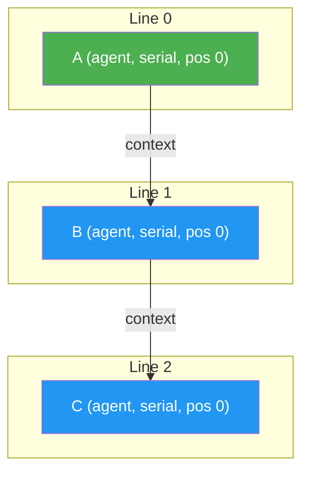

### Walk Trace

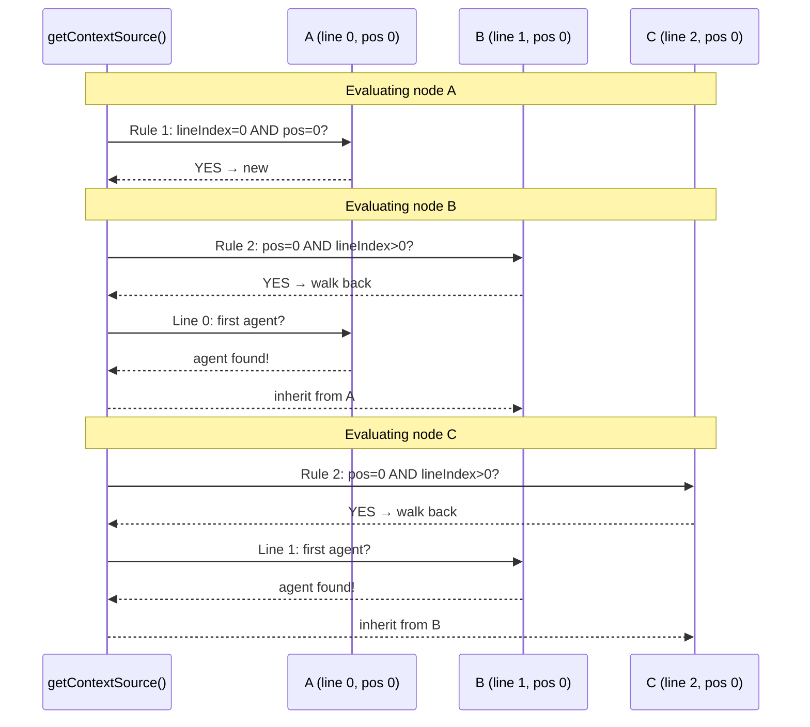

### Resolution Table

| Node | Rule Hit | Source | From | Session Chain |
|------|----------|--------|------|---------------|
| A | Rule 1 | `new` | — | `sid-1` (fresh) |
| B | Rule 2 | `inherit` | A | `sid-1` (from A) |
| C | Rule 2 | `inherit` | B | `sid-1` (from B, which was from A) |

**Result:** A → B → C share one continuous conversation. This is the most common pattern.

---

## Scenario 2: Skip Over Non-Agent Lines

A line of code-only nodes sits between two agent lines. The walk must skip it.

### Topology

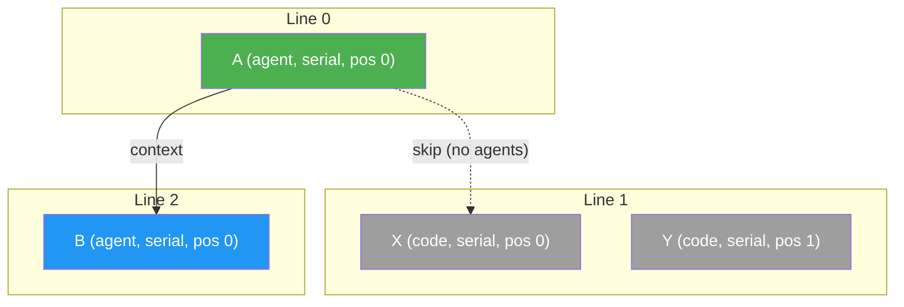

### Walk Trace

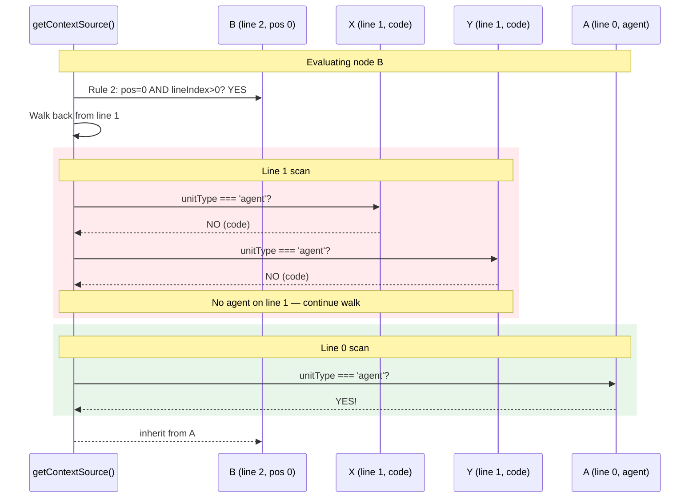

### Resolution Table

| Node | Rule Hit | Source | From | Reason |
|------|----------|--------|------|--------|
| A | Rule 1 | `new` | — | First agent on line 0 |
| X | Rule 0 | `not-applicable` | — | Code node |
| Y | Rule 0 | `not-applicable` | — | Code node |
| B | Rule 2 | `inherit` | **A** | Walk-back skipped line 1 (no agents), found A on line 0 |

**Key insight:** Non-agent lines are transparent. The walk passes right through them. This is the DYK-I10 behaviour — walk ALL previous lines, not just the immediately preceding one.

**Tested:** `agent-context.test.ts` line 291 — "walks past line with only code nodes to find agent on earlier line"

---

## Scenario 3: Parallel Fan-Out Blocks Context Skip (THE PROBLEM)

This is the scenario from our E2E test. A spec-writer on line 1, two parallel programmers on line 2, and a reviewer on line 3 that SHOULD inherit from the spec-writer — but the parallel nodes get in the way.

### Topology

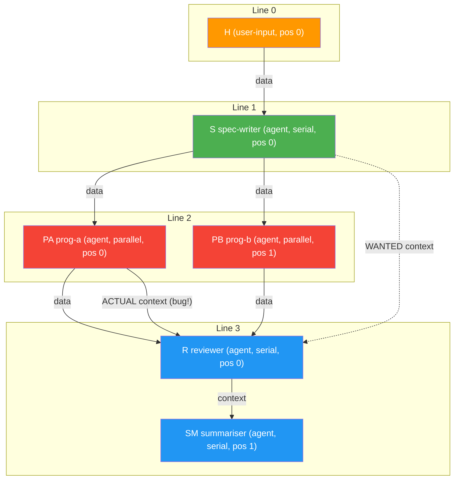

### Walk Trace for Node R (Reviewer)

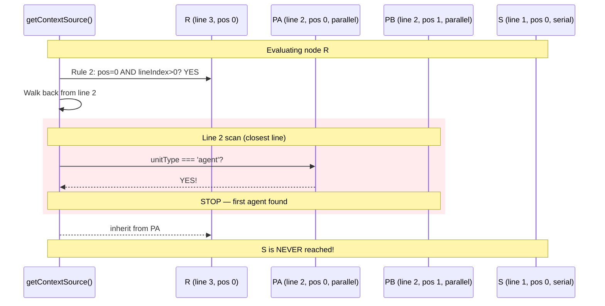

### Walk Trace for Parallel Nodes

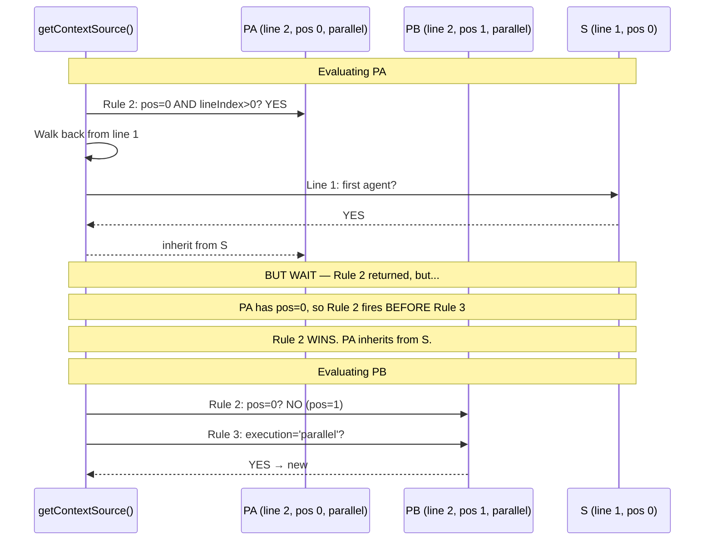

### Resolution Table

| Node | Rule Hit | Source | From | Surprise? |
|------|----------|--------|------|-----------|
| H | Rule 0 | `not-applicable` | — | No |
| S | Rule 2→ finds H (user-input, skip) → `new` | `new` | — | No |
| **PA** | **Rule 2** | **`inherit`** | **S** | **YES!** PA is parallel but Rule 2 fires first because pos=0 |
| PB | Rule 3 | `new` | — | No |
| **R** | **Rule 2** | **`inherit`** | **PA** | **YES!** Wanted S, got PA |
| SM | Rule 4 | `inherit` | R | No |

### Two Problems Found

**Problem 1: PA inherits from S despite being parallel.**

Rule 2 (`pos=0 AND lineIndex>0`) fires BEFORE Rule 3 (`parallel`). So the first parallel node at position 0 gets cross-line inheritance, while all other parallel nodes on the same line get fresh sessions. This is inconsistent:
- PA (pos 0, parallel): inherits from S
- PB (pos 1, parallel): fresh session

**Problem 2: R inherits from PA instead of S.**

The backward walk finds PA (an agent on line 2) before reaching S (on line 1). The walk stops at the first agent it finds — it has no concept of "skip this agent because it was a parallel worker."

### Session Reality

```
S:  sid-1  (new)
PA: sid-1  (inherited from S — WRONG, should be fresh)
PB: sid-2  (new — correct)
R:  sid-1  (inherited from PA — ACCIDENTALLY CORRECT session, WRONG source)
SM: sid-1  (inherited from R)
```

Wait — PA inheriting from S means R inherits from PA which inherited from S. The session ID chain is `S → PA → R → SM`, which gives R the session from S... **by accident**. But PA's conversation pollutes the context with programming work that the reviewer shouldn't see.

**The context is correct (same session ID) but the conversation history is wrong (includes PA's work).**

---

## Scenario 4: Mixed Serial-Parallel on Same Line

Two agents on the same line: first is serial, second is parallel. Tests the Rule 3 vs Rule 4 interaction.

### Topology

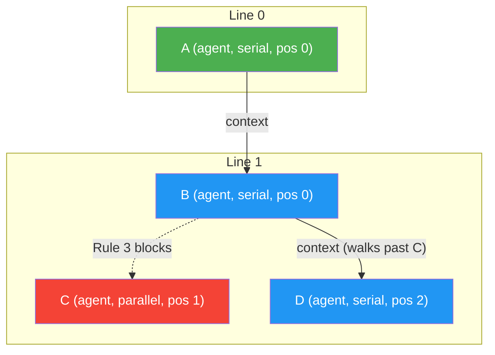

### Walk Trace

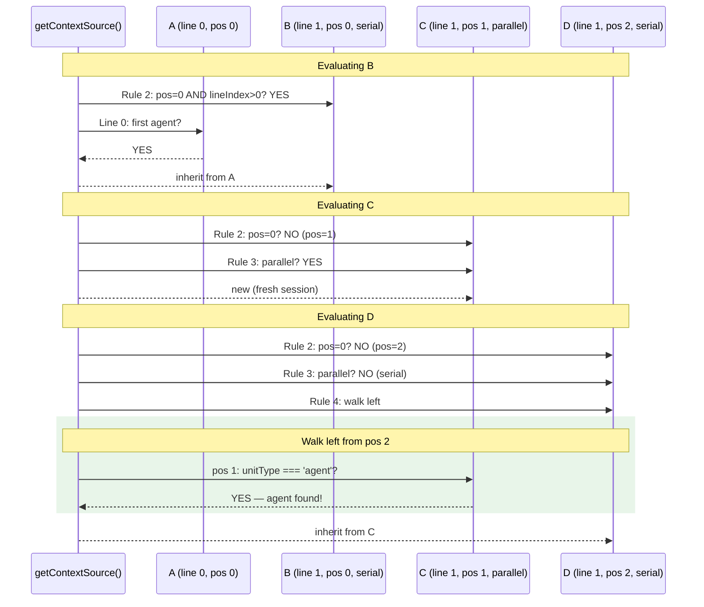

### Resolution Table

| Node | Rule Hit | Source | From | Notes |
|------|----------|--------|------|-------|
| A | Rule 1 | `new` | — | First on line 0 |
| B | Rule 2 | `inherit` | A | Cross-line, normal |
| C | Rule 3 | `new` | — | Parallel → fresh |
| **D** | **Rule 4** | **`inherit`** | **C** | Walks left, finds C (parallel agent). **D gets C's session** |

**Insight:** Rule 4 does NOT skip parallel agents. A serial node to the right of a parallel node inherits from the parallel node. This means D gets C's fresh session, NOT A→B's chain. This may or may not be desired — the existing test `agent-context.test.ts` line 453 explicitly covers this case and calls it correct.

### Session Reality

```
A:  sid-1 (new)
B:  sid-1 (from A)
C:  sid-2 (new, parallel)
D:  sid-2 (from C — takes C's fresh session, NOT A→B chain)
```

---

## Scenario 5: The Fix — `noContext` Enables True Context Skip

This is the proposed solution from Workshop 01. Adding `noContext: true` to parallel nodes makes Rule 2's backward walk skip them, allowing the reviewer to inherit from the spec-writer.

### Proposed Code Change

```typescript
// agent-context.ts — Rule 2 inner loop (line 72-76)
// CURRENT:
if (n && n.unitType === 'agent') {
  return { source: 'inherit', fromNodeId: n.nodeId };
}

// PROPOSED:
if (n && n.unitType === 'agent') {
  // Skip agents marked noContext — they opted out of the inheritance chain
  if ('noContext' in n && (n as { noContext: unknown }).noContext === true) {
    continue;  // ← NEW: skip this agent, keep walking
  }
  return { source: 'inherit', fromNodeId: n.nodeId };
}
```

**Same change needed in Rule 4** (line 103):

```typescript
// agent-context.ts — Rule 4 inner loop (line 100-108)
// CURRENT:
if (leftNode && leftNode.unitType === 'agent') {
  return { source: 'inherit', fromNodeId: leftNode.nodeId };
}

// PROPOSED:
if (leftNode && leftNode.unitType === 'agent') {
  if ('noContext' in leftNode && (leftNode as { noContext: unknown }).noContext === true) {
    continue;  // ← skip noContext agents when walking left too
  }
  return { source: 'inherit', fromNodeId: leftNode.nodeId };
}
```

### Topology (Same as Scenario 3, with `noContext`)

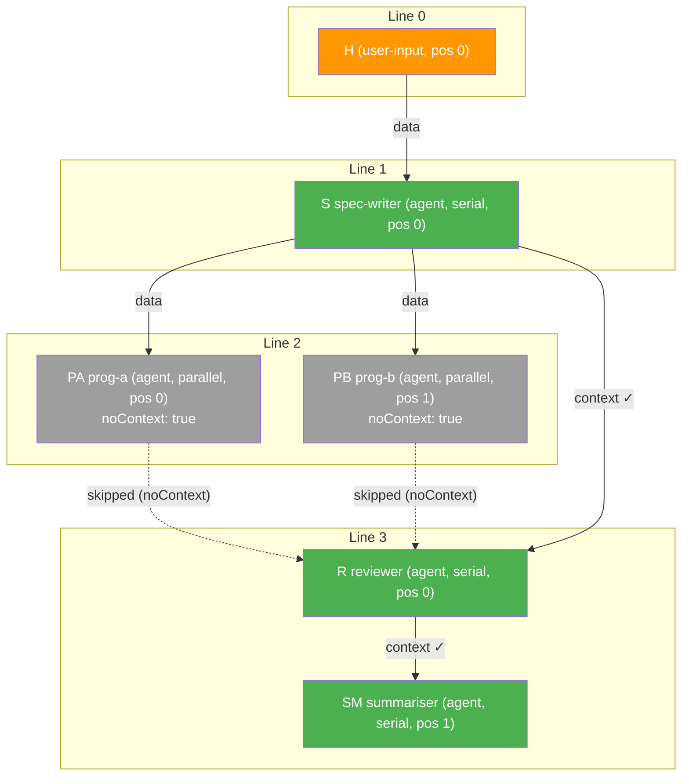

### Walk Trace for Node R (Reviewer) — WITH Fix

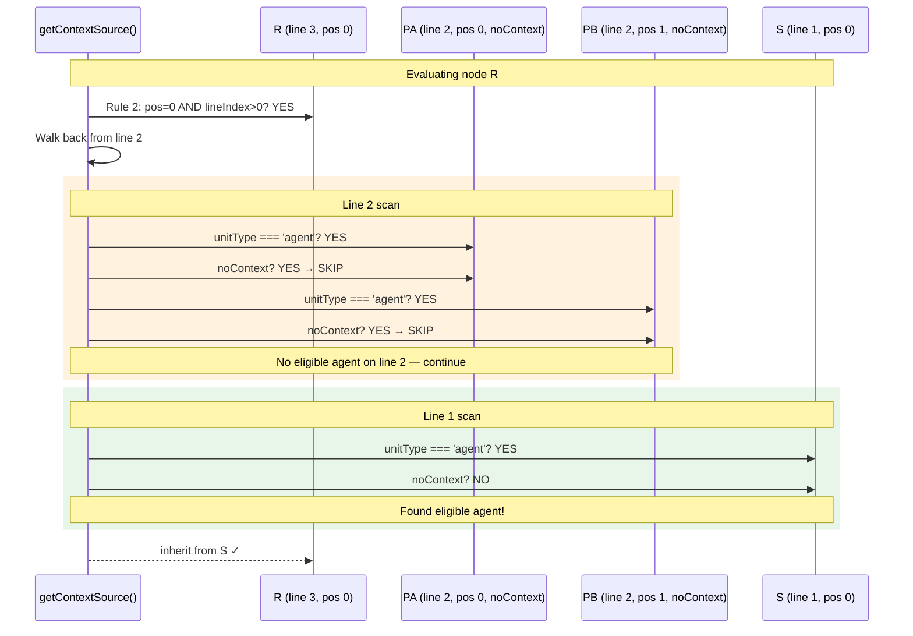

### Walk Trace for PA — noContext Override Fires FIRST

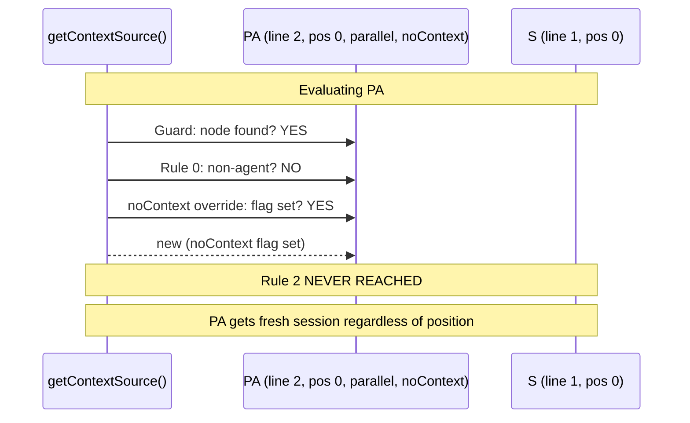

### Resolution Table (WITH Fix)

| Node | Rule Hit | Source | From | Correct? |
|------|----------|--------|------|----------|
| H | Rule 0 | `not-applicable` | — | Yes |
| S | Rule 2 (walks line 0, finds H=user-input, no agent) | `new` | — | Yes |
| PA | noContext override | `new` | — | **Yes** (was inherit from S — now fixed) |
| PB | noContext override (fires before Rule 3) | `new` | — | Yes (same result, different rule) |
| R | Rule 2 (walks line 2: PA skip, PB skip → line 1: finds S) | `inherit` | **S** | **Yes!** (was PA — now fixed) |
| SM | Rule 4 (walks left, finds R) | `inherit` | R | Yes |

### Session Reality (WITH Fix)

```
S:  sid-1 (new)
PA: sid-2 (new — noContext)
PB: sid-3 (new — noContext)
R:  sid-1 (inherited from S ✓ — clean conversation, no programming noise)
SM: sid-1 (inherited from R, which was from S)
```

**Context chain: S → R → SM** (skipping PA and PB entirely).
**Parallel isolation: PA and PB each get unique sessions, no cross-contamination.**

---

## Scenario 3b: Deep Walk — 5 Lines, Multiple Gaps

A stress test: many lines, mix of types, multiple gaps. Tests that the walk-back is truly exhaustive.

### Topology

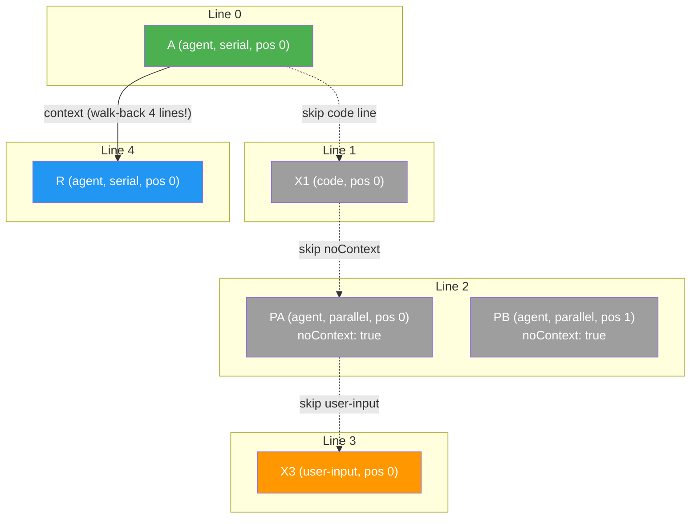

### Walk Trace for Node R

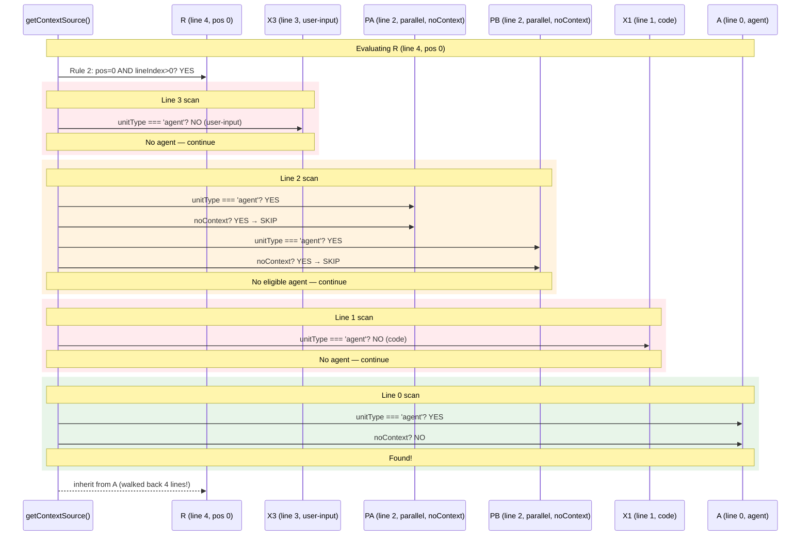

### Resolution Table

| Node | Walk Summary | Source | From |
|------|-------------|--------|------|
| A (line 0) | Rule 1 | `new` | — |
| X1 (line 1) | Rule 0 | `not-applicable` | — |
| PA (line 2) | noContext override | `new` | — |
| PB (line 2) | noContext override | `new` | — |
| X3 (line 3) | Rule 0 | `not-applicable` | — |
| **R (line 4)** | Rule 2, walks: L3(skip user-input) → L2(skip noContext×2) → L1(skip code) → **L0(found A)** | `inherit` | **A** |

**4 lines traversed, 5 nodes examined, 1 match found.** The walk is exhaustive and correct.

---

## Summary: What Needs to Change

### The Dual-Purpose of `noContext`

`noContext` serves TWO distinct purposes — and this must be clearly understood:

| Purpose | Affects | Current State |
|---------|---------|---------------|
| **Self-isolation**: "I get a fresh session" | The flagged node itself | ✅ Works via noContext override guard (line 52) |
| **Walk-invisibility**: "Other nodes skip me when searching" | Downstream nodes using Rule 2 or Rule 4 | ❌ NOT implemented yet |

Both are needed. The existing guard handles self-isolation. The new code handles walk-invisibility.

### Bonus Fix: Rule 2 vs Rule 3 Ordering for pos=0 Parallel Nodes

Scenario 3 revealed that a parallel node at position 0 hits Rule 2 (cross-line inherit) BEFORE Rule 3 (parallel → new). This means the first parallel node on a line inherits context while all others don't.

With `noContext`, this is moot (the override fires before Rule 2). But for graphs WITHOUT `noContext`, should we fix Rule 2 to check execution mode?

**Options:**

| Option | Change | Effect |
|--------|--------|--------|
| A: Do nothing | — | pos=0 parallel inherits, others don't. Existing test covers this. |
| B: Add parallel check to Rule 2 | `if (node.execution === 'parallel') skip Rule 2` | All parallel nodes get fresh sessions regardless of position |
| C: Rely on noContext | Require noContext flag for isolation | Explicit opt-in only |

**Recommendation: Option C (rely on noContext).** The Rule 2→Rule 3 ordering is documented and tested. Changing it now would break backward compatibility. Using `noContext` makes the intent explicit.

### Code Changes Required

| # | File | Change | Lines |
|---|------|--------|-------|
| 1 | `orchestrator-settings.schema.ts` | Add `noContext: z.boolean().default(false)` to `NodeOrchestratorSettingsSchema` | +1 |
| 2 | `reality.types.ts` | Add `readonly noContext?: boolean` to `NodeReality` | +1 |
| 3 | `reality.builder.ts` | Wire `noContext` from node settings to NodeReality | ~3 |
| 4 | `agent-context.ts` line 74 | Add `noContext` skip in Rule 2 inner loop | +3 |
| 5 | `agent-context.ts` line 103 | Add `noContext` skip in Rule 4 inner loop | +3 |
| 6 | `agent-context.test.ts` | 4 new tests: (a) noContext node skipped by Rule 2, (b) noContext node skipped by Rule 4, (c) deep walk over multiple noContext, (d) noContext + non-agent mix | ~80 |

**Total: ~8 lines production code + ~80 lines tests.**

### New Test Cases Needed

```typescript
// Test: Rule 2 walk-back skips noContext agent
// Graph: Line 0 [agent-A], Line 1 [agent-B noContext], Line 2 [agent-C pos=0]
// Expected: C inherits from A (skips B)

// Test: Rule 4 walk-left skips noContext agent
// Graph: Line 0 [agent-A noContext, agent-B serial]
// Expected: B gets new (A is noContext, no other agent to left)

// Test: Deep walk over mixed noContext and non-agent lines
// Graph: Line 0 [agent-A], Line 1 [code-X], Line 2 [agent-B noContext, agent-C noContext], Line 3 [user-input], Line 4 [agent-D]
// Expected: D inherits from A (walks back 4 lines, skips everything)

// Test: noContext node still gets new for itself
// Graph: Line 0 [agent-A], Line 1 [agent-B noContext pos=0]
// Expected: B gets new (noContext override fires before Rule 2)
```

---

## Decision Matrix

| Question | Answer | Confidence |
|----------|--------|-----------|
| Can context skip lines today? | Yes, but only over non-agent lines | Proven by code + tests |
| Can context skip over parallel agent lines? | **NO** — walk stops at first agent found | Proven by Scenario 3 trace |
| Does `noContext` fix the skip problem? | Yes, with 2 additions to walk loops | High — design is minimal |
| Is Rule 2 vs Rule 3 ordering a bug? | Debatable — documented, tested, `noContext` makes it moot | Recommend: leave as-is |
| Is `compact()` needed for this? | No — sessions are short, compaction is a future optimisation | Resolved |
| How many lines of code to fix? | ~8 production + ~80 test | Counted per-file above |
