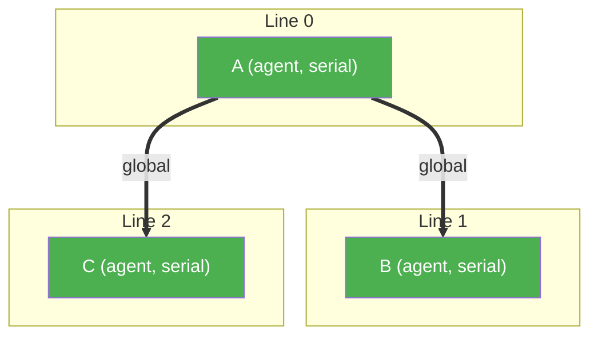
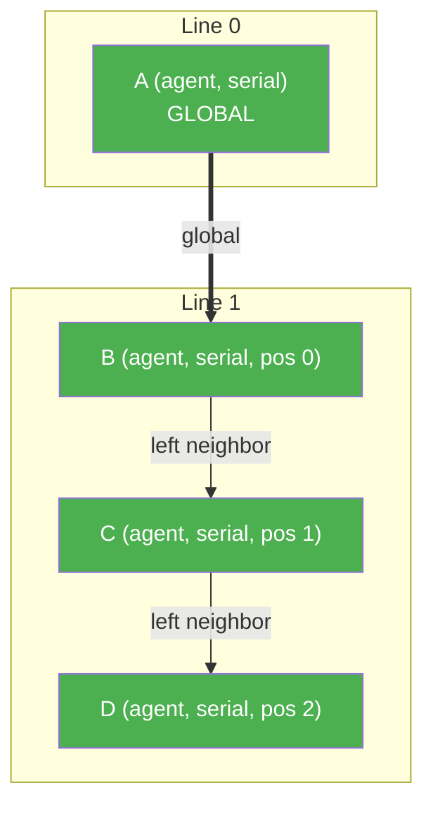
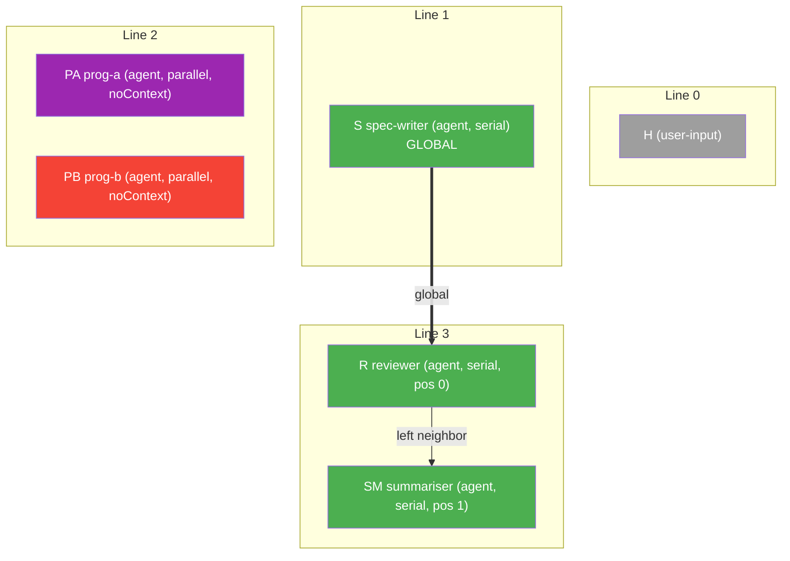
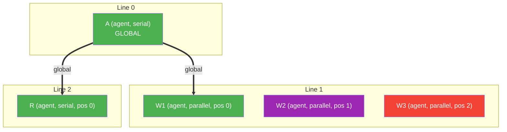
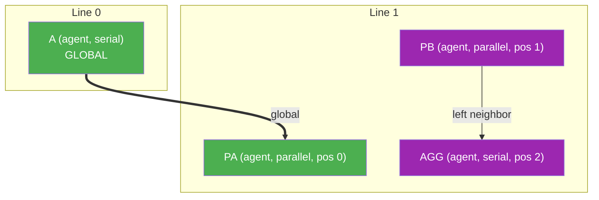
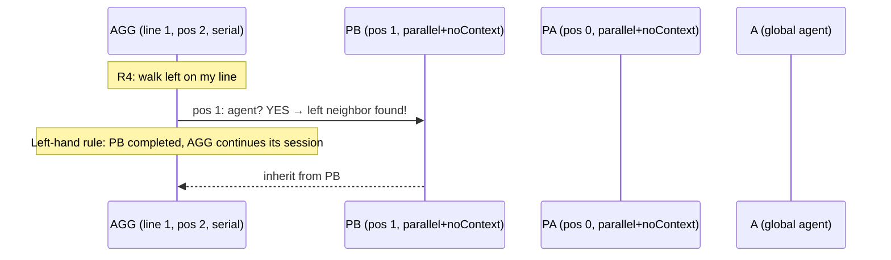
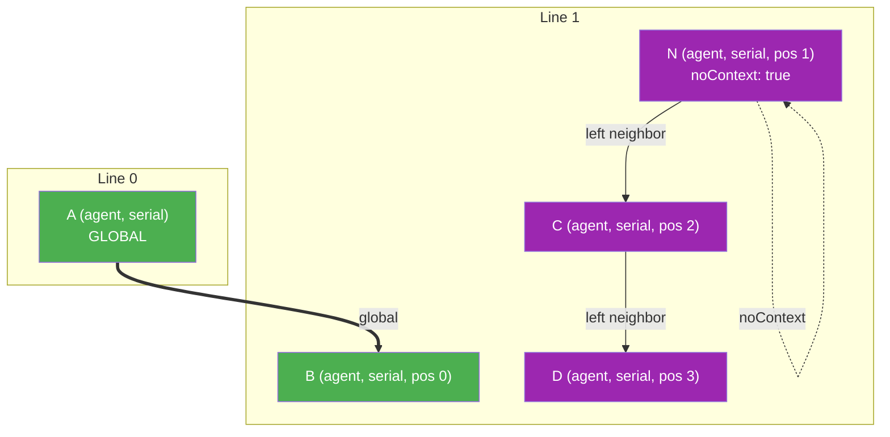
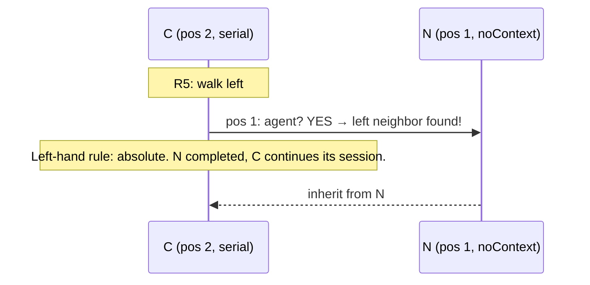
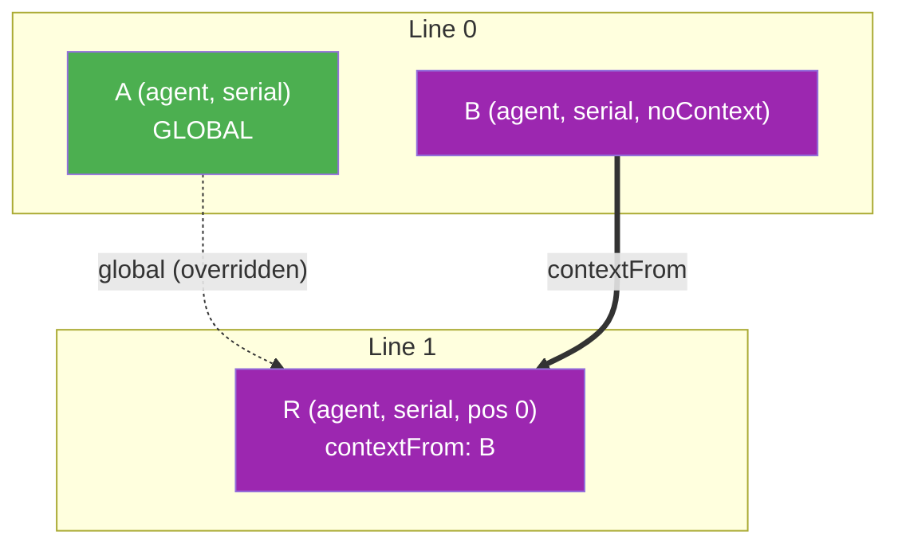

# Workshop: Simplified Context Model — Global Session + Left Neighbor

**Type**: State Machine + Integration Pattern
**Plan**: 039-advanced-e2e-pipeline
**Created**: 2026-02-21T01:49:00Z
**Status**: Draft

**Related Documents**:
- [agent-context.ts](../../../../packages/positional-graph/src/features/030-orchestration/agent-context.ts) — current 5-rule engine (TO BE REPLACED)
- [agent-context.test.ts](../../../../test/unit/positional-graph/features/030-orchestration/agent-context.test.ts) — current test suite (TO BE REWRITTEN)
- [Workshop 02 (DEPRECATED)](./02-context-backward-walk-scenarios.md) — backward walk analysis that led to this design
- [Workshop 01](./01-multi-line-qa-e2e-test-design.md) — E2E pipeline that motivated the redesign

---

## Purpose

Replace the 5-rule backward-walk context inheritance engine with a radically simpler model. The current engine has 118 lines, 5 rules with subtle ordering dependencies, and produces surprising results when parallel agents sit between source and target nodes (see Workshop 02, Scenario 3). The new model has 2 concepts: **global session** and **left neighbor**.

## Key Questions Addressed

- How should context flow between lines? → **Always from the global session**
- How should context flow within a line? → **From your left neighbor**
- What about parallel nodes? → **Parallel implies fresh session (noContext)**
- What about explicit wiring? → **`contextFrom` overrides everything**
- What happens at parallel→serial transitions on a line? → **Serial inherits from its left neighbor (even if parallel) — left-hand rule is absolute**

---

## The Old Model (Being Replaced)

5 rules, evaluated in order, first match wins:

```
Rule 0: non-agent           → not-applicable
Rule 1: first on line 0     → new
Rule 2: first on line N>0   → WALK BACK all previous lines for first agent
Rule 3: parallel             → new
Rule 4: serial not-first     → walk left past non-agents
```

**Problems:**
- Rule 2 walks backwards across ALL previous lines — O(lines × nodes) worst case
- Rule 2 finds parallel agents on intervening lines and inherits from them (unwanted)
- Rule 2 fires before Rule 3 for pos=0 parallel nodes (ordering surprise)
- No way for context to "skip" a line of parallel workers
- `noContext` flag existed but didn't make nodes invisible to the walk

---

## The New Model

Two concepts. That's it.

### Concept 1: Global Session

The **first agent node** in the graph (by line index, then position) creates the global session. Every subsequent agent node inherits this session by default — regardless of how many lines are between them. No walking. No scanning. Just: "who was first?"

### Concept 2: Left Neighbor

Within a line, the **second, third, fourth...** agent nodes inherit from the agent immediately to their left (skipping non-agent nodes). This creates sub-chains within a line.

### Overrides

| Setting | Effect | Scope |
|---------|--------|-------|
| `noContext: true` | Fresh session, skipped by global-agent search | Context isolation (overrides everything) |
| `contextFrom: nodeId` | Inherit from specific node | Context redirection |

### Parallel Execution — Context Behaviour

`execution: 'parallel'` affects context differently depending on position:

| Position | Serial | Parallel |
|----------|--------|----------|
| pos 0 (first on line) | Inherit from global | Inherit from global |
| pos > 0 | Inherit from left neighbor | **Always new session** |

Parallel at pos 0 gets the global session — same as serial. Parallel at pos > 0 always gets a fresh session (they're independent workers, not a chain).

`noContext: true` overrides everything regardless of position or execution mode.

**Examples:**

| Node Config | Pos | Session |
|------------|-----|---------|
| serial, pos 0 | 0 | global |
| serial, pos 2 | 2 | left neighbor |
| parallel, pos 0 | 0 | global |
| parallel, pos 1 | 1 | new (fresh) |
| parallel, pos 0, noContext | 0 | new (noContext overrides) |
| serial, pos 0, noContext | 0 | new (noContext overrides) |

---

## Complete Rule Set

```
┌─────────────────────────────────────────────────────────────────┐
│                    Rule Evaluation Order                         │
│                                                                 │
│  Guard: node not found?                → not-applicable         │
│    │ no                                                         │
│    ▼                                                            │
│  R0: not an agent?                     → not-applicable         │
│    │ no                                                         │
│    ▼                                                            │
│  R1: noContext?                         → new                   │
│    │ no                                                         │
│    ▼                                                            │
│  R2: contextFrom set?                  → inherit from that node │
│    │ no                                                         │
│    ▼                                                            │
│  R3: I am the global agent?            → new                   │
│    │ no                                                         │
│    ▼                                                            │
│  R4: parallel AND pos > 0?             → new                   │
│    │ no                                                         │
│    ▼                                                            │
│  R5: walk left (serial) or global      → inherit               │
│      (pos 0)                                                    │
│                                                                 │
└─────────────────────────────────────────────────────────────────┘
```

### R4: Parallel at pos > 0 → New

Parallel nodes beyond the first position always get a fresh session. They're independent workers — they don't chain from their left neighbor.

### R5 Detail: Serial Left Walk + Global Fallback

```typescript
// Serial node at pos > 0: walk left, skip only non-agents
if (myPosition > 0) {
  for (pos = myPosition - 1; pos >= 0; pos--) {
    const left = getNode(line.nodeIds[pos]);
    if (left.unitType !== 'agent') continue;     // skip code, user-input
    return { inherit from left };                 // left-hand rule: absolute
  }
}
// pos 0, or no agent to the left → inherit from global
return { inherit from globalAgent };
```

**Within-line:** The left-hand rule is absolute. If a parallel node is to your left, you get its session. It completed (serial waits via `waitForPrevious`), so its conversation is ready to continue. `noContext` only affects what session the *flagged* node itself receives — it does NOT make the node invisible to its right neighbors on the same line.

**Cross-line:** Only the global agent lookup skips isolated (parallel/noContext) nodes — they opted out of the main thread, so they shouldn't BE the global anchor.

---

## Finding the Global Agent

One scan at the start — find the first agent by position:

```typescript
function findGlobalAgent(reality: PositionalGraphReality): string | undefined {
  for (const line of reality.lines) {
    for (const nodeId of line.nodeIds) {
      const node = reality.nodes.get(nodeId);
      if (node && node.unitType === 'agent') {
        // Skip noContext nodes — they opted out of the main thread
        if ('noContext' in node && (node as { noContext: unknown }).noContext === true) continue;
        return node.nodeId;
      }
    }
  }
  return undefined; // graph has no eligible agent
}
```

**Edge case:** What if the very first agent has `noContext`? It's skipped. The global agent is the first non-`noContext` agent. `parallel` does NOT disqualify — a parallel node without `noContext` can be the global agent. If ALL agents have `noContext`, every node gets `new`.

---

## Scenarios

**Colour key:** Nodes sharing the same colour share the same session. Green = global session. Each other colour = a distinct fresh session.

### Scenario 1: Simple Serial Chain (Happy Path)



| Node | Rule | Source | From | Session |
|------|------|--------|------|---------|
| A | R3 (I am the global agent) | `new` | — | `sid-1` |
| B | R5 (pos 0, no left → global) | `inherit` | A | `sid-1` |
| C | R5 (pos 0, no left → global) | `inherit` | A | `sid-1` |

**Same result as old model.** B and C both inherit from A. Since B adds turns to sid-1 before C runs, C sees A+B's conversation. The chain is implicit via the shared session.

---

### Scenario 2: Serial Sub-Chain Within a Line



| Node | Rule | Source | From | Session |
|------|------|--------|------|---------|
| A | R3 | `new` | — | `sid-1` |
| B | R5 (pos 0, no left → global) | `inherit` | A | `sid-1` |
| C | R5 (walks left, finds B) | `inherit` | B | `sid-1` |
| D | R5 (walks left, finds C) | `inherit` | C | `sid-1` |

B→C→D form a sub-chain. All on `sid-1` because B inherited from global and the chain continues. **Same behaviour as old model Rule 4.**

---

### Scenario 3: The E2E Pipeline (The Motivating Case)



| Node | Rule | Source | From | Session |
|------|------|--------|------|---------|
| H | R0 (user-input) | `not-applicable` | — | — |
| S | R3 (first eligible agent = global) | `new` | — | `sid-1` |
| PA | R1 (noContext) | `new` | — | `sid-2` |
| PB | R1 (noContext) | `new` | — | `sid-3` |
| R | R5 (pos 0, no left → global = S) | `inherit` | **S** | `sid-1` |
| SM | R5 (walks left, finds R) | `inherit` | R | `sid-1` |

**Context chain: S → R → SM** (sid-1). Parallel workers completely isolated. No backward walk. No Rule 2-vs-Rule 3 surprise. **This is what Workshop 02 Scenario 3 could NOT achieve without code changes.**

---

### Scenario 4: Parallel Nodes on a Line

Three parallel agents on the same line. W1 at pos 0 gets global by default. W2 and W3 at pos > 0 get fresh sessions automatically (R4). `noContext` on W1 is only needed if you want it to NOT see A's conversation.



| Node | Rule | Source | From | Session |
|------|------|--------|------|---------|
| A | R3 (global) | `new` | — | `sid-1` |
| W1 | R5 (pos 0, no left → global) | `inherit` | A | `sid-1` (nothing else uses it on this line) |
| W2 | R4 (parallel, pos > 0) | `new` | — | `sid-2` |
| W3 | R4 (parallel, pos > 0) | `new` | — | `sid-3` |
| R | R5 (pos 0, no left → global = A) | `inherit` | A | `sid-1` |

**Key:** W1 gets global (green) because it's pos 0 — nothing on line 1 inherits from it so it's an "orphaned" green. W2 and W3 get fresh sessions automatically (parallel + pos > 0). R skips straight to global.

**With `noContext` on W1** (if W1 should NOT see A's conversation):

| Node | Rule | Source | From | Session |
|------|------|--------|------|---------|
| W1 | R1 (noContext) | `new` | — | `sid-2` (clean slate) |

---

### Scenario 5: Parallel → Serial Transition on Same Line

Parallel workers followed by a serial aggregator, all on the SAME line. PA at pos 0 gets global (green). PB at pos > 0 gets new. AGG chains from PB (left-hand rule).



**AGG's left walk:**



| Node | Rule | Source | From | Session |
|------|------|--------|------|---------|
| A | R3 | `new` | — | `sid-1` |
| PA | R5 (pos 0, no left → global) | `inherit` | A | `sid-1` (green, nothing else uses it on this line) |
| PB | R4 (parallel, pos > 0) | `new` | — | `sid-2` |
| AGG | R5 (walks left, finds PB) | `inherit` | **PB** | `sid-2` |

**AGG gets PB's session.** The left-hand rule is absolute within a line: PB is the nearest agent to AGG's left, PB completed (serial waits via `waitForPrevious`), AGG continues PB's conversation.

**If AGG should get the global session instead**, use `contextFrom`:

```typescript
await service.addNode(ctx, slug, line1, 'aggregator', {
  orchestratorSettings: { contextFrom: globalAgentId }
});
```

**With `noContext` on PA** (if PA should NOT see A's conversation):

| Node | Rule | Source | From | Session |
|------|------|--------|------|---------|
| PA | R1 (noContext) | `new` | — | `sid-2` (clean slate) |

---

### Scenario 6: Sub-Chain Branching with `noContext`

A serial line where the middle node opts out, creating a new sub-chain. The noContext node gets a fresh session, and its right neighbors inherit that fresh session via the left-hand rule.



**C's left walk:**



| Node | Rule | Source | From | Session |
|------|------|--------|------|---------|
| A | R3 | `new` | — | `sid-1` |
| B | R5 (pos 0, no left → global) | `inherit` | A | `sid-1` |
| N | R1 (noContext) | `new` | — | `sid-2` |
| C | R5 (walks left, finds N) | `inherit` | **N** | `sid-2` |
| D | R5 (walks left, finds C) | `inherit` | C | `sid-2` |

**N creates a sub-chain.** C inherits N's fresh session (sid-2) via the left-hand rule — `noContext` controls what session N *itself* receives, but does NOT make N invisible to its right neighbors. C and D continue on N's conversation thread (sid-2), separate from the main thread (sid-1) on B.

**Key principle**: Only `noContext` nodes and non-first parallel nodes do NOT inherit from their left. Everyone else does — the left-hand rule is absolute within a line.

To redirect C back to the main thread instead, use `contextFrom`:

```
C: contextFrom = B → inherit from B → sid-1
```

---

### Scenario 7: `contextFrom` Explicit Override

Two independent conversation threads merging at a review node.



| Node | Rule | Source | From | Session |
|------|------|--------|------|---------|
| A | R3 (global) | `new` | — | `sid-1` |
| B | R1 (noContext) | `new` | — | `sid-2` |
| R | **R2 (contextFrom = B)** | `inherit` | B | `sid-2` |

R would normally get the global session (A), but `contextFrom` overrides everything. R continues B's conversation thread instead.

---

## Implementation

### New `getContextSource()` — Complete Replacement

```typescript
/**
 * getContextSource() v2 — Global Session + Left Neighbor model.
 *
 * Rules (first match wins):
 *   R0: not an agent             → not-applicable
 *   R1: noContext                 → new
 *   R2: contextFrom set          → inherit from specified node
 *   R3: I am the global agent    → new
 *   R4: parallel AND pos > 0     → new
 *   R5: serial left walk + global fallback → inherit
 */
export function getContextSource(
  reality: PositionalGraphReality,
  nodeId: string
): ContextSourceResult {
  const view = new PositionalGraphRealityView(reality);
  const node = view.getNode(nodeId);

  // Guard: node not found
  if (!node) {
    return { source: 'not-applicable', reason: `Node '${nodeId}' not found in reality` };
  }

  // R0: non-agent
  if (node.unitType !== 'agent') {
    return { source: 'not-applicable', reason: `Node '${nodeId}' is type '${node.unitType}', not an agent` };
  }

  // R1: noContext
  if (hasNoContext(node)) {
    return { source: 'new', reason: 'Isolated — noContext flag set' };
  }

  // R2: contextFrom override (target validated as ready by input gates — runtime guard for safety)
  const contextFrom = getContextFromOverride(node);
  if (contextFrom) {
    const targetNode = view.getNode(contextFrom);
    if (!targetNode || targetNode.unitType !== 'agent') {
      return { source: 'new', reason: `contextFrom '${contextFrom}' invalid (not found or not agent) — bug in input gates` };
    }
    return { source: 'inherit', fromNodeId: contextFrom, reason: `Explicit contextFrom override` };
  }

  // R3: am I the global agent?
  const globalAgentId = findGlobalAgent(reality);
  if (!globalAgentId || globalAgentId === nodeId) {
    return { source: 'new', reason: 'Global agent — no prior context' };
  }

  // R4: parallel at pos > 0 → always new (independent workers)
  if (node.execution === 'parallel' && node.positionInLine > 0) {
    return { source: 'new', reason: 'Parallel at pos > 0 — independent worker' };
  }

  // R5: serial left walk + global fallback
  const line = view.getLineByIndex(node.lineIndex);
  if (line && node.positionInLine > 0) {
    for (let pos = node.positionInLine - 1; pos >= 0; pos--) {
      const leftId = line.nodeIds[pos];
      const leftNode = view.getNode(leftId);
      if (!leftNode) continue;
      if (leftNode.unitType !== 'agent') continue;  // skip code, user-input
      // Left-hand rule: absolute — includes parallel and noContext nodes
      return {
        source: 'inherit',
        fromNodeId: leftNode.nodeId,
        reason: `Left neighbor '${leftNode.nodeId}' at position ${pos}`,
      };
    }
  }

  // pos 0 or no agent to the left → global
  return {
    source: 'inherit',
    fromNodeId: globalAgentId,
    reason: `No left neighbor — inheriting from global agent '${globalAgentId}'`,
  };
}

// ── Helpers ──────────────────────────────────────────

function hasNoContext(node: NodeReality): boolean {
  if ('noContext' in node && (node as { noContext: unknown }).noContext === true) return true;
  return false;
}

function getContextFromOverride(node: NodeReality): string | undefined {
  if ('contextFrom' in node) {
    const val = (node as { contextFrom: unknown }).contextFrom;
    if (typeof val === 'string' && val.length > 0) return val;
  }
  return undefined;
}

function findGlobalAgent(reality: PositionalGraphReality): string | undefined {
  for (const line of reality.lines) {
    for (const nodeId of line.nodeIds) {
      const node = reality.nodes.get(nodeId);
      if (node && node.unitType === 'agent' && !hasNoContext(node)) {
        return node.nodeId;
      }
    }
  }
  return undefined;
}
```

**Line count: ~70 lines** (down from 128, but more importantly the logic is flat — no nested cross-line loops).

### Schema Changes

```typescript
// orchestrator-settings.schema.ts — NodeOrchestratorSettingsSchema
export const NodeOrchestratorSettingsSchema = BaseOrchestratorSettingsSchema.extend({
  execution: ExecutionSchema.default('serial'),
  waitForPrevious: z.boolean().default(true),
  noContext: z.boolean().default(false),            // NEW
  contextFrom: z.string().min(1).optional(),        // NEW — node ID (e.g. "spec-writer-a3f")
}).strict();
```

### NodeReality Changes

```typescript
// reality.types.ts — add to NodeReality interface
export interface NodeReality {
  // ... existing fields ...
  readonly noContext?: boolean;       // NEW
  readonly contextFrom?: string;     // NEW
}
```

### Reality Builder Changes

```typescript
// reality.builder.ts — inside the node-building loop
nodes.set(ns.nodeId, {
  // ... existing fields ...
  noContext: ns.orchestratorSettings?.noContext ?? false,    // NEW
  contextFrom: ns.orchestratorSettings?.contextFrom,        // NEW
});
```

---

## Comparison: Old vs New

### Rule-by-Rule Migration

| Old Rule | Old Behaviour | New Equivalent | Change |
|----------|--------------|----------------|--------|
| Rule 0: non-agent | → not-applicable | R0: same | No change |
| Rule 1: first on line 0 | → new | R3: global agent | Generalised — works on any line, not just line 0 |
| Rule 2: cross-line walk | Walk ALL previous lines backwards | R4 global fallback | **Eliminated** — no cross-line walk, just global |
| Rule 3: parallel | → new | R1 if noContext set | Parallel no longer implies isolation — must set noContext explicitly |
| Rule 4: serial left walk | Walk left past non-agents | R4 left walk | Same, plus left-hand rule applies to ALL agents including parallel |
| (none) | — | R2: contextFrom | **New** — explicit override escape hatch |

### Behaviour Changes

| Scenario | Old Result | New Result | Better? |
|----------|-----------|------------|---------|
| Simple serial chain | A→B→C inherits | A→B→C inherits global | Same sessions |
| Skip over code line | Walk back, skip code | Global fallback | Same sessions |
| Parallel blocks skip (THE BUG) | Reviewer inherits from programmer-a | Reviewer inherits from global (spec-writer) | **Fixed** |
| pos=0 parallel inherits | Rule 2 fires before Rule 3 | R4: pos 0 parallel gets global (unless noContext) | **Fixed** |
| Serial after parallel on same line | Inherits from parallel node | Left-hand rule: inherits from parallel node | Same (correct behaviour) |
| No agents anywhere | new | new | Same |

### Breaking Changes

1. The old behaviour where **Rule 2 fired before Rule 3** for pos=0 parallel nodes is gone. Under the new model, there's no Rule 2/3 ordering — a parallel node at pos 0 gets global context (or `new` if `noContext` is set).

2. The old **Rule 3 (parallel → always new)** is gone. Parallel nodes now follow the same context rules as serial nodes. To get fresh sessions on parallel nodes, set `noContext: true` explicitly.

**Risk assessment:** The Rule 2/3 ordering was documented as a surprise in Workshop 02. No known graphs depend on it. The parallel→new default was convenient but made two orthogonal concerns (scheduling vs context) implicitly coupled. Making `noContext` explicit is a better design.

---

## Test Plan

### Tests to REWRITE (existing, behaviour changes)

| Existing Test | Old Expectation | New Expectation |
|---------------|----------------|-----------------|
| Rule 1: first agent line 0 → new | Specific to line 0 | Generalised: global agent → new (could be any line) |
| Rule 2: cross-line inherit | Inherits from previous line's first agent | Inherits from global agent |
| Rule 3: parallel → new | Checks Rule 3 path | Checks R1 path (same result) |

### Tests to ADD

```
Test: R1 — parallel node gets new (regardless of position)
Test: R1 — noContext node gets new
Test: R2 — contextFrom overrides global default
Test: R3 — global agent is first eligible (non-isolated) agent
Test: R3 — global agent on line > 0 (line 0 has only user-input)
Test: R4 — pos 0 on line > 0 inherits from global
Test: R4 — pos > 0 inherits from left neighbor
Test: R4 — left walk skips code nodes
Test: R4 — left walk skips noContext agents
Test: R4 — left walk skips parallel agents
Test: R4 — left walk finds nothing, falls back to global
Test: R4 — sub-chain: noContext breaks chain, next node heals to prior
Test: E2E scenario — parallel fan-out, reviewer gets global
Test: E2E scenario — parallel→serial on same line, serial gets global
Test: Edge — all agents are parallel → every node gets new
Test: Edge — graph has no agents → not-applicable for everything
```

---

## Open Questions

### OQ1: Should `contextFrom` validate that the target node exists?

**RESOLVED**: Yes — and it's an **input readiness gate**, not a runtime check. If `contextFrom` references a node that doesn't exist or hasn't completed yet, the node should NOT show as ready when ONBAS walks the graph. This is checked as part of the `inputsAvailable` pass in the reality builder, same as data inputs. The context engine (`getContextSource`) never sees an invalid `contextFrom` because the node never reaches `ready` status.

### OQ2: Should `contextFrom` work with non-agent nodes?

**RESOLVED**: No. `contextFrom` must reference an agent node (one that produces a session). If it references a code or user-input node, treat as if `contextFrom` were not set (fall through to R3/R4).

### OQ6: How is `contextFrom` set if node IDs are random?

**RESOLVED**: Not a problem. Graphs are always built through `addNode()` — either via CLI (`cg wf node add`) or programmatically. Each call returns the node ID immediately. The builder always has the target node's ID before creating the node that references it:

```typescript
const spec = await service.addNode(ctx, slug, line1, 'spec-writer');
const reviewer = await service.addNode(ctx, slug, line3, 'reviewer', {
  orchestratorSettings: { contextFrom: spec.nodeId }  // known at this point
});
```

Future template systems will instantiate through tooling that calls `addNode()` in sequence, resolving template references to real IDs at instantiation time. No slug-based resolution or pre-creation ID prediction needed. `contextFrom` is always a concrete node ID string set by code that already holds a reference to the target node.

### OQ3: Is `noContext` needed on parallel nodes for isolation?

**RESOLVED**: Only on pos 0. Parallel nodes at pos > 0 get a fresh session automatically via R4 (parallel + pos > 0 → new) regardless of `noContext`. So `noContext` is only needed on a parallel node at pos 0 to prevent it inheriting the global session. Setting `noContext` on pos > 0 parallel nodes is harmless but redundant — R1 fires before R4 either way.

### OQ4: What about the `getFirstAgentOnPreviousLine()` helper on RealityView?

**RESOLVED**: Delete it. The new model doesn't need cross-line agent lookups. This codebase hasn't shipped — clean the house as we go, no deprecation baggage.

### OQ5: Performance of `findGlobalAgent()`?

**RESOLVED**: Called once per `getContextSource()` invocation. Scans lines × nodes until first eligible agent found — typically line 0 or 1, so O(1) in practice. Could be cached on the reality snapshot if needed, but not worth optimising now.

---

## Summary

| Aspect | Old Model | New Model |
|--------|-----------|-----------|
| Rules | 5 with ordering dependencies | 5 flat, no ordering surprises |
| Cross-line walk | O(lines × nodes) backward scan | None — global fallback |
| Within-line walk | Left scan (skips non-agents) | Left scan (skips non-agents). Left-hand rule is absolute. |
| Parallel handling | Rule 3 → new (but Rule 2 overrides at pos=0) | pos 0 → global. pos > 0 → new. `noContext` for full isolation. |
| Context skip | Impossible over agent lines | Automatic via global fallback — noContext nodes don't interfere |
| Left-hand rule | Walk left, skip non-agents | Walk left, skip non-agents only. All agents valid including parallel. |
| Explicit wiring | Not supported | `contextFrom` override |
| Code size | 118 lines, nested loops | ~70 lines, flat logic |
| Mental model | "Walk back and left to find context" | "Global session + left neighbor" |
