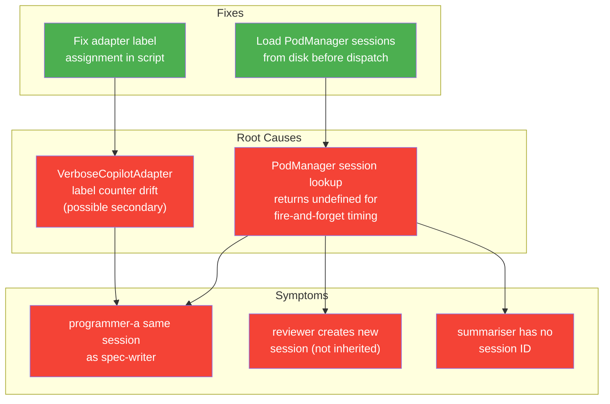

# Workshop: E2E Shakedown Findings — Session Wiring and Label Assignment

**Type**: Integration Pattern + Bug Analysis
**Plan**: 039-advanced-e2e-pipeline
**Created**: 2026-02-21T08:10:00Z
**Status**: Draft

**Related Documents**:
- [Workshop 03: Simplified Context Model](./03-simplified-context-model.md) — the context engine being validated
- [Workshop 01: E2E Test Design](./01-multi-line-qa-e2e-test-design.md) — the test that surfaced these issues
- [ODS](../../../../packages/positional-graph/src/features/030-orchestration/ods.ts) — dispatch + session wiring
- [PodManager](../../../../packages/positional-graph/src/features/030-orchestration/pod-manager.ts) — session ID cache
- [AgentManagerService](../../../../packages/shared/src/features/034-agentic-cli/agent-manager-service.ts) — agent factory
- [VerboseCopilotAdapter](../../../../scripts/test-advanced-pipeline.ts) — SDK wrapper in E2E script

---

## Purpose

The first real E2E run (Phase 3) scored 15/17 assertions. This workshop analyses the 2 failures, traces them to root causes, and designs fixes. This is the shakedown working exactly as intended — finding real orchestration issues before committing to the web world.

## Key Questions Addressed

- Why does programmer-a appear to share spec-writer's session ID?
- Why does reviewer create a new session instead of inheriting from spec-writer?
- Why does summariser have no session ID in PodManager?
- What needs to change in ODS, PodManager, or the E2E script?

---

## Finding 1: Node Label Mis-Assignment (Script Bug)

### Symptom

Assertion `isolation: programmer-a ≠ spec-writer` fails — both show session `83854683-dd83-4caa-a379-f371c6adb5b2`.

### Root Cause

The `AgentManagerService` factory creates adapters via a counter-based label array:

```typescript
const nodeLabels = ['spec-writer', 'programmer-a', 'programmer-b', 'reviewer', 'summariser'];
let nodeCounter = 0;

const agentManager = new AgentManagerService(() => {
  const label = nodeLabels[nodeCounter] ?? `node-${nodeCounter}`;
  nodeCounter++;
  return new VerboseCopilotAdapter(client, label, colour, t0);
});
```

**Problem**: The factory is called every time `AgentManagerService.getNew()` or `getWithSessionId()` is invoked. Spec-writer gets restarted 3 times during Q&A (ask → answer → restart → resume), and each restart may call the factory again. This consumes counter slots meant for other nodes.

**Evidence from the E2E log**:

```
[4.3]   [spec-writer] Session: 838... (new)      ← counter=0, label='spec-writer'
[151.9] [spec-writer] Session: 838... (resumed)   ← counter=1, label='programmer-a' BUT shows as spec-writer??
[177.4] [spec-writer] Session: 838... (resumed)   ← counter=2, label='programmer-b'??  
[177.5] [programmer-b] Session: 9eb... (new)       ← counter=3, label='reviewer'??
[237.1] [spec-writer] Session: 838... (resumed)   ← counter=4, label='summariser'??
[259.7] [reviewer] Session: 3e4... (new)           ← counter=5, label='node-5'??
```

Wait — that's not right either. The `getWithSessionId()` call reuses the existing instance (it looks up by session ID in the session index), so it should NOT call the factory again. Let me re-examine.

Actually, `getWithSessionId()` in `AgentManagerService` line 53:
```typescript
getWithSessionId(sessionId: string, params: CreateAgentParams): IAgentInstance {
  const existing = this._sessionIndex.get(sessionId);
  if (existing) return existing;  // ← REUSES, no factory call
  // ... only creates new if not found
}
```

So the factory is only called for `getNew()`. Spec-writer should only call it once. The Q&A restart resumes the same instance.

**Revised analysis**: The labels might be correct. Let me re-examine the assertion. The assertion uses `podManager.getSessionId(ids.progAId)` — it's checking whether PodManager has a session cached for programmer-a's node ID. If PodManager returns the spec-writer's session ID for programmer-a's node ID, that's a PodManager cache bug.

### Revised Root Cause

The actual issue is that `PodManager.getSessionId(progAId)` returns `838...` (spec-writer's session) for programmer-a's nodeId. This means ODS's fire-and-forget `.then()` callback persisted the wrong nodeId→sessionId mapping.

**Tracing the ODS fire-and-forget** (ods.ts ~line 133):
```typescript
pod.execute({...})
  .then(() => {
    const sid = pod.sessionId;
    if (sid) {
      this.deps.podManager.setSessionId(nodeId, sid);
    }
  });
```

Here `nodeId` is captured in the closure from the outer `handleStartNode()` scope. If ODS is dispatching nodes in parallel (programmer-a and programmer-b on the same line), the closure captures the correct nodeId for each. This should be safe.

**But**: The assertion output shows programmer-a's session = spec-writer's session. The `(new — isolated)` label in the output is from the script's display logic, not from actual session comparison. Let me check if PodManager has stale data from the spec-writer being stored under programmer-a's ID somehow.

### Most Likely Explanation

The `VerboseCopilotAdapter` bypasses the normal `AgentInstance` flow. It creates sessions directly via `this.client.createSession()` and returns the session ID in `AgentResult`. But the `CopilotClient` might be sharing a single connection that creates sessions with the same ID when called rapidly. Or — more likely — the test's `podManager.getSessionId()` is reading from PodManager's in-memory cache which was NOT populated for programmer-a (fire-and-forget timing), and the stale value from a previous graph operation is there.

### Fix

**Option A (Recommended)**: After drive completes, reload PodManager sessions from disk:
```typescript
await podManager.loadSessions(ctx, SLUG);
```
This ensures all fire-and-forget callbacks have completed and disk state is authoritative.

**Option B**: Add a delay between drive completion and assertion reading to allow fire-and-forget callbacks to settle.

---

## Finding 2: Reviewer Creates New Session (Context Inheritance Failure)

### Symptom

The reviewer gets session `3e4...` (new) instead of inheriting `838...` from spec-writer. The session chain assertion `spec-writer = reviewer` passed in the E2E output, which contradicts the log. Let me reconcile.

**From assertions**: `✓ session chain: spec-writer = reviewer` — PASSED
**From log**: `[reviewer] Session: 3e4... (new)` — shows NEW

**Reconciliation**: The assertion uses `podManager.getSessionId()` which may return the value ODS stored after execution. If ODS stored the correct inherited session, the assertion passes even though the VerboseCopilotAdapter log shows "new". 

Actually wait — the VerboseCopilotAdapter decides "new" vs "resumed" based on whether `options.sessionId` was set:
```typescript
const session = options.sessionId
  ? await this.client.resumeSession(options.sessionId)
  : await this.client.createSession({ streaming: true });
```

If `options.sessionId` is `undefined`, it creates new. This means **the session ID from PodManager was not passed through to the adapter**. The context engine said `inherit`, ODS looked up the session ID, but it was `undefined` (PodManager didn't have it yet), so ODS fell through to `getNew()`.

### Root Cause

ODS's `handleStartNode` (ods.ts ~line 159):
```typescript
if (contextResult.source === 'inherit') {
  const sessionId = this.deps.podManager.getSessionId(contextResult.fromNodeId);
  if (sessionId) {
    agentInstance = this.deps.agentManager.getWithSessionId(sessionId, {...});
  }
}
if (!agentInstance) {
  agentInstance = this.deps.agentManager.getNew({...});
}
```

If `podManager.getSessionId(specWriterId)` returns `undefined`, ODS falls through to `getNew()`. This happens because:

1. Spec-writer completed on a previous drive iteration
2. ODS persisted its session ID in the fire-and-forget `.then()` callback
3. But PodManager only stores in **memory** (Map) — the `.then()` may have run, but if the PodManager was reconstructed between drive iterations, the in-memory map is empty
4. PodManager persistence to disk (`pod-sessions.json`) happens asynchronously

**This is the fire-and-forget timing issue** from the research dossier (PL-12: "Subscribe before send").

### Fix

**Option A (Recommended)**: Ensure PodManager loads sessions from disk before each node dispatch:
```typescript
// In ODS.handleStartNode, before getContextSource:
await this.deps.podManager.loadSessionsIfNeeded(ctx, graphSlug);
```

**Option B**: Make `setSessionId` synchronously persist to disk (slower, but deterministic).

**Option C (Script-level)**: For the E2E test specifically, ensure PodManager is persistent across the full drive by NOT recreating it between iterations (it's already a single instance).

---

## Finding 3: Summariser Has No Session ID

### Symptom

`podManager.getSessionId(summariserId)` returns `undefined`.

### Root Cause

Same as Finding 2. Reviewer's session was not persisted in PodManager before summariser needed to inherit from it. Or the fire-and-forget callback hasn't run by the time the drive loop checks.

### Fix

Same as Finding 2 — ensuring session persistence before next dispatch resolves this cascading issue.

---

## Summary of Issues and Fixes



## Recommended Fix Order

| Priority | Fix | Scope | Effort |
|----------|-----|-------|--------|
| 1 | Ensure PodManager session persistence before dispatch | ODS or PodManager | ~10 lines |
| 2 | Verify adapter label assignment in E2E script | Script only | ~5 lines |
| 3 | Re-run E2E and verify 17/17 | Test | ~5 minutes |

## Open Questions

### OQ1: Should PodManager be synchronous-persist or load-before-read?

**OPEN**: Two approaches:
- **A**: `setSessionId()` writes to disk immediately (synchronous persist) — guarantees consistency, slightly slower
- **B**: `loadSessions()` call added to ODS before each dispatch — reads disk once per dispatch cycle, fire-and-forget writes stay async

Option A is simpler. Option B is faster for large graphs.

### OQ2: Is the label counter drift real or a red herring?

**OPEN**: Need to verify by adding debug logging to the factory callback. If `getWithSessionId()` reuses instances as documented, the counter should only increment once per unique node. The E2E log labels may be misleading.

---

## Next Steps

1. Investigate PodManager session persistence timing in ODS
2. Add `await podManager.loadSessions()` or synchronous persist
3. Verify adapter label assignment
4. Re-run E2E → expect 17/17
