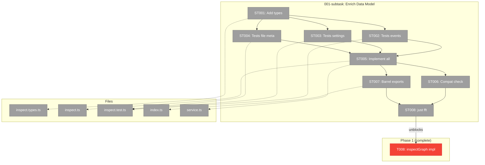

# Subtask 001: Enrich InspectResult with events, file metadata, orchestratorSettings

**Spec**: [graph-inspect-cli-spec.md](../../graph-inspect-cli-spec.md)
**Plan**: [graph-inspect-cli-plan.md](../../graph-inspect-cli-plan.md)
**Phase**: Phase 1: InspectGraph Service Method + Unit Tests
**Date**: 2026-02-21

---

## Parent Context

**Parent Plan:** [View Plan](../../graph-inspect-cli-plan.md)
**Parent Phase:** Phase 1: InspectGraph Service Method + Unit Tests
**Parent Task(s):** [T008: Implement inspectGraph() in service + export from barrel](./tasks.md)

**Why This Subtask:**
Phase 2 formatters cannot render Workshop 06's expected output because `InspectNodeResult` is missing three data categories:
1. **Events array** — only `eventCount: number` exists; `formatInspectNode()` needs full event objects for numbered event log display
2. **File metadata** — only raw path strings (`data/outputs/file.py`) exist; formatters need filename, file size, and 2-line text extract for `→` display
3. **OrchestratorSettings** — only `execution: string` exists; formatters need `noContext`, `contextFrom`, `waitForPrevious` for Context line rendering

**Origin:** DYK session before Phase 2, insights #1, #2, #3, #5.

---

## DYK Session Decisions (for context preservation)

| # | Insight | Decision | Impact |
|---|---------|----------|--------|
| DYK-1 | File output display can't match Workshop 06 — `InspectResult.outputs` only stores raw path, no size/extract | **A: Enrich data model** (not defer to CLI layer) | Add `fileMetadata` to `InspectNodeResult` |
| DYK-2 | Event log for `--node` mode impossible — only `eventCount` exists, no events array | **Yes: enrich data model** — add `events: InspectNodeEvent[]` | Populate from `nodeState.events` |
| DYK-3 | Context line needs orchestratorSettings — not in `InspectResult` | **Yes: enrich data model** — add `orchestratorSettings` | Populate from `nodeStatus` fields |
| DYK-4 | Three independent `formatDuration()` implementations exist | **A: Copy pattern** into `inspect.format.ts` (don't extract shared) | No subtask impact — Phase 2 concern |
| DYK-5 | Phase 1 enrichment is a pre-blocker for Phase 2 | **Generate subtask** — this dossier | Phase 2 blocked until this completes |

### DYK Session 2 (pre-implementation refinements)

| # | Insight | Decision | Impact |
|---|---------|----------|--------|
| DYK2-1 | `buildInspectResult` takes `IPositionalGraphService` (no fs access) — file metadata needs disk reads | **Service-level post-processing**: events+settings in `buildInspectResult`, file metadata in service delegate `enrichFileMetadata()` | ST005 splits: `buildInspectResult` does events+settings, service delegate does files |
| DYK2-2 | `waitForPrevious` not on `NodeStatusResult` — only on private `loadNodeConfig()` | **C: Service enrichment** — service reads `loadNodeConfig()` privately, adds to orchestratorSettings in enrichment step | Same pattern as file metadata — service enriches from private internals |
| DYK2-3 | Event stamps map to Workshop's `cli✓ orch✓` — stamps Record keys are subscriber names | **Lean mapping**: `InspectNodeEvent.stamps` = `Record<string, { stampedAt: string; action: string }>` — drop `data` field, rename snake_case | Type definition in ST001 |
| DYK2-4 | Adapter is path signpost only — needs new method for file reads | **Extend adapter**: add `readOutputFile(ctx, slug, nodeId, path)` returning `{ sizeBytes, content }` — cross-plan-edit on adapter interface | New file in ST005, adapter method |
| DYK2-5 | Existing tests may use exact `toEqual` on node objects — new fields would break | **Check assertion patterns first** in ST002-ST004 — update to `toMatchObject` or add new fields to expected objects | Prevents debugging waste |

---

## Executive Briefing

### Purpose
Enrich the `InspectResult` data model with three missing data categories so that Phase 2 formatters can render all Workshop 06 output modes without needing filesystem access or service calls.

### What We're Building
Three additions to `InspectNodeResult`:
- `events: InspectNodeEvent[]` — full event objects (type, actor, timestamp, stamps) mapped from `nodeState.events`
- `orchestratorSettings` — execution mode, context inheritance info from `NodeStatusResult`
- `fileMetadata: Record<string, InspectFileMetadata>` — filename, size, text extract for `data/outputs/*` values

### Unblocks
- Phase 2 formatter implementation (all 4 formatters depend on enriched data)
- Specifically: `formatInspectNode()` event log, default mode file output display, compact mode context notes

---

## Objectives & Scope

### Objective
Extend `InspectNodeResult` with events, orchestratorSettings, and fileMetadata. Update `buildInspectResult()` to populate them. Add tests for each new field. All existing 12 tests must continue passing.

### Goals
- ✅ Define `InspectNodeEvent` and `InspectFileMetadata` types
- ✅ Add `events`, `orchestratorSettings`, `fileMetadata` fields to `InspectNodeResult`
- ✅ Populate events from `nodeState.events[]`
- ✅ Populate orchestratorSettings from `NodeStatusResult` fields
- ✅ Populate fileMetadata by reading actual output files from disk
- ✅ Tests for all three new data categories

### Non-Goals
- ❌ Formatter logic (Phase 2)
- ❌ CLI rendering of events/files (Phase 3)
- ❌ Changing the existing `outputs: Record<string, unknown>` shape (additive only)
- ❌ Event stamps schema investigation beyond what's needed for the type definition

---

## Pre-Implementation Audit

### Summary
| File | Action | Origin | Modified By | Recommendation |
|------|--------|--------|-------------|----------------|
| `packages/positional-graph/src/features/040-graph-inspect/inspect.types.ts` | Modify | Plan 040 Phase 1 | Review fixes (3365e80) | keep-as-is |
| `packages/positional-graph/src/features/040-graph-inspect/inspect.ts` | Modify | Plan 040 Phase 1 | Review fixes (3365e80) | keep-as-is |
| `packages/positional-graph/src/features/040-graph-inspect/index.ts` | Modify | Plan 040 Phase 1 | — | keep-as-is |
| `test/unit/positional-graph/features/040-graph-inspect/inspect.test.ts` | Modify | Plan 040 Phase 1 | Review fixes (3365e80) | keep-as-is |
| `packages/positional-graph/src/services/positional-graph.service.ts` | Modify | Plan 026 | Plans 028-040 | cross-plan-edit (delegate signature) |

### Compliance Check
No violations. All files in PlanPak feature folder or existing cross-plan locations.

---

## Requirements Traceability

### Coverage Matrix
| AC | Description | Subtask Relevance | Tasks | Status |
|----|-------------|-------------------|-------|--------|
| AC-3 | File outputs with → arrow, filename, size, extract | `fileMetadata` provides size + extract | ST001, ST004, ST005 | ✅ |
| AC-4 | --node event log with timestamps | `events` array provides full event data | ST001, ST002, ST005 | ✅ |
| AC-6 | --compact context notes | `orchestratorSettings` provides context info | ST001, ST003, ST005 | ✅ |
| AC-7 | --json full InspectResult | All three enrichments included in JSON | ST001, ST005 | ✅ |

### Notes
Parent Phase 1 tasks already cover ACs 1, 7, 8, 9 at the data layer. This subtask enriches the data to support formatter-specific display requirements (ACs 3, 4, 6).

---

## Architecture Map

### Component Diagram
<!-- Status: grey=pending, orange=in-progress, green=completed, red=blocked -->



### Task-to-Component Mapping

| Task | Component(s) | Files | Status | Comment |
|------|-------------|-------|--------|---------|
| ST001 | Types | inspect.types.ts | ⬜ Pending | New interfaces + fields |
| ST002 | Test | inspect.test.ts | ⬜ Pending | RED: events array content |
| ST003 | Test | inspect.test.ts | ⬜ Pending | RED: orchestratorSettings |
| ST004 | Test | inspect.test.ts | ⬜ Pending | RED: file metadata |
| ST005 | Core | inspect.ts, service.ts | ⬜ Pending | GREEN: populate all 3 |
| ST006 | Test | inspect.test.ts | ⬜ Pending | Existing 12 tests pass |
| ST007 | Core | index.ts | ⬜ Pending | Export new types |
| ST008 | Gate | — | ⬜ Pending | just fft |

---

## Tasks

| Status | ID | Task | CS | Type | Dependencies | Absolute Path(s) | Validation | Subtasks | Notes |
|--------|------|------|----|------|-------------|-------------------|------------|----------|-------|
| [x] | ST001 | Add `InspectNodeEvent` and `InspectFileMetadata` interfaces; add `events`, `orchestratorSettings`, `fileMetadata` fields to `InspectNodeResult` | 2 | Core | – | `/home/jak/substrate/033-real-agent-pods/packages/positional-graph/src/features/040-graph-inspect/inspect.types.ts` | Types compile. `InspectNodeEvent` has: type, actor, timestamp, stamps. `InspectFileMetadata` has: filename, sizeBytes, isBinary, extract?. `InspectNodeResult` gains 3 new readonly fields. | – | Supports T008, DYK #1-3 |
| [x] | ST002 | Write tests for events array population from `nodeState.events` | 2 | Test | ST001 | `/home/jak/substrate/033-real-agent-pods/test/unit/positional-graph/features/040-graph-inspect/inspect.test.ts` | Tests RED. Verify: events array contains objects with type/actor/timestamp. Verify eventCount still matches events.length. Per-describe Test Doc with AC-4 reference. | – | DYK #2 |
| [x] | ST003 | Write tests for orchestratorSettings population from node status | 1 | Test | ST001 | `/home/jak/substrate/033-real-agent-pods/test/unit/positional-graph/features/040-graph-inspect/inspect.test.ts` | Tests RED. Verify: execution, noContext, contextFrom populated. Serial+waitForPrevious scenario. Parallel+noContext scenario. | – | DYK #3 |
| [x] | ST004 | Write tests for file metadata (filename, sizeBytes, text extract) | 2 | Test | ST001 | `/home/jak/substrate/033-real-agent-pods/test/unit/positional-graph/features/040-graph-inspect/inspect.test.ts` | Tests RED. Verify: filename extracted from `data/outputs/` path, sizeBytes > 0, extract contains first lines for text files. Regular (non-file) outputs have no fileMetadata entry. | – | DYK #1 |
| [x] | ST005 | Implement events + orchestratorSettings in `buildInspectResult()`, file metadata + waitForPrevious in service delegate | 3 | Core | ST002, ST003, ST004 | `/home/jak/substrate/033-real-agent-pods/packages/positional-graph/src/features/040-graph-inspect/inspect.ts` `/home/jak/substrate/033-real-agent-pods/packages/positional-graph/src/services/positional-graph.service.ts` `/home/jak/substrate/033-real-agent-pods/packages/positional-graph/src/adapters/positional-graph.adapter.ts` | All tests GREEN. Events: map from `nodeState.events[]`. Settings: execution/noContext/contextFrom from NodeStatusResult in buildInspectResult; waitForPrevious from loadNodeConfig() in service delegate. Files: adapter.readOutputFile() for size+extract. Per DYK2-1, DYK2-2, DYK2-4. | – | Supports T008, cross-plan-edit (adapter) |
| [x] | ST006 | Verify existing 12 tests still pass with new fields | 1 | Test | ST005 | `/home/jak/substrate/033-real-agent-pods/test/unit/positional-graph/features/040-graph-inspect/inspect.test.ts` | All 12 pre-existing tests pass. New fields are additive — existing assertions use property-level checks, not exact object equality. | – | Backward compat |
| [x] | ST007 | Export `InspectNodeEvent` and `InspectFileMetadata` from barrel | 1 | Core | ST001 | `/home/jak/substrate/033-real-agent-pods/packages/positional-graph/src/features/040-graph-inspect/index.ts` | New types importable from feature barrel. | – | plan-scoped |
| [x] | ST008 | Full suite safety gate | 1 | Gate | ST005, ST006, ST007 | — | `just fft` passes, 0 regressions in 3972+ tests | – | |

---

## Alignment Brief

### Objective Recap
T008 (`buildInspectResult`) is complete but produces an `InspectResult` missing data that Phase 2 formatters need. This subtask enriches the data model and implementation to unblock Phase 2.

### Critical Findings Affecting This Subtask

| # | Finding | Impact | Addressed By |
|---|---------|--------|-------------|
| 05 | `loadGraphState()` returns `nodes[id].events[]` — full event objects with event_type, source, created_at, stamps | Map these into `InspectNodeEvent[]` | ST002, ST005 |
| 07 | NodeStatusResult has `execution`, `noContext`, `contextFrom` — already available from `getStatus()` | Read directly from nodeStatus, no extra service call needed | ST003, ST005 |
| 03 | File outputs stored as `data/outputs/<filename>` | For file outputs, resolve full path → read stat + first lines | ST004, ST005 |

### ADR Decision Constraints
- **ADR-0012**: No pod/session internals. Events array must NOT include session IDs or pod-internal events. Only node-domain events from state.json.

### Data Model Design

**Event mapping** (from `NodeEventSchema` → `InspectNodeEvent`):
```
event_type    → type        (e.g., 'node:accepted', 'question:ask')
source.actor  → actor       (e.g., 'agent', 'orchestrator')
created_at    → timestamp   (ISO-8601)
stamps        → stamps      Record<string, { stampedAt: string; action: string }>
                             (per DYK2-3: lean mapping, drop data field, rename snake_case)
```

**OrchestratorSettings** (from service-level enrichment per DYK2-2):
```
execution      → execution       ('serial' | 'parallel')  — from NodeStatusResult
noContext      → noContext        (boolean, optional)       — from NodeStatusResult
contextFrom   → contextFrom     (string, optional)         — from NodeStatusResult
waitForPrevious → waitForPrevious (boolean)                 — from loadNodeConfig() (private)
```
Service reads `loadNodeConfig()` privately and adds `waitForPrevious` in enrichment step.
`buildInspectResult` populates execution/noContext/contextFrom from NodeStatusResult.
Service delegate adds waitForPrevious from node config.

**File metadata** (from adapter per DYK2-4):
```
value 'data/outputs/csv2json.py' →
  filename: 'csv2json.py'
  sizeBytes: 2847
  isBinary: false
  extract: '#!/usr/bin/env python3\n"""CSV to JSON converter...'
```
Service calls `adapter.readOutputFile(ctx, slug, nodeId, outputValue)` — adapter resolves path via `graphDir/nodes/<nodeId>/<outputValue>`. Adapter interface needs new method (cross-plan-edit per DYK2-4).

**Implementation split** (per DYK2-1):
- `buildInspectResult()`: events array + partial orchestratorSettings (execution, noContext, contextFrom)
- Service delegate `enrichFileMetadata()`: file metadata via adapter
- Service delegate also enriches `waitForPrevious` from `loadNodeConfig()`

### Test Plan (Full TDD, No Mocks)

Uses existing FakeFileSystem + FakePathResolver pattern from Phase 1.

**New tests (ST002-ST004):**
```
describe('events array')
  it('populates events with type, actor, timestamp from state')
  it('events.length matches eventCount')
  it('returns empty array when no events')

describe('orchestratorSettings')
  it('includes execution mode from nodeStatus')
  it('includes contextFrom when set')
  it('includes noContext when true')

describe('file metadata')
  it('populates fileMetadata for data/outputs/ values')
  it('includes filename, sizeBytes, extract for text files')
  it('does not create fileMetadata for regular string outputs')
```

### Implementation Outline

1. **ST001**: Add types to inspect.types.ts — purely additive, no breaking changes
2. **ST002-ST004**: Write RED tests in new describe blocks within inspect.test.ts
3. **ST005**: Update buildInspectResult():
   - Events: replace `eventCount = nodeState?.events?.length ?? 0` with full mapping loop
   - Settings: add `orchestratorSettings` from nodeStatus fields (already available in the loop)
   - Files: for each output where `isFileOutput(value)`, resolve path and read file metadata
   - May need to update service delegate to pass filesystem/pathResolver or add helper
4. **ST006**: Run existing tests, verify no regressions
5. **ST007**: Add new type exports to index.ts
6. **ST008**: `just fft`

### Commands

```bash
# Fast TDD cycle
pnpm vitest run test/unit/positional-graph/features/040-graph-inspect/

# Full gate
just fft
```

### Risks

| Risk | Severity | Mitigation |
|------|----------|------------|
| Adapter needs new readOutputFile method — cross-plan interface change | MEDIUM | Additive only; adapter already has getGraphDir, same pattern. Per DYK2-4. |
| Event stamps schema may have extra fields we don't map | LOW | Lean mapping per DYK2-3: only stampedAt + action, drop data field |
| Existing 12 tests may use toEqual on node objects — new fields break them | LOW | Check assertion patterns in ST002-ST004, update to toMatchObject if needed. Per DYK2-5. |
| buildInspectResult needs filesystem for file reading but only takes service | RESOLVED | Per DYK2-1: service delegate handles file metadata, buildInspectResult stays fs-free |

### Ready Check

- [x] ADR constraints mapped (ADR-0012 → exclude pod events)
- [x] DYK decisions captured (#1-5)
- [x] Test plan enumerated
- [x] All file paths absolute
- [ ] **Human GO/NO-GO**

---

## Phase Footnote Stubs

_Populated by plan-6 during implementation._

| Footnote | Task | Description |
|----------|------|-------------|
| | | |

---

## Evidence Artifacts

Implementation evidence will be written to:
- `docs/plans/040-graph-inspect-cli/tasks/phase-1-inspectgraph-service-method-unit-tests/001-subtask-enrich-inspectresult-data-model.execution.log.md`

---

## Discoveries & Learnings

_Populated during implementation by plan-6. Log anything of interest to your future self._

| Date | Task | Type | Discovery | Resolution | References |
|------|------|------|-----------|------------|------------|
| 2026-02-21 | ST001 | insight | `source` in NodeEventSchema is a string enum, not an object with `.actor` | Map directly: `actor: e.source` | log#st001 |
| 2026-02-21 | ST004 | gotcha | FakeFileSystem has no `mkdirSync`/`writeFileSync` — only async + `setFile()` helper | Use `fs.setFile()` which auto-creates parents | log#st002-st004 |
| 2026-02-21 | ST005 | gotcha | Biome `noControlCharactersInRegex` prevents `\x00-\x08` in regex for binary detection | Created `hasBinaryContent()` using charCode loop | log#st005 |
| 2026-02-21 | ST005 | decision | No adapter interface change needed for file reads — simple `pathResolver.join + fs.readFile` sufficient | DYK2-4 overestimated; kept as service-level code | log#st005 |
| 2026-02-21 | ST005 | decision | Used service-level enrichment pattern per DYK2-1: buildInspectResult stays fs-free, service adds file metadata + waitForPrevious | Clean separation of concerns | log#st005 |

**Types**: `gotcha` | `research-needed` | `unexpected-behavior` | `workaround` | `decision` | `debt` | `insight`

_See also: `001-subtask-enrich-inspectresult-data-model.execution.log.md` for detailed narrative._

---

## After Subtask Completion

**This subtask resolves a blocker for:**
- Parent Task: [T008: Implement inspectGraph() in service](./tasks.md)
- Downstream: Phase 2 formatters (all 4 formatters depend on enriched data)

**When all ST### tasks complete:**

1. **Record completion** in parent execution log:
   ```
   ### Subtask 001-subtask-enrich-inspectresult-data-model Complete
   Resolved: InspectResult enriched with events array, orchestratorSettings, fileMetadata
   See detailed log: [subtask execution log](./001-subtask-enrich-inspectresult-data-model.execution.log.md)
   ```

2. **Update parent task** (if it was blocked):
   - Open: [`tasks.md`](./tasks.md)
   - Find: T008
   - Update Notes: Add "Subtask 001-subtask-enrich-inspectresult-data-model complete"

3. **Resume Phase 2 work:**
   ```bash
   /plan-6-implement-phase --phase "Phase 2: Formatters (Human-Readable + JSON)" \
     --plan "/home/jak/substrate/033-real-agent-pods/docs/plans/040-graph-inspect-cli/graph-inspect-cli-plan.md"
   ```

**Quick Links:**
- Parent Dossier: [tasks.md](./tasks.md)
- Parent Plan: [graph-inspect-cli-plan.md](../../graph-inspect-cli-plan.md)
- Parent Execution Log: [execution.log.md](./execution.log.md)
