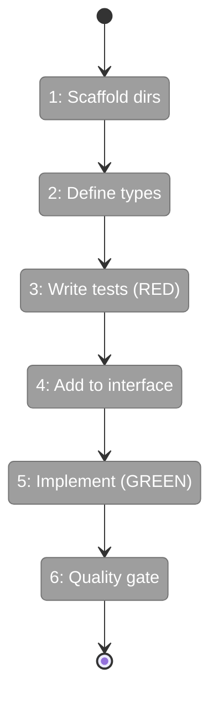
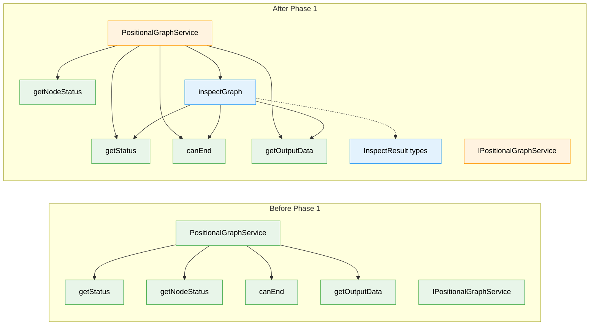

# Flight Plan: Phase 1 — InspectGraph Service Method + Unit Tests

**Plan**: [graph-inspect-cli-plan.md](../../graph-inspect-cli-plan.md)
**Phase**: Phase 1: InspectGraph Service Method + Unit Tests
**Generated**: 2026-02-21
**Status**: Ready for takeoff

---

## Departure → Destination

**Where we are**: The Chainglass CLI has `cg wf status` for compact dashboard views and `cg wf node collate` for agent-facing input resolution. To see output values, event history, or input wiring, a developer must manually read `state.json`, `data.json`, and `node.yaml` files across the workspace. There is no unified data access method for graph inspection.

**Where we're going**: By the end of this phase, `service.inspectGraph(ctx, 'my-graph')` returns a single `InspectResult` object containing every node's status, timing, input wiring, output values, event counts, and questions. A developer (or downstream formatter) can render any view of a graph from this one call.

---

## Flight Status

<!-- Updated by /plan-6: pending → active → done. Use blocked for problems/input needed. -->

**Legend**: grey = pending | yellow = active | red = blocked/needs input | green = done

---

## Stages

<!-- Updated by /plan-6 during implementation: [ ] → [~] → [x] -->

- [ ] **Stage 1: Create feature and test directories** — scaffold PlanPak folders for the new feature (`features/040-graph-inspect/`, `test/.../040-graph-inspect/` — new dirs)
- [ ] **Stage 2: Define InspectResult types** — create the data model that all formatters and CLI modes will consume (`inspect.types.ts` — new file)
- [ ] **Stage 3: Write failing tests for all scenarios** — TDD RED phase covering complete graphs, in-progress states, errors, file outputs, and Q&A (`inspect.test.ts` — new file)
- [ ] **Stage 4: Add inspectGraph to service interface** — extend IPositionalGraphService with the new method signature (`positional-graph-service.interface.ts`)
- [ ] **Stage 5: Implement inspectGraph** — compose existing service reads into a single unified method that passes all tests (`inspect.ts` — new file, `positional-graph.service.ts`)
- [ ] **Stage 6: Full quality gate** — run `just fft` to confirm zero regressions across all 3960+ existing tests

---

## Acceptance Criteria

- [ ] `inspectGraph()` returns per-node sections with status, timing, inputs, and outputs (data layer for AC-1)
- [ ] InspectResult schema defined for JSON output (data layer for AC-7)
- [ ] In-progress nodes show elapsed time, pending nodes show waiting reason (AC-8)
- [ ] Failed nodes include error code and message (AC-9)

---

## Goals & Non-Goals

**Goals**:
- Define `InspectResult` and `InspectNodeResult` TypeScript interfaces
- Implement `inspectGraph()` composing existing service methods
- Add `inspectGraph()` to `IPositionalGraphService` interface
- Full unit test coverage: complete, in-progress, error, file output, Q&A scenarios

**Non-Goals**:
- Formatters / human-readable rendering (Phase 2)
- CLI command registration (Phase 3)
- JSON envelope wrapping via OutputAdapter (Phase 3)
- E2E validation with real pipeline (Phase 4)

---

## Architecture: Before & After

**Legend**: existing (green, unchanged) | changed (orange, modified) | new (blue, created)

---

## Checklist

- [ ] T001: Create feature and test directories (CS-1)
- [ ] T002: Define InspectResult and InspectNodeResult types (CS-2)
- [ ] T003: Write unit tests — complete 6-node graph (CS-3)
- [ ] T004: Write unit tests — in-progress graph (CS-2)
- [ ] T005: Write unit tests — error states (CS-2)
- [ ] T006: Write unit tests — file output detection (CS-2)
- [ ] T007: Add inspectGraph() to IPositionalGraphService (CS-1)
- [ ] T008: Implement inspectGraph() in service (CS-3)
  - [ ] **Subtask 001**: Enrich InspectResult data model (events, file metadata, orchestratorSettings)
    - [ ] ST001: Add InspectNodeEvent + InspectFileMetadata types (CS-2)
    - [ ] ST002: Tests for events array (CS-2)
    - [ ] ST003: Tests for orchestratorSettings (CS-1)
    - [ ] ST004: Tests for file metadata (CS-2)
    - [ ] ST005: Implement population in buildInspectResult (CS-3)
    - [ ] ST006: Verify backward compat (CS-1)
    - [ ] ST007: Export new types (CS-1)
    - [ ] ST008: just fft (CS-1)
- [ ] T009: Full quality gate — just fft (CS-1)

---

## PlanPak

Active — files organized under `features/040-graph-inspect/`
