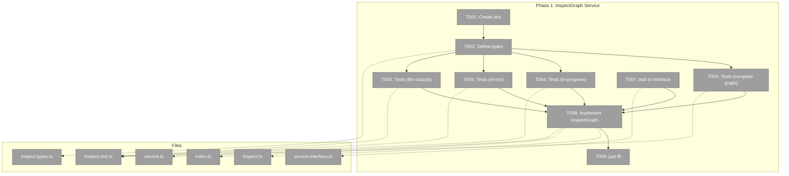

# Phase 1: InspectGraph Service Method + Unit Tests — Tasks & Alignment Brief

**Spec**: [graph-inspect-cli-spec.md](../../graph-inspect-cli-spec.md)
**Plan**: [graph-inspect-cli-plan.md](../../graph-inspect-cli-plan.md)
**Date**: 2026-02-21

---

## Executive Briefing

### Purpose
This phase defines the `InspectResult` data model and implements `inspectGraph()` on the positional graph service — the foundation for all inspect output modes. Without this, there's no way to get a unified view of nodes, their state, timing, inputs, outputs, and events through a single call.

### What We're Building
An `inspectGraph(ctx, graphSlug)` method that:
- Loads the graph definition, state, and each node's config and outputs in one pass
- Returns a structured `InspectResult` with per-node details: status, timing, input wiring, output values (data + file paths), event counts, and questions
- Composes existing service methods (`getStatus`, `canEnd`, `getOutputData`, `loadGraphState`, `loadNodeConfig`) — no new data access patterns

### User Value
Downstream phases (formatters, CLI, E2E) can render any view of the graph from a single `InspectResult` object — the single source of truth for graph inspection.

### Example
```typescript
const result = await service.inspectGraph(ctx, 'advanced-pipeline');
// result.nodes[0] → { nodeId: 'spec-writer-e66', status: 'complete',
//   durationMs: 198702, outputs: { language_1: 'Python', spec: '...' },
//   eventCount: 6, questions: [{ questionId: '...', answered: true }] }
```

---

## Objectives & Scope

### Objective
Define InspectResult types and implement inspectGraph() with full test coverage, satisfying the data requirements for spec ACs 1, 7, 8, 9.

### Goals

- ✅ Define `InspectResult` and `InspectNodeResult` TypeScript interfaces
- ✅ Implement `inspectGraph()` composing existing service methods
- ✅ Add `inspectGraph()` to `IPositionalGraphService` interface
- ✅ Unit tests covering: complete graph, in-progress graph, error states, file outputs, Q&A
- ✅ Export from feature barrel (`index.ts`)

### Non-Goals

- ❌ Formatters (Phase 2)
- ❌ CLI command registration (Phase 3)
- ❌ Human-readable output rendering (Phase 2)
- ❌ JSON envelope wrapping (Phase 3 — uses existing OutputAdapter)
- ❌ Contract tests for IPositionalGraphService (existing gap, not introduced by this plan)
- ❌ File size or content reading (that's a formatter concern — inspectGraph returns the path only)

---

## Pre-Implementation Audit

### Summary
| File | Action | Origin | Modified By | Recommendation |
|------|--------|--------|-------------|----------------|
| `packages/positional-graph/src/features/040-graph-inspect/` | Create | New | — | keep-as-is |
| `packages/positional-graph/src/features/040-graph-inspect/inspect.types.ts` | Create | New | — | keep-as-is |
| `packages/positional-graph/src/features/040-graph-inspect/inspect.ts` | Create | New | — | keep-as-is |
| `packages/positional-graph/src/features/040-graph-inspect/index.ts` | Create | New | — | keep-as-is |
| `test/unit/positional-graph/features/040-graph-inspect/inspect.test.ts` | Create | New | — | keep-as-is |
| `packages/positional-graph/src/interfaces/positional-graph-service.interface.ts` | Modify | Plan 026 | Plans 028, 030, 032, 039 | cross-plan-edit |
| `packages/positional-graph/src/services/positional-graph.service.ts` | Modify | Plan 026 | Plans 028, 030, 032, 039 | cross-plan-edit |

### Compliance Check
No violations found. All new files placed in PlanPak feature folder. Cross-plan edits are additive only (new method, no changes to existing).

---

## Requirements Traceability

### Coverage Matrix
| AC | Description | Files in Flow | Tasks | Status |
|----|-------------|---------------|-------|--------|
| AC-1 | Graph topology header + per-node sections | inspect.ts, inspect.types.ts | T003, T007 | ✅ Complete (data layer) |
| AC-7 | JSON output with InspectResult schema | inspect.types.ts | T002 | ✅ Complete (types defined) |
| AC-8 | In-progress: running nodes with elapsed, pending with wait reason | inspect.ts, inspect.types.ts | T004, T007 | ✅ Complete |
| AC-9 | Failed nodes show error code and message | inspect.ts, inspect.types.ts | T005, T007 | ✅ Complete |

### Notes
ACs 2-6, 10-11 are formatter/CLI concerns (Phases 2-3). This phase provides the data layer they consume.

### Orphan Files
None — all files map to ACs.

---

## Architecture Map

### Component Diagram
<!-- Status: grey=pending, orange=in-progress, green=completed, red=blocked -->
<!-- Updated by plan-6 during implementation -->



### Task-to-Component Mapping

| Task | Component(s) | Files | Status | Comment |
|------|-------------|-------|--------|---------|
| T001 | Setup | feature + test dirs | ⬜ Pending | PlanPak scaffold |
| T002 | Types | inspect.types.ts | ⬜ Pending | InspectResult + InspectNodeResult |
| T003 | Test | inspect.test.ts | ⬜ Pending | RED: complete graph, outputs, inputs |
| T004 | Test | inspect.test.ts | ⬜ Pending | RED: running/pending/Q&A nodes |
| T005 | Test | inspect.test.ts | ⬜ Pending | RED: blocked-error, missing units |
| T006 | Test | inspect.test.ts | ⬜ Pending | RED: file outputs vs data values |
| T007 | Interface | service.interface.ts | ⬜ Pending | Add method signature |
| T008 | Core | inspect.ts, service.ts, index.ts | ⬜ Pending | GREEN: implement to pass all tests |
| T009 | Gate | — | ⬜ Pending | just fft safety check |

---

## Tasks

| Status | ID | Task | CS | Type | Dependencies | Absolute Path(s) | Validation | Subtasks | Notes |
|--------|------|------|----|------|-------------|-------------------|------------|----------|-------|
| [ ] | T001 | Create feature directory and test directory | 1 | Setup | – | `/home/jak/substrate/033-real-agent-pods/packages/positional-graph/src/features/040-graph-inspect/` `/home/jak/substrate/033-real-agent-pods/test/unit/positional-graph/features/040-graph-inspect/` | Dirs exist | – | plan-scoped |
| [ ] | T002 | Define `InspectResult` and `InspectNodeResult` types in `inspect.types.ts` | 2 | Core | T001 | `/home/jak/substrate/033-real-agent-pods/packages/positional-graph/src/features/040-graph-inspect/inspect.types.ts` | Types compile; match Workshop 06 schema: nodeId, unitSlug, unitType, lineIndex, position, status, startedAt, completedAt, durationMs, orchestratorSettings, inputs map, outputs map, outputCount, eventCount, questions array | – | plan-scoped |
| [ ] | T003 | Write unit tests: inspectGraph() on complete 6-node graph | 3 | Test | T002 | `/home/jak/substrate/033-real-agent-pods/test/unit/positional-graph/features/040-graph-inspect/inspect.test.ts` | Tests RED. Cover: 6 nodes all complete, output values present, event counts correct, input wiring (from_node/from_output), duration computed, graph-level totals. Test Doc per R-TEST-002. | – | Per Finding #04 (canEnd for output names) |
| [ ] | T004 | Write unit tests: inspectGraph() on in-progress graph | 2 | Test | T002 | `/home/jak/substrate/033-real-agent-pods/test/unit/positional-graph/features/040-graph-inspect/inspect.test.ts` | Tests RED. Cover: running node with startedAt but no completedAt, pending node with status='pending', node in waiting-question with pendingQuestion fields, durationMs undefined for pending | – | Per Finding #05 (state for events) |
| [ ] | T005 | Write unit tests: inspectGraph() on error states | 2 | Test | T002 | `/home/jak/substrate/033-real-agent-pods/test/unit/positional-graph/features/040-graph-inspect/inspect.test.ts` | Tests RED. Cover: blocked-error node with error code+message, work unit not found → unitType 'unknown' graceful fallback, graph with mix of complete and failed nodes | – | Per spec AC-9 |
| [ ] | T006 | Write unit tests: file output detection | 2 | Test | T002 | `/home/jak/substrate/033-real-agent-pods/test/unit/positional-graph/features/040-graph-inspect/inspect.test.ts` | Tests RED. Cover: output value starting with `data/outputs/` identified as file output, regular string value not misidentified, mixed data+file outputs on same node | – | Per Finding #03 (data/outputs/ prefix) |
| [ ] | T007 | Add `inspectGraph()` to `IPositionalGraphService` interface | 1 | Core | T002 | `/home/jak/substrate/033-real-agent-pods/packages/positional-graph/src/interfaces/positional-graph-service.interface.ts` | Interface compiles; method signature: `inspectGraph(ctx: WorkspaceContext, graphSlug: string): Promise<InspectResult>` | – | cross-plan-edit |
| [ ] | T008 | Implement `inspectGraph()` in service + export from barrel | 3 | Core | T003, T004, T005, T006, T007 | `/home/jak/substrate/033-real-agent-pods/packages/positional-graph/src/features/040-graph-inspect/inspect.ts` `/home/jak/substrate/033-real-agent-pods/packages/positional-graph/src/features/040-graph-inspect/index.ts` `/home/jak/substrate/033-real-agent-pods/packages/positional-graph/src/services/positional-graph.service.ts` | All tests from T003-T006 pass (GREEN). Compose: getStatus + loadGraphState + loadNodeConfig + canEnd + getOutputData + workUnitLoader.load per node. Use Promise.all for batching (Finding #09). | – | cross-plan-edit (service.ts), plan-scoped (inspect.ts, index.ts) |
| [ ] | T009 | Compile check + full test suite | 1 | Gate | T008 | — | `just fft` passes, 0 regressions in existing 3960+ tests | – | Safety gate |

**Fast TDD command**: `pnpm vitest run test/unit/positional-graph/features/040-graph-inspect/` (run after each RED→GREEN cycle; `just fft` only at phase end)

---

## Alignment Brief

### Critical Findings Affecting This Phase

| # | Finding | Impact | Addressed By |
|---|---------|--------|-------------|
| 01 | ADR-0012: no Pod Domain internals in output | InspectResult must NOT include sessionId, pod state | T002 (type excludes it) |
| 03 | File outputs stored as `data/outputs/<filename>` relative path | Need `isFileOutput()` helper to distinguish from data values | T006 (tests), T008 (impl) |
| 04 | `canEnd()` returns `savedOutputs[]` — efficient output name discovery | Use canEnd first, then getOutputData per name | T003 (tests verify pattern), T008 (impl) |
| 05 | `loadGraphState()` returns `nodes[id].events[]` and `questions[]` | Need raw state for event counts and Q&A | T004 (tests), T008 (impl) |
| 07 | Node config has inputs wiring and orchestratorSettings | Load via `loadNodeConfig()` for input display | T003 (tests), T008 (impl) |
| 09 | Work unit type from `workUnitLoader.load()` — async per node | Batch with Promise.all | T008 (impl) |

### ADR Decision Constraints

- **ADR-0006**: CLI Consumer Domain — inspect is read-only, no orchestration logic. Affects Phase 3 mainly, but InspectResult must be structured for thin CLI wrapper.
- **ADR-0012**: No pod/session internals. InspectResult MUST NOT include session IDs, pod state, or agent adapter details. Constrains T002 type design.

### PlanPak Placement Rules

- `inspect.types.ts`, `inspect.ts`, `index.ts` → `features/040-graph-inspect/` (plan-scoped)
- `inspect.test.ts` → `test/unit/positional-graph/features/040-graph-inspect/` (plan-scoped)
- `positional-graph-service.interface.ts` → stays in `interfaces/` (cross-plan-edit)
- `positional-graph.service.ts` → stays in `services/` (cross-plan-edit)

### Test Plan (Full TDD, Fakes Only)

**Test setup**: Real `PositionalGraphService` with `FakeFileSystem`. Pre-populate fake FS with:
- `graph.yaml` — graph definition with lines/nodes
- `node.yaml` — per node config with inputs/orchestratorSettings
- `state.json` — node execution states, events, questions
- `data/data.json` — per node output data (values + file refs)

**Named tests** (T003-T006):

```
describe('inspectGraph')
  describe('complete graph')
    it('returns all 6 nodes with status complete')
    it('computes durationMs from startedAt/completedAt')
    it('returns output values from data.json')
    it('returns input wiring from node.yaml')
    it('counts events per node from state.json')
    it('returns graph-level totals (completedNodes, totalNodes)')

  describe('in-progress graph')
    it('returns running node with startedAt, no completedAt, no durationMs')
    it('returns pending node with status pending')
    it('returns waiting-question node with question details')

  describe('error states')
    it('returns blocked-error node with error code and message')
    it('returns unitType unknown when work unit not found')

  describe('file outputs')
    it('detects data/outputs/ prefix as file output')
    it('does not misidentify regular string as file output')
```

### Implementation Outline

1. **T001**: `mkdir -p` for feature + test dirs
2. **T002**: Define types in `inspect.types.ts`, export from `index.ts`
3. **T003-T006**: Write all test files (RED) — tests call `service.inspectGraph()` which doesn't exist yet
4. **T007**: Add `inspectGraph()` signature to interface
5. **T008**: Implement `inspectGraph()`:
   - Call `getStatus()` for graph-level data
   - Call `loadGraphState()` for events + questions
   - For each node: `loadNodeConfig()` + `canEnd()` + per-output `getOutputData()` + `workUnitLoader.load()` (batched with Promise.all)
   - Assemble `InspectNodeResult` per node
   - Return `InspectResult`
6. **T009**: `just fft` — safety gate

### Commands

```bash
# Fast TDD cycle
pnpm vitest run test/unit/positional-graph/features/040-graph-inspect/

# Full gate
just fft
```

### Risks

| Risk | Severity | Mitigation |
|------|----------|------------|
| N+1 getOutputData calls per node | LOW | Promise.all batching; graphs < 20 nodes |
| Work unit not found | LOW | Graceful fallback: unitType = 'unknown' |
| State.json missing node entries | LOW | Default to empty events/pending status |

### Ready Check

- [x] ADR constraints mapped (ADR-0006, ADR-0012 → T002)
- [x] Critical findings mapped (6 of 11 affect this phase)
- [x] Test plan enumerated with named tests
- [x] All file paths absolute
- [x] PlanPak classifications assigned
- [ ] **Human GO/NO-GO**

---

## Phase Footnote Stubs

_Populated by plan-6 during implementation._

| Footnote | Task | Description |
|----------|------|-------------|
| | | |

---

## Evidence Artifacts

Implementation evidence will be written to:
- `docs/plans/040-graph-inspect-cli/tasks/phase-1-inspectgraph-service-method-unit-tests/execution.log.md`

---

## Discoveries & Learnings

_Populated during implementation by plan-6. Log anything of interest to your future self._

| Date | Task | Type | Discovery | Resolution | References |
|------|------|------|-----------|------------|------------|
| | | | | | |

**Types**: `gotcha` | `research-needed` | `unexpected-behavior` | `workaround` | `decision` | `debt` | `insight`

**What to log**:
- Things that didn't work as expected
- External research that was required
- Implementation troubles and how they were resolved
- Gotchas and edge cases discovered
- Decisions made during implementation
- Technical debt introduced (and why)
- Insights that future phases should know about

_See also: `execution.log.md` for detailed narrative._

---

## Directory Layout

```
docs/plans/040-graph-inspect-cli/
  ├── graph-inspect-cli-spec.md
  ├── graph-inspect-cli-plan.md
  ├── workshops/
  │   └── 06-graph-inspect-cli-command.md → (symlink to plan 039)
  └── tasks/
      └── phase-1-inspectgraph-service-method-unit-tests/
          ├── tasks.md              ← this file
          ├── tasks.fltplan.md      ← generated by /plan-5b
          └── execution.log.md     ← created by /plan-6
```
