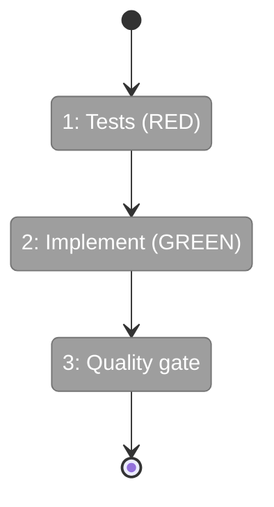
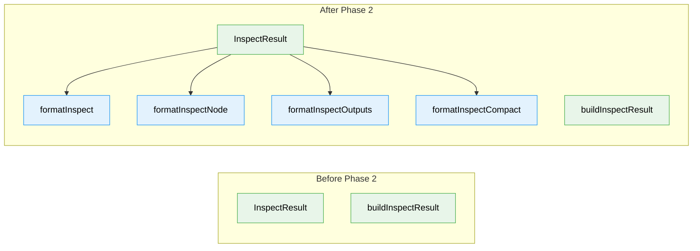

# Flight Plan: Phase 2 — Formatters (Human-Readable + JSON)

**Plan**: [graph-inspect-cli-plan.md](../../graph-inspect-cli-plan.md)
**Phase**: Phase 2: Formatters (Human-Readable + JSON)
**Generated**: 2026-02-21
**Status**: Ready for takeoff

---

## Departure → Destination

**Where we are**: Phase 1 delivered `inspectGraph()` which returns a structured `InspectResult` with per-node status, timing, inputs, outputs, events, and errors. The data exists but there's no way to render it — calling `inspectGraph()` gives raw objects, not human-readable output.

**Where we're going**: By the end of this phase, four pure formatter functions transform `InspectResult` into readable text for every use case: full dump, single-node deep dive, outputs-only, and compact one-liner. A developer can see exactly what they need at the right level of detail.

---

## Flight Status

**Legend**: grey = pending | yellow = active | red = blocked/needs input | green = done

---

## Stages

- [ ] **Stage 1: Write failing tests for all 4 formatters + helpers** — TDD RED phase covering default, --node, --outputs, --compact, file outputs, and in-progress/error states (`inspect-format.test.ts` — new file)
- [ ] **Stage 2: Implement all formatters** — pure functions: InspectResult → string, with truncation, duration formatting, glyph mapping, and file output detection (`inspect.format.ts` — new file)
- [ ] **Stage 3: Full quality gate** — `just fft` confirms zero regressions across all 3970+ tests

---

## Acceptance Criteria

- [ ] Default mode matches Workshop 06 sample output structure (AC-1, AC-2)
- [ ] File outputs display with `→`, filename, size, extract (AC-3)
- [ ] `--node` mode shows full values + event log + raw node.yaml (AC-4)
- [ ] `--outputs` mode groups by node, 40-char truncation (AC-5)
- [ ] `--compact` produces one line per node (AC-6)
- [ ] In-progress and error states render correctly (AC-8, AC-9)

## Goals & Non-Goals

**Goals**:
- 4 formatter functions: default, node, outputs, compact
- Helper functions: truncate, formatDuration, formatFileSize, formatOutputValue
- Reuse glyphs from reality.format.ts (✅ ❌ 🔶 ⏸️ ⬜ ⚪)

**Non-Goals**:
- CLI command registration (Phase 3)
- JSON envelope wrapping (Phase 3)
- ANSI color codes (per OutputAdapter contract)
- Reading file contents from disk (CLI-layer concern)

---

## Architecture: Before & After

**Legend**: existing (green, unchanged) | new (blue, created)

---

## Checklist

- [ ] T001: Write tests — default mode (CS-2)
- [ ] T002: Write tests — --node deep dive (CS-2)
- [ ] T003: Write tests — --outputs mode (CS-2)
- [ ] T004: Write tests — --compact mode (CS-1)
- [ ] T005: Write tests — file output display (CS-2)
- [ ] T006: Write tests — in-progress + error rendering (CS-1)
- [ ] T007: Implement all formatters + update barrel (CS-3)
- [ ] T008: Full quality gate — just fft (CS-1)

---

## PlanPak

Active — files organized under `features/040-graph-inspect/`
