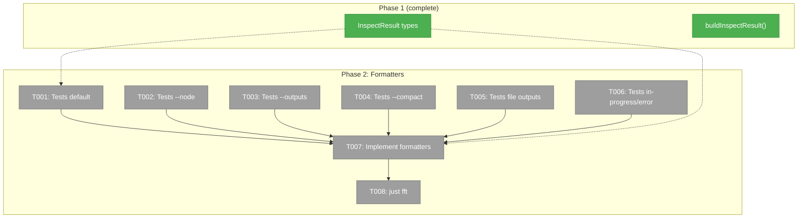

# Phase 2: Formatters (Human-Readable + JSON) — Tasks & Alignment Brief

**Spec**: [graph-inspect-cli-spec.md](../../graph-inspect-cli-spec.md)
**Plan**: [graph-inspect-cli-plan.md](../../graph-inspect-cli-plan.md)
**Date**: 2026-02-21

---

## Executive Briefing

### Purpose
Phase 1 gave us `inspectGraph()` which returns raw `InspectResult` data. This phase transforms that data into 4 human-readable output formats — the "views" that make `cg wf inspect` useful. Without formatters, the data exists but can't be displayed.

### What We're Building
Four pure formatter functions in `inspect.format.ts`:
- `formatInspect(result)` — full graph dump with topology header, per-node sections, truncated outputs
- `formatInspectNode(result, nodeId)` — single node deep dive with full values, event log, raw node.yaml
- `formatInspectOutputs(result)` — outputs-only mode, grouped by node
- `formatInspectCompact(result)` — one-liner per node with glyph, type, duration, output count

Plus helper functions: `truncate()`, `formatDuration()`, `formatFileSize()`, `formatOutputValue()`.

### User Value
A developer can run `cg wf inspect my-graph` and immediately see the full state of every node — status, timing, what inputs it received, what outputs it produced, and how long it took. No more reading raw JSON files.

### Example
**Input**: `InspectResult` with 2 nodes (one complete with outputs, one pending)
**Output** (compact mode):
```
Graph: my-graph (in_progress) — 2/2 nodes

  ✅ worker-a1b     agent   32s    2 outputs
  ⚪ reviewer-c3d   agent   —      0 outputs  (waiting: serial)
```

---

## Objectives & Scope

### Goals
- ✅ Default formatter matches Workshop 06 sample output structure
- ✅ Node deep dive shows full output values + event log + raw node.yaml
- ✅ File outputs display with `→` arrow, filename, size, 2-line text extract
- ✅ Compact mode produces exactly one line per node
- ✅ All formatters are pure functions (InspectResult in, string out)
- ✅ Reuse glyphs from existing `formatGraphStatus()` in reality.format.ts

### Non-Goals
- ❌ CLI command wiring (Phase 3)
- ❌ JSON envelope wrapping (Phase 3 — uses existing OutputAdapter)
- ❌ ANSI color codes (per OutputAdapter contract — glyphs carry meaning)
- ❌ Reading actual file contents from disk (formatters receive InspectResult only — file content reading is a CLI-layer concern for `--node` mode, not a formatter concern)

---

## Prior Phase Review

### Phase 1 Deliverables
| File | What It Provides |
|------|-----------------|
| `features/040-graph-inspect/inspect.types.ts` | `InspectResult`, `InspectNodeResult`, `InspectNodeInput`, `InspectNodeQuestion`, `InspectNodeError`, `isFileOutput()` |
| `features/040-graph-inspect/inspect.ts` | `buildInspectResult(service, ctx, graphSlug)` — composes service reads |
| `features/040-graph-inspect/index.ts` | Barrel exports for types + functions |
| `test/.../040-graph-inspect/inspect.test.ts` | 10 tests: complete, in-progress, error, file output scenarios |

### Phase 1 Discoveries
- `endNode(ctx, slug, id, message)` takes `string`, not `{ message: string }`
- `InputPack.inputs` has `{ status, detail: { sources: [{ sourceNodeId, sourceOutput }] } }` structure
- Error info in state uses `{ code, message }` — no `occurred_at` field
- Work unit loader must declare inputs/outputs for collation to work
- `FakeFileSystem` + `FakePathResolver` + `YamlParserAdapter` is the standard unit test setup

### Dependencies Exported from Phase 1
- `InspectResult` and `InspectNodeResult` — the data model formatters consume
- `isFileOutput(value)` — helper to detect file output paths

---

## Pre-Implementation Audit

### Summary
| File | Action | Origin | Modified By | Recommendation |
|------|--------|--------|-------------|----------------|
| `packages/positional-graph/src/features/040-graph-inspect/inspect.format.ts` | Create | New | — | keep-as-is |
| `test/unit/positional-graph/features/040-graph-inspect/inspect-format.test.ts` | Create | New | — | keep-as-is |
| `packages/positional-graph/src/features/040-graph-inspect/index.ts` | Modify | Phase 1 | — | Add formatter exports |

### Compliance Check
No violations. All files in PlanPak feature folder. Workshop 06 provides exact output specs.

---

## Requirements Traceability

### Coverage Matrix
| AC | Description | Files in Flow | Tasks | Status |
|----|-------------|---------------|-------|--------|
| AC-1 | Graph topology header + per-node sections | inspect.format.ts | T001, T007 | ✅ |
| AC-2 | Output data values truncated at 60 chars | inspect.format.ts | T001, T007 | ✅ |
| AC-3 | File outputs with → arrow, size, extract | inspect.format.ts | T005, T007 | ✅ |
| AC-4 | --node deep dive with full values + events + node.yaml | inspect.format.ts | T002, T007 | ✅ |
| AC-5 | --outputs mode, 40-char truncation | inspect.format.ts | T003, T007 | ✅ |
| AC-6 | --compact one-liner per node | inspect.format.ts | T004, T007 | ✅ |
| AC-8 | In-progress: running with elapsed, pending with reason | inspect.format.ts | T001, T007 | ✅ |
| AC-9 | Failed nodes show error | inspect.format.ts | T001, T007 | ✅ |

### Notes
AC-7 (JSON output) and AC-10-11 (CLI registration) are Phase 3 concerns.

---

## Architecture Map



### Task-to-Component Mapping

| Task | Component | Files | Status | Comment |
|------|-----------|-------|--------|---------|
| T001 | Test | inspect-format.test.ts | ⬜ Pending | RED: default mode |
| T002 | Test | inspect-format.test.ts | ⬜ Pending | RED: --node deep dive |
| T003 | Test | inspect-format.test.ts | ⬜ Pending | RED: --outputs mode |
| T004 | Test | inspect-format.test.ts | ⬜ Pending | RED: --compact mode |
| T005 | Test | inspect-format.test.ts | ⬜ Pending | RED: file output display |
| T006 | Test | inspect-format.test.ts | ⬜ Pending | RED: in-progress + error rendering |
| T007 | Core | inspect.format.ts, index.ts | ⬜ Pending | GREEN: all formatters |
| T008 | Gate | — | ⬜ Pending | just fft |

---

## Tasks

| Status | ID | Task | CS | Type | Dependencies | Absolute Path(s) | Validation | Subtasks | Notes |
|--------|------|------|----|------|-------------|-------------------|------------|----------|-------|
| [ ] | T001 | Write tests for `formatInspect()` default mode | 2 | Test | – | `/home/jak/substrate/033-real-agent-pods/test/unit/positional-graph/features/040-graph-inspect/inspect-format.test.ts` | Tests RED. Verify: graph header present, per-node sections with `━━━` separator, truncated output values at 60 chars, input wiring `← fromNode/output ✓`, duration `(Xs)` format, `(none)` for empty inputs. Test Doc per R-TEST-002. | – | plan-scoped |
| [ ] | T002 | Write tests for `formatInspectNode()` deep dive | 2 | Test | – | `/home/jak/substrate/033-real-agent-pods/test/unit/positional-graph/features/040-graph-inspect/inspect-format.test.ts` | Tests RED. Verify: full (untruncated) output values, event log with numbered rows (`1. event:type actor timestamp cli✓ orch✓`), node.yaml content section at bottom. | – | plan-scoped |
| [ ] | T003 | Write tests for `formatInspectOutputs()` | 2 | Test | – | `/home/jak/substrate/033-real-agent-pods/test/unit/positional-graph/features/040-graph-inspect/inspect-format.test.ts` | Tests RED. Verify: output-only sections grouped by nodeId, 40-char truncation, `(X chars)` suffix on long strings, numbers shown as-is. | – | plan-scoped |
| [ ] | T004 | Write tests for `formatInspectCompact()` | 1 | Test | – | `/home/jak/substrate/033-real-agent-pods/test/unit/positional-graph/features/040-graph-inspect/inspect-format.test.ts` | Tests RED. Verify: one line per node, glyph + nodeId + unit type + duration + output count, context notes in parens. | – | plan-scoped |
| [ ] | T005 | Write tests for file output display | 2 | Test | – | `/home/jak/substrate/033-real-agent-pods/test/unit/positional-graph/features/040-graph-inspect/inspect-format.test.ts` | Tests RED. Verify: `→` arrow for `data/outputs/` values, `=` for regular values, `(X chars)` on truncated strings. isFileOutput() used for detection. | – | plan-scoped, per Finding #03 |
| [ ] | T006 | Write tests for in-progress and error node rendering | 1 | Test | – | `/home/jak/substrate/033-real-agent-pods/test/unit/positional-graph/features/040-graph-inspect/inspect-format.test.ts` | Tests RED. Verify: running node shows `Running: Xs` instead of `Ended:`, pending node shows `Waiting:` reason, error node shows `Error: code — message`. | – | plan-scoped |
| [ ] | T007 | Implement all formatters + update barrel exports | 3 | Core | T001-T006 | `/home/jak/substrate/033-real-agent-pods/packages/positional-graph/src/features/040-graph-inspect/inspect.format.ts` `/home/jak/substrate/033-real-agent-pods/packages/positional-graph/src/features/040-graph-inspect/index.ts` | All tests from T001-T006 pass (GREEN). Formatters are pure functions: `InspectResult → string`. Helpers: `truncate()`, `formatDuration()`, `formatOutputValue()`. | – | plan-scoped |
| [ ] | T008 | Compile check + full test suite | 1 | Gate | T007 | — | `just fft` passes, 0 regressions | – | Safety gate |

**Fast TDD command**: `pnpm vitest run test/unit/positional-graph/features/040-graph-inspect/` (run after each RED→GREEN cycle; `just fft` only at phase end)

---

## Alignment Brief

### Critical Findings Affecting This Phase

| # | Finding | Impact | Addressed By |
|---|---------|--------|-------------|
| 03 | File outputs stored as `data/outputs/<filename>` | Formatters must detect this prefix and render with `→` arrow | T005, T007 |
| 08 | `formatGraphStatus()` takes `PositionalGraphReality`, not `InspectResult` | Default formatter must build its own header from InspectResult data (or reuse glyph logic directly) | T001, T007 |
| 10 | `ConsoleOutputAdapter.format()` is too basic for inspect | Implement custom formatters; adapter only used for JSON wrapping in Phase 3 | T007 |

### Test Plan (Full TDD, No Mocks)

Formatters are pure functions — they take `InspectResult` objects and return strings. Tests construct `InspectResult` objects directly (no service calls needed).

```
describe('formatInspect (default)')
  it('includes graph header with status and progress')
  it('renders per-node sections with ━━━ separator')
  it('truncates string outputs at 60 chars with … and char count')
  it('shows input wiring as inputName ← fromNode/output ✓')
  it('displays duration as (Xs) or (XmYs)')
  it('shows (none) for nodes with no inputs')

describe('formatInspectNode (deep dive)')
  it('shows full untruncated output values')
  it('renders event log with numbered rows')
  it('includes raw node.yaml content at bottom')

describe('formatInspectOutputs')
  it('groups outputs by node')
  it('truncates at 40 chars')
  it('shows numbers without quotes')

describe('formatInspectCompact')
  it('produces exactly one line per node')
  it('includes glyph, nodeId, type, duration, output count')

describe('file output display')
  it('uses → for data/outputs/ values')
  it('uses = for regular string values')

describe('in-progress and error rendering')
  it('shows Running: Xs for running nodes')
  it('shows Waiting: reason for pending nodes')
  it('shows Error: code — message for failed nodes')
```

### Implementation Notes

**Formatter signatures** (all pure, no side effects):
```typescript
function formatInspect(result: InspectResult): string
function formatInspectNode(result: InspectResult, nodeId: string): string
function formatInspectOutputs(result: InspectResult): string
function formatInspectCompact(result: InspectResult): string
```

**Glyph reuse**: Copy the glyph mapping from `reality.format.ts` rather than importing it (avoid coupling formatters to the orchestration feature). Same glyphs: ✅ ❌ 🔶 ⏸️ ⬜ ⚪.

**Header**: The default formatter builds its own graph header (topology lines with glyphs) from `InspectResult.nodes` grouped by `lineIndex`. This duplicates some logic from `formatGraphStatus()` but avoids needing a `PositionalGraphReality` dependency.

### Commands

```bash
pnpm vitest run test/unit/positional-graph/features/040-graph-inspect/
just fft
```

### Ready Check

- [x] Phase 1 deliverables reviewed
- [x] Workshop 06 sample output studied
- [x] Critical findings mapped
- [ ] **Human GO/NO-GO**

---

## Phase Footnote Stubs

_Populated by plan-6 during implementation._

| Footnote | Task | Description |
|----------|------|-------------|
| | | |

---

## Evidence Artifacts

Implementation evidence will be written to:
- `docs/plans/040-graph-inspect-cli/tasks/phase-2-formatters-human-readable-json/execution.log.md`

---

## Discoveries & Learnings

_Populated during implementation by plan-6. Log anything of interest to your future self._

| Date | Task | Type | Discovery | Resolution | References |
|------|------|------|-----------|------------|------------|
| | | | | | |

**Types**: `gotcha` | `research-needed` | `unexpected-behavior` | `workaround` | `decision` | `debt` | `insight`

---

## Directory Layout

```
docs/plans/040-graph-inspect-cli/
  ├── graph-inspect-cli-spec.md
  ├── graph-inspect-cli-plan.md
  └── tasks/
      ├── phase-1-inspectgraph-service-method-unit-tests/
      │   ├── tasks.md
      │   ├── tasks.fltplan.md
      │   └── execution.log.md
      └── phase-2-formatters-human-readable-json/
          ├── tasks.md              ← this file
          ├── tasks.fltplan.md      ← generated by /plan-5b
          └── execution.log.md     ← created by /plan-6
```
