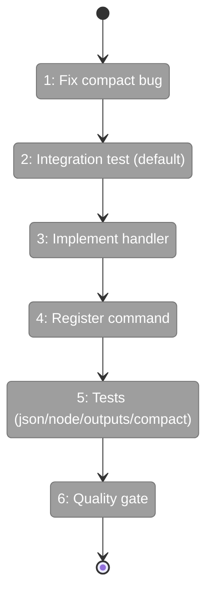

# Flight Plan: Phase 3 — CLI Command Registration + Integration Tests

**Plan**: [graph-inspect-cli-plan.md](../../graph-inspect-cli-plan.md)
**Phase**: Phase 3: CLI Command Registration + Integration Tests
**Generated**: 2026-02-22
**Status**: Ready for takeoff

---

## Departure → Destination

**Where we are**: `inspectGraph()` returns `InspectResult` and 4 formatters turn it into human-readable output — but there's no CLI command to invoke them. A developer would need to write code to see inspect output.

**Where we're going**: `cg wf inspect my-graph` works from the terminal with `--node`, `--outputs`, `--compact`, and `--json` modes. Integration tests verify all modes against real fixture graphs.

---

## Flight Status

---

## Stages

- [ ] **Stage 1: Fix compact header bug** — `completedNodes/totalNodes` instead of `totalNodes/totalNodes`
- [ ] **Stage 2: Write integration test for default mode** — RED: handler doesn't exist yet
- [ ] **Stage 3: Implement handleWfInspect** — thin handler: context → service → formatter → console.log
- [ ] **Stage 4: Register cg wf inspect command** — Commander.js with --node, --outputs, --compact options
- [ ] **Stage 5: Write integration tests for all modes** — RED→GREEN for --json, --node, --outputs, --compact
- [ ] **Stage 6: Quality gate** — `just fft` confirms zero regressions

---

## Acceptance Criteria

- [ ] `cg wf inspect <slug>` outputs graph header + per-node sections (AC-1, AC-11)
- [ ] `--json` returns valid JSON with CommandResponse envelope (AC-7, AC-10)
- [ ] `--node <id>` shows single node deep dive (AC-4)
- [ ] `--outputs` shows output data grouped by node (AC-5)
- [ ] `--compact` shows one-liner per node with correct ratio (AC-6)

---

## Checklist

- [ ] T001: Fix compact header bug (CS-1)
- [ ] T002: Integration test — default mode (CS-2)
- [ ] T003: Implement handleWfInspect handler (CS-2)
- [ ] T004: Register cg wf inspect command (CS-1)
- [ ] T005: Integration test — --json mode (CS-2)
- [ ] T006: Integration test — --node mode (CS-2)
- [ ] T007: Integration test — --outputs mode (CS-1)
- [ ] T008: Integration test — --compact mode (CS-1)
- [ ] T009: just fft quality gate (CS-1)
