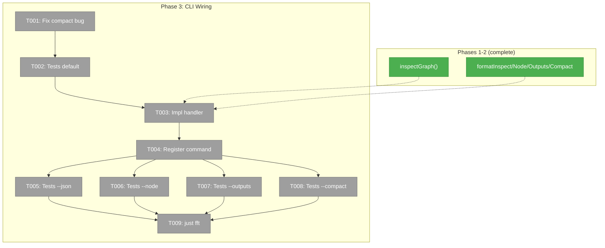

# Phase 3: CLI Command Registration + Integration Tests — Tasks & Alignment Brief

**Spec**: [graph-inspect-cli-spec.md](../../graph-inspect-cli-spec.md)
**Plan**: [graph-inspect-cli-plan.md](../../graph-inspect-cli-plan.md)
**Date**: 2026-02-22

---

## Executive Briefing

### Purpose
Phases 1–2 built the data model (`inspectGraph()`) and formatters — but nothing a user can run yet. This phase wires them to the CLI so `cg wf inspect <slug>` produces real output. It's the phase that turns library code into a usable developer tool.

### What We're Building
A `cg wf inspect <slug>` CLI command with 4 output modes:
- Default: full graph dump with topology, per-node sections, truncated outputs
- `--node <id>`: single node deep dive with full values + event log
- `--outputs`: output data only, grouped by node
- `--compact`: one-liner per node
- `--json`: full InspectResult wrapped in CommandResponse envelope

Plus a `handleWfInspect()` handler function following the existing `handleWfStatus()` pattern: resolve context → call service → format → print.

### User Value
A developer can type `cg wf inspect my-graph` and immediately see every node's status, timing, inputs, outputs, and events — no more reading raw JSON files.

### Example
```
$ cg wf inspect advanced-pipeline --compact
Graph: advanced-pipeline (complete) — 4/4 nodes

  ✅ human-input-b3f      user-input   3s     1 output
  ✅ spec-writer-e66      agent        3m19s  3 outputs  (Q&A: 1 question)
  ✅ programmer-a-a8c     agent        32s    2 outputs  (parallel, noContext)
  ✅ reviewer-df3         agent        42s    2 outputs  (inherit: spec-writer)
```

---

## Objectives & Scope

### Goals
- ✅ Fix compact header bug (`totalNodes/totalNodes` → `completedNodes/totalNodes`)
- ✅ `handleWfInspect()` handler following wrapAction + OutputAdapter pattern
- ✅ Command registered as `cg wf inspect <slug>` with `--node`, `--outputs`, `--compact` options
- ✅ JSON mode uses existing OutputAdapter to wrap InspectResult in CommandResponse envelope
- ✅ Integration tests for default, `--json`, `--node`, `--outputs`, `--compact` modes

### Non-Goals
- ❌ E2E validation with real pipeline (Phase 4)
- ❌ Documentation/how-to guide (Phase 5)
- ❌ ANSI color codes (per OutputAdapter contract — glyphs carry meaning)
- ❌ node.yaml raw dump in `--node` mode (deferred — requires file read in CLI handler)
- ❌ Any changes to formatters (Phase 2 output is consumed as-is)

---

## Prior Phases Review

### Phase 1 → Phase 2 Evolution
Phase 1 defined `InspectResult` types and `buildInspectResult()` composing service reads. A DYK session revealed 3 missing data categories (events, orchestratorSettings, fileMetadata), spawning Subtask 001 which enriched the model. Phase 2 then consumed the enriched model to implement 4 pure formatters. Both phases used Full TDD with no mocks.

### Cumulative Deliverables Available to Phase 3

| Origin | File | Provides |
|--------|------|----------|
| Phase 1 | `features/040-graph-inspect/inspect.types.ts` | `InspectResult`, `InspectNodeResult`, 7 other types, `isFileOutput()` |
| Phase 1 | `features/040-graph-inspect/inspect.ts` | `buildInspectResult(service, ctx, slug)` |
| Phase 1 | Service interface + service.ts | `service.inspectGraph(ctx, slug): Promise<InspectResult>` |
| Phase 2 | `features/040-graph-inspect/inspect.format.ts` | `formatInspect`, `formatInspectNode`, `formatInspectOutputs`, `formatInspectCompact` |
| Phase 2 | `features/040-graph-inspect/index.ts` | Barrel re-exports all of the above |

### Reusable Test Infrastructure
- `makeNode()` + `makeResult()` fixtures (Phase 2) — for constructing InspectResult in tests
- `createTestServiceStack()` (Phase 1) — real service with temp filesystem
- `FakeFileSystem.setFile()` pattern — for test file setup

### Known Issues to Fix
- **Compact header bug** (Phase 2 debt): `formatInspectCompact` displays `totalNodes/totalNodes` instead of `completedNodes/totalNodes`

---

## Pre-Implementation Audit

### Summary
| File | Action | Origin | Modified By | Recommendation |
|------|--------|--------|-------------|----------------|
| `apps/cli/src/commands/positional-graph.command.ts` | Modify | Plan 026 | Plans 028-039 | cross-plan-edit, add inspect command |
| `packages/positional-graph/src/features/040-graph-inspect/inspect.format.ts` | Modify | Phase 2 | — | Fix compact header bug |
| `test/unit/positional-graph/features/040-graph-inspect/inspect-format.test.ts` | Modify | Phase 2 | — | Add compact header fix test |
| `test/integration/positional-graph/features/040-graph-inspect/inspect-cli.test.ts` | Create | New | — | plan-scoped |

### Compliance Check
- **ADR-0006**: CLI is Consumer Domain — handler must be a thin wrapper. ✅ Planned as 1-function handler.
- **ADR-0012**: No pod/session internals in output. ✅ Already enforced by Phase 1 types.

---

## Requirements Traceability

### Coverage Matrix
| AC | Description | Files in Flow | Tasks | Status |
|----|-------------|---------------|-------|--------|
| AC-1 | Graph topology header + per-node sections | positional-graph.command.ts | T003, T004 | ✅ |
| AC-2 | Output truncation at 60 chars | (Phase 2 formatter) | — | ⏭️ Already done |
| AC-3 | File outputs with → arrow | (Phase 2 formatter) | — | ⏭️ Already done |
| AC-4 | --node deep dive | positional-graph.command.ts | T004, T006 | ✅ |
| AC-5 | --outputs mode | positional-graph.command.ts | T004, T007 | ✅ |
| AC-6 | --compact one-liner | positional-graph.command.ts, inspect.format.ts | T001, T004, T008 | ✅ |
| AC-7 | --json full InspectResult | positional-graph.command.ts | T004, T005 | ✅ |
| AC-8 | In-progress display | (Phase 2 formatter) | — | ⏭️ Already done |
| AC-9 | Failed node error display | (Phase 2 formatter) | — | ⏭️ Already done |
| AC-10 | JSON parseable by jq | positional-graph.command.ts | T005 | ✅ |
| AC-11 | Command registration | positional-graph.command.ts | T004 | ✅ |

---

## Architecture Map



### Task-to-Component Mapping

| Task | Component | Files | Status | Comment |
|------|-----------|-------|--------|---------|
| T001 | Fix | inspect.format.ts, inspect-format.test.ts | ⬜ Pending | Compact header bug |
| T002 | Test | inspect-cli.test.ts | ⬜ Pending | RED: default mode integration |
| T003 | Core | positional-graph.command.ts | ⬜ Pending | handleWfInspect handler |
| T004 | Core | positional-graph.command.ts | ⬜ Pending | Commander registration |
| T005 | Test | inspect-cli.test.ts | ⬜ Pending | RED→GREEN: --json mode |
| T006 | Test | inspect-cli.test.ts | ⬜ Pending | RED→GREEN: --node mode |
| T007 | Test | inspect-cli.test.ts | ⬜ Pending | RED→GREEN: --outputs mode |
| T008 | Test | inspect-cli.test.ts | ⬜ Pending | RED→GREEN: --compact mode |
| T009 | Gate | — | ⬜ Pending | just fft |

---

## Tasks

| Status | ID | Task | CS | Type | Dependencies | Absolute Path(s) | Validation | Subtasks | Notes |
|--------|------|------|----|------|-------------|-------------------|------------|----------|-------|
| [ ] | T001 | Fix `formatInspectCompact` header bug: `totalNodes/totalNodes` → `completedNodes/totalNodes`. Add regression test. | 1 | Fix | – | `/home/jak/substrate/033-real-agent-pods/packages/positional-graph/src/features/040-graph-inspect/inspect.format.ts` `/home/jak/substrate/033-real-agent-pods/test/unit/positional-graph/features/040-graph-inspect/inspect-format.test.ts` | Compact header shows `2/4` for 2 complete out of 4 total. Test asserts correct ratio. | – | Phase 2 debt |
| [ ] | T002 | Write integration test: `handleWfInspect()` default mode on fixture graph | 2 | Test | T001 | `/home/jak/substrate/033-real-agent-pods/test/unit/positional-graph/features/040-graph-inspect/inspect-cli.test.ts` | Test RED. Creates graph via service, calls handler, verifies output contains graph header + per-node sections. | – | plan-scoped |
| [ ] | T003 | Implement `handleWfInspect()` CLI handler | 2 | Core | T002 | `/home/jak/substrate/033-real-agent-pods/apps/cli/src/commands/positional-graph.command.ts` | Handler follows wrapAction pattern: resolve context → `service.inspectGraph()` → dispatch to formatter based on flags → `console.log()`. Default/node/outputs/compact use formatters; --json uses adapter.format(). | – | cross-plan-edit, per ADR-0006 |
| [ ] | T004 | Register `cg wf inspect <slug>` command with `--node`, `--outputs`, `--compact` options | 1 | Core | T003 | `/home/jak/substrate/033-real-agent-pods/apps/cli/src/commands/positional-graph.command.ts` | Command shows in `cg wf --help`. Options: `--node <nodeId>`, `--outputs`, `--compact`. JSON inherited from parent `wf` command. | – | cross-plan-edit |
| [ ] | T005 | Write integration test: `--json` mode parseable + envelope | 2 | Test | T004 | `/home/jak/substrate/033-real-agent-pods/test/unit/positional-graph/features/040-graph-inspect/inspect-cli.test.ts` | Test verifies: output is valid JSON, has `success: true`, `command: 'wf.inspect'`, `data.nodes[]` array, output values present. | – | plan-scoped, AC-7/AC-10 |
| [ ] | T006 | Write integration test: `--node` mode | 2 | Test | T004 | `/home/jak/substrate/033-real-agent-pods/test/unit/positional-graph/features/040-graph-inspect/inspect-cli.test.ts` | Test verifies: single node output, full untruncated values, event list present. | – | plan-scoped, AC-4 |
| [ ] | T007 | Write integration test: `--outputs` mode | 1 | Test | T004 | `/home/jak/substrate/033-real-agent-pods/test/unit/positional-graph/features/040-graph-inspect/inspect-cli.test.ts` | Test verifies: output-only sections, grouped by nodeId, 40-char truncation. | – | plan-scoped, AC-5 |
| [ ] | T008 | Write integration test: `--compact` mode | 1 | Test | T004 | `/home/jak/substrate/033-real-agent-pods/test/unit/positional-graph/features/040-graph-inspect/inspect-cli.test.ts` | Test verifies: one line per node, correct completion ratio in header. | – | plan-scoped, AC-6 |
| [ ] | T009 | Compile check + full test suite | 1 | Gate | T005-T008 | — | `just fft` passes, 0 regressions | – | Safety gate |

---

## Alignment Brief

### Critical Findings Affecting This Phase

| # | Finding | Impact | Addressed By |
|---|---------|--------|-------------|
| 02 | `createOutputAdapter(json)` wraps in CommandResponse envelope | JSON mode: `adapter.format('wf.inspect', result)` | T003, T005 |
| 06 | `createTestServiceStack()` for real service + temp filesystem | Integration tests use real service, build graphs via API | T002, T005-T008 |
| 10 | ConsoleOutputAdapter too basic for inspect | Human-readable modes use Phase 2 formatters directly, NOT the adapter | T003 |

### ADR Constraints

- **ADR-0006**: CLI is Consumer Domain — `handleWfInspect()` must be a thin wrapper. No business logic. Constrains T003.
- **ADR-0012**: No pod/session internals. Already enforced by Phase 1 types. No new constraints.

### Handler Implementation Pattern (from `handleWfStatus`)

```typescript
async function handleWfInspect(slug: string, options: InspectOptions): Promise<void> {
  const adapter = createOutputAdapter(options.json ?? false);
  const ctx = await resolveOrOverrideContext(options.workspacePath);
  if (!ctx) { /* error handling */ }
  const service = getPositionalGraphService();
  const result = await service.inspectGraph(ctx, slug);

  if (options.json) {
    console.log(adapter.format('wf.inspect', result));
  } else if (options.node) {
    console.log(formatInspectNode(result, options.node));
  } else if (options.outputs) {
    console.log(formatInspectOutputs(result));
  } else if (options.compact) {
    console.log(formatInspectCompact(result));
  } else {
    console.log(formatInspect(result));
  }
}
```

### Test Plan (Full TDD, No Mocks)

Integration tests create real graphs via `createTestServiceStack()`, call `handleWfInspect()`, capture console.log output, and assert on content.

```
describe('cg wf inspect (integration)')
  describe('default mode')
    it('outputs graph header with slug and status')
    it('outputs per-node sections with ━━━ separator')

  describe('--json mode')
    it('outputs valid JSON with CommandResponse envelope')
    it('JSON has data.nodes array with output values')

  describe('--node mode')
    it('outputs single node with full values')
    it('outputs event log')

  describe('--outputs mode')
    it('outputs grouped by node')

  describe('--compact mode')
    it('outputs one line per node with correct header ratio')
```

### Commands

```bash
# Fast TDD cycle
pnpm vitest run test/unit/positional-graph/features/040-graph-inspect/

# Full gate
just fft
```

### Risks

| Risk | Severity | Mitigation |
|------|----------|------------|
| `getPositionalGraphService()` DI resolution pattern unknown | MEDIUM | Follow existing `handleWfStatus` pattern exactly |
| Console.log capture in tests | LOW | Use `vi.spyOn(console, 'log')` or capture variable |
| Import path for formatters from CLI package | LOW | Import from `@chainglass/positional-graph` barrel |

### Ready Check

- [x] ADR constraints mapped (ADR-0006 → T003, ADR-0012 → already enforced)
- [x] Prior phases reviewed (Phase 1 + 2)
- [x] Critical findings mapped
- [x] Compact header bug identified
- [ ] **Human GO/NO-GO**

---

## Phase Footnote Stubs

_Populated by plan-6 during implementation._

| Footnote | Task | Description |
|----------|------|-------------|
| | | |

---

## Evidence Artifacts

Implementation evidence will be written to:
- `docs/plans/040-graph-inspect-cli/tasks/phase-3-cli-command-registration-integration-tests/execution.log.md`

---

## Discoveries & Learnings

_Populated during implementation by plan-6. Log anything of interest to your future self._

| Date | Task | Type | Discovery | Resolution | References |
|------|------|------|-----------|------------|------------|
| | | | | | |

**Types**: `gotcha` | `research-needed` | `unexpected-behavior` | `workaround` | `decision` | `debt` | `insight`

_See also: `execution.log.md` for detailed narrative._

---

## Directory Layout

```
docs/plans/040-graph-inspect-cli/
  ├── graph-inspect-cli-spec.md
  ├── graph-inspect-cli-plan.md
  └── tasks/
      ├── phase-1-.../
      ├── phase-2-.../
      └── phase-3-cli-command-registration-integration-tests/
          ├── tasks.md              ← this file
          ├── tasks.fltplan.md      ← generated by /plan-5b
          └── execution.log.md     ← created by /plan-6
```
