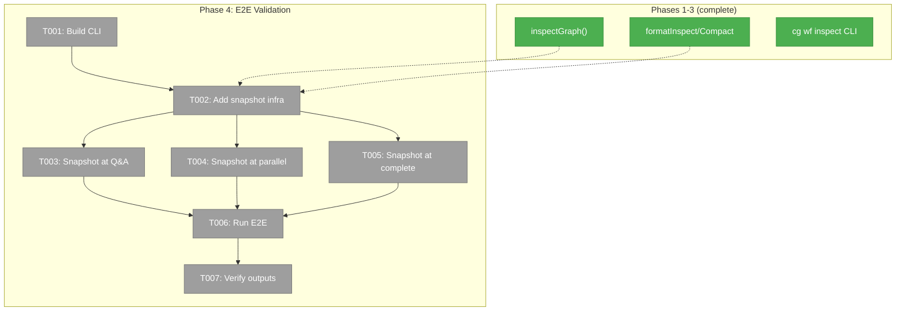

# Phase 4: E2E Validation Against Real Pipeline — Tasks & Alignment Brief

**Spec**: [graph-inspect-cli-spec.md](../../graph-inspect-cli-spec.md)
**Plan**: [graph-inspect-cli-plan.md](../../graph-inspect-cli-plan.md)
**Date**: 2026-02-22

---

## Executive Briefing

### Purpose
Phases 1–3 built and tested `cg wf inspect` with unit and integration tests against fixture graphs. This phase validates it against the real 6-node E2E pipeline with actual LLM agents — proving the output is useful for debugging real workflows, not just test fixtures.

### What We're Building
Three inspect snapshot calls added to `test-advanced-pipeline.ts` at lifecycle moments:
1. **During Q&A pause** — spec-writer is waiting-question, others pending
2. **During parallel execution** — programmers running, reviewer/summariser pending
3. **After completion** — all 6 nodes complete with real outputs

Plus structural assertions on each snapshot to verify correctness.

### User Value
Confirms that `cg wf inspect` produces meaningful output on real agent workflows — the developer actually sees agent-produced code, reviews, and summaries in the inspect output.

### Example
After running `just test-advanced-pipeline`, the script will print 3 inspect snapshots showing the graph evolving from Q&A → parallel → complete, then verify all 23 existing assertions still pass plus new snapshot assertions.

---

## Objectives & Scope

### Goals
- ✅ Add 3 inspect snapshots to test-advanced-pipeline.ts onEvent handler
- ✅ Rebuild CLI before E2E run (`pnpm turbo build --force`)
- ✅ Run full E2E pipeline with real agents — all 23 existing assertions pass
- ✅ Verify snapshot 1: spec-writer in waiting-question state
- ✅ Verify snapshot 2: programmers running in parallel
- ✅ Verify snapshot 3: all nodes complete with outputs
- ✅ No session IDs or pod internals exposed (ADR-0012)

### Non-Goals
- ❌ Adding new assertions beyond inspect snapshots (23/23 is the baseline)
- ❌ Performance testing or benchmarking
- ❌ Modifying the pipeline graph structure
- ❌ Documentation (Phase 5)
- ❌ JSON output validation in E2E (covered by Phase 3 integration tests)

---

## Pre-Implementation Audit

### Summary
| File | Action | Origin | Modified By | Recommendation |
|------|--------|--------|-------------|----------------|
| `scripts/test-advanced-pipeline.ts` | Modify | Plan 039 | Plan 039 Phase 4 | cross-plan-edit |

### Compliance Check
- **ADR-0012**: Snapshot assertions must verify no session IDs in inspect output. Addressed by T005.

---

## Requirements Traceability

### Coverage Matrix
| AC | Description | Files in Flow | Tasks | Status |
|----|-------------|---------------|-------|--------|
| AC-1 | Default mode topology + per-node sections | test-advanced-pipeline.ts | T003, T005 | ✅ |
| AC-2 | Truncated output values | (Phase 2 formatters) | — | ⏭️ Already done |
| AC-3 | File outputs with → arrow | test-advanced-pipeline.ts | T005 | ✅ |
| AC-8 | In-progress: running + pending states | test-advanced-pipeline.ts | T003, T004 | ✅ |
| AC-9 | Failed nodes show error | (no failures expected) | — | ⏭️ N/A for happy path |

---

## Architecture Map



### Task-to-Component Mapping

| Task | Component | Files | Status | Comment |
|------|-----------|-------|--------|---------|
| T001 | Build | — | ⬜ Pending | `pnpm turbo build --force` |
| T002 | Core | test-advanced-pipeline.ts | ⬜ Pending | Snapshot capture helper function |
| T003 | Core | test-advanced-pipeline.ts | ⬜ Pending | Snapshot during Q&A idle |
| T004 | Core | test-advanced-pipeline.ts | ⬜ Pending | Snapshot during parallel |
| T005 | Core | test-advanced-pipeline.ts | ⬜ Pending | Snapshot after completion |
| T006 | Gate | — | ⬜ Pending | Run full E2E |
| T007 | Core | test-advanced-pipeline.ts | ⬜ Pending | Structural assertions on snapshots |

---

## Tasks

| Status | ID | Task | CS | Type | Dependencies | Absolute Path(s) | Validation | Subtasks | Notes |
|--------|------|------|----|------|-------------|-------------------|------------|----------|-------|
| [ ] | T001 | Rebuild CLI: `pnpm turbo build --force` | 1 | Setup | – | — | Build succeeds, CLI binary includes inspect command | – | Required because CLI imports from dist/ |
| [ ] | T002 | Add `captureInspectSnapshot()` helper to test script that calls `service.inspectGraph()` + `formatInspect()` + `formatInspectCompact()` and logs to console + stores result | 2 | Core | T001 | `/home/jak/substrate/033-real-agent-pods/scripts/test-advanced-pipeline.ts` | Helper function defined, takes slug + label, returns InspectResult | – | cross-plan-edit, import formatters from package |
| [ ] | T003 | Add snapshot call in onEvent idle handler during Q&A phase — trigger when question detected | 1 | Core | T002 | `/home/jak/substrate/033-real-agent-pods/scripts/test-advanced-pipeline.ts` | Snapshot fires when spec-writer has pending question (around line 477) | – | cross-plan-edit |
| [ ] | T004 | Add snapshot call during parallel execution — trigger when programmers are running | 1 | Core | T002 | `/home/jak/substrate/033-real-agent-pods/scripts/test-advanced-pipeline.ts` | Snapshot fires when programmer nodes are in agent-accepted state | – | cross-plan-edit |
| [ ] | T005 | Add snapshot after completion — in assertion section before existing checks | 2 | Core | T002 | `/home/jak/substrate/033-real-agent-pods/scripts/test-advanced-pipeline.ts` | Full inspect at completion. Assert: all ✅, outputs present, no session IDs in output (ADR-0012), JSON parseable. | – | cross-plan-edit, per ADR-0012 |
| [ ] | T006 | Run `just test-advanced-pipeline` — full E2E with real agents | 2 | Gate | T003-T005 | — | All 23 existing assertions pass. 3 inspect snapshots captured and displayed. | – | ~3-5 min with real agents |
| [ ] | T007 | Add structural assertions on captured snapshots (not content — agent output is non-deterministic) | 2 | Core | T006 | `/home/jak/substrate/033-real-agent-pods/scripts/test-advanced-pipeline.ts` | Snapshot 1: ≥1 node waiting/pending. Snapshot 2: ≥2 nodes running/accepted. Snapshot 3: all nodes complete, all outputs present. | – | cross-plan-edit |

---

## Alignment Brief

### Prior Phases Summary

**Phase 1** (data model): `inspectGraph()` returns `InspectResult` with per-node status, timing, inputs, outputs, events, orchestratorSettings, fileMetadata. 21 unit tests.

**Phase 2** (formatters): 4 pure functions — `formatInspect`, `formatInspectNode`, `formatInspectOutputs`, `formatInspectCompact`. 20 unit tests.

**Phase 3** (CLI): `cg wf inspect <slug>` with `--node`, `--outputs`, `--compact`, `--json`. Handler + Commander registration. 9 integration tests via `withTestGraph`.

### Critical Findings Affecting This Phase

| # | Finding | Impact | Addressed By |
|---|---------|--------|-------------|
| 06 | `createTestServiceStack()` / `withTestGraph` for real service | E2E script already has its own service stack via `buildStack()` — use that service instance directly | T002 |
| 11 | ADR-0012: no pod/session internals | Snapshot 3 assertion must verify no `sessionId` in formatted output | T005 |

### Test Plan

This is NOT a TDD phase — it's E2E validation. The test is running the actual pipeline with real agents and verifying inspect output at 3 lifecycle points. Agent output is non-deterministic, so assertions check **structure** not **content**.

**Snapshot timing:**
- **Snapshot 1 (Q&A)**: In `onEvent` idle handler, when `questionWatcher.hasPendingQuestion()` is true
- **Snapshot 2 (Parallel)**: In `onEvent` iteration handler, when status shows ≥2 nodes in `agent-accepted`
- **Snapshot 3 (Complete)**: After drive loop exits, before existing assertions

**Assertions per snapshot:**
```
Snapshot 1 (Q&A):
  - result.nodes.some(n => n.status includes 'waiting' or 'question')
  - result.graphStatus !== 'complete'

Snapshot 2 (Parallel):
  - result.nodes.filter(n => n.status === 'agent-accepted').length >= 2
  - result.graphStatus === 'in_progress'

Snapshot 3 (Complete):
  - result.graphStatus === 'complete'
  - result.nodes.every(n => n.status === 'complete')
  - result.nodes.every(n => n.outputCount > 0)
  - formatted output does not contain 'sessionId'
```

### Commands

```bash
# Build CLI first
pnpm turbo build --force

# Run E2E (requires CG_MODEL or defaults to claude-sonnet-4.6)
just test-advanced-pipeline

# Or with specific model
CG_MODEL=claude-sonnet-4.6 just test-advanced-pipeline
```

### Risks

| Risk | Severity | Mitigation |
|------|----------|------------|
| E2E takes 3-5 min with real agents | MEDIUM | Single run, structural assertions only |
| Agent output non-deterministic | LOW | Assert structure not content |
| Snapshot timing depends on event ordering | MEDIUM | Use state-based triggers (check node status), not sequence-based |
| Real agent may timeout (60s SDK) | LOW | Script already has 600s overall timeout |

### Ready Check

- [x] ADR-0012 mapped (T005 — no session IDs in output)
- [x] Prior phases reviewed
- [x] E2E script structure understood
- [x] Snapshot insertion points identified (onEvent handler, assertion section)
- [ ] **Human GO/NO-GO**

---

## Phase Footnote Stubs

_Populated by plan-6 during implementation._

| Footnote | Task | Description |
|----------|------|-------------|
| | | |

---

## Evidence Artifacts

Implementation evidence will be written to:
- `docs/plans/040-graph-inspect-cli/tasks/phase-4-e2e-validation-against-real-pipeline/execution.log.md`

---

## Discoveries & Learnings

_Populated during implementation by plan-6. Log anything of interest to your future self._

| Date | Task | Type | Discovery | Resolution | References |
|------|------|------|-----------|------------|------------|
| | | | | | |

**Types**: `gotcha` | `research-needed` | `unexpected-behavior` | `workaround` | `decision` | `debt` | `insight`

---

## Directory Layout

```
docs/plans/040-graph-inspect-cli/
  ├── graph-inspect-cli-plan.md
  └── tasks/
      ├── phase-1-.../
      ├── phase-2-.../
      ├── phase-3-.../
      └── phase-4-e2e-validation-against-real-pipeline/
          ├── tasks.md              ← this file
          ├── tasks.fltplan.md      ← generated by /plan-5b
          └── execution.log.md     ← created by /plan-6
```
