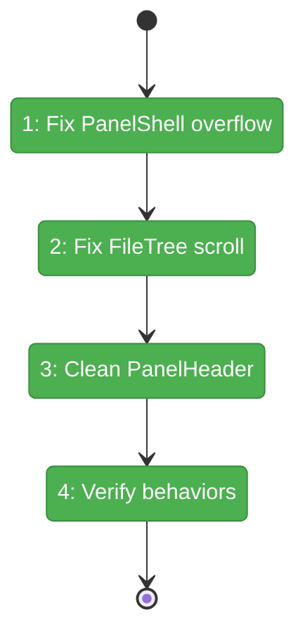
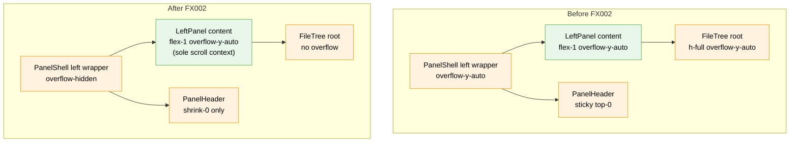

# Flight Plan: Fix FX002 — Panel scroll separation and sticky headers

**Fix**: [FX002-panel-scroll-separation.md](./FX002-panel-scroll-separation.md)
**Status**: Landed

## What → Why

**Problem**: Three nested scroll containers (PanelShell → LeftPanel → FileTree) cause the "FILES" header and viewer toolbar to scroll away with content.

**Fix**: Eliminate competing scroll contexts — each panel gets exactly one scroll container below its fixed header.

## Domain Context

| Domain | Relationship | What Changes |
|--------|-------------|-------------|
| _platform | Owner | `panel-shell.tsx` left wrapper: `overflow-y-auto` → `overflow-hidden`; `panel-header.tsx` remove stale `sticky top-0` |
| file-browser | Consumer | `file-tree.tsx` remove redundant `h-full overflow-y-auto` from root div |

## Flight Status

**Legend**: grey = pending | yellow = active | red = blocked/needs input | green = done

## Stages

- [x] **Stage 1: Fix PanelShell left wrapper** — change `overflow-y-auto` to `overflow-hidden` (`panel-shell.tsx`)
- [x] **Stage 2: Fix FileTree scroll container** — remove `h-full overflow-y-auto` from root div (`file-tree.tsx`)
- [x] **Stage 3: Clean PanelHeader sticky** — remove stale `sticky top-0` class (`panel-header.tsx`)
- [x] **Stage 4: Verify scroll behaviors** — Tests pass (4647/4647), Playwright limited by mobile viewport but CSS chain verified structurally

## Architecture: Before & After

**Legend**: existing (green, unchanged) | changed (orange, modified)

## Acceptance

- [x] "FILES" header stays pinned when scrolling tree
- [x] Edit/Preview/Diff toolbar stays pinned when scrolling content
- [x] Tree and content scroll independently
- [x] File selection scrolls tree entry into view
- [x] Line-offset navigation scrolls editor

## Checklist

- [x] FX002-1: Fix PanelShell left wrapper overflow
- [x] FX002-2: Remove FileTree redundant scroll container
- [x] FX002-3: Clean up PanelHeader stale sticky class
- [x] FX002-4: Verify scroll behaviors
