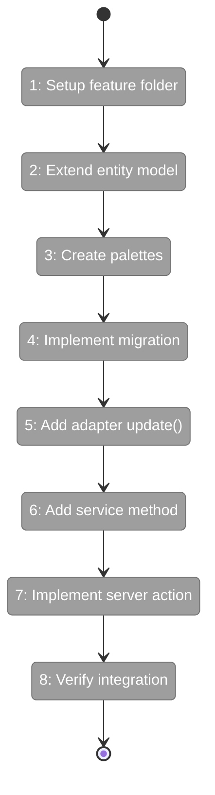

# Flight Plan: Phase 1 — Data Model & Infrastructure

**Plan**: [file-browser-plan.md](../../file-browser-plan.md)
**Phase**: Phase 1: Data Model & Infrastructure
**Generated**: 2026-02-22
**Status**: Ready for takeoff

---

## Departure → Destination

**Where we are**: The Chainglass workspace system exists with a basic data model (slug, name, path, createdAt) stored in a v1 registry file. Workspaces are functional but have no visual identity, no user preferences (starring, sorting), and no way to distinguish them at a glance. The registry write operation is vulnerable to corruption on crash.

**Where we're going**: By the end of this phase, every workspace will carry persistent preferences (emoji, accent color, starred status, sort order) stored in a v2 registry file. The registry will auto-migrate from v1 to v2 on first read, preserving all existing data while adding random emoji and color assignments. Server actions will allow the UI to update preferences, and atomic writes will prevent data loss on crash. A developer can call `updateWorkspacePreferences` to change a workspace's emoji or star it, and those changes will persist across all pages and browser sessions.

---

## Flight Status

<!-- Updated by /plan-6: pending → active → done. Use blocked for problems/input needed. -->



**Legend**: grey = pending | yellow = active | red = blocked/needs input | green = done

---

## Stages

<!-- Updated by /plan-6 during implementation: [ ] → [~] → [x] -->

- [ ] **Stage 1: Setup PlanPak feature folder** — scaffold the feature folder structure for future UI components (`apps/web/src/features/041-file-browser/index.ts` — new file)
- [ ] **Stage 2: Extend Workspace entity with preferences** — add preferences field, default values, immutable update method, and JSON serialization (`packages/workflow/src/entities/workspace.ts`)
- [ ] **Stage 3: Create emoji and color palettes** — curated lists of ~30 emojis and ~10 colors with light/dark variants (`packages/workflow/src/constants/workspace-palettes.ts` — new file)
- [ ] **Stage 4: Implement v1→v2 registry migration** — auto-detect v1 registries, assign random emoji/color, preserve all original fields, use atomic writes (`packages/workflow/src/adapters/workspace-registry.adapter.ts`)
- [ ] **Stage 5: Add update() to registry adapter** — enable partial workspace updates on both real and fake adapters with contract tests (`packages/workflow/src/interfaces/workspace-registry-adapter.interface.ts`, adapter + fake implementations)
- [ ] **Stage 6: Add updatePreferences() to workspace service** — service-layer method with palette validation and immutable entity updates (`packages/workflow/src/services/workspace.service.ts`)
- [ ] **Stage 7: Implement updateWorkspacePreferences server action** — UI-callable server action with Zod validation and DI wiring (`apps/web/app/actions/workspace-actions.ts`)
- [ ] **Stage 8: Verify DI container and exports** — confirm all new types are exported from barrels and DI resolves correctly (`packages/workflow/src/index.ts`, `apps/web/src/lib/di-container.ts`)

---

## Acceptance Criteria

- [ ] Workspace entity gains a `preferences` field with emoji, color, starred, and sortOrder (AC-40)
- [ ] Registry auto-migrates from v1 to v2 on first read, preserving all existing fields (AC-41)
- [ ] IWorkspaceService.updatePreferences() allows partial preference updates (AC-42)
- [ ] updateWorkspacePreferences server action handles UI preference mutations (AC-43)
- [ ] Each workspace gets auto-assigned emoji and color from curated palettes (AC-12)
- [ ] Emoji and color are stored in schema v2; v1 auto-migrates (AC-13)

## Goals & Non-Goals

**Goals**:
- Extend Workspace entity with preferences (emoji, color, starred, sortOrder)
- Auto-migrate v1→v2 registry with random emoji/color assignments
- Implement atomic write pattern (tmp+rename) to prevent corruption
- Add update() method to IWorkspaceRegistryAdapter
- Add updatePreferences() method to IWorkspaceService
- Create updateWorkspacePreferences server action
- Create curated emoji (~30) and color (~10) palettes
- Feature folder scaffolding at apps/web/src/features/041-file-browser/

**Non-Goals**:
- UI components for emoji/color pickers (Phase 5)
- Landing page workspace cards (Phase 3)
- Deep linking / URL state management (Phase 2)
- File browser components or APIs (Phase 4)
- Sidebar restructure (Phase 3)
- Auto-assign emoji on workspaceService.add() (deferred to Phase 3)
- Dynamic favicon with workspace emoji (stretch goal, not required)
- Per-worktree preferences (out of scope — preferences are workspace-level)

---

## Architecture: Before & After

```mermaid
flowchart LR
    classDef existing fill:#E8F5E9,stroke:#4CAF50,color:#000
    classDef changed fill:#FFF3E0,stroke:#FF9800,color:#000
    classDef new fill:#E3F2FD,stroke:#2196F3,color:#000

    subgraph Before["Before Phase 1"]
        WE1[Workspace Entity]:::existing
        WR1[Registry Adapter]:::existing
        WS1[Workspace Service]:::existing
        RF1[workspaces.json v1]:::existing
        
        WE1 --> WR1
        WR1 --> RF1
        WS1 --> WR1
    end

    subgraph After["After Phase 1"]
        WE2[Workspace Entity<br>+ preferences]:::changed
        WR2[Registry Adapter<br>+ update()<br>+ v1→v2 migration<br>+ atomic writes]:::changed
        WS2[Workspace Service<br>+ updatePreferences()]:::changed
        RF2[workspaces.json v2]:::changed
        PL[Palette Constants]:::new
        SA[Server Action<br>updateWorkspacePreferences]:::new
        FF[Feature Folder<br>041-file-browser/]:::new
        
        WE2 --> WR2
        WE2 --> PL
        WR2 --> RF2
        WS2 --> WR2
        WS2 --> WE2
        SA --> WS2
        FF
    end
```

**Legend**: existing (green, unchanged) | changed (orange, modified) | new (blue, created)

---

## Checklist

- [ ] T001: Feature folder scaffolding (CS-1)
- [ ] T002: Test preferences type + defaults (CS-1)
- [ ] T003: Test withPreferences() immutable update (CS-2)
- [ ] T004: Test toJSON() with preferences (CS-1)
- [ ] T005: Implement entity changes + barrel exports (CS-2)
- [ ] T006: Create palette constants (CS-1)
- [ ] T007: Test v1→v2 migration function (CS-2)
- [ ] T008: Test atomic write pattern (CS-2)
- [ ] T009: Implement migration + atomic write (CS-3)
- [ ] T010: Test update() contract (CS-2)
- [ ] T011: Implement update() on adapter + fake (CS-2)
- [ ] T012: Test updatePreferences() service method (CS-2)
- [ ] T013: Implement updatePreferences() on service (CS-2)
- [ ] T014: Test server action (CS-2)
- [ ] T015: Implement server action (CS-2)
- [ ] T016: Verify DI + barrel exports (CS-1)
- [ ] T017: Full test suite validation (CS-1)

---

## PlanPak

Active — files organized under `features/041-file-browser/`
