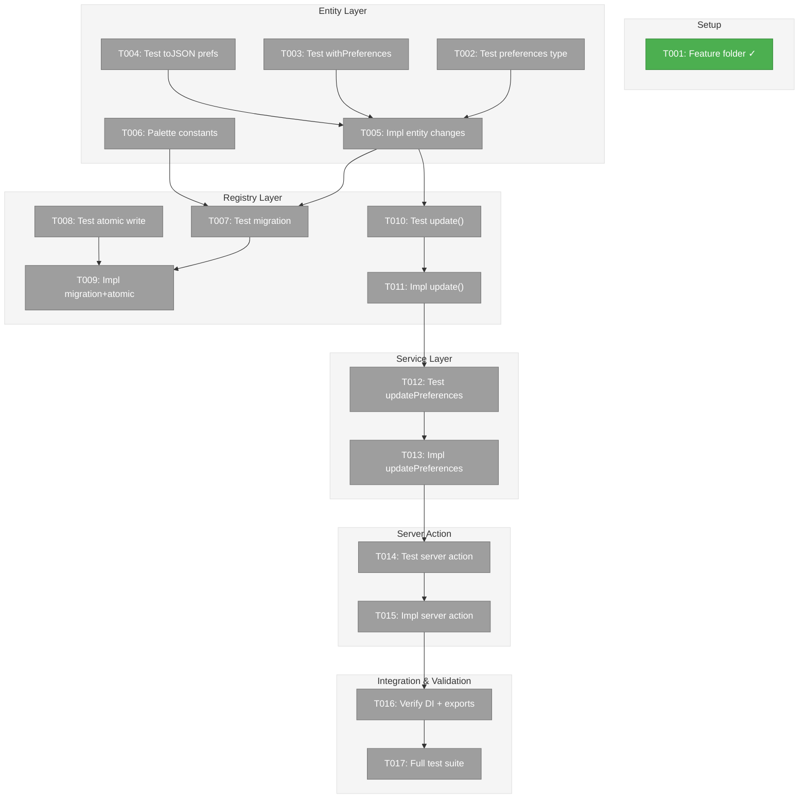
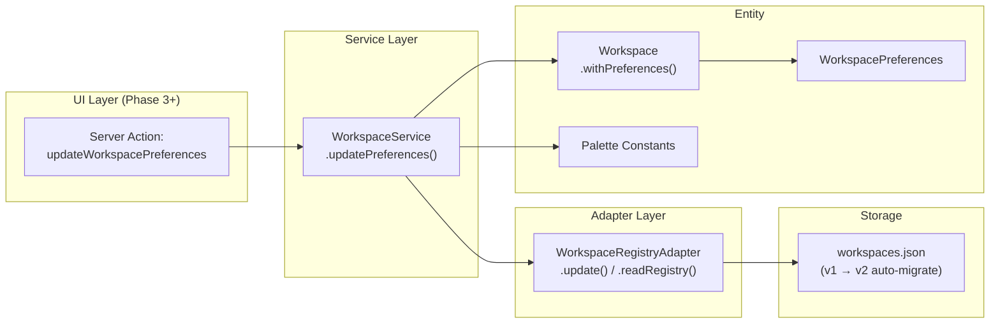
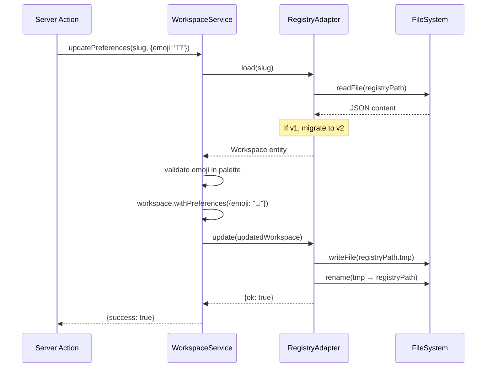

# Phase 1: Data Model & Infrastructure – Tasks & Alignment Brief

**Spec**: [file-browser-spec.md](../../file-browser-spec.md)
**Plan**: [file-browser-plan.md](../../file-browser-plan.md)
**Date**: 2026-02-22

---

## Executive Briefing

### Purpose
This phase extends the Workspace entity with user preferences (emoji, accent color, starred status, sort order), implements registry schema migration (v1→v2) with atomic writes, and creates the palette constants that future phases use for visual identity. Without this, no workspace can carry visual identity or be starred/pinned.

### What We're Building
- A `WorkspacePreferences` type on the Workspace entity with `emoji`, `color`, `starred`, `sortOrder`
- Automatic v1→v2 registry migration that preserves all existing data and assigns random emoji+color
- Atomic write pattern (tmp+rename) for the registry file to prevent corruption
- `update()` on `IWorkspaceRegistryAdapter` and `updatePreferences()` on `IWorkspaceService`
- A server action `updateWorkspacePreferences` for the UI to mutate preferences
- Curated emoji (~30) and color (~10) palettes with light/dark variants

### User Value
Users will see emoji + color identity on every workspace across the UI (cards, sidebar, tab titles). Starring workspaces pins them to the top. All preferences are persisted in the global registry and survive workspace re-registration.

### Example
**Before (v1 registry)**:
```json
{ "version": 1, "workspaces": [{ "slug": "substrate", "name": "Substrate", "path": "/home/jak/substrate", "createdAt": "2024-01-15T10:30:00Z" }] }
```
**After (v2 registry — auto-migrated)**:
```json
{ "version": 2, "workspaces": [{ "slug": "substrate", "name": "Substrate", "path": "/home/jak/substrate", "createdAt": "2024-01-15T10:30:00Z", "preferences": { "emoji": "🔮", "color": "purple", "starred": false, "sortOrder": 0 } }] }
```

---

## Objectives & Scope

### Objective
Extend the Workspace data model with preferences, implement registry migration, and expose preference updates through the service and server action layers. Satisfies AC-40, AC-41, AC-42, AC-43, AC-12, AC-13 from spec.

### Goals

- ✅ `WorkspacePreferences` type with emoji, color, starred, sortOrder fields
- ✅ `DEFAULT_PREFERENCES` constant for consistent defaults
- ✅ `Workspace.withPreferences()` immutable update method
- ✅ `Workspace.toJSON()` includes preferences in output
- ✅ Curated emoji palette (~30) and color palette (~10 with light/dark)
- ✅ Pure `migrateV1toV2()` function for registry migration
- ✅ Atomic write pattern (tmp+rename) in `writeRegistry()`
- ✅ `IWorkspaceRegistryAdapter.update()` method on real + fake
- ✅ `IWorkspaceService.updatePreferences()` with palette validation
- ✅ `updateWorkspacePreferences` server action
- ✅ Feature folder scaffolding at `apps/web/src/features/041-file-browser/`
- ✅ All barrel exports updated for new types

### Non-Goals

- ❌ UI components for emoji/color pickers (Phase 5)
- ❌ Landing page workspace cards (Phase 3)
- ❌ Deep linking / URL state management (Phase 2)
- ❌ File browser components or APIs (Phase 4)
- ❌ Sidebar restructure (Phase 3)
- ❌ Auto-assign emoji on `workspaceService.add()` — Phase 1 focuses on migration and update; add() enhancement can be handled when the landing page "Add workspace" card is built in Phase 3
- ❌ Dynamic favicon with workspace emoji (stretch goal, not required)
- ❌ Per-worktree preferences (out of scope — preferences are workspace-level)

### Scope Note: Planning Documents in Phase 1 Commit
The Phase 1 git commit includes `docs/plans/041-file-browser/` documents (spec, research, 3 workshops) that were created during the planning phases (/plan-1a through /plan-4) but were uncommitted. These are planning artifacts, not Phase 1 implementation work. They are included in the commit because they were first committed alongside Phase 1 code. All implementation files are listed in the task table below.

---

## Pre-Implementation Audit

### Summary

| # | File | Action | Origin | Modified By | Recommendation |
|---|------|--------|--------|-------------|----------------|
| 1 | `apps/web/src/features/041-file-browser/index.ts` | Create | 041 | — | keep-as-is |
| 2 | `packages/workflow/src/constants/workspace-palettes.ts` | Create | 041 | — | keep-as-is |
| 3 | `test/unit/workflow/registry-migration.test.ts` | Create | 041 | — | keep-as-is |
| 4 | `test/unit/web/app/actions/workspace-actions.test.ts` | Create | 041 | — | keep-as-is |
| 5 | `packages/workflow/src/entities/workspace.ts` | Modify | 014 | 014 only | cross-plan-edit |
| 6 | `packages/workflow/src/interfaces/workspace-registry-adapter.interface.ts` | Modify | 014 | 014 only | cross-plan-edit |
| 7 | `packages/workflow/src/interfaces/workspace-service.interface.ts` | Modify | 014 | 014 only | cross-plan-edit |
| 8 | `packages/workflow/src/adapters/workspace-registry.adapter.ts` | Modify | 014 | 014 only | cross-plan-edit |
| 9 | `packages/workflow/src/services/workspace.service.ts` | Modify | 014 | 014 only | cross-plan-edit |
| 10 | `packages/workflow/src/fakes/fake-workspace-registry-adapter.ts` | Modify | 014 | 014 only | cross-plan-edit |
| 11 | `packages/workflow/src/index.ts` | Modify | 001 | 014,019,022,027 | cross-plan-edit |
| 12 | `apps/web/app/actions/workspace-actions.ts` | Modify | 014 | 014 only | cross-plan-edit |
| 13 | `apps/web/src/lib/di-container.ts` | Verify | 001 | 014,019,022,027 | keep-as-is |
| 14 | `test/unit/workflow/workspace-entity.test.ts` | Modify | 014 | 014 only | cross-plan-edit |
| 15 | `test/contracts/workspace-registry-adapter.contract.ts` | Modify | 014 | 014 only | cross-plan-edit |
| 16 | `test/unit/workflow/workspace-service.test.ts` | Modify | 014 | 014 only | cross-plan-edit |

### Per-File Detail

#### `packages/workflow/src/constants/workspace-palettes.ts` (NEW)
- **Duplication check**: No emoji/color palettes exist in `packages/workflow/`. Unrelated emoji usage in `positional-graph` (graph formatting) — no conflict.
- **Note**: `constants/` directory does not exist yet — must be created.

#### `test/unit/web/app/actions/workspace-actions.test.ts` (NEW)
- **Duplication check**: No workspace action tests exist. `test/unit/web/app/actions/` directory must be created.

#### `packages/workflow/src/index.ts` ⚠️ HIGH-TRAFFIC
- **Note**: Modified by 4+ plans. Additive re-exports only. Use `export type` for type-only exports. Check concurrent branches.

### Compliance Check
No blocking violations. All files follow naming conventions (kebab-case, `.interface.ts`, `.adapter.ts` suffixes). PlanPak classification tags are correct per File Placement Manifest.

---

## Requirements Traceability

### Coverage Matrix

| AC | Description | Flow Summary | Files in Flow | Tasks | Status |
|----|-------------|-------------|---------------|-------|--------|
| AC-40 | Workspace entity gains `preferences` field | workspace.ts → entities barrel → main barrel | 3 | T002–T005,T016 | ✅ Complete |
| AC-41 | Registry auto-handles missing preferences on read | Spread-with-defaults in load()/list() | 2 | T005,T009 | ✅ Complete (DYK-P1-02: no formal migration needed) |
| AC-42 | `updatePreferences()` on service + `update()` on adapter | interfaces → adapter → fake → service → barrels | 7 | T010–T013,T016 | ✅ Complete |
| AC-43 | `updateWorkspacePreferences` server action | workspace-actions.ts → DI → service | 3 | T014–T016 | ✅ Complete |
| AC-12 | Auto-assigned emoji/color from curated palettes | palettes.ts → updatePreferences() (user picks or Phase 3 auto-assigns) | 2 | T006,T013 | ✅ Complete (auto-assign deferred to Phase 3 add() flow) |
| AC-13 | Emoji/color stored in registry; missing prefs handled gracefully | workspace.ts + spread-with-defaults in adapter | 3 | T005,T009 | ✅ Complete (DYK-P1-02) |

### Gaps Found
Three intermediary barrel files (entities/index.ts, interfaces/index.ts, fakes/index.ts) were initially missing from the task table. These have been folded into T005, T011, and T016 respectively — each gets explicit barrel export updates in its Absolute Path(s).

### Orphan Files
| File | Tasks | Assessment |
|------|-------|------------|
| `apps/web/src/features/041-file-browser/index.ts` | T001 | Scaffolding — standard feature folder prep for Phase 2+ |

---

## Architecture Map

### Component Diagram
<!-- Status: grey=pending, orange=in-progress, green=completed, red=blocked -->
<!-- Updated by plan-6 during implementation -->



### Task-to-Component Mapping

<!-- Status: ⬜ Pending | 🟧 In Progress | ✅ Complete | 🔴 Blocked -->

| Task | Component(s) | Files | Status | Comment |
|------|-------------|-------|--------|---------|
| T001 | Feature Scaffold | features/041-file-browser/index.ts | ✅ Complete | PlanPak folder setup |
| T002 | Entity Tests | workspace-entity.test.ts | ⬜ Pending | RED: preferences type + defaults |
| T003 | Entity Tests | workspace-entity.test.ts | ⬜ Pending | RED: immutable withPreferences() |
| T004 | Entity Tests | workspace-entity.test.ts | ⬜ Pending | RED: toJSON with preferences |
| T005 | Entity Impl | workspace.ts, entities barrel | ⬜ Pending | GREEN: make T002-T004 pass |
| T006 | Palettes | workspace-palettes.ts, workflow barrel | ⬜ Pending | Emoji + color constants |
| T007 | Migration Tests | registry-migration.test.ts | ⬜ Pending | RED: v1→v2 pure function |
| T008 | Atomic Write Tests | contract tests | ⬜ Pending | RED: tmp+rename pattern |
| T009 | Registry Adapter | workspace-registry.adapter.ts | ⬜ Pending | GREEN: migration + atomic write |
| T010 | Update Contract | contract tests | ⬜ Pending | RED: update() contract |
| T011 | Adapter Update | adapter + fake + interface | ⬜ Pending | GREEN: update() real + fake |
| T012 | Service Tests | workspace-service.test.ts | ⬜ Pending | RED: updatePreferences() |
| T013 | Service Impl | workspace.service.ts, interface | ⬜ Pending | GREEN: updatePreferences() |
| T014 | Action Tests | workspace-actions.test.ts | ⬜ Pending | RED: server action tests |
| T015 | Server Action | workspace-actions.ts | ⬜ Pending | GREEN: server action impl |
| T016 | Integration | di-container.ts, workflow barrel | ⬜ Pending | Verify DI + exports |
| T017 | Validation | all test files | ⬜ Pending | `just fft` green |

---

## Tasks

| Status | ID | Task | CS | Type | Dependencies | Absolute Path(s) | Validation | Subtasks | Notes |
|--------|------|------|-----|------|--------------|-------------------|------------|----------|-------|
| [x] | T001 | Create `apps/web/src/features/041-file-browser/` directory with `index.ts` barrel file. Barrel exports nothing initially — placeholder for Phase 2+ components. | 1 | Setup | – | `/home/jak/substrate/041-file-browser/apps/web/src/features/041-file-browser/index.ts` | Directory exists, barrel file compiles, `pnpm build` passes | – | plan-scoped, PlanPak T000 |
| [x] | T002 | Write tests for `WorkspacePreferences` type and `DEFAULT_PREFERENCES` constant. Tests verify: default emoji is empty string, default color is empty string, default starred is false, default sortOrder is 0. Test that `Workspace.create()` with no preferences uses defaults. Test that `Workspace.create()` with partial preferences merges with defaults. | 1 | Test | T001 | `/home/jak/substrate/041-file-browser/test/unit/workflow/workspace-entity.test.ts` | Tests written and FAIL (RED) — entity not yet updated | – | cross-plan-edit |
| [x] | T003 | Write tests for `Workspace.withPreferences()` immutable update. Tests verify: returns new Workspace instance, original unchanged, partial preferences merge correctly (e.g. only `starred: true` keeps existing emoji/color), all fields preserved (slug, name, path, createdAt). | 2 | Test | T001 | `/home/jak/substrate/041-file-browser/test/unit/workflow/workspace-entity.test.ts` | Tests written and FAIL (RED) — withPreferences() not yet implemented | – | cross-plan-edit |
| [x] | T004 | Write tests for `Workspace.toJSON()` including preferences. Tests verify: output includes `preferences` object with emoji, color, starred, sortOrder fields. Verify round-trip: create with preferences → toJSON → create from JSON matches. | 1 | Test | T001 | `/home/jak/substrate/041-file-browser/test/unit/workflow/workspace-entity.test.ts` | Tests written and FAIL (RED) — toJSON not yet updated | – | cross-plan-edit |
| [x] | T005 | Implement `WorkspacePreferences` interface, `DEFAULT_PREFERENCES` constant, add `preferences` field to `Workspace` entity, implement `withPreferences()`, update `toJSON()`, update `WorkspaceInput` + `WorkspaceJSON` types, update entities barrel to export new types. | 2 | Core | T002,T003,T004 | `/home/jak/substrate/041-file-browser/packages/workflow/src/entities/workspace.ts`, `/home/jak/substrate/041-file-browser/packages/workflow/src/entities/index.ts` | All tests from T002-T004 pass (GREEN). Entity compiles. Barrel exports `WorkspacePreferences`, `DEFAULT_PREFERENCES`. | – | cross-plan-edit |
| [x] | T006 | Create `packages/workflow/src/constants/` directory. Create `workspace-palettes.ts` with `WORKSPACE_EMOJI_PALETTE` (~30 emojis) and `WORKSPACE_COLOR_PALETTE` (~10 colors with name, light hex, dark hex). Export `WorkspaceColorName` type. Export from workflow package barrel. | 1 | Core | – | `/home/jak/substrate/041-file-browser/packages/workflow/src/constants/workspace-palettes.ts`, `/home/jak/substrate/041-file-browser/packages/workflow/src/index.ts` | Constants exported and importable from `@chainglass/workflow`. `pnpm build` passes. | – | cross-cutting |
| ~~T007~~ | ~~REMOVED~~ | ~~v1→v2 migration dropped per DYK-P1-02: schema is a superset, spread-with-defaults handles missing preferences. No formal migration needed.~~ | – | – | – | – | – | – | DYK-P1-02 |
| [x] | T008 | Write tests for atomic write pattern in registry adapter. Extend contract tests to verify: `writeRegistry()` writes to `.tmp` file then renames, data survives (read after write returns same data), registry content is valid JSON after write. Use `FakeFileSystem` to test the tmp+rename pattern. | 2 | Test | – | `/home/jak/substrate/041-file-browser/test/contracts/workspace-registry-adapter.contract.ts`, `/home/jak/substrate/041-file-browser/test/contracts/workspace-registry-adapter.contract.test.ts` | Tests written and FAIL (RED) — atomic write not yet implemented | – | cross-plan-edit |
| [x] | T009 | Implement atomic write in `writeRegistry()` and update `load()`/`list()` to pass preferences. Atomic write: write to `registryPath + '.tmp'`, then `fs.rename()` tmp to target. Update `load()` and `list()` to pass `json.preferences` via spread-with-defaults: `preferences: { ...DEFAULT_PREFERENCES, ...json.preferences }` (DYK-P1-01). No formal v1→v2 migration — schema is a superset (DYK-P1-02). | 2 | Core | T008 | `/home/jak/substrate/041-file-browser/packages/workflow/src/adapters/workspace-registry.adapter.ts` | All tests from T008 pass (GREEN). Write uses tmp+rename. load() and list() preserve preferences via spread-with-defaults. | – | cross-plan-edit, per Critical Discovery 01, DYK-P1-01, DYK-P1-02 |
| [x] | T010 | Write contract tests for `IWorkspaceRegistryAdapter.update()`. Tests verify: update existing workspace returns ok=true, updated workspace loadable with new data, update non-existent workspace returns error, partial preference update preserves other fields. Run against both real and fake. | 2 | Test | T005 | `/home/jak/substrate/041-file-browser/test/contracts/workspace-registry-adapter.contract.ts` | Tests written and FAIL (RED) — update() not on interface yet | – | cross-plan-edit |
| [x] | T011 | Add `update()` to `IWorkspaceRegistryAdapter` interface. Add `WorkspaceUpdateResult` type. Implement on `WorkspaceRegistryAdapter` (read registry, find by slug, replace, write). Implement on `FakeWorkspaceRegistryAdapter` (in-memory replace + `WorkspaceUpdateCall` tracking). Update interfaces and fakes barrel exports. | 2 | Core | T010 | `/home/jak/substrate/041-file-browser/packages/workflow/src/interfaces/workspace-registry-adapter.interface.ts`, `/home/jak/substrate/041-file-browser/packages/workflow/src/adapters/workspace-registry.adapter.ts`, `/home/jak/substrate/041-file-browser/packages/workflow/src/fakes/fake-workspace-registry-adapter.ts`, `/home/jak/substrate/041-file-browser/packages/workflow/src/interfaces/index.ts`, `/home/jak/substrate/041-file-browser/packages/workflow/src/fakes/index.ts` | Contract tests from T010 pass for both real and fake (GREEN). Call tracking works in fake. | – | cross-plan-edit |
| [x] | T012 | Write tests for `IWorkspaceService.updatePreferences()`. Tests verify: partial update (only emoji) preserves other preferences, palette validation rejects invalid emoji, palette validation rejects invalid color, **empty string is valid for emoji/color (means "unset" — DYK-P1-05)**, non-existent workspace returns error with appropriate code, successful update returns `{ success: true }`. Uses `FakeWorkspaceRegistryAdapter`. | 2 | Test | T011 | `/home/jak/substrate/041-file-browser/test/unit/workflow/workspace-service.test.ts` | Tests written and FAIL (RED) — updatePreferences() not yet on service | – | cross-plan-edit |
| [x] | T013 | Add `updatePreferences()` to `IWorkspaceService` interface. Implement on `WorkspaceService`: load workspace by slug, validate emoji/color against palette (if provided), merge preferences via `withPreferences()`, call `adapter.update()`. Return `WorkspaceOperationResult`. | 2 | Core | T012 | `/home/jak/substrate/041-file-browser/packages/workflow/src/interfaces/workspace-service.interface.ts`, `/home/jak/substrate/041-file-browser/packages/workflow/src/services/workspace.service.ts` | All tests from T012 pass (GREEN). | – | cross-plan-edit |
| WAIVED | T014 | Write tests for `updateWorkspacePreferences` server action. Tests verify: valid update (slug + emoji) returns success, invalid emoji returns error, missing slug returns validation error, non-existent workspace returns error. Follow existing action test pattern (Zod validation + DI resolve). | 2 | Test | T013 | `/home/jak/substrate/041-file-browser/test/unit/web/app/actions/workspace-actions.test.ts` | **DECISION**: Server action is thin glue (Zod + DI). Testing requires mocking getContainer()/revalidatePath which violates no-mocks rule. Core logic covered by T012 service tests. Compilation verified via T017. | – | plan-scoped |
| [x] | T015 | Implement `updateWorkspacePreferences` server action. Follow existing pattern: `'use server'`, Zod schema validation for FormData (slug required, emoji/color/starred optional), resolve `IWorkspaceService` from DI container, call `updatePreferences()`, `revalidatePath('/')` on success. | 2 | Core | T014 | `/home/jak/substrate/041-file-browser/apps/web/app/actions/workspace-actions.ts` | All tests from T014 pass (GREEN). Server action exported and callable. | – | cross-plan-edit |
| [x] | T016 | Verify DI containers work with all changes. Ensure `createProductionContainer()` resolves `IWorkspaceService` with working `updatePreferences()`. Ensure `createTestContainer()` provides fake with working `update()`. Export all new types from `@chainglass/workflow` barrel (`WorkspacePreferences`, `DEFAULT_PREFERENCES`, palette types, `WorkspaceUpdateResult`). | 1 | Integration | T015 | `/home/jak/substrate/041-file-browser/apps/web/src/lib/di-container.ts`, `/home/jak/substrate/041-file-browser/packages/workflow/src/index.ts` | DI container resolves without errors. All new types importable from `@chainglass/workflow`. | – | cross-plan-edit |
| [x] | T017 | Run full test suite and quality checks. `just fft` (lint + format + typecheck + test) must pass. Verify no regressions in existing workspace tests. | 1 | Validation | T016 | – | `just fft` exits 0. Zero test regressions. | – | – |

---

## Alignment Brief

### Critical Findings Affecting This Phase

| Finding | Title | Constraint | Tasks |
|---------|-------|-----------|-------|
| 01 | Registry Migration Must Be Atomic | `writeRegistry()` must use tmp+rename pattern. Back up v1 before migration. | T008, T009 |
| 08 | Feature Folder Pattern Established | Follow `features/022-workgraph-ui/` pattern: barrel index.ts, fakes alongside reals, types in separate file. | T001 |

Findings 02-07 and 09-10 affect later phases (2-5), not Phase 1.

### ADR Decision Constraints

- **ADR-0004: DI Container Architecture** — All services use constructor injection via `useFactory`. No decorators. Constrains: T016. Addressed by: T016 (verify existing registration works, no new registrations needed since update() is on existing adapter interface).
- **ADR-0008: Workspace Split Storage** — Preferences go in global registry, not per-worktree storage. Constrains: T005, T009. Addressed by: T005 (preferences on entity), T009 (migration in registry adapter).

### PlanPak Placement Rules

- **Plan-scoped**: `apps/web/src/features/041-file-browser/` — T001 (feature folder)
- **Cross-cutting**: `packages/workflow/src/constants/` — T006 (palettes used by entity + web UI)
- **Cross-plan-edit**: `packages/workflow/src/entities/workspace.ts`, adapter, service, fake, interface files — T005, T009, T011, T013 (extending Plan 014 code)
- **Dependency direction**: plans → shared (allowed). Workflow package constants imported by web app.
- **Test location**: `test/unit/workflow/`, `test/contracts/`, `test/unit/web/app/actions/` per project conventions

### Invariants & Guardrails

- All existing workspace tests must continue to pass (no regressions)
- Registry migration must be non-destructive (all v1 fields preserved exactly)
- Atomic writes prevent data loss on crash during write
- Emoji/color validated against palette constants (soft validation — rejects unknowns)
- `Workspace` entity remains immutable — `withPreferences()` returns new instance

### System Flow Diagram



### Sequence Diagram — Update Preferences Flow



### Test Plan (Full TDD, Fakes Only)

| Test File | Named Tests | Fixtures | Expected Output |
|-----------|-------------|----------|-----------------|
| `workspace-entity.test.ts` | `creates with default preferences`, `creates with partial preferences`, `withPreferences returns new entity`, `withPreferences preserves all fields`, `toJSON includes preferences`, `round-trip create→toJSON→create` | `Workspace.create()` | Preferences field populated with defaults or provided values |
| `registry-migration.test.ts` | `migrates v1 to v2 with correct version`, `assigns emoji from palette`, `assigns color from palette`, `preserves all original fields`, `handles empty workspaces array`, `avoids duplicate emoji when possible` | v1 registry JSON fixture | v2 registry with preferences on each workspace |
| `workspace-registry-adapter.contract.ts` | `update replaces workspace data`, `update non-existent returns error`, `atomic write uses tmp+rename`, `data survives write cycle` | `SAMPLE_WORKSPACE_1`, `SAMPLE_WORKSPACE_2` | Correct update behavior on both real and fake |
| `workspace-service.test.ts` | `updatePreferences partial update`, `updatePreferences validates emoji`, `updatePreferences validates color`, `updatePreferences non-existent workspace`, `updatePreferences success` | FakeWorkspaceRegistryAdapter | Correct service behavior with validation |
| `workspace-actions.test.ts` | `valid update returns success`, `invalid emoji returns error`, `missing slug returns error`, `non-existent workspace returns error` | DI test container | Server action validation and delegation |

### Implementation Outline (mapped 1:1 to tasks)

1. **T001** — `mkdir -p` feature folder, create barrel `index.ts`
2. **T002–T004** — Write entity test cases in `workspace-entity.test.ts` (RED phase)
3. **T005** — Implement entity changes to make T002–T004 pass (GREEN), update barrel
4. **T006** — Create palette constants, export from workflow barrel
5. **T007** — Write migration tests (RED)
6. **T008** — Write atomic write tests (RED)
7. **T009** — Implement migration + atomic write in adapter (GREEN)
8. **T010** — Write update() contract tests (RED)
9. **T011** — Implement update() on real + fake adapters, update interface + barrels (GREEN)
10. **T012** — Write updatePreferences() service tests (RED)
11. **T013** — Implement updatePreferences() on service + interface (GREEN)
12. **T014** — Write server action tests (RED)
13. **T015** — Implement server action (GREEN)
14. **T016** — Verify DI + barrel exports
15. **T017** — `just fft` green across entire suite

### Commands to Run

```bash
# Install (if needed)
pnpm install

# Run specific test file during development
pnpm vitest run test/unit/workflow/workspace-entity.test.ts
pnpm vitest run test/unit/workflow/registry-migration.test.ts
pnpm vitest run test/contracts/workspace-registry-adapter.contract.test.ts
pnpm vitest run test/unit/workflow/workspace-service.test.ts
pnpm vitest run test/unit/web/app/actions/workspace-actions.test.ts

# Watch mode for fast feedback during TDD
pnpm vitest watch test/unit/workflow/workspace-entity.test.ts

# Full quality gate (before commit)
just fft

# Build only (typecheck)
just typecheck

# Run all tests
just test
```

### Risks & Unknowns

| Risk | Severity | Mitigation |
|------|----------|------------|
| Concurrent plan editing `packages/workflow/src/index.ts` | Medium | Additive exports only, check for conflicts before commit |
| FakeFileSystem may not support `rename()` for atomic write tests | Medium | Check FakeFileSystem API — may need to add rename support or test at integration level |
| `migrateV1toV2()` random assignment is non-deterministic in tests | Low | Seed random or verify against palette membership (not exact values) |
| Existing tests may assert on `WorkspaceJSON` shape without preferences | Medium | Check existing test assertions — may need to update fixtures that compare full JSON output |

### Ready Check

- [x] ADR constraints mapped to tasks (ADR-0004 → T016, ADR-0008 → T005/T009)
- [ ] Plan reviewed and understood
- [ ] All test file paths verified as writable
- [ ] Feature folder path confirmed available
- [ ] Concurrent branch conflicts checked
- [ ] **GO / NO-GO**: Awaiting human approval

---

## Phase Footnote Stubs

_Populated by plan-6 during implementation. Do not create footnote tags during planning._

| Footnote | Phase | Task | Description | Impact |
|----------|-------|------|-------------|--------|
| | | | | |

---

## Evidence Artifacts

- **Execution log**: `docs/plans/041-file-browser/tasks/phase-1-data-model-infrastructure/execution.log.md`
- **Supporting files**: Any additional evidence will be placed in `docs/plans/041-file-browser/tasks/phase-1-data-model-infrastructure/`

---

## Discoveries & Learnings

_Populated during implementation by plan-6. Log anything of interest to your future self._

| Date | Task | Type | Discovery | Resolution | References |
|------|------|------|-----------|------------|------------|
| | | | | | |

**Types**: `gotcha` | `research-needed` | `unexpected-behavior` | `workaround` | `decision` | `debt` | `insight`

**What to log**:
- Things that didn't work as expected
- External research that was required
- Implementation troubles and how they were resolved
- Gotchas and edge cases discovered
- Decisions made during implementation
- Technical debt introduced (and why)
- Insights that future phases should know about

_See also: `execution.log.md` for detailed narrative._

---

## Directory Layout

```
docs/plans/041-file-browser/
  ├── file-browser-plan.md
  ├── file-browser-spec.md
  ├── research.md
  ├── workshops/
  │   ├── deep-linking-system.md
  │   ├── ux-vision-workspace-experience.md
  │   └── workspace-preferences-data-model.md
  └── tasks/phase-1-data-model-infrastructure/
      ├── tasks.md                    ← this file
      ├── tasks.fltplan.md            # generated by /plan-5b (Flight Plan)
      └── execution.log.md            # created by /plan-6
```
