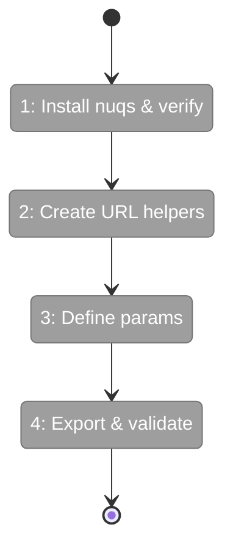
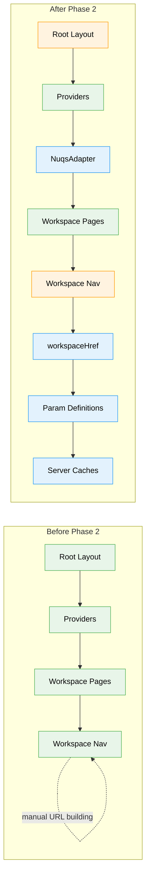

# Flight Plan: Phase 2 — Deep Linking & URL State

**Plan**: [file-browser-plan.md](../../file-browser-plan.md)  
**Phase**: Phase 2: Deep Linking & URL State  
**Generated**: 2025-02-22  
**Status**: Ready for takeoff

---

## Departure → Destination

**Where we are**: Phase 1 is complete. The Workspace entity now has preferences (emoji, color, starred, sortOrder), the registry supports v1→v2 migration with atomic writes, and curated palettes exist. However, none of the workspace pages can encode their state in URLs — every page refresh loses context (which worktree you were viewing, which file was open, what mode was active). Browser bookmarks and tabs can't remember specific page states.

**Where we're going**: By the end of this phase, every page state will be URL-encoded using type-safe params via nuqs. A developer can bookmark `/workspaces/my-proj/browser?file=utils.ts&mode=edit` and return to exactly that state. Different workspaces can live in different browser tabs, all pinnable in browser favorites. The `workspaceHref()` helper will build clean workspace-scoped URLs, and server components can extract typed params without boilerplate.

---

## Flight Status

<!-- Updated by /plan-6: pending → active → done. Use blocked for problems/input needed. -->

**Legend**: grey = pending | yellow = active | red = blocked/needs input | green = done

---

## Stages

<!-- Updated by /plan-6 during implementation: [ ] → [~] → [x] -->

- [ ] **Stage 1: Install nuqs and wire NuqsAdapter** — add the nuqs package, integrate NuqsAdapter into root layout, verify builds pass and existing pages work (`apps/web/package.json`, `apps/web/app/layout.tsx`)
- [ ] **Stage 2: Build URL helper tests** — write failing tests for `workspaceHref()` URL builder covering encoding, param omission, and workspace scoping (`test/unit/web/lib/workspace-url.test.ts` — new file)
- [ ] **Stage 3: Implement URL helpers** — create `workspaceHref()` to build clean workspace URLs, refactor existing `buildWorktreeUrl()` to use it (`apps/web/src/lib/workspace-url.ts` — new file, `apps/web/src/components/workspaces/workspace-nav.tsx`)
- [ ] **Stage 4: Define workspace params with tests** — write tests for `workspaceParams` (worktree) and its server-side cache (`test/unit/web/features/041-file-browser/params.test.ts` — new file)
- [ ] **Stage 5: Define file browser params with tests** — write tests for `fileBrowserParams` (dir, file, mode, changed) and its combined server cache (same test file)
- [ ] **Stage 6: Implement param definitions** — create typed param definitions using nuqs parsers and server-side caches (`apps/web/src/features/041-file-browser/params/workspace.params.ts`, `apps/web/src/features/041-file-browser/params/file-browser.params.ts`, `apps/web/src/features/041-file-browser/params/index.ts` — all new files)
- [ ] **Stage 7: Build parseWorkspacePageProps tests** — write tests for the server component helper that extracts slug and worktree from Next.js page props (`test/unit/web/lib/workspace-url.test.ts`)
- [ ] **Stage 8: Implement parseWorkspacePageProps** — create the helper function that awaits params/searchParams promises and returns typed data (`apps/web/src/lib/workspace-url.ts`)
- [ ] **Stage 9: Export params from feature barrel** — update feature barrel to re-export all param definitions and caches (`apps/web/src/features/041-file-browser/index.ts`)
- [ ] **Stage 10: Verify existing pages unaffected** — manually test 5+ existing pages to ensure NuqsAdapter doesn't break anything (no file changes)
- [ ] **Stage 11: Run full quality gate** — execute `just fft` to confirm zero regressions across lint, format, typecheck, and tests (no file changes)

---

## Acceptance Criteria

- [ ] AC-16: URL-encoded page state via type-safe nuqs params (package installed, adapter wired, param definitions created)
- [ ] AC-17: Bookmark URL restores exact page state (emergent property of AC-16 param system)
- [ ] AC-18: `workspaceHref()` builds workspace-scoped URLs with proper encoding
- [ ] AC-19: NuqsAdapter wired in root layout for app-wide URL state management

---

## Goals & Non-Goals

**Goals**:
- Install `nuqs` and verify Next.js 16 + Turbopack compatibility
- Wire `NuqsAdapter` in root layout inside `<Providers>`
- Create `workspaceHref()` URL builder with encoding + omit-defaults
- Create `workspaceParams` (worktree) and `fileBrowserParams` (dir, file, mode, changed)
- Create `createSearchParamsCache` for server-side param parsing
- Create `parseWorkspacePageProps()` helper for server components
- Export all param definitions from feature barrel

**Non-Goals**:
- Migrating existing pages to use `workspaceHref()` (opportunistic, not required for this phase)
- Building any UI components (Phase 3+)
- Client-side `useQueryStates()` integration (happens when components consume params in Phase 3/4)
- Agent chat params (future feature adds its own param definition)
- Worktree picker URL interaction (Phase 3)

---

## Architecture: Before & After

**Legend**: existing (green, unchanged) | changed (orange, modified) | new (blue, created)

---

## Checklist

- [ ] T001: Install nuqs & wire NuqsAdapter (CS-2)
- [ ] T002: Test workspaceHref (CS-2)
- [ ] T003: Impl workspaceHref (CS-2)
- [ ] T004: Test workspaceParams (CS-1)
- [ ] T005: Test fileBrowserParams (CS-2)
- [ ] T006: Impl param defs + caches (CS-2)
- [ ] T007: Test parseWorkspacePageProps (CS-1)
- [ ] T008: Impl parseWorkspacePageProps (CS-1)
- [ ] T009: Export + barrel update (CS-1)
- [ ] T010: Verify existing pages (CS-1)
- [ ] T011: Full test suite (CS-1)

---

## PlanPak

Active — files organized under `apps/web/src/features/041-file-browser/`
