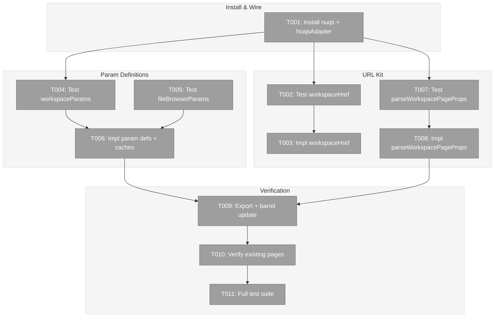
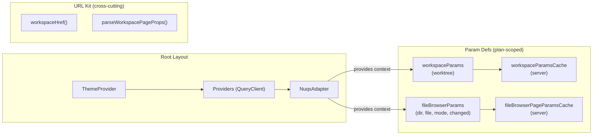
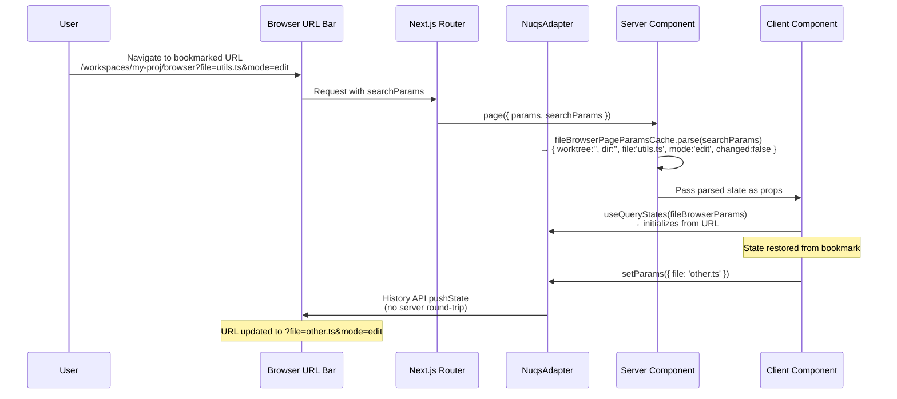

# Phase 2: Deep Linking & URL State – Tasks & Alignment Brief

**Spec**: [file-browser-spec.md](../../file-browser-spec.md)
**Plan**: [file-browser-plan.md](../../file-browser-plan.md)
**Date**: 2026-02-22

---

## Executive Briefing

### Purpose
This phase installs nuqs for type-safe URL state management and creates the workspace URL kit that all subsequent phases depend on. Without this, no page state can be bookmarked, deep-linked, or restored from a URL.

### What We're Building
- `NuqsAdapter` wired in the root layout for app-wide URL state sync
- `workspaceHref()` — a URL builder for workspace-scoped links with proper encoding
- `workspaceParams` — shared `worktree` param definition used by all workspace pages
- `fileBrowserParams` — file browser params (dir, file, mode, changed) with server-side cache
- `parseWorkspacePageProps()` — server component helper to extract slug + worktree from page props

### User Value
Every page state becomes a URL. Users can bookmark `/workspaces/my-proj/browser?file=utils.ts&mode=edit` and return to exactly that state. Different workspaces in different browser tabs, all pinnable in browser favorites.

### Example
```
workspaceHref('my-proj', '/browser', { file: 'README.md', mode: 'preview' }, '/path/to/worktree')
→ '/workspaces/my-proj/browser?worktree=%2Fpath%2Fto%2Fworktree&file=README.md&mode=preview'
```

---

## Objectives & Scope

### Objective
Install nuqs and create the deep linking infrastructure specified in AC-16 through AC-19. This is pure infrastructure — no UI components, no page changes (except wiring NuqsAdapter).

### Goals

- ✅ Install `nuqs` and verify Next.js 16 + Turbopack compatibility (Critical Finding 07)
- ✅ Wire `NuqsAdapter` in root layout inside `<Providers>`
- ✅ Create `workspaceHref()` URL builder with encoding + omit-defaults
- ✅ Create `workspaceParams` (worktree) and `fileBrowserParams` (dir, file, mode, changed)
- ✅ Create `createSearchParamsCache` for server-side param parsing
- ✅ Create `parseWorkspacePageProps()` helper for server components
- ✅ Export all param definitions from feature barrel

### Non-Goals

- ❌ Migrating existing pages to use `workspaceHref()` (opportunistic, per workshop § 6)
- ❌ Building any UI components (Phase 3+)
- ❌ Client-side `useQueryStates()` integration (that happens when components use params in Phase 3/4)
- ❌ Agent chat params (future feature adds its own param definition)
- ❌ Worktree picker URL interaction (Phase 3)

---

## Pre-Implementation Audit

### Summary

| # | File | Action | Origin | Recommendation |
|---|------|--------|--------|----------------|
| 1 | `apps/web/src/lib/workspace-url.ts` | Create | — | **reuse-existing** — retire `buildWorktreeUrl()` from `workspace-nav.tsx` |
| 2 | `apps/web/src/features/041-file-browser/params/workspace.params.ts` | Create | — | keep-as-is |
| 3 | `apps/web/src/features/041-file-browser/params/file-browser.params.ts` | Create | — | keep-as-is |
| 4 | `apps/web/src/features/041-file-browser/params/index.ts` | Create | — | keep-as-is |
| 5 | `test/unit/web/lib/workspace-url.test.ts` | Create | — | keep-as-is |
| 6 | `test/unit/web/features/041-file-browser/params.test.ts` | Create | — | keep-as-is |
| 7 | `apps/web/app/layout.tsx` | Modify | Plans 014,019,web-slick | cross-plan-edit (additive) |
| 8 | `apps/web/src/features/041-file-browser/index.ts` | Modify | Plan 041 Phase 1 | keep-as-is |

### Per-File Detail

#### `apps/web/src/lib/workspace-url.ts` — Duplication Finding
`workspace-nav.tsx:81-85` has an inline `buildWorktreeUrl()` that does the same thing as `workspaceHref()`. Additionally, `workunit-toolbox.tsx` manually builds workspace URLs. When implementing `workspaceHref()`, also update `workspace-nav.tsx` to import it — prevents two URL builders diverging.

### Compliance Check
No violations found. All files match PlanPak classifications (cross-cutting for URL kit, plan-scoped for params).

---

## Requirements Traceability

### Coverage Matrix

| AC | Description | Flow Summary | Files in Flow | Tasks | Status |
|----|-------------|-------------|---------------|-------|--------|
| AC-16 | URL-encoded page state via type-safe nuqs params | package.json → layout.tsx → param definitions → barrel | 7 | T001,T006,T009 | ✅ Complete |
| AC-17 | Bookmark URL restores exact page state | Emergent from AC-16 param system | same as AC-16 | T004,T005,T006 | ✅ Complete |
| AC-18 | `workspaceHref()` builds workspace-scoped URLs | workspace-url.ts → consumers | 1 core | T002,T003,T007,T008 | ✅ Complete |
| AC-19 | NuqsAdapter wired in root layout | package.json → layout.tsx | 2 | T001 | ✅ Complete |

### Gaps Found
None — all 4 ACs have complete file coverage.

### Notes
- AC-18 says "used consistently across all link construction" — Phase 2 creates the helper; migrating existing pages is opportunistic per workshop § 6
- AC-17 is an emergent property of the param definitions + nuqs — no additional files needed

---

## Architecture Map

### Component Diagram



### Task-to-Component Mapping

| Task | Component(s) | Files | Status | Comment |
|------|-------------|-------|--------|---------|
| T001 | nuqs Install | layout.tsx, package.json | ⬜ Pending | Integration spike per Finding 07 |
| T002 | URL Kit Tests | workspace-url.test.ts | ⬜ Pending | RED: workspaceHref() tests |
| T003 | URL Kit Impl | workspace-url.ts, workspace-nav.tsx | ⬜ Pending | GREEN: workspaceHref() + retire buildWorktreeUrl |
| T004 | Param Tests | params.test.ts | ⬜ Pending | RED: workspaceParams server cache |
| T005 | Param Tests | params.test.ts | ⬜ Pending | RED: fileBrowserParams server cache |
| T006 | Param Impl | workspace.params.ts, file-browser.params.ts, params/index.ts | ⬜ Pending | GREEN: param definitions + caches |
| T007 | URL Kit Tests | workspace-url.test.ts | ⬜ Pending | RED: parseWorkspacePageProps() |
| T008 | URL Kit Impl | workspace-url.ts | ⬜ Pending | GREEN: parseWorkspacePageProps() |
| T009 | Barrel Export | index.ts (feature) | ⬜ Pending | Export params from feature barrel |
| T010 | Verification | (manual) | ⬜ Pending | Existing pages unaffected |
| T011 | Validation | (all) | ⬜ Pending | `just fft` green |

---

## Tasks

| Status | ID | Task | CS | Type | Dependencies | Absolute Path(s) | Validation | Subtasks | Notes |
|--------|------|------|-----|------|--------------|-------------------|------------|----------|-------|
| [ ] | T001 | Install `nuqs` in apps/web, wire `NuqsAdapter` in root layout wrapping children inside `<Providers>`. Import from `nuqs/adapters/next/app`. Verify `pnpm build` passes and `pnpm dev` starts without errors. This is the integration spike for Critical Finding 07 — if nuqs is incompatible with Next.js 16 + Turbopack, fall back to custom hooks. | 2 | Setup | – | `/home/jak/substrate/041-file-browser/apps/web/app/layout.tsx`, `/home/jak/substrate/041-file-browser/apps/web/package.json` | `pnpm add nuqs` succeeds. `pnpm build` passes. Dev server starts. No hydration errors on `/` and `/workspaces`. | – | cross-plan-edit, per Finding 07 |
| [ ] | T002 | Write tests for `workspaceHref()`. Tests: basic workspace URL, with worktree param, with feature params (file, mode), omits empty/false/undefined params, encodes worktree paths with slashes, handles slug encoding. | 2 | Test | T001 | `/home/jak/substrate/041-file-browser/test/unit/web/lib/workspace-url.test.ts` | Tests written and FAIL (RED) | – | cross-cutting |
| [ ] | T003 | Implement `workspaceHref()`. Build workspace-scoped URLs: base path `/workspaces/{slug}{subPath}`, add `worktree` param if provided, add feature params (omit empty/false/undefined). Also update `workspace-nav.tsx` to import `workspaceHref` instead of using inline `buildWorktreeUrl()`. | 2 | Core | T002 | `/home/jak/substrate/041-file-browser/apps/web/src/lib/workspace-url.ts`, `/home/jak/substrate/041-file-browser/apps/web/src/components/workspaces/workspace-nav.tsx` | All tests from T002 pass (GREEN). `workspace-nav.tsx` uses `workspaceHref`. | – | cross-cutting, reuse-existing |
| [ ] | T004 | Write tests for `workspaceParams` server-side cache. Tests: empty params → worktree defaults to `''`, populated worktree parsed correctly, non-string worktree ignored. | 1 | Test | T001 | `/home/jak/substrate/041-file-browser/test/unit/web/features/041-file-browser/params.test.ts` | Tests written and FAIL (RED) | – | plan-scoped |
| [ ] | T005 | Write tests for `fileBrowserParams` server-side cache (combined with workspaceParams). Tests: defaults (dir='', file='', mode='preview', changed=false), all params populated, invalid mode falls back to 'preview', boolean 'changed' parses correctly. | 2 | Test | T001 | `/home/jak/substrate/041-file-browser/test/unit/web/features/041-file-browser/params.test.ts` | Tests written and FAIL (RED) | – | plan-scoped |
| [ ] | T006 | Implement param definitions and server-side caches. Create `workspaceParams` (worktree via `parseAsString`), `fileBrowserParams` (dir, file, mode via `parseAsStringLiteral`, changed via `parseAsBoolean`), `workspaceParamsCache`, `fileBrowserPageParamsCache` (combined workspace + file browser). Export from params barrel. | 2 | Core | T004,T005 | `/home/jak/substrate/041-file-browser/apps/web/src/features/041-file-browser/params/workspace.params.ts`, `/home/jak/substrate/041-file-browser/apps/web/src/features/041-file-browser/params/file-browser.params.ts`, `/home/jak/substrate/041-file-browser/apps/web/src/features/041-file-browser/params/index.ts` | All tests from T004-T005 pass (GREEN). | – | plan-scoped |
| [ ] | T007 | Write tests for `parseWorkspacePageProps()`. Tests: extracts slug from params Promise, extracts worktree from searchParams Promise, handles missing worktree (returns undefined), handles array worktree (takes first). | 1 | Test | T001 | `/home/jak/substrate/041-file-browser/test/unit/web/lib/workspace-url.test.ts` | Tests written and FAIL (RED) | – | cross-cutting |
| [ ] | T008 | Implement `parseWorkspacePageProps()`. Accepts Next.js page props (params: Promise, searchParams: Promise), awaits both, extracts slug and optional worktree string. Returns `{ slug, worktree }`. | 1 | Core | T007 | `/home/jak/substrate/041-file-browser/apps/web/src/lib/workspace-url.ts` | All tests from T007 pass (GREEN). | – | cross-cutting |
| [ ] | T009 | Update feature barrel `apps/web/src/features/041-file-browser/index.ts` to re-export param definitions from `./params/`. Export `workspaceParams`, `fileBrowserParams`, `workspaceParamsCache`, `fileBrowserPageParamsCache`. | 1 | Integration | T006,T008 | `/home/jak/substrate/041-file-browser/apps/web/src/features/041-file-browser/index.ts` | Params importable from `@/features/041-file-browser`. | – | plan-scoped |
| [ ] | T010 | Verify existing pages work with NuqsAdapter. Navigate to 5+ existing pages: `/`, `/workspaces`, `/workspaces/[slug]`, `/workspaces/[slug]/worktree`, `/workspaces/[slug]/agents`. No errors in console. | 1 | Verification | T009 | – | All pages render without errors. | – | – |
| [ ] | T011 | Run full test suite and quality checks. `just fft` must pass. Verify no regressions. | 1 | Validation | T010 | – | `just fft` exits 0. Zero test regressions. | – | – |

---

## Alignment Brief

### Prior Phase Review

**Phase 1: Data Model & Infrastructure** (COMPLETE)

Phase 1 delivered:
- `WorkspacePreferences` type (emoji, color, starred, sortOrder) on the Workspace entity
- `DEFAULT_PREFERENCES` constant, `withPreferences()` immutable update
- Curated palettes: 30 emojis, 10 colors with light/dark hex variants
- Atomic write (tmp+rename) in registry adapter
- `update()` on adapter interface + `updatePreferences()` on service with palette validation
- `updateWorkspacePreferences` server action
- PlanPak feature folder at `apps/web/src/features/041-file-browser/`

Key learnings:
- Formal v1→v2 migration unnecessary — spread-with-defaults handles superset schemas (DYK-P1-02)
- Server action testing skipped (no-mocks rule) — service layer tests cover logic
- Biome rejects `any` — use `as unknown as T` pattern
- Barrel file gaps caught by requirements flow — fold into related implementation tasks

**Phase 2 dependency on Phase 1**: None. Phase 2 is purely about nuqs + URL helpers. The feature barrel at `features/041-file-browser/index.ts` (created in Phase 1) is the only shared artifact — Phase 2 adds params exports to it.

### Critical Findings Affecting This Phase

| Finding | Title | Constraint | Tasks |
|---------|-------|-----------|-------|
| 07 | nuqs + Next.js 16 Compatibility Unverified | First task must be integration spike. If nuqs fails with Turbopack, fall back to custom hooks. | T001 |
| 03 | No Conflicts in Provider Chain for nuqs | Existing provider chain is clean. NuqsAdapter wraps inside `<Providers>`. | T001 |

### ADR Decision Constraints

- **ADR-0004: DI Container Architecture** — N/A for Phase 2. No DI registrations — pure functions + nuqs parsers.

### PlanPak Placement Rules

- **Plan-scoped**: `apps/web/src/features/041-file-browser/params/` — param definitions serve only this plan
- **Cross-cutting**: `apps/web/src/lib/workspace-url.ts` — URL kit used by all workspace pages
- **Cross-plan-edit**: `apps/web/app/layout.tsx` — additive NuqsAdapter wrapper

### Invariants & Guardrails

- `NuqsAdapter` must not break existing pages (T010 verifies)
- `workspaceHref()` must omit params with empty/false/undefined values (clean URLs)
- Param defaults must match: `mode='preview'`, `changed=false`, `dir=''`, `file=''`, `worktree=''`
- `fileBrowserParams` mode must be a string literal union `['edit', 'preview', 'diff']`

### System Flow Diagram



### Sequence Diagram — URL State Flow



### Test Plan (Full TDD, No Mocks)

| Test File | Named Tests | Fixtures | Expected Output |
|-----------|-------------|----------|-----------------|
| `workspace-url.test.ts` | `builds basic workspace URL`, `includes worktree param`, `includes feature params`, `omits empty/false/undefined params`, `encodes worktree paths`, `parseWorkspacePageProps extracts slug+worktree`, `handles missing worktree`, `handles array worktree` | None (pure functions) | Correct URL strings |
| `params.test.ts` | `workspaceParams defaults`, `workspaceParams populated`, `fileBrowserParams defaults`, `fileBrowserParams all populated`, `invalid mode falls back`, `changed boolean parses`, `combined cache parses all` | None (nuqs parsers) | Correct parsed param objects |

### Implementation Outline

1. **T001** — `pnpm add nuqs`, wire NuqsAdapter in layout.tsx, verify build
2. **T002** — Write workspaceHref() tests (RED)
3. **T003** — Implement workspaceHref(), retire inline buildWorktreeUrl (GREEN)
4. **T004** — Write workspaceParams cache tests (RED)
5. **T005** — Write fileBrowserParams cache tests (RED)
6. **T006** — Implement param definitions + server caches (GREEN)
7. **T007** — Write parseWorkspacePageProps() tests (RED)
8. **T008** — Implement parseWorkspacePageProps() (GREEN)
9. **T009** — Update feature barrel exports
10. **T010** — Verify existing pages work
11. **T011** — `just fft` green

### Commands to Run

```bash
# Install nuqs
cd apps/web && pnpm add nuqs

# Run specific test files during TDD
pnpm vitest run test/unit/web/lib/workspace-url.test.ts
pnpm vitest run test/unit/web/features/041-file-browser/params.test.ts

# Watch mode
pnpm vitest watch test/unit/web/lib/workspace-url.test.ts

# Full quality gate
just fft
```

### Risks & Unknowns

| Risk | Severity | Mitigation |
|------|----------|------------|
| nuqs incompatible with Next.js 16 / Turbopack | High | T001 is integration spike — verify before building on it. Fallback: custom hooks per Finding 07. |
| NuqsAdapter conflicts with existing providers | Medium | Test hydration on existing pages (T010). Workshop confirms clean provider chain (Finding 03). |
| nuqs `createSearchParamsCache` API may differ in latest version | Low | Check nuqs docs during T006. API is stable (5k+ stars). |

### Ready Check

- [x] ADR constraints mapped — ADR-0004 N/A for Phase 2
- [x] Critical findings mapped — Finding 07 → T001, Finding 03 → T001
- [x] Prior phase reviewed — Phase 1 complete, no dependency
- [x] Pre-implementation audit — no compliance violations
- [x] Requirements traceability — all 4 ACs covered, no gaps
- [ ] **GO / NO-GO**: Awaiting human approval

---

## Phase Footnote Stubs

_Populated by plan-6 during implementation. Do not create footnote tags during planning._

| Footnote | Phase | Task | Description | Impact |
|----------|-------|------|-------------|--------|
| | | | | |

---

## Evidence Artifacts

- **Execution log**: `docs/plans/041-file-browser/tasks/phase-2-deep-linking-url-state/execution.log.md`
- **Supporting files**: Placed in `docs/plans/041-file-browser/tasks/phase-2-deep-linking-url-state/`

---

## Discoveries & Learnings

_Populated during implementation by plan-6. Log anything of interest to your future self._

| Date | Task | Type | Discovery | Resolution | References |
|------|------|------|-----------|------------|------------|
| | | | | | |

**Types**: `gotcha` | `research-needed` | `unexpected-behavior` | `workaround` | `decision` | `debt` | `insight`

**What to log**:
- Things that didn't work as expected
- External research that was required
- Implementation troubles and how they were resolved
- Gotchas and edge cases discovered
- Decisions made during implementation
- Technical debt introduced (and why)
- Insights that future phases should know about

_See also: `execution.log.md` for detailed narrative._

---

## Directory Layout

```
docs/plans/041-file-browser/
  ├── file-browser-plan.md
  ├── file-browser-spec.md
  ├── research.md
  ├── workshops/
  │   ├── deep-linking-system.md
  │   ├── ux-vision-workspace-experience.md
  │   └── workspace-preferences-data-model.md
  └── tasks/
      ├── phase-1-data-model-infrastructure/
      │   ├── tasks.md
      │   ├── tasks.fltplan.md
      │   └── execution.log.md
      └── phase-2-deep-linking-url-state/
          ├── tasks.md                    ← this file
          ├── tasks.fltplan.md            # generated by /plan-5b
          └── execution.log.md            # created by /plan-6
```
