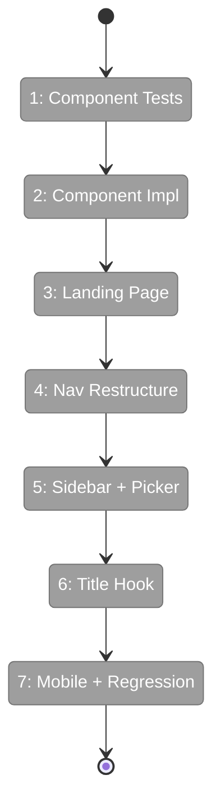

# Flight Plan: Phase 3 — UI Overhaul — Landing Page & Sidebar

**Plan**: [file-browser-plan.md](../../file-browser-plan.md)
**Phase**: Phase 3: UI Overhaul — Landing Page & Sidebar
**Dossier**: [tasks.md](./tasks.md)
**Generated**: 2026-02-23
**Status**: Ready for takeoff

---

## Departure → Destination

**Where we are**: Phases 1 and 2 are complete. The Workspace entity has preferences (emoji, color, starred, sortOrder) with curated palettes of 30 emojis and 10 colors. URL state management is wired — `workspaceHref()` builds typed workspace URLs, nuqs param caches parse them server-side, and NuqsAdapter is live globally. But the landing page is still a placeholder ("Welcome to Chainglass" with two feature cards). The sidebar lists all 10 nav items flat — demos alongside core tools — with no workspace context awareness. Every workspace looks the same: no emoji, no color, no visual identity. You can't tell which tab is which when you have three workspaces open. The whole experience screams "prototype."

**Where we're going**: By the end of this phase, hitting `/` shows a workspace card grid — each card with its emoji, accent color border, worktree summary, and agent status dots. Starred workspaces float to the top. A fleet status bar shows at a glance if any agents need attention. Clicking a card enters the workspace context: the sidebar transforms to show the workspace emoji + name as header, a searchable worktree picker (handling 23+ worktrees gracefully), and focused nav items (Browser, Agents, Workflows). Demo pages move to a collapsed "Dev" section. Browser tab titles update dynamically — `🔮 substrate — Browser` — so you can find the right tab at a glance. The mobile bottom tab bar becomes workspace-aware. Every link uses `workspaceHref()` from Phase 2. The app stops feeling like a prototype and starts feeling like a product.

---

## Flight Status

<!-- Updated by /plan-6: pending → active → done. Use blocked for problems/input needed. -->



**Legend**: grey = pending | yellow = active | red = blocked/needs input | green = done

---

## Stages

### S1: Component Tests (T001, T003)
- [ ] T001: WorkspaceCard tests — renders emoji, name, worktree summary, star toggle, agent dots, color border
- [ ] T003: FleetStatusBar tests — hidden when idle, running count, attention count

### S2: Component Implementation (T002, T004)
- [ ] T002: WorkspaceCard — props-only, reuse ui/card.tsx base
- [ ] T004: FleetStatusBar — returns null when idle

### S3: Landing Page (T006)
- [ ] T006: Landing page with card grid — direct DI service call (DYK-P3-03), starred-first sort, responsive grid

### S4: Navigation Restructure (T007)
- [ ] T007: Split NAV_ITEMS → WORKSPACE_NAV_ITEMS + DEV_NAV_ITEMS + LANDING_NAV_ITEMS

### S5: Sidebar + Picker (T008, T009, T010)
- [ ] T008: WorktreePicker tests — search, starred top, keyboard nav, 23+ items
- [ ] T009: WorktreePicker implementation — popover/sheet, workspaceHref for selection
- [ ] T010: DashboardSidebar restructure — workspace context awareness

### S6: Title Hook (T011, T012)
- [ ] T011: useAttentionTitle tests — emoji prefix, attention indicator
- [ ] T012: useAttentionTitle implementation — document.title management

### S7: Mobile + Regression (T013, T014)
- [ ] T013: BottomTabBar workspace-scoped tabs
- [ ] T014: Full regression — all 21+ pages, `just fft`

---

## Pre-Flight Checklist

- [x] Phase 1 complete (preferences data model, palettes, service layer)
- [x] Phase 2 complete (workspaceHref, nuqs, param caches)
- [x] shadcn Card + StatusBadge available for reuse
- [x] Workspace API exists at `/api/workspaces` (needs preferences extension)
- [x] PlanPak feature folder at `features/041-file-browser/` ready
- [ ] Phase 3 dossier reviewed and approved

---

## Risk Watchlist

| Risk | Impact | Watch For |
|------|--------|-----------|
| Sidebar refactor breaks existing pages | HIGH | T014 regression pass — test all 21+ routes |
| WorktreePicker performance with 23+ items | MEDIUM | Scroll + filter responsiveness |
| Landing page data fetching N+1 | MEDIUM | T005 — batch preferences with existing API |

---

## Architecture: Before → After

### Before
```
/                  → Placeholder "Welcome to Chainglass" with 2 cards
Sidebar            → All NAV_ITEMS flat (10 items including demos)
Mobile             → 3-item BottomTabBar (Home, Workflows, Kanban)
Tab title          → "Chainglass" (static)
```

### After
```
/                  → Workspace card grid (emoji, name, status, worktrees)
Sidebar (landing)  → Hidden or collapsed icons
Sidebar (workspace)→ Emoji+name header, WorktreePicker, Browser/Agents/Workflows, Dev section
Mobile (landing)   → Home tab
Mobile (workspace) → Browser/Agents tabs
Tab title          → "🔮 substrate — Browser" (dynamic emoji + context)
```

---

## Acceptance Criteria

- [ ] AC-1: Workspace card grid on `/` with emoji, name, worktree info, agent dots, path
- [ ] AC-2: Click card navigates to `/workspaces/[slug]`, middle-click opens new tab
- [ ] AC-3: Fleet status bar appears when agents running, hidden when idle
- [ ] AC-5: Starred workspaces at top of grid, star toggle pins/unpins
- [ ] AC-7: Sidebar shows workspace header + worktree picker + Browser/Agents/Workflows inside workspace
- [ ] AC-8: Demo/prototype pages accessible under collapsed "Dev" section
- [ ] AC-9: Worktree picker searchable, handles 20+ items, starred at top, keyboard nav
- [ ] AC-11: Sidebar collapse to icon-only mode with emoji at top
- [ ] AC-14: Emoji + color on landing cards, sidebar header, browser tab title
- [ ] AC-35–39: Responsive at 375px, 768px, 1440px for landing + sidebar

---

## Goals & Non-Goals

**Goals**:
- Workspace card grid on landing page with visual identity (emoji, accent color)
- Fleet status bar showing running/attention agent counts
- Sidebar restructured: workspace-scoped nav + "Dev" collapsed section
- Searchable worktree picker handling 23+ items
- Dynamic browser tab titles with emoji prefix + attention indicator
- Workspace-aware mobile bottom tab bar
- All 21+ existing pages still work after refactor

**Non-Goals**:
- Live SSE updates for fleet status (Phase 5 attention system)
- Workspace settings/manage page (Phase 5)
- File browser page (Phase 4)
- "Add workspace" inline form (existing add flow suffices)
- Worktree-level agent aggregation (data model doesn't support it yet)
- Agent chat or workflow pages (future phases)

---

## Checklist

<!-- Updated by /plan-6 during implementation: [ ] → [~] → [x] -->

- [ ] T001: WorkspaceCard tests (CS-2)
- [ ] T002: WorkspaceCard impl — Server Component (CS-3)
- [ ] T003: FleetStatusBar tests (CS-2)
- [ ] T004: FleetStatusBar impl (CS-2)
- ~~T005: DROPPED (DYK-P3-03)~~
- [ ] T006: Landing page card grid — direct DI call (CS-3)
- [ ] T007: Navigation restructure (CS-2)
- [ ] T008: WorktreePicker tests (CS-3)
- [ ] T009: WorktreePicker impl (CS-3)
- [ ] T010: Sidebar restructure (CS-3)
- [ ] T011: useAttentionTitle tests (CS-1)
- [ ] T012: useAttentionTitle impl (CS-1)
- [ ] T013: BottomTabBar workspace scope (CS-2)
- [ ] T014: Regression verification (CS-2)

---

## PlanPak

Active — new components organized under `apps/web/src/features/041-file-browser/components/` and `hooks/`. Cross-plan edits modify existing files in-place.
