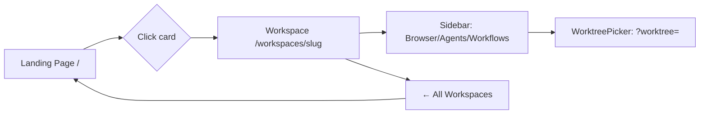
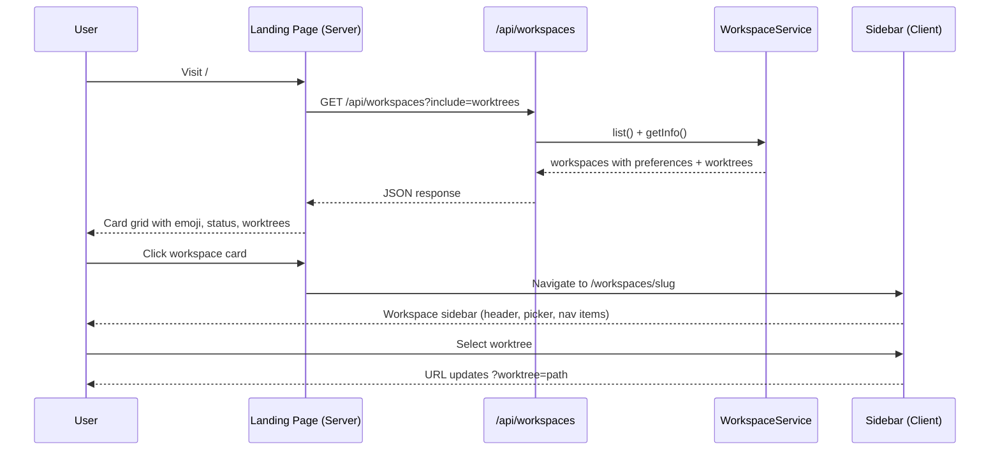

# Phase 3: UI Overhaul — Landing Page & Sidebar

**Plan**: [file-browser-plan.md](../../file-browser-plan.md)
**Phase**: 3 of 6
**Testing**: Full TDD (fakes only, no mocks)
**File Management**: PlanPak
**Target Domains**: `_platform/workspace-url` (consumer), none extracted this phase

---

## Executive Briefing

**Purpose**: Replace the placeholder dashboard landing page with a workspace card grid showing fleet status. Restructure the sidebar to be workspace-scoped — inside a workspace you see Browser/Agents/Workflows; outside you see the card grid. Visual identity (emoji + accent color) renders on cards, sidebar header, and browser tab title.

**What We're Building**: A workspace-first entry experience. The landing page becomes "pick a workspace" — a grid of cards with emoji, name, agent status, and worktree summary. Clicking a card enters the workspace context. The sidebar adapts: workspace pages show workspace nav (Browser, Agents, Workflows, worktree picker); landing page shows no sidebar or collapsed icons. Existing demo/prototype pages move to a collapsed "Dev" section.

**Goals**:
- ✅ Landing page with workspace card grid, fleet status bar, "Add workspace" card
- ✅ Workspace cards display emoji, accent color, worktree summary, agent status dots
- ✅ Sidebar restructured: workspace header, worktree picker, Browser/Agents/Workflows, "Dev" section
- ✅ Dynamic browser tab titles with workspace emoji prefix
- ✅ Responsive layouts (phone bottom tabs, tablet, desktop sidebar)
- ✅ All existing pages still work after sidebar refactor

**Non-Goals**:
- ❌ Worktree-level agent aggregation (data model doesn't support it yet — gracefully omit)
- ❌ Live SSE updates for fleet status (Phase 5 wires attention system)
- ❌ Workspace settings/manage page (Phase 5)
- ❌ File browser page (Phase 4)
- ❌ "Add workspace" inline form (use existing modal/link for now)

---

## Prior Phase Context

### Phase 1: Data Model & Infrastructure

**A. Deliverables**:
- `packages/workflow/src/entities/workspace.ts` — Extended with `preferences` (emoji, color, starred, sortOrder)
- `packages/workflow/src/constants/workspace-palettes.ts` — 30 emojis, 10 colors with light/dark hex
- `packages/workflow/src/adapters/workspace-registry.adapter.ts` — Atomic write, `update()`, spread-with-defaults
- `packages/workflow/src/services/workspace.service.ts` — `updatePreferences()` with palette validation
- `apps/web/app/actions/workspace-actions.ts` — `updateWorkspacePreferences` server action
- `apps/web/src/features/041-file-browser/index.ts` — PlanPak feature folder

**B. Dependencies Exported**:
- `WorkspacePreferences` type: `{ emoji, color, starred, sortOrder }`
- `DEFAULT_PREFERENCES`: `{ emoji: "", color: "", starred: false, sortOrder: 0 }`
- `WORKSPACE_EMOJI_PALETTE` (30 emojis), `WORKSPACE_COLOR_PALETTE` (10 with lightHex/darkHex)
- `WorkspaceColorName` union type
- `IWorkspaceService.updatePreferences(slug, partialPrefs)`
- `IWorkspaceRegistryAdapter.update(slug, workspace)`
- `Workspace.toJSON()` includes `preferences` object

**C. Gotchas & Debt**:
- No formal v1→v2 migration — spread-with-defaults handles missing prefs
- Empty string `""` means "unset" for emoji/color (not null)
- Auto-assign of random emoji/color on `add()` deferred to Phase 3 landing page
- `revalidatePath` scoped to `/workspaces/[slug]` (not `/`)

**D. Incomplete Items**: None — all 16 tasks complete.

**E. Patterns to Follow**:
- Immutable entity: `Workspace.withPreferences()` returns new instance
- Atomic write: tmp+rename pattern
- Palette validation in service layer (not adapter)
- Contract tests against both real and fake implementations

### Phase 2: Deep Linking & URL State

**A. Deliverables**:
- `apps/web/src/lib/workspace-url.ts` — `workspaceHref()` URL builder
- `apps/web/src/lib/params/workspace.params.ts` — `workspaceParams` + `workspaceParamsCache`
- `apps/web/src/features/041-file-browser/params/` — `fileBrowserParams` + `fileBrowserPageParamsCache`
- `apps/web/src/components/providers.tsx` — NuqsAdapter wired inside Providers
- `apps/web/src/components/workspaces/workspace-nav.tsx` — Migrated to `workspaceHref()`

**B. Dependencies Exported**:
- `workspaceHref(slug, subPath, options?)` — flat options API, worktree sorted first
- `workspaceParams` / `workspaceParamsCache` — cross-cutting, in `src/lib/params/`
- `fileBrowserParams` / `fileBrowserPageParamsCache` — plan-scoped
- NuqsAdapter wired globally via Providers component

**C. Gotchas & Debt**:
- `parseAsString` with array input takes first element, not default
- URLSearchParams encodes spaces as `+` not `%20`
- Use `!= null` (loose equality) for null+undefined param checks
- vitest has no `toStartWith` — use `toMatch(/^.../)`

**D. Incomplete Items**: None — all 9 tasks complete.

**E. Patterns to Follow**:
- Server param parsing: `await params` + `cache.parse(await searchParams)` — no wrappers
- Cross-cutting params in `src/lib/params/`; plan-scoped in `features/041-file-browser/params/`
- Feature barrels re-export plan-scoped modules
- Don't duplicate URL builders inline — always use `workspaceHref()`

---

## Pre-Implementation Check

| File | Exists? | Action | Domain | Notes |
|------|---------|--------|--------|-------|
| `apps/web/app/(dashboard)/page.tsx` | ✅ 28 lines | **Modify** | cross-plan-edit | Replace placeholder with workspace card grid |
| `apps/web/src/components/dashboard-sidebar.tsx` | ✅ 109 lines | **Modify** | cross-plan-edit | Restructure: workspace header, workspace/dev nav groups |
| `apps/web/src/lib/navigation-utils.ts` | ✅ 79 lines | **Modify** | cross-plan-edit | Split NAV_ITEMS → WORKSPACE_NAV_ITEMS + DEV_NAV_ITEMS |
| `apps/web/src/components/navigation/bottom-tab-bar.tsx` | ✅ 92 lines | **Modify** | cross-plan-edit | Workspace-scoped phone tabs |
| `apps/web/src/components/workspaces/workspace-nav.tsx` | ✅ 195 lines | **Modify** | cross-plan-edit | Evolve into workspace sidebar header + worktree picker |
| `apps/web/src/components/navigation-wrapper.tsx` | ✅ 38 lines | **Modify** | cross-plan-edit | Conditionally hide sidebar on landing page |
| `apps/web/src/features/041-file-browser/components/workspace-card.tsx` | ❌ | **Create** | plan-scoped | New workspace card component (Server Component, DYK-P3-02) |
| `apps/web/src/features/041-file-browser/components/fleet-status-bar.tsx` | ❌ | **Create** | plan-scoped | New fleet status bar |
| `apps/web/src/features/041-file-browser/components/worktree-picker.tsx` | ❌ | **Create** | plan-scoped | New searchable worktree picker |
| `apps/web/src/features/041-file-browser/hooks/use-attention-title.ts` | ❌ | **Create** | plan-scoped | Browser tab title with emoji prefix |
| `test/unit/web/features/041-file-browser/workspace-card.test.ts` | ❌ | **Create** | test | WorkspaceCard tests |
| `test/unit/web/features/041-file-browser/fleet-status-bar.test.ts` | ❌ | **Create** | test | FleetStatusBar tests |
| `test/unit/web/features/041-file-browser/worktree-picker.test.ts` | ❌ | **Create** | test | WorktreePicker tests |
| `test/unit/web/features/041-file-browser/use-attention-title.test.ts` | ❌ | **Create** | test | useAttentionTitle tests |

**Concept search**: WorkspaceCard is new. FleetStatusBar is new. No existing card/fleet/title hooks to reuse. StatusBadge exists in `ui/status-badge.tsx` — reuse for agent status dots. Card component exists in `ui/card.tsx` — reuse as base.

---

## Architecture Map

```mermaid
flowchart TD
    classDef pending fill:#9E9E9E,stroke:#757575,color:#fff
    classDef completed fill:#4CAF50,stroke:#388E3C,color:#fff
    classDef dropped fill:#BDBDBD,stroke:#9E9E9E,color:#666,stroke-dasharray:5
    classDef inprogress fill:#FF9800,stroke:#F57C00,color:#fff

    subgraph Phase3["Phase 3: UI Overhaul"]
        T001["T001: WorkspaceCard tests ✓"]:::completed
        T002["T002: WorkspaceCard impl ✓"]:::completed
        T003["T003: FleetStatusBar tests ✓"]:::completed
        T004["T004: FleetStatusBar impl ✓"]:::completed
        T005["T005: DROPPED (DYK-P3-03)"]:::dropped
        T006["T006: Landing page ✓"]:::completed
        T007["T007: Navigation restructure ✓"]:::completed
        T008["T008: WorktreePicker tests ✓"]:::completed
        T009["T009: WorktreePicker impl ✓"]:::completed
        T010["T010: Sidebar restructure ✓"]:::completed
        T011["T011: useAttentionTitle tests ✓"]:::completed
        T012["T012: useAttentionTitle impl ✓"]:::completed
        T013["T013: BottomTabBar workspace scope ✓"]:::completed
        T014["T014: Regression verification ✓"]:::completed

        T001 --> T002
        T003 --> T004
        T002 --> T006
        T004 --> T006
        T007 --> T010
        T008 --> T009
        T009 --> T010
        T011 --> T012
        T010 --> T013
        T012 --> T014
        T013 --> T014
        T006 --> T014
    end

    subgraph Files["Files"]
        F1["workspace-card.tsx ✓"]:::completed
        F2["fleet-status-bar.tsx ✓"]:::completed
        F3["worktree-picker.tsx ✓"]:::completed
        F4["use-attention-title.ts ✓"]:::completed
        F5["page.tsx (landing) ✓"]:::completed
        F6["navigation-utils.ts ✓"]:::completed
        F7["dashboard-sidebar.tsx ✓"]:::completed
        F8["bottom-tab-bar.tsx ✓"]:::completed
    end

    T002 -.-> F1
    T004 -.-> F2
    T006 -.-> F5
    T007 -.-> F6
    T009 -.-> F3
    T010 -.-> F7
    T012 -.-> F4
    T013 -.-> F8
```



---

## DYK Decisions

| ID | Priority | Decision | Impact |
|----|----------|----------|--------|
| DYK-P3-01 | HIGH | Agent data is placeholder only — optional props on WorkspaceCard/FleetStatusBar, gracefully omit when absent. Real wiring deferred to future agent system plan. | Simplifies T001-T004, T006. No agent API calls. |
| DYK-P3-02 | HIGH | WorkspaceCard is a Server Component — `<form action>` for star toggle, CSS `:hover`, plain `<a>` links. Zero client JS. | T001/T002 test server-rendered HTML. |
| DYK-P3-03 | HIGH | Landing page uses direct DI service call (`getContainer().resolve<IWorkspaceService>()`), not API route. | **T005 DROPPED.** Phase reduces from 14 → 13 tasks. |
| DYK-P3-04 | MEDIUM | WorktreePicker is pure presentational (props in, callbacks out). `workspace-nav.tsx` stays as data-fetching wrapper, passes worktrees down. | No duplicate fetch. T008/T009 test props only. |
| DYK-P3-05 | MEDIUM | Fallback avatar when emoji empty (first letter of workspace name). Neutral border when color empty. Cards always look complete. | T001 gains fallback test case. No migration needed. |

---

## Tasks

| Status | ID | Task | Domain | Path(s) | Done When | Notes |
|--------|-----|------|--------|---------|-----------|-------|
| [x] | T001 | Write tests for `WorkspaceCard` component | plan-scoped | `test/unit/web/features/041-file-browser/workspace-card.test.ts` | Tests: renders emoji+name, fallback avatar (first letter) when emoji empty (DYK-P3-05), shows branch names when ≤3 worktrees, shows count when >3, star toggle is `<form action>` (DYK-P3-02), accent color left border (neutral when empty), optional agent summary gracefully omitted (DYK-P3-01), card wraps `<a>` link to `/workspaces/[slug]` | Server Component — test rendered HTML. |
| [x] | T002 | Implement `WorkspaceCard` component | plan-scoped | `apps/web/src/features/041-file-browser/components/workspace-card.tsx` | All T001 tests pass. Server Component (no `'use client'`). Props-only. Star toggle via `<form action={updateWorkspacePreferences}>`. Hover via CSS. Uses `workspaceHref()` for link. | DYK-P3-02: idiomatic Server Component. |
| [x] | T003 | Write tests for `FleetStatusBar` component | plan-scoped | `test/unit/web/features/041-file-browser/fleet-status-bar.test.ts` | Tests: hidden when all idle (returns null), shows running count, shows attention count with clickable link. All props optional (DYK-P3-01) — returns null when no data. | Props-only: `{ runningCount?, attentionCount?, firstAttentionHref? }` |
| [x] | T004 | Implement `FleetStatusBar` component | plan-scoped | `apps/web/src/features/041-file-browser/components/fleet-status-bar.tsx` | All T003 tests pass. Returns null when idle or no data. Shows "N agents running" and "◆ N needs attention" with link when present. | Simple conditional render. Server Component. |
| ~~[ ]~~ | ~~T005~~ | ~~Extend workspaces API to include preferences~~ | — | — | — | **DROPPED per DYK-P3-03**: Landing page uses direct DI call, not API. |
| [x] | T006 | Implement landing page (`/`) with card grid | cross-plan-edit | `apps/web/app/(dashboard)/page.tsx` | Server Component uses direct DI service call (DYK-P3-03) to fetch workspaces. Renders WorkspaceCard grid + FleetStatusBar (no agent data for now, DYK-P3-01) + "Add workspace" card. Starred first sort. Responsive grid (1-col phone, 2-col tablet, 3-col desktop). | `getContainer().resolve<IWorkspaceService>()` |
| [x] | T007 | Restructure `navigation-utils.ts` | cross-plan-edit | `apps/web/src/lib/navigation-utils.ts` | `NAV_ITEMS` split into: `WORKSPACE_NAV_ITEMS` (Browser, Agents, Workflows) + `DEV_NAV_ITEMS` (demos, kanban, etc.). Existing consumers updated. Types exported. | Keep `NavItem` interface stable. Add `LANDING_NAV_ITEMS` for Home only. |
| [x] | T008 | Write tests for `WorktreePicker` component | plan-scoped | `test/unit/web/features/041-file-browser/worktree-picker.test.ts` | Tests: renders worktree list, search filters by name, starred worktrees at top, keyboard nav (arrow+enter), scrollable for 23+ items, selection calls callback, empty search shows all | CS 3. Pure presentational — props in, callbacks out (DYK-P3-04). |
| [x] | T009 | Implement `WorktreePicker` component | plan-scoped | `apps/web/src/features/041-file-browser/components/worktree-picker.tsx` | All T008 tests pass. Searchable popover with filter input, starred section, alphabetical rest. Handles 23+ items. Uses `workspaceHref()` for selection. | DYK-P3-04: workspace-nav.tsx fetches, passes worktrees as props. Phone: Sheet. Desktop: Popover. |
| [x] | T010 | Restructure `DashboardSidebar` | cross-plan-edit | `apps/web/src/components/dashboard-sidebar.tsx` | Workspace context: shows emoji+name header (with fallback avatar, DYK-P3-05), workspace-nav wrapping WorktreePicker (DYK-P3-04), WORKSPACE_NAV_ITEMS, "← All Workspaces" link, collapsed DEV_NAV_ITEMS section. Landing page: collapsed icons or hidden. | Finding 04: test all routes after. |
| [x] | T011 | Write tests for `useAttentionTitle` hook | plan-scoped | `test/unit/web/features/041-file-browser/use-attention-title.test.ts` | Tests: sets document.title with emoji prefix, uses fallback (first letter) when emoji empty, adds ❗ when attention flag true, updates when emoji/title/attention change, restores original title on unmount | Client hook — `'use client'` |
| [x] | T012 | Implement `useAttentionTitle` hook | plan-scoped | `apps/web/src/features/041-file-browser/hooks/use-attention-title.ts` | All T011 tests pass. Sets `document.title = \`${emoji} ${pageName}\``. Prepends ❗ when `needsAttention` is true. Cleans up on unmount. | Simple useEffect. |
| [x] | T013 | Update `BottomTabBar` for workspace scope | cross-plan-edit | `apps/web/src/components/navigation/bottom-tab-bar.tsx` | When inside workspace: shows Browser/Agents tabs using WORKSPACE_NAV_ITEMS (with workspace slug in hrefs). Otherwise: shows LANDING_NAV_ITEMS (Home). | Receives workspace context via props or URL segment. |
| [x] | T014 | Regression verification — all pages work | cross-plan-edit | — | Navigate all 21+ existing pages. No broken layouts, no missing nav items. `just fft` passes. | Finding 04: sidebar blast radius. |

---

## Context Brief

### Key findings from plan

- **Finding 04 (HIGH)**: Sidebar refactor blast radius — `DashboardSidebar` is shared by all 21+ pages. Restructure incrementally, test all routes after. → T010 + T014
- **Finding 08 (HIGH)**: Feature folder pattern — follow `features/022-workgraph-ui/` pattern exactly (barrel, fakes alongside reals). → All new components go in `features/041-file-browser/components/`

### Domain dependencies (contracts consumed)

- `_platform/workspace-url`: `workspaceHref(slug, subPath, options?)` — all card links, sidebar nav links, worktree picker selection
- `@chainglass/workflow`: `WorkspacePreferences`, `DEFAULT_PREFERENCES`, `WORKSPACE_EMOJI_PALETTE`, `WORKSPACE_COLOR_PALETTE` — card rendering, random assignment
- `@chainglass/workflow`: `IWorkspaceService.list()`, `.getInfo()`, `.updatePreferences()` — data fetching, star toggle
- `@chainglass/workflow`: `Workspace.toJSON()` with `preferences` — API response shape

### Domain constraints

- Plan-scoped components (`WorkspaceCard`, `FleetStatusBar`, `WorktreePicker`, `useAttentionTitle`) live in `features/041-file-browser/`
- Cross-plan edits (sidebar, landing page, nav utils, API route) modify files in-place
- Import direction: plan code → `@chainglass/workflow` + `src/lib/` ✅ | `@chainglass/workflow` → plan code ❌

### Reusable from prior phases

- `ui/card.tsx` — shadcn Card base component (use for WorkspaceCard)
- `ui/status-badge.tsx` — StatusBadge with dot mode for agent indicators
- `workspaceHref()` — URL construction (Phase 2)
- `workspaceParamsCache` — server-side URL param parsing (Phase 2)
- `updateWorkspacePreferences` server action — star toggle mutation (Phase 1)
- `Workspace.toJSON()` with preferences — API JSON shape (Phase 1)

### System state flow



### Actor interactions



---

## Discoveries & Learnings

_Populated during implementation by plan-6._

| Date | Task | Type | Discovery | Resolution | References |
|------|------|------|-----------|------------|------------|
| 2026-02-23 | T002 | gotcha | `workspaceHref(slug)` without subPath appends "undefined" to URL — subPath is required, not optional | Pass `''` as subPath: `workspaceHref(slug, '')` | log#task-t001 |
| 2026-02-23 | T009 | gotcha | Biome lint rejects `div[role="option"]` and `div[role="listbox"]` — requires semantic elements or button | Changed to `<button>` elements with `aria-current` instead of `role="option"` with `aria-selected` | log#task-t009 |
| 2026-02-23 | T010 | debt | Sidebar header shows decoded slug only — no emoji or display name from workspace preferences | Deferred: requires workspace data plumbing through layout or context. Sidebar renders slug as workspace name for now. Full identity wiring tracked for Phase 5. | log#task-t010, FT-006 |
| 2026-02-23 | T002 | gotcha | `updateWorkspacePreferences` is `(prevState, formData)` for useActionState — can't be used as `<form action>` directly | Created `toggleWorkspaceStar(formData)` single-arg action for `<form action>` | log#task-t002 |
| 2026-02-23 | T012 | debt | `useAttentionTitle` exists and is tested but not wired into workspace pages | Deferred: requires workspace layout wrapper that provides emoji + workspace name. Hook ready for integration when workspace context data flows through layout. | log#task-t012, FT-007 |
| 2026-02-23 | T013 | decision | `toggleWorkspaceStar` silent on failure — no user-visible error | Intentional: Server Component form action has no client feedback mechanism. Action validates slug, logs errors server-side. Future enhancement: wire `useActionState` in client wrapper for toast feedback. | FT-009 |

---

## Phase Footnote Stubs

_Populated by plan-6a during implementation._

| Footnote | Task | File(s) | Description |
|----------|------|---------|-------------|
| [^21] | T001 | `test/unit/web/features/041-file-browser/workspace-card.test.tsx` | NEW: 15 WorkspaceCard tests |
| [^22] | T002 | `apps/web/src/features/041-file-browser/components/workspace-card.tsx` | NEW: Server Component card |
| [^23] | T003 | `test/unit/web/features/041-file-browser/fleet-status-bar.test.tsx` | NEW: 6 FleetStatusBar tests |
| [^24] | T004 | `apps/web/src/features/041-file-browser/components/fleet-status-bar.tsx` | NEW: Server Component fleet bar |
| [^25] | T006 | `apps/web/app/(dashboard)/page.tsx` | REPLACED: Workspace card grid landing page |
| [^26] | T008 | `test/unit/web/features/041-file-browser/worktree-picker.test.tsx` | NEW: 8 WorktreePicker tests |
| [^27] | T009 | `apps/web/src/features/041-file-browser/components/worktree-picker.tsx` | NEW: Searchable worktree picker |
| [^28] | T010 | `apps/web/src/components/dashboard-sidebar.tsx` | RESTRUCTURED: Context-aware sidebar |
| [^29] | T007 | `apps/web/src/lib/navigation-utils.ts` | RESTRUCTURED: Nav item groups |
| [^30] | T011 | `test/unit/web/features/041-file-browser/use-attention-title.test.ts` | NEW: 5 useAttentionTitle tests |
| [^31] | T012 | `apps/web/src/features/041-file-browser/hooks/use-attention-title.ts` | NEW: Tab title hook |
| [^32] | T013 | `apps/web/src/components/navigation/bottom-tab-bar.tsx` | MODIFIED: Workspace-scoped tabs |
| [^33] | T014 | `apps/web/app/actions/workspace-actions.ts`, `apps/web/src/features/041-file-browser/index.ts` | toggleWorkspaceStar + barrel update |

---

## Evidence Artifacts

_Populated during implementation._

- Execution log: `execution.log.md`

---

## Directory Layout

```
docs/plans/041-file-browser/
  ├── file-browser-plan.md
  └── tasks/phase-3-ui-overhaul-landing-page-sidebar/
      ├── tasks.md            ← this file
      ├── tasks.fltplan.md    ← flight plan (generated)
      └── execution.log.md    ← created by plan-6
```
