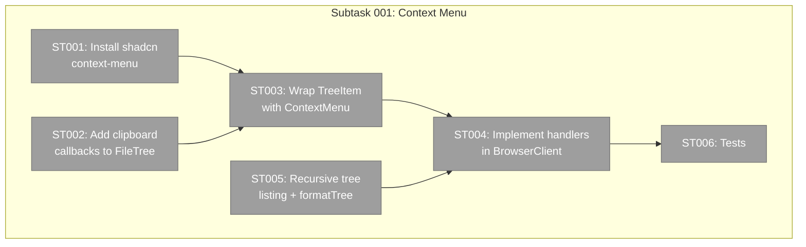
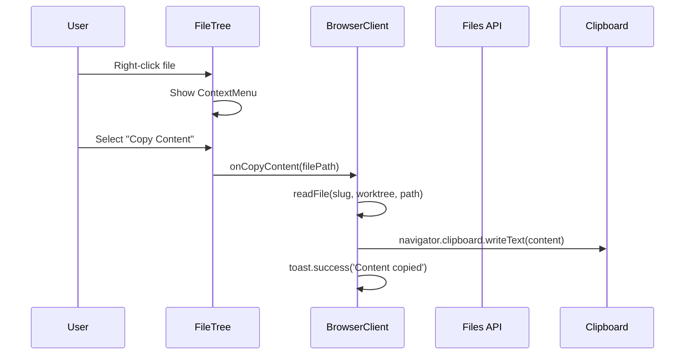

# Subtask 001: Context Menu with Clipboard Operations

**Parent Phase**: Phase 4 — File Browser
**Parent Plan**: [file-browser-plan.md](../../file-browser-plan.md)
**Workshop**: [file-tree-context-menu.md](../../workshops/file-tree-context-menu.md)
**Created**: 2026-02-24
**Status**: Proposed

---

## Parent Context

Phase 4 built the FileTree component with expand/collapse and file selection. This subtask adds right-click context menus with clipboard operations — the first use of shadcn ContextMenu in the project, establishing a reusable UI primitive.

## Executive Briefing

**Purpose**: Add right-click context menus to file tree items so users can quickly copy paths, file content, or directory tree structures to clipboard — essential workflow for developers who need to reference file paths in prompts, docs, or commands.

**What We're Building**: shadcn ContextMenu installed as reusable primitive. File items get "Copy Full Path", "Copy Relative Path", "Copy Content". Folder items get path copies plus "Copy Tree From Here" with `tree`-style formatted output. Toast feedback on all operations.

**Goals**:
- ✅ Right-click any file → copy path or content
- ✅ Right-click any folder → copy path or tree structure
- ✅ Toast confirmation on every clipboard operation
- ✅ shadcn ContextMenu installed as reusable primitive for future features

**Non-Goals**:
- ❌ File operations (rename, delete, move) — future
- ❌ "Open in terminal" or external tool integration
- ❌ Drag and drop

## Pre-Implementation Check

| File | Exists? | Domain Check | Notes |
|------|---------|-------------|-------|
| `apps/web/src/components/ui/context-menu.tsx` | No (create) | shadcn pattern | Installed via `npx shadcn@latest add context-menu` |
| `apps/web/src/features/041-file-browser/components/file-tree.tsx` | Yes (modify) | file-browser ✅ | Wrap TreeItem buttons with ContextMenu |
| `apps/web/app/(dashboard)/workspaces/[slug]/browser/browser-client.tsx` | Yes (modify) | file-browser ✅ | Add clipboard handler callbacks |
| `apps/web/app/api/workspaces/[slug]/files/route.ts` | Yes (modify) | file-browser ✅ | Add `?tree=true` recursive mode |
| `apps/web/src/features/041-file-browser/services/directory-listing.ts` | Yes (modify) | file-browser ✅ | Add `listDirectoryRecursive` |

## Architecture Map



## Tasks

| Status | ID | Task | Domain | Path(s) | Done When | Notes |
|--------|-----|------|--------|---------|-----------|-------|
| [ ] | ST001 | Install shadcn context-menu component | file-browser | `apps/web/src/components/ui/context-menu.tsx` | `import { ContextMenu } from '@/components/ui/context-menu'` resolves | Reusable primitive |
| [ ] | ST002 | Add clipboard callback props to FileTree | file-browser | `apps/web/src/features/041-file-browser/components/file-tree.tsx` | FileTreeProps has `onCopyFullPath`, `onCopyRelativePath`, `onCopyContent`, `onCopyTree` optional callbacks | Workshop D2 |
| [ ] | ST003 | Wrap TreeItem buttons with ContextMenu | file-browser | `apps/web/src/features/041-file-browser/components/file-tree.tsx` | Right-click on file shows 3 items, right-click on folder shows 3 items. Left-click behavior unchanged. | Workshop D1 |
| [ ] | ST004 | Implement clipboard handlers in BrowserClient | file-browser | `apps/web/app/(dashboard)/workspaces/[slug]/browser/browser-client.tsx` | Copy Full Path → clipboard + toast. Copy Relative Path → clipboard + toast. Copy Content → readFile + clipboard + toast. Copy Tree → API + format + clipboard + toast. | Workshop D3 |
| [ ] | ST005 | Add recursive tree listing + formatTree utility | file-browser | `apps/web/src/features/041-file-browser/services/directory-listing.ts`, `apps/web/app/api/workspaces/[slug]/files/route.ts` | `?tree=true` returns recursive entries. `formatTree()` produces `tree`-style text output. Max depth 10. | Workshop D4 |
| [ ] | ST006 | Add tests for context menu and tree formatting | file-browser | `test/unit/web/features/041-file-browser/context-menu.test.tsx`, `test/unit/web/features/041-file-browser/format-tree.test.ts` | Tests verify: formatTree output matches expected tree text, clipboard callbacks fire correct args, context menu renders correct items for file vs folder | |

## Context Brief

**Key findings from workshop**:
- D1: shadcn ContextMenu (Radix) — reusable, accessible, keyboard nav
- D2: Callback pattern — TreeItem stays presentational, BrowserClient handles server calls
- D3: Toast feedback on all clipboard operations via sonner
- D4: `?tree=true` extends existing files API, not a new route

**Domain dependencies**:
- `_platform/notifications`: `toast()` — clipboard feedback
- `file-browser`: `readFile` server action — for Copy Content
- `file-browser`: files API route — for Copy Tree

**Domain constraints**:
- ContextMenu component goes in `components/ui/` (shadcn pattern), not in feature folder
- Clipboard callbacks are optional props — FileTree works without them

**Reusable from prior work**:
- `readFile` server action already available in BrowserClient
- Files API route already handles directory listing
- `toast.success()` / `toast.error()` from Plan 042

**Sequence diagram**:


## Discoveries & Learnings

_Populated during implementation._

| Date | Task | Type | Discovery | Resolution | References |
|------|------|------|-----------|------------|------------|

## After Subtask Completion

Resume Phase 4 / Phase 5 work. The ContextMenu component at `components/ui/context-menu.tsx` is now available for any future right-click menus (workgraph nodes, agent list, etc).

---

```
docs/plans/041-file-browser/
  ├── file-browser-plan.md
  └── tasks/phase-4-file-browser/
      ├── tasks.md
      ├── tasks.fltplan.md
      ├── execution.log.md
      ├── review.md
      └── 001-subtask-context-menu-clipboard.md  ← this file
```
