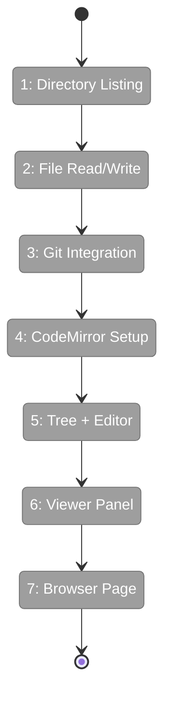

# Flight Plan: Phase 4 — File Browser

**Plan**: [file-browser-plan.md](../../file-browser-plan.md)
**Phase**: Phase 4: File Browser
**Dossier**: [tasks.md](./tasks.md)
**Generated**: 2026-02-23
**Status**: Ready for takeoff

---

## Departure → Destination

**Where we are**: Phases 1–3 are complete. The workspace data model has preferences with palettes. URL state management is live — `fileBrowserParams` defines `dir`, `file`, `mode`, and `changed` params with server-side caches. The sidebar has a "Browser" link in `WORKSPACE_NAV_ITEMS`. Existing viewer components (FileViewer, MarkdownViewer, DiffViewer) render code, markdown, and git diffs. Shiki does server-side syntax highlighting. IFileSystem and IPathResolver are in DI. But there's no actual file browser — clicking "Browser" in the sidebar goes nowhere. You can't browse files, you can't edit code, you can't see diffs within a workspace context.

**Where we're going**: By the end of this phase, `/workspaces/chainglass-main/browser` shows a two-panel layout. Left: a file tree built from `git ls-files` showing workspace files grouped by directory, with expand/collapse, refresh, and a "changed only" toggle. Right: a file viewer panel with three modes — Edit (CodeMirror 6 with syntax highlighting), Preview (markdown with mermaid, or read-only code), and Diff (uncommitted git changes). Save checks mtime to catch conflicts. Every state is URL-encoded: bookmark a file in edit mode, open it later, it's right there. Path traversal and symlink escapes are blocked. Large files show a warning instead of crashing. The file browser is the core feature that makes workspaces useful.

---

## Flight Status

<!-- Updated by /plan-6: pending → active → done -->



**Legend**: grey = pending | yellow = active | red = blocked/needs input | green = done

---

## Stages

### S1: Infrastructure (T001, T013, T014)
- [ ] T001: Add realpath() to IFileSystem + fakes (DYK-P4-02)
- [ ] T013: Extract shared detectLanguage() utility (DYK-P4-05)
- [ ] T014: Install @uiw/react-codemirror + language extensions

### S2: Directory Listing + API (T002–T005)
- [ ] T002: Tests for lazy per-directory listing (DYK-P4-03)
- [ ] T003: Implement directory listing service
- [ ] T004: Tests for files API route (DYK-P4-01)
- [ ] T005: Implement GET /api/workspaces/[slug]/files route

### S3: File Read/Write (T006–T009)
- [ ] T006: Tests for readFile (size, binary, security, realpath)
- [ ] T007: Implement readFile server action
- [ ] T008: Tests for saveFile (mtime conflict, atomic write)
- [ ] T009: Implement saveFile server action

### S4: Git Integration (T010–T012)
- [ ] T010: Tests for changed-files filter
- [ ] T011: Implement changed-files filter
- [ ] T012: Extend getGitDiff with workspace cwd

### S5: Tree + Editor Components (T015–T018)
- [ ] T015: Tests for FileTree (lazy expand, filter, refresh)
- [ ] T016: Implement FileTree
- [ ] T017: Tests for CodeEditor wrapper (thin, stubbed)
- [ ] T018: Implement CodeEditor (lazy-loaded)

### S6: Viewer Panel (T019, T020)
- [ ] T019: Tests for FileViewerPanel (mode toggle, save, conflict)
- [ ] T020: Implement FileViewerPanel

### S7: Browser Page + Regression (T021, T022)
- [ ] T021: Implement browser page with URL state (DYK-P4-01 hybrid)
- [ ] T022: Full regression — `just fft`

---

## Acceptance Criteria

- [ ] AC-20: Two-panel layout at /workspaces/[slug]/browser
- [ ] AC-21: File tree uses git ls-files, falls back to readDir
- [ ] AC-22: Changed-only toggle via git diff --name-only
- [ ] AC-23: File tree refresh button
- [ ] AC-24: Edit/Preview/Diff mode buttons in URL
- [ ] AC-25: Edit mode: CodeMirror 6 with syntax highlighting
- [ ] AC-26: Preview mode: MarkdownViewer or read-only FileViewer
- [ ] AC-27: Diff mode: DiffViewer with workspace-scoped paths
- [ ] AC-28: Save with mtime conflict detection
- [ ] AC-29: File viewer refresh button
- [ ] AC-30: Large file / binary file messages
- [ ] AC-44: Directory listing API with path validation
- [ ] AC-45: readFile server action with IPathResolver
- [ ] AC-46: saveFile with conflict detection
- [ ] AC-47: getGitDiff extended for workspace paths

---

## Goals & Non-Goals

**Goals**:
- Backend file operations with security (path traversal, symlink escape)
- Frontend tree + viewer with three modes
- URL-driven state for deep linking
- Integration with existing viewers (FileViewer, MarkdownViewer, DiffViewer)
- CodeMirror 6 editor lazy-loaded

**Non-Goals**:
- File creation/deletion
- Multi-file tabs
- Search within files
- Git commit/push from UI
- Live file watching (Phase 5)
- Mobile-optimized editor

---

## Checklist

- [ ] T001: IFileSystem.realpath() (CS-2)
- [ ] T002: Directory listing tests (CS-3)
- [ ] T003: Directory listing impl (CS-3)
- [ ] T004: Files API route tests (CS-2)
- [ ] T005: Files API route impl (CS-2)
- [ ] T006: readFile tests (CS-3)
- [ ] T007: readFile impl (CS-2)
- [ ] T008: saveFile tests (CS-3)
- [ ] T009: saveFile impl (CS-3)
- [ ] T010: Changed files tests (CS-2)
- [ ] T011: Changed files impl (CS-2)
- [ ] T012: getGitDiff cwd extension (CS-2)
- [ ] T013: detectLanguage utility (CS-1)
- [ ] T014: Install CodeMirror (CS-1)
- [ ] T015: FileTree tests (CS-3)
- [ ] T016: FileTree impl (CS-3)
- [ ] T017: CodeEditor tests (CS-2)
- [ ] T018: CodeEditor impl (CS-3)
- [ ] T019: FileViewerPanel tests (CS-3)
- [ ] T020: FileViewerPanel impl (CS-3)
- [ ] T021: Browser page (CS-3)
- [ ] T022: Regression (CS-1)

---

## Architecture: Before → After

### Before
```
/workspaces/[slug]/browser  → Does not exist (404)
File operations              → No server actions for file read/write
Git integration              → getGitDiff() hardcoded to process.cwd()
CodeMirror                   → Not installed
```

### After
```
/workspaces/[slug]/browser  → Two-panel file browser with URL state
File operations              → readFile/saveFile with security + conflict detection
Git integration              → getGitDiff(cwd), git ls-files, git diff --name-only
CodeMirror                   → Lazy-loaded editor with theme sync
```

---

## PlanPak

Active — new services and components in `apps/web/src/features/041-file-browser/`. Server actions in `apps/web/app/actions/`. Browser page route in `apps/web/app/(dashboard)/workspaces/[slug]/browser/`.
