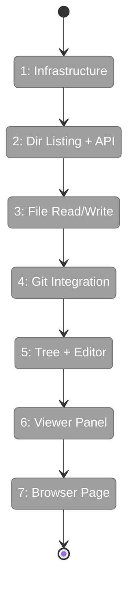

# Flight Plan: Phase 4 — File Browser

**Plan**: [file-browser-plan.md](../../file-browser-plan.md)
**Phase**: Phase 4: File Browser
**Dossier**: [tasks.md](./tasks.md)
**Generated**: 2026-02-24
**Status**: Ready for takeoff

---

## Departure → Destination

**Where we are**: Phases 1–3 are complete. The workspace data model has preferences. URL state management is live — `fileBrowserParams` defines `dir`, `file`, `mode`, and `changed` params. The sidebar has a "Browser" link. Existing viewer components (FileViewer, MarkdownViewer, DiffViewer) render code, markdown, and git diffs. Shiki does server-side syntax highlighting. IFileSystem and IPathResolver are in DI. But clicking "Browser" in the sidebar goes nowhere — there's no file browser.

**Where we're going**: `/workspaces/chainglass-main/browser` shows a two-panel layout. Left: file tree loaded lazily per directory from `git ls-files`, with expand/collapse, refresh, and "changed only" toggle. Right: file viewer with Edit (CodeMirror 6), Preview (markdown or read-only code), and Diff (uncommitted changes). Save checks mtime for conflicts. Every state is URL-encoded — bookmark a file in edit mode, come back later, it's right there. Path traversal and symlink escapes are blocked. Large/binary files show warnings. This is the core feature that makes workspaces useful.

---

## Domain Context

### Domains Changed

| Domain | Type | What Changes | Key Files |
|--------|------|-------------|-----------|
| `@chainglass/shared` | cross-plan | Add `realpath()` to IFileSystem interface + adapters + fakes | `packages/shared/src/interfaces/filesystem.interface.ts` |
| Plan 041 feature | plan-scoped | New services (directory listing, changed files), components (FileTree, CodeEditor, FileViewerPanel), server actions (readFile, saveFile) | `apps/web/src/features/041-file-browser/` |
| cross-cutting | lib | New `detectLanguage()` utility, extended `getGitDiff()` | `apps/web/src/lib/` |

### Domains Consumed

| Domain | Contract | Usage |
|--------|----------|-------|
| `_platform/workspace-url` | `workspaceHref()` | Browser page URLs |
| `_platform/workspace-url` | `fileBrowserPageParamsCache` | Server-side URL params |
| `_platform/workspace-url` | `fileBrowserParams` + `useQueryStates` | Client-side URL state |
| `@chainglass/shared` | `IFileSystem` (DI) | All file operations |
| `@chainglass/shared` | `IPathResolver.resolvePath()` | Security validation |
| `@chainglass/workflow` | `IWorkspaceService.getInfo()` | Workspace path + git status |

---

## Flight Status



**Legend**: grey = pending | yellow = active | red = blocked | green = done

---

## Stages

### S1: Infrastructure (T001, T013, T014)
- [ ] T001: Add realpath() to IFileSystem + fakes
- [ ] T013: Extract shared detectLanguage() utility
- [ ] T014: Install @uiw/react-codemirror

### S2: Directory Listing + API (T002–T005)
- [ ] T002: Tests for lazy per-directory listing
- [ ] T003: Implement directory listing service
- [ ] T004: Tests for files API route
- [ ] T005: Implement GET /api/workspaces/[slug]/files

### S3: File Read/Write (T006–T009)
- [ ] T006: Tests for readFile (security, size, binary)
- [ ] T007: Implement readFile server action
- [ ] T008: Tests for saveFile (conflict, atomic write)
- [ ] T009: Implement saveFile server action

### S4: Git Integration (T010–T012)
- [ ] T010: Tests for changed-files filter
- [ ] T011: Implement changed-files filter
- [ ] T012: Extend getGitDiff with workspace cwd

### S5: Tree + Editor (T015–T018)
- [ ] T015: Tests for FileTree (lazy expand, filter)
- [ ] T016: Implement FileTree
- [ ] T017: Tests for CodeEditor wrapper
- [ ] T018: Implement CodeEditor (lazy-loaded)

### S6: Viewer Panel (T019, T020)
- [ ] T019: Tests for FileViewerPanel
- [ ] T020: Implement FileViewerPanel

### S7: Browser Page + Regression (T021, T022)
- [ ] T021: Implement browser page (hybrid fetch + URL state)
- [ ] T022: Regression — `just fft`

---

## Architecture: Before → After

### Before
```
/workspaces/[slug]/browser  → 404
File read/write              → No server actions
git integration              → getGitDiff() hardcoded to cwd
IFileSystem                  → No realpath()
Language detection           → Inline in shiki-processor
CodeMirror                   → Not installed
```

### After
```
/workspaces/[slug]/browser  → Two-panel file browser, all state in URL
File read/write              → readFile/saveFile with security + conflict detection
git integration              → getGitDiff(cwd), git ls-files per-dir, git diff --name-only
IFileSystem                  → realpath() for symlink detection
Language detection           → Shared detectLanguage() utility
CodeMirror                   → Lazy-loaded editor with theme sync
```

---

## Acceptance Criteria

- [ ] AC-20: Two-panel layout at /workspaces/[slug]/browser
- [ ] AC-21: File tree uses git ls-files (lazy per-dir), readDir fallback
- [ ] AC-22: Changed-only toggle via git diff --name-only
- [ ] AC-23: File tree refresh button
- [ ] AC-24: Edit/Preview/Diff mode buttons reflected in URL
- [ ] AC-25: Edit mode with CodeMirror 6
- [ ] AC-26: Preview mode with MarkdownViewer or FileViewer
- [ ] AC-27: Diff mode with workspace-scoped DiffViewer
- [ ] AC-28: Save with mtime conflict detection
- [ ] AC-29: File viewer refresh button
- [ ] AC-30: Large file / binary file messages
- [ ] AC-44: Directory listing API with path validation
- [ ] AC-45: readFile with IPathResolver
- [ ] AC-46: saveFile with conflict detection
- [ ] AC-47: getGitDiff with workspace paths

---

## Goals & Non-Goals

**Goals**: Backend file operations with security, frontend tree + viewer, URL-driven state, lazy loading, CodeMirror editor.

**Non-Goals**: File creation/deletion, multi-file tabs, search, git commit/push, live watching, mobile editor.

---

## Checklist

- [ ] T001: IFileSystem.realpath() (CS-2)
- [ ] T002: Dir listing tests (CS-3)
- [ ] T003: Dir listing impl (CS-3)
- [ ] T004: Files API tests (CS-2)
- [ ] T005: Files API route (CS-2)
- [ ] T006: readFile tests (CS-3)
- [ ] T007: readFile impl (CS-2)
- [ ] T008: saveFile tests (CS-3)
- [ ] T009: saveFile impl (CS-3)
- [ ] T010: Changed files tests (CS-2)
- [ ] T011: Changed files impl (CS-2)
- [ ] T012: getGitDiff cwd (CS-2)
- [ ] T013: detectLanguage (CS-1)
- [ ] T014: Install CodeMirror (CS-1)
- [ ] T015: FileTree tests (CS-3)
- [ ] T016: FileTree impl (CS-3)
- [ ] T017: CodeEditor tests (CS-2)
- [ ] T018: CodeEditor impl (CS-3)
- [ ] T019: ViewerPanel tests (CS-3)
- [ ] T020: ViewerPanel impl (CS-3)
- [ ] T021: Browser page (CS-3)
- [ ] T022: Regression (CS-1)

---

## PlanPak

Active — services and components in `apps/web/src/features/041-file-browser/`. Server actions in `apps/web/app/actions/`. Route in `apps/web/app/(dashboard)/workspaces/[slug]/browser/`.
