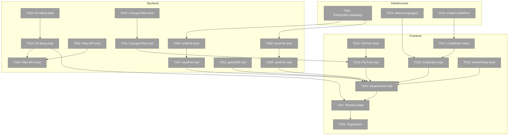
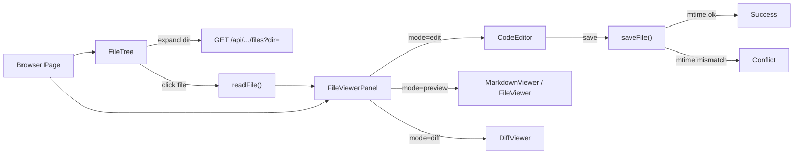
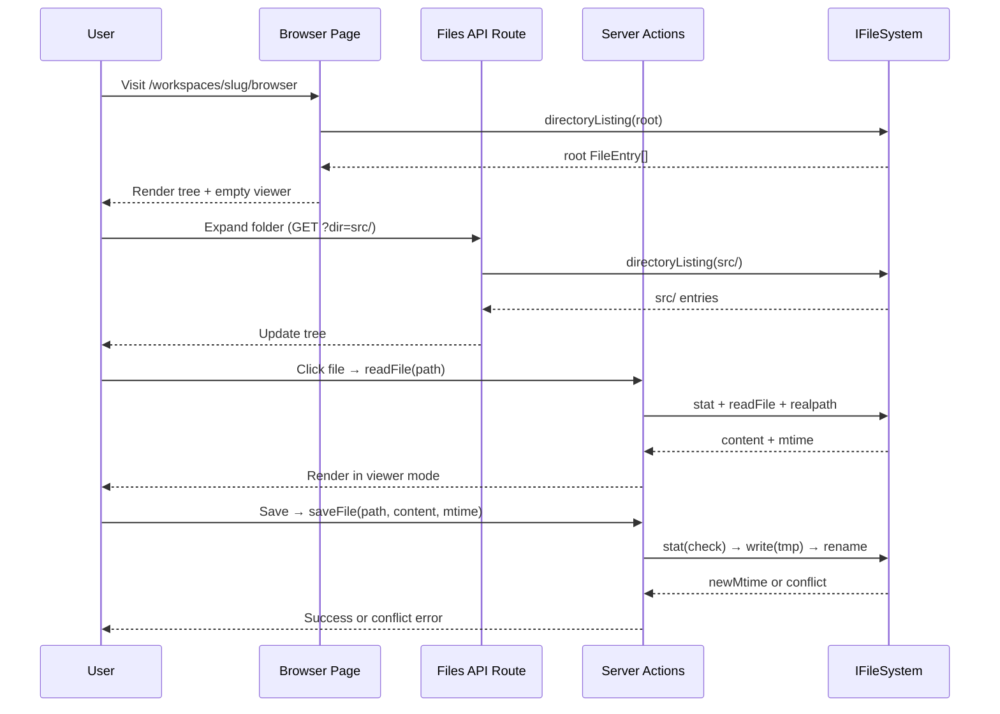

# Phase 4: File Browser — Tasks & Context Brief

**Plan**: [file-browser-plan.md](../../file-browser-plan.md)
**Phase**: 4 of 6
**Testing**: Full TDD (fakes only, no mocks — CodeMirror stub justified)
**File Management**: PlanPak

---

## Executive Briefing

**Purpose**: Build the core file browser — the central feature of Plan 041. Users navigate workspace files, view with syntax highlighting, edit with CodeMirror, preview markdown, and view git diffs.

**What We're Building**: A two-panel page at `/workspaces/[slug]/browser`. Left: file tree from `git ls-files` (lazy per-directory). Right: viewer panel with Edit/Preview/Diff modes, save with conflict detection. All state URL-encoded.

**Goals**:
- ✅ Lazy directory listing via `git ls-files -- <dir>` with `readDir` fallback
- ✅ File read with 5MB limit, binary detection, symlink escape prevention
- ✅ File save with mtime conflict detection + atomic write
- ✅ Changed-files filter via `git diff --name-only`
- ✅ CodeMirror 6 editor (lazy-loaded, theme-synced)
- ✅ File viewer panel with Edit/Preview/Diff toggle
- ✅ Browser page with URL-driven state via nuqs
- ✅ API route for client-side directory fetching

**Non-Goals**:
- ❌ File creation/deletion
- ❌ Multi-file tabs or search within files
- ❌ Git commit/push from UI
- ❌ Live file watching (Phase 5)
- ❌ Mobile-optimized editor

---

## DYK Decisions

| ID | Priority | Decision |
|----|----------|----------|
| DYK-P4-01 | HIGH | Hybrid fetch: server props for initial tree + `GET /api/workspaces/[slug]/files` route for lazy expansion |
| DYK-P4-02 | HIGH | Add `realpath()` to IFileSystem + fakes. Cross-plan edit for testable symlink detection. |
| DYK-P4-03 | HIGH | Lazy per-directory: `git ls-files -- <dir>` scoped. Scales to huge repos. |
| DYK-P4-04 | MEDIUM | CodeEditor: thin wrapper tests, stub CodeMirror in jsdom. Justified deviation. |
| DYK-P4-05 | MEDIUM | Shared `detectLanguage(filename)` for Shiki + CodeMirror. Single source of truth. |

---

## Prior Phase Context

### Phase 1: Data Model & Infrastructure

**A. Deliverables**: Workspace entity with preferences, atomic writes, `updatePreferences()` service+action, DI-registered workspace service, feature folder scaffold.

**B. Dependencies Exported**: `IWorkspaceService.getInfo(slug)` → workspace path + worktrees. `FakeFileSystem`, `FakeWorkspaceRegistryAdapter`, `FakePathResolver` for testing.

**C. Gotchas**: Biome rejects `as any` — use `as unknown as {...}`. sortOrder validation rejects negative/NaN. Cache invalidation scoped to `/workspaces/[slug]`.

**D. Incomplete**: None.

**E. Patterns**: Immutable entities (`withPreferences()` returns new instance). Atomic write (tmp+rename). Service-layer validation. Contract tests against real + fake.

### Phase 2: Deep Linking & URL State

**A. Deliverables**: `workspaceHref(slug, subPath, options?)`, `workspaceParams`/`workspaceParamsCache`, `fileBrowserParams`/`fileBrowserPageParamsCache`, NuqsAdapter in Providers.

**B. Dependencies Exported**: `fileBrowserParams` with `dir`, `file`, `mode` (edit|preview|diff), `changed` (boolean). `fileBrowserPageParamsCache` for server-side parsing. `useQueryStates(fileBrowserParams)` for client-side.

**C. Gotchas**: `workspaceHref(slug, '')` — subPath required. `parseAsString` takes first array element. URLSearchParams encodes spaces as `+`.

**D. Incomplete**: None.

**E. Patterns**: No custom wrappers — pages use `await params` + `cache.parse(await searchParams)`. Cross-cutting params in `src/lib/params/`. Feature barrels re-export.

### Phase 3: UI Overhaul

**A. Deliverables**: WorkspaceCard, FleetStatusBar, WorktreePicker, useAttentionTitle, landing page, restructured sidebar+nav+bottom-tab-bar, worktree starring.

**B. Dependencies Exported**: `WORKSPACE_NAV_ITEMS` includes Browser link. `toggleWorktreeStar` action. Sidebar is workspace-context-aware.

**C. Gotchas**: `updateWorkspacePreferences` is `(prevState, formData)` for useActionState — single-arg wrappers needed for `<form action>`. Biome rejects `div[role="option"]`.

**D. Incomplete**: Sidebar emoji/title hook wiring deferred to Phase 5.

**E. Patterns**: Server Components by default. `<form action>` for mutations. Direct DI in server pages. Pure presentational components (props in, callbacks out).

### Existing Infrastructure

| Component | Location | What Phase 4 Uses |
|-----------|----------|-------------------|
| IFileSystem | `packages/shared` (DI) | `readFile`, `writeFile`, `readDir`, `stat`, `rename` + new `realpath` |
| IPathResolver | `packages/shared` (DI) | `resolvePath(base, relative)` — PathSecurityError on traversal |
| git-diff-action | `apps/web/src/lib/server/git-diff-action.ts` | `getGitDiff()` — extend with `cwd` param |
| shiki-processor | `apps/web/src/lib/server/shiki-processor.ts` | `highlightCodeAction(code, lang)` |
| FileViewer | `apps/web/src/components/viewers/file-viewer.tsx` | Read-only syntax-highlighted code |
| MarkdownViewer | `apps/web/src/components/viewers/markdown-viewer.tsx` | Markdown preview with mermaid |
| DiffViewer | `apps/web/src/components/viewers/diff-viewer.tsx` | Git diff unified/split views |

---

## Pre-Implementation Check

| File | Exists? | Action | Notes |
|------|---------|--------|-------|
| `packages/shared/src/interfaces/filesystem.interface.ts` | ✅ | Modify | Add `realpath()` method |
| `packages/shared/src/adapters/node-filesystem.adapter.ts` | ✅ | Modify | Implement `realpath()` |
| `packages/shared/src/fakes/fake-filesystem.ts` | ✅ | Modify | Add `realpath()` with symlink simulation |
| `apps/web/src/features/041-file-browser/services/directory-listing.ts` | ❌ | Create | plan-scoped service |
| `apps/web/app/api/workspaces/[slug]/files/route.ts` | ❌ | Create | New API route |
| `apps/web/app/actions/file-actions.ts` | ❌ | Create | readFile + saveFile server actions |
| `apps/web/src/features/041-file-browser/services/changed-files.ts` | ❌ | Create | plan-scoped service |
| `apps/web/src/lib/server/git-diff-action.ts` | ✅ | Modify | Add optional `cwd` param |
| `apps/web/src/lib/language-detection.ts` | ❌ | Create | cross-cutting utility |
| `apps/web/src/features/041-file-browser/components/file-tree.tsx` | ❌ | Create | plan-scoped component |
| `apps/web/src/features/041-file-browser/components/code-editor.tsx` | ❌ | Create | plan-scoped component |
| `apps/web/src/features/041-file-browser/components/file-viewer-panel.tsx` | ❌ | Create | plan-scoped component |
| `apps/web/app/(dashboard)/workspaces/[slug]/browser/page.tsx` | ❌ | Create | New route |

---

## Architecture Map



---

## Tasks

| Status | ID | Task | Domain | Path(s) | Done When | Notes |
|--------|-----|------|--------|---------|-----------|-------|
| [ ] | T001 | Add `realpath()` to IFileSystem interface + NodeFileSystemAdapter + FakeFileSystem | cross-plan | `packages/shared/src/interfaces/filesystem.interface.ts`, adapters, fakes | FakeFileSystem.realpath() resolves paths; can simulate symlink escape via configurable map | DYK-P4-02. CS-2. |
| [ ] | T002 | Write tests for directory listing service | plan-scoped | `test/unit/web/features/041-file-browser/directory-listing.test.ts` | Tests: git repo lists files for given dir only, non-git uses readDir, `../` → PathSecurityError, empty → `[]`, one-level entries (not full tree) | DYK-P4-03. Finding 05. CS-3. |
| [ ] | T003 | Implement directory listing service | plan-scoped | `apps/web/src/features/041-file-browser/services/directory-listing.ts` | All T002 tests pass. `execFile('git', ['ls-files', '--', dir])` scoped. `readDir` fallback. Returns `FileEntry[]`. | DYK-P4-03. CS-3. |
| [ ] | T004 | Write tests for files API route | plan-scoped | `test/unit/web/features/041-file-browser/files-api.test.ts` | GET → `{ entries }`, invalid path → 400, `../` → 403, workspace not found → 404 | DYK-P4-01. CS-2. |
| [ ] | T005 | Implement `GET /api/workspaces/[slug]/files` route | cross-plan | `apps/web/app/api/workspaces/[slug]/files/route.ts` | All T004 tests pass. Uses directory listing service via DI. | DYK-P4-01. AC-44. CS-2. |
| [ ] | T006 | Write tests for `readFile()` server action | plan-scoped | `test/unit/web/features/041-file-browser/file-actions.test.ts` | Returns `{ content, mtime, size, language }`. >5MB → `file-too-large`. Null-byte → `binary-file`. `../` → PathSecurityError. Symlink escape → PathSecurityError. Not found → `not-found`. | DYK-P4-02. Finding 02, 09. CS-3. |
| [ ] | T007 | Implement `readFile()` server action | plan-scoped | `apps/web/app/actions/file-actions.ts` | All T006 tests pass. stat check → null-byte scan → realpath verification via IFileSystem.realpath(). | Finding 02, 09. CS-2. |
| [ ] | T008 | Write tests for `saveFile()` server action | plan-scoped | `test/unit/web/features/041-file-browser/file-actions.test.ts` | Save → `{ ok, newMtime }`. Mtime mismatch → `{ error: 'conflict', serverMtime }`. force=true overrides. Atomic tmp+rename. `../` → PathSecurityError. | Finding 06. CS-3. |
| [ ] | T009 | Implement `saveFile()` server action | plan-scoped | `apps/web/app/actions/file-actions.ts` | All T008 tests pass. Atomic: writeFile(tmp) + rename(tmp, target). | Finding 06. CS-3. |
| [ ] | T010 | Write tests for changed-files filter | plan-scoped | `test/unit/web/features/041-file-browser/changed-files.test.ts` | Returns `string[]` of changed paths. Empty when clean. Non-git → `not-git` error. | CS-2. |
| [ ] | T011 | Implement changed-files filter | plan-scoped | `apps/web/src/features/041-file-browser/services/changed-files.ts` | All T010 tests pass. `execFile('git', ['diff', '--name-only'])` with workspace cwd. | CS-2. |
| [ ] | T012 | Extend `getGitDiff()` with optional `cwd` param | cross-plan | `apps/web/src/lib/server/git-diff-action.ts` | Existing tests still pass. Workspace path used as cwd. | AC-47. CS-2. |
| [ ] | T013 | Extract shared `detectLanguage(filename)` utility | cross-cutting | `apps/web/src/lib/language-detection.ts` | Tests: .ts→typescript, .md→markdown, .py→python, unknown→plaintext. Shiki processor updated to consume it. | DYK-P4-05. CS-1. |
| [ ] | T014 | Install `@uiw/react-codemirror` + language extensions | cross-plan | `apps/web/package.json` | Installed, `pnpm build` passes. | CS-1. |
| [ ] | T015 | Write tests for `FileTree` component | plan-scoped | `test/unit/web/features/041-file-browser/file-tree.test.tsx` | Renders entries. Expand fires onExpand callback. File click fires onSelect. Changed-only filter. Refresh button. Empty state. | DYK-P4-01. CS-3. |
| [ ] | T016 | Implement `FileTree` component | plan-scoped | `apps/web/src/features/041-file-browser/components/file-tree.tsx` | All T015 tests pass. Client component. Lazy-loads via onExpand. Icons. Filter toggle. | DYK-P4-01, DYK-P4-03. CS-3. |
| [ ] | T017 | Write tests for `CodeEditor` wrapper | plan-scoped | `test/unit/web/features/041-file-browser/code-editor.test.tsx` | Renders without crash. Passes language/theme/readOnly/onChange correctly. CodeMirror stubbed. | DYK-P4-04. CS-2. |
| [ ] | T018 | Implement `CodeEditor` wrapper (lazy-loaded) | plan-scoped | `apps/web/src/features/041-file-browser/components/code-editor.tsx` | All T017 tests pass. Dynamic import. github-light/dark themes. Uses `detectLanguage()`. | DYK-P4-04, DYK-P4-05. Finding 10. CS-3. |
| [ ] | T019 | Write tests for `FileViewerPanel` | plan-scoped | `test/unit/web/features/041-file-browser/file-viewer-panel.test.tsx` | Mode toggle (edit/preview/diff). Save button in edit. Conflict error display. Refresh. Large file/binary messages. | CS-3. |
| [ ] | T020 | Implement `FileViewerPanel` | plan-scoped | `apps/web/src/features/041-file-browser/components/file-viewer-panel.tsx` | All T019 tests pass. Integrates CodeEditor + MarkdownViewer + DiffViewer. Mode buttons update URL. | CS-3. |
| [ ] | T021 | Implement browser page | cross-plan | `apps/web/app/(dashboard)/workspaces/[slug]/browser/page.tsx` | Server Component fetches root entries via DI, passes to FileTree. Two-panel layout. URL state via `fileBrowserPageParamsCache`. | DYK-P4-01. AC-20. CS-3. |
| [ ] | T022 | Regression verification | – | – | `just fft` passes. All existing pages work. | CS-1. |

---

## Context Brief

### Key findings from plan

- **Finding 02 (Critical)**: Symlink escape — `realpath()` after path resolution, verify within workspace bounds → T001, T006, T007, T008, T009
- **Finding 05 (High)**: git ls-files pattern — `execFile('git', ['ls-files', '--', dir])` with array args, `readDir` fallback → T002, T003
- **Finding 06 (High)**: Save conflict race — atomic write (check mtime → writeFile tmp → rename), best-effort → T008, T009
- **Finding 09 (Medium)**: Large file handling — `stat().size` < 5MB before read, null-byte scan → T006, T007
- **Finding 10 (Medium)**: CodeMirror lazy load — dynamic `import()`, language extensions on demand → T018

### Domain dependencies (contracts consumed)

- `_platform/workspace-url`: `workspaceHref(slug, '/browser', options)` — all browser page URLs
- `_platform/workspace-url`: `fileBrowserPageParamsCache` — server-side URL param parsing
- `_platform/workspace-url`: `fileBrowserParams` + `useQueryStates` — client-side URL state
- `@chainglass/shared`: `IFileSystem` — file operations via DI
- `@chainglass/shared`: `IPathResolver.resolvePath()` — security validation
- `@chainglass/workflow`: `IWorkspaceService.getInfo(slug)` — workspace path + git status

### Domain constraints

- Plan-scoped services/components in `features/041-file-browser/`
- Cross-plan edits to `@chainglass/shared` (realpath), `git-diff-action.ts` (cwd), `package.json` (CodeMirror)
- Import direction: plan code → shared/lib ✅ | shared → plan code ❌

### Reusable from prior phases

- `FakeFileSystem` / `FakePathResolver` — testing without real FS
- `highlightCodeAction(code, lang)` — server-side Shiki
- `FileViewer`, `MarkdownViewer`, `DiffViewer` — existing viewer components
- `getGitDiff()` — extended with cwd in T012
- `WORKSPACE_NAV_ITEMS` includes Browser link

### System state flow



### Actor interactions



---

## Discoveries & Learnings

_Populated during implementation by plan-6._

| Date | Task | Type | Discovery | Resolution | References |
|------|------|------|-----------|------------|------------|

---

## Phase Footnote Stubs

_Populated by plan-6a during implementation._

| Footnote | Task | File(s) | Description |
|----------|------|---------|-------------|

---

## Directory Layout

```
docs/plans/041-file-browser/
  ├── file-browser-plan.md
  └── tasks/phase-4-file-browser/
      ├── tasks.md            ← this file
      ├── tasks.fltplan.md    ← flight plan
      └── execution.log.md   ← created by plan-6
```
