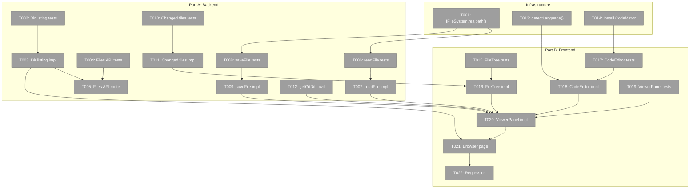
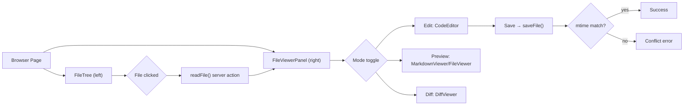
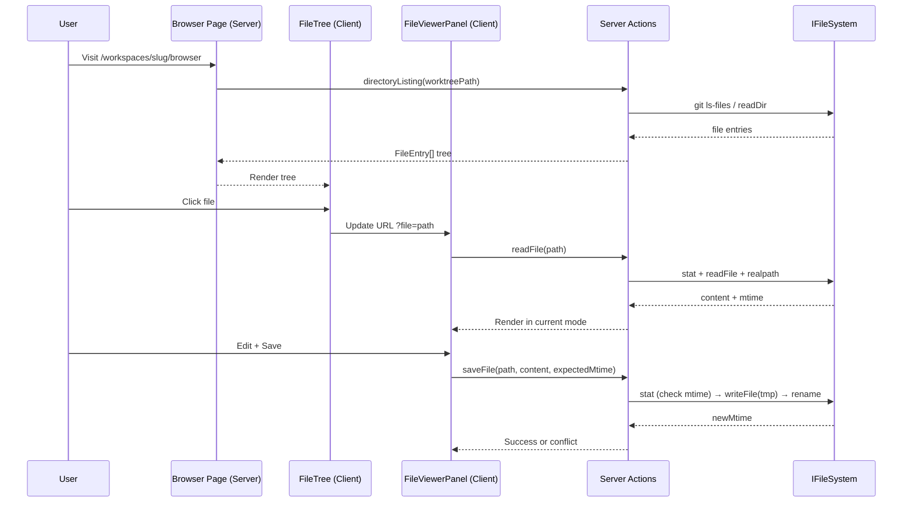

# Phase 4: File Browser — Tasks & Alignment Brief

**Plan**: [file-browser-plan.md](../../file-browser-plan.md)
**Spec**: [file-browser-spec.md](../../file-browser-spec.md)
**Phase**: 4 of 6
**Testing**: Full TDD (fakes only, no mocks)
**File Management**: PlanPak

---

## Executive Briefing

### Purpose
This phase builds the complete file browser — the core feature of Plan 041. Users can navigate workspace files in a tree, view them with syntax highlighting, edit with CodeMirror, preview markdown, and see git diffs. Save detects conflicts via mtime comparison.

### What We're Building
A two-panel file browser at `/workspaces/[slug]/browser`:
- **Left panel**: File tree built from `git ls-files` (respects .gitignore) with expand/collapse, refresh, and "changed only" filter
- **Right panel**: File viewer with three modes — Edit (CodeMirror 6), Preview (MarkdownViewer/FileViewer), Diff (DiffViewer) — plus save with conflict detection

All state (selected file, directory, mode, changed filter) is URL-encoded via nuqs for deep linking.

### User Value
A developer can browse any workspace's files, edit code, preview markdown with mermaid diagrams, and view uncommitted git changes — all from the browser. Every state is bookmarkable.

### Example
**URL**: `/workspaces/chainglass-main/browser?worktree=/home/jak/substrate/041-file-browser&file=src/lib/workspace-url.ts&mode=edit`
**Result**: File tree on left showing workspace files, CodeMirror editor on right with `workspace-url.ts` open for editing.

---

## Objectives & Scope

### Objective
Build the file browser backend (directory listing, file read/write, git integration) and frontend (tree, viewer panel, editor) as specified in plan tasks 4.1–4.22 and spec ACs 20–30, 44–47.

### Goals
- ✅ Directory listing via `git ls-files` with `readDir` fallback
- ✅ File read with size limit (5MB) and binary detection
- ✅ File save with mtime conflict detection and atomic write
- ✅ Changed-files filter via `git diff --name-only`
- ✅ Workspace-scoped `getGitDiff()` extension
- ✅ File tree component with expand/collapse, icons, refresh
- ✅ CodeMirror 6 editor (lazy-loaded, theme-synced)
- ✅ File viewer panel with Edit/Preview/Diff mode toggle
- ✅ Browser page with URL-driven state via nuqs
- ✅ Path traversal prevention + symlink escape check (Finding 02)

### Non-Goals
- ❌ File creation/deletion (browse and edit only)
- ❌ Multi-file editing or tabs
- ❌ Search within files (future feature)
- ❌ Git commit/push from UI
- ❌ Live file watching / SSE (Phase 5 attention system)
- ❌ Mobile-optimized editor (CodeMirror on phone is view-only)

---

## Prior Phase Context

### Phase 1: Data Model & Infrastructure
- Workspace entity with preferences, atomic writes, DI-registered services
- `IWorkspaceService.getInfo(slug)` returns workspace path + worktree info
- `FakeFileSystem`, `FakeWorkspaceRegistryAdapter` for testing
- Pattern: immutable entities, service-layer validation, spread-with-defaults

### Phase 2: Deep Linking & URL State
- `workspaceHref(slug, subPath, options?)` for URL construction
- `fileBrowserParams` with `dir`, `file`, `mode`, `changed` definitions
- `fileBrowserPageParamsCache` for server-side param parsing
- NuqsAdapter wired globally; `useQueryStates` ready for client components
- Gotcha: `workspaceHref(slug, '')` — subPath must be explicit

### Phase 3: UI Overhaul
- Sidebar is workspace-context-aware; WORKSPACE_NAV_ITEMS includes Browser link
- Landing page with workspace cards, worktree starring
- `useAttentionTitle` hook for tab titles
- Pattern: Server Components by default, `<form action>` for mutations
- Pattern: direct DI service calls in server pages (not API routes)

### Existing Infrastructure (from codebase)
- **IFileSystem**: `exists`, `readFile`, `writeFile`, `readDir`, `stat`, `rename` — via DI
- **IPathResolver**: `resolvePath(base, relative)` — throws `PathSecurityError` on traversal
- **GitWorktreeResolver**: `git worktree list --porcelain` detection
- **git-diff-action.ts**: `getGitDiff()` with `execFile` + array args pattern
- **shiki-processor.ts**: Server-side highlighter with `github-light`/`github-dark` themes, 20+ languages
- **highlightCodeAction()**: Server action returning pre-highlighted HTML
- **FileViewer**: Read-only syntax-highlighted code (line numbers, keyboard nav)
- **MarkdownViewer**: Source/preview toggle, mermaid support
- **DiffViewer**: `@git-diff-view/react` + `@git-diff-view/shiki`, unified/split views

---

## Architecture Map



---

## DYK Decisions

| ID | Priority | Decision | Impact |
|----|----------|----------|--------|
| DYK-P4-01 | HIGH | Hybrid data fetching — server props for initial tree + `GET /api/workspaces/[slug]/files` route handler for lazy expansion/refresh/filter | Reinstates API route. FileTree gets initial data server-side, fetches subdirectories on expand. |
| DYK-P4-02 | HIGH | Add `realpath(path): Promise<string>` to IFileSystem + NodeFileSystemAdapter + FakeFileSystem. Cross-plan edit. | Testable symlink escape detection via DI. |
| DYK-P4-03 | HIGH | Lazy-load per directory — `git ls-files -- <dir>` scoped to requested directory. No full tree upfront. | Scales to huge repos (1000s of files). |
| DYK-P4-04 | MEDIUM | CodeEditor: thin wrapper tests, stub CodeMirror dynamic import in jsdom. Justified mock deviation for third-party rendering. | Avoids flaky jsdom issues. Tests contract not internals. |
| DYK-P4-05 | MEDIUM | Shared `detectLanguage(filename): string` utility in `src/lib/`. Both Shiki and CodeMirror consume it. | Single source of truth for language mapping. |

---

## Tasks

| Status | ID | Task | CS | Type | Dependencies | Path(s) | Validation | Notes |
|--------|-----|------|-----|------|-------------|---------|------------|-------|
| [ ] | T001 | Add `realpath()` to IFileSystem + implementations + FakeFileSystem | 2 | Core | – | `packages/shared/src/interfaces/filesystem.interface.ts`, adapters, fakes | Test: FakeFileSystem.realpath() resolves paths, can simulate symlink escape | DYK-P4-02. Cross-plan edit. |
| [ ] | T002 | Write tests for directory listing service (lazy per-dir, DYK-P4-03) | 3 | Test | – | `test/unit/web/features/041-file-browser/directory-listing.test.ts` | Tests: git repo lists tracked files for given dir, non-git uses readDir, `../` → PathSecurityError, empty dir → `{ entries: [] }`, returns entries for requested dir only (not full tree) | DYK-P4-03. Finding 05. |
| [ ] | T003 | Implement directory listing service | 3 | Core | T002 | `apps/web/src/features/041-file-browser/services/directory-listing.ts` | All T002 tests pass. `execFile('git', ['ls-files', '--', dir])` for git, `readDir` fallback. Returns `FileEntry[]` for one directory level. | DYK-P4-03. Finding 05. |
| [ ] | T004 | Write tests for files API route handler | 2 | Test | – | `test/unit/web/features/041-file-browser/files-api.test.ts` | Tests: GET returns `{ entries }`, invalid path → 400, `../` → 403, workspace not found → 404 | DYK-P4-01. Reinstated from plan 4.3. |
| [ ] | T005 | Implement `GET /api/workspaces/[slug]/files` route handler | 2 | Core | T003, T004 | `apps/web/app/api/workspaces/[slug]/files/route.ts` | All T004 tests pass. Uses directory listing service via DI. | DYK-P4-01. AC-44. |
| [ ] | T006 | Write tests for `readFile()` server action | 3 | Test | T001 | `test/unit/web/features/041-file-browser/file-actions.test.ts` | Tests: returns `{ content, mtime, size, language }`, >5MB → `file-too-large`, null-byte → `binary-file`, `../` → PathSecurityError, realpath escape → PathSecurityError, not found → `not-found` | DYK-P4-02. Finding 02, 09. |
| [ ] | T007 | Implement `readFile()` server action | 2 | Core | T006 | `apps/web/app/actions/file-actions.ts` | All T006 tests pass. stat check, null-byte scan, realpath verification via IFileSystem.realpath(). | Finding 02, 09. |
| [ ] | T008 | Write tests for `saveFile()` server action | 3 | Test | T001 | `test/unit/web/features/041-file-browser/file-actions.test.ts` | Tests: save → `{ ok, newMtime }`, mtime mismatch → `{ error: 'conflict', serverMtime }`, force=true overrides, atomic tmp+rename, `../` → PathSecurityError | Finding 06. |
| [ ] | T009 | Implement `saveFile()` server action | 3 | Core | T008 | `apps/web/app/actions/file-actions.ts` | All T008 tests pass. Atomic write: writeFile(tmp) + rename(tmp, target). | Finding 06. |
| [ ] | T010 | Write tests for changed-files filter | 2 | Test | – | `test/unit/web/features/041-file-browser/changed-files.test.ts` | Tests: returns `string[]` of changed paths, empty when clean, non-git → `not-git` error | plan-scoped. |
| [ ] | T011 | Implement changed-files filter | 2 | Core | T010 | `apps/web/src/features/041-file-browser/services/changed-files.ts` | All T010 tests pass. `execFile('git', ['diff', '--name-only'])` with workspace cwd. | plan-scoped. |
| [ ] | T012 | Extend `getGitDiff()` to accept workspace-scoped cwd | 2 | Core | – | `apps/web/src/lib/server/git-diff-action.ts` | Existing tests still pass. Optional `cwd` param added. | cross-plan-edit. AC-47. |
| [ ] | T013 | Extract shared `detectLanguage(filename)` utility | 1 | Core | – | `apps/web/src/lib/language-detection.ts` | Unit tests: .ts→typescript, .md→markdown, .py→python, unknown→plaintext. Shiki processor updated to use it. | DYK-P4-05. cross-cutting. |
| [ ] | T014 | Install `@uiw/react-codemirror` + language extensions | 1 | Setup | – | `apps/web/package.json` | Package installed, `pnpm build` passes. | cross-plan-edit. |
| [ ] | T015 | Write tests for `FileTree` component | 3 | Test | – | `test/unit/web/features/041-file-browser/file-tree.test.tsx` | Tests: renders entries, expand triggers fetch callback, file click fires onSelect, changed-only filter, refresh button, empty state | DYK-P4-01 (receives entries as props, calls onExpand for subdirs). |
| [ ] | T016 | Implement `FileTree` component | 3 | Core | T011, T015 | `apps/web/src/features/041-file-browser/components/file-tree.tsx` | All T015 tests pass. Client component. Lazy-loads subdirectories via onExpand callback. | DYK-P4-01, DYK-P4-03. |
| [ ] | T017 | Write tests for `CodeEditor` wrapper | 2 | Test | T014 | `test/unit/web/features/041-file-browser/code-editor.test.tsx` | Tests: renders without crash, passes language/theme/readOnly/onChange props correctly. CodeMirror stubbed in jsdom. | DYK-P4-04. Justified mock deviation. |
| [ ] | T018 | Implement `CodeEditor` wrapper (lazy-loaded) | 3 | Core | T013, T017 | `apps/web/src/features/041-file-browser/components/code-editor.tsx` | All T017 tests pass. Dynamic import. github-light/dark themes. Uses `detectLanguage()`. | DYK-P4-04, DYK-P4-05. Finding 10. |
| [ ] | T019 | Write tests for `FileViewerPanel` component | 3 | Test | – | `test/unit/web/features/041-file-browser/file-viewer-panel.test.tsx` | Tests: mode toggle (edit/preview/diff), save button in edit, conflict error, refresh, large file/binary messages | plan-scoped. |
| [ ] | T020 | Implement `FileViewerPanel` component | 3 | Core | T007, T009, T012, T016, T018, T019 | `apps/web/src/features/041-file-browser/components/file-viewer-panel.tsx` | All T019 tests pass. Integrates CodeEditor, MarkdownViewer, DiffViewer. Mode buttons update URL. | plan-scoped. |
| [ ] | T021 | Implement browser page (`/workspaces/[slug]/browser`) | 3 | Core | T003, T020 | `apps/web/app/(dashboard)/workspaces/[slug]/browser/page.tsx` | Server Component fetches root entries via DI, passes to FileTree. Two-panel layout. URL state via `fileBrowserPageParamsCache`. | DYK-P4-01. AC-20. |
| [ ] | T022 | Regression verification + `just fft` | 1 | Test | T021 | – | All tests pass. No broken pages. | |

---

## Context Brief

### Critical Findings Affecting This Phase

| Finding | Title | Constraint | Tasks |
|---------|-------|-----------|-------|
| 02 | Symlink Escape Risk | `realpath()` check after path resolution — verify real path is within workspace bounds | T003, T004, T005, T006 |
| 05 | git ls-files Pattern | Use `execFile('git', ['ls-files', '--full-name'])` with array args, fallback to `readDir` | T001, T002 |
| 06 | Save Conflict Race Window | Atomic write: check mtime → writeFile(tmp) → rename(tmp, target). Best-effort, not transactional. | T005, T006 |
| 09 | Large File Handling | `stat().size` check before `readFile()`. 5MB limit. Binary detection via null-byte scan. | T003, T004 |
| 10 | CodeMirror Lazy Load | Dynamic `import()` for CodeMirror. Language extensions on demand. | T014 |

### Reusable from Prior Phases
- `IFileSystem` / `FakeFileSystem` from DI — file operations
- `IPathResolver` / `FakePathResolver` from DI — path validation + security
- `fileBrowserPageParamsCache` — server-side URL param parsing (Phase 2)
- `fileBrowserParams` with `useQueryStates` — client-side URL state (Phase 2)
- `workspaceHref(slug, '/browser', options)` — URL construction (Phase 2)
- `highlightCodeAction(code, lang)` — server-side Shiki highlighting
- `FileViewer`, `MarkdownViewer`, `DiffViewer` — existing viewer components
- `getGitDiff()` — git diff server action (extended in T009)
- `WORKSPACE_NAV_ITEMS` includes Browser link (Phase 3)

### System State Flow



### Actor Interactions



### Test Plan (Full TDD)
- **Backend tests**: Use `FakeFileSystem` and `FakePathResolver` from DI. No real filesystem operations.
- **Security tests**: Verify `../` traversal and symlink escape are rejected.
- **Frontend tests**: Use `@testing-library/react` + `userEvent`. Mock server actions with vi.fn() for component isolation (deviation: Next.js server actions can't be faked without mocking).
- **Integration**: Browser page renders with URL params driving initial state.

### Commands
```bash
just test-feature 041          # Run 041 tests only
just fft                       # Full lint + format + typecheck + test
pnpm dev                       # Dev server on port 3000
```

### Risks
| Risk | Severity | Mitigation |
|------|----------|------------|
| Symlink escape (Finding 02) | Critical | realpath() check in every file action |
| Large file OOM (Finding 09) | High | stat().size check before read |
| CodeMirror bundle size | Medium | Dynamic import, lazy load |
| Save race condition (Finding 06) | Medium | Atomic write, documented as best-effort |

### Ready Check
- [x] Phase 1 complete (workspace data model + DI)
- [x] Phase 2 complete (URL params + workspaceHref)
- [x] Phase 3 complete (sidebar with Browser nav item)
- [x] Existing viewers available (FileViewer, MarkdownViewer, DiffViewer)
- [x] Shiki highlighting available (highlightCodeAction)
- [x] IFileSystem + IPathResolver in DI
- [ ] Phase 4 dossier reviewed and approved

---

## Phase Footnote Stubs

_Populated by plan-6a during implementation._

| Footnote | Task | File(s) | Description |
|----------|------|---------|-------------|

---

## Evidence Artifacts

- Execution log: `execution.log.md`

---

## Discoveries & Learnings

_Populated during implementation by plan-6._

| Date | Task | Type | Discovery | Resolution | References |
|------|------|------|-----------|------------|------------|

**Types**: `gotcha` | `research-needed` | `unexpected-behavior` | `workaround` | `decision` | `debt` | `insight`

---

## Directory Layout

```
docs/plans/041-file-browser/
  ├── file-browser-plan.md
  └── tasks/phase-4-file-browser/
      ├── tasks.md            ← this file
      ├── tasks.fltplan.md    ← flight plan (generated)
      └── execution.log.md    ← created by plan-6
```
