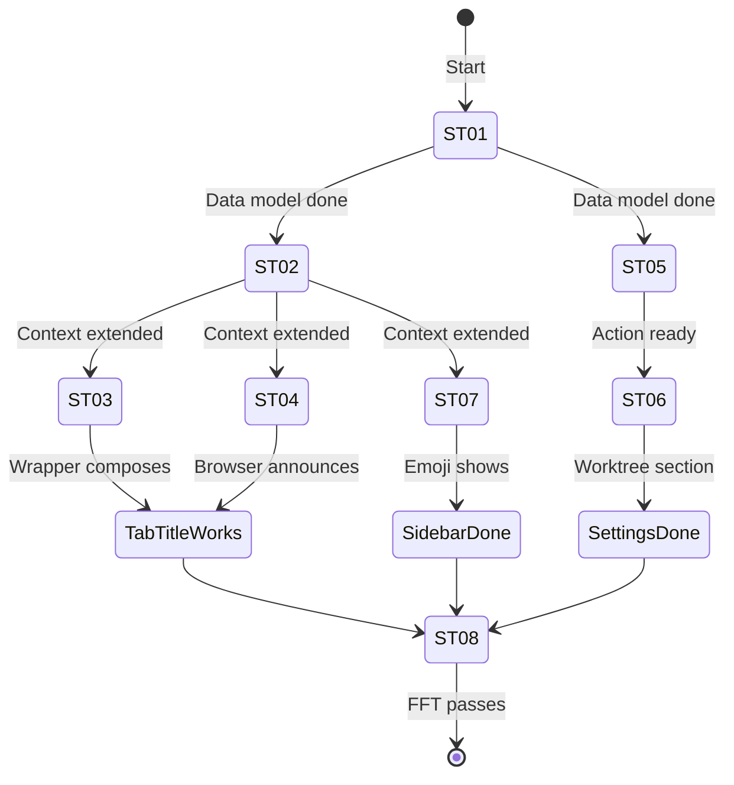
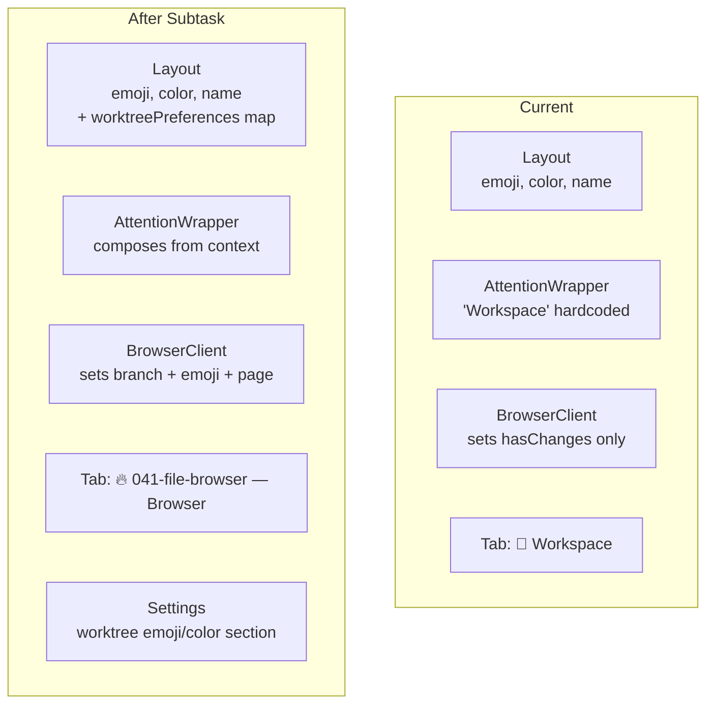

# Flight Plan: Worktree Identity & Tab Titles

**Subtask**: [001-subtask-worktree-identity-tab-titles.md](./001-subtask-worktree-identity-tab-titles.md)
**Plan**: [file-browser-plan.md](../../file-browser-plan.md)
**Status**: Ready

---

## Departure → Destination

**Where we are**: Every workspace page shows `🔮 Workspace` in the tab title. All worktrees from the same workspace look identical. There's no way to set per-worktree emoji/color. The settings page only handles workspace-level preferences.

**Where we're going**: Each tab shows `{worktreeEmoji} {branch} — {page}` (e.g., `🔥 041-file-browser — Browser`). Each worktree can have its own emoji + color set from the settings page. Sidebar shows worktree emoji when available. Missing worktree prefs gracefully fall back to workspace-level identity.

---

## Domain Context

### Domains We're Changing

| Domain | Relationship | What Changes | Key Files |
|--------|-------------|-------------|-----------|
| @chainglass/workflow | modify | `WorktreeVisualPreferences` type, `worktreePreferences` field on `WorkspacePreferences` | `entities/workspace.ts` |
| file-browser | modify | Context extended, attention wrapper rewritten, browser announces identity, settings gains worktree section, new server action | 8 files |

### Domains We Depend On

| Domain | Contract | Usage |
|--------|----------|-------|
| _platform/events | `toast()` | Feedback on worktree pref saves |
| @chainglass/workflow | `IWorkspaceService.updatePreferences()` | Persist worktree prefs |
| @chainglass/workflow | `WORKSPACE_EMOJI_PALETTE`, `WORKSPACE_COLOR_PALETTE` | Picker palettes (via subpath export) |

---

## Flight Status

---

## Stages

- [ ] **Data model** (ST01): Add `worktreePreferences` to `WorkspacePreferences`
- [ ] **Context extension** (ST02): Add worktree branch, emoji, page title to WorkspaceContext
- [ ] **Title composition** (ST03): Attention wrapper builds title from worktree or workspace
- [ ] **Browser wiring** (ST04): Browser page resolves branch + prefs, client announces
- [ ] **Server action** (ST05): `updateWorktreePreferences` action
- [ ] **Settings worktree section** (ST06): Contextual worktree prefs in settings page
- [ ] **Sidebar emoji** (ST07): Prefer worktree emoji when available
- [ ] **Validation** (ST08): Tests + lint + visual verification

---

## Architecture: Before & After

---

## Acceptance

- [ ] Tab title shows worktree branch + page name (not hardcoded "Workspace")
- [ ] Worktree emoji overrides workspace emoji in tab title when set
- [ ] Settings page shows worktree section when accessed with worktree context
- [ ] Worktree emoji/color persist across page refresh
- [ ] Sidebar shows worktree emoji when available
- [ ] Missing worktree prefs gracefully fall back to workspace defaults
- [ ] All tests pass, lint clean

---

## Checklist

| ID | Task | CS |
|----|------|----|
| ST01 | Data model — WorktreeVisualPreferences | 1 |
| ST02 | Context extension — worktree fields | 2 |
| ST03 | Attention wrapper — title composition | 1 |
| ST04 | Browser wiring — resolve + announce | 2 |
| ST05 | Server action — updateWorktreePreferences | 1 |
| ST06 | Settings — worktree section | 2 |
| ST07 | Sidebar — worktree emoji | 1 |
| ST08 | Tests + FFT + visual | 1 |
