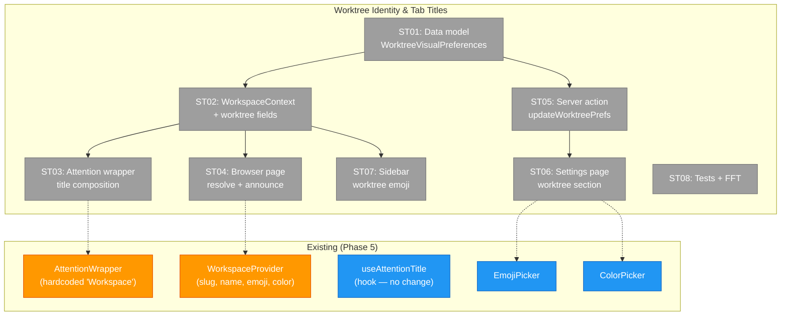
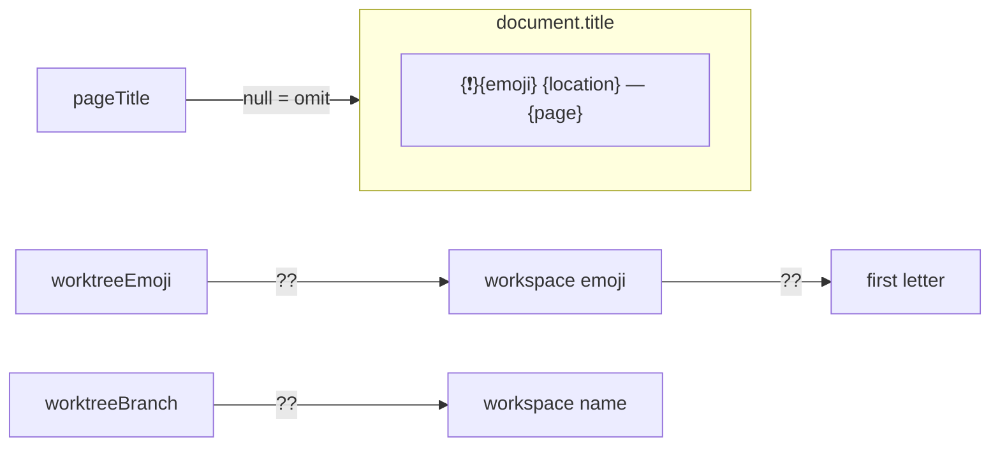

# Subtask: Worktree Identity & Tab Titles

**Parent Phase**: Phase 5: Attention System & Polish
**Parent Task**: T005 (Workspace layout + WorkspaceContext + useAttentionTitle)
**Plan**: [file-browser-plan.md](../../file-browser-plan.md)
**Workshop**: [tab-title-strategy.md](../../workshops/tab-title-strategy.md)
**Created**: 2026-02-24
**Testing Approach**: TDD for data model + context; visual verification for tab titles

---

## Parent Context

Phase 5 delivered WorkspaceContext with workspace-level emoji/color and a hardcoded `pageName: 'Workspace'` for all pages. The tab title shows `🔮 Workspace` regardless of which worktree or page you're on. With multiple tabs open on different worktrees, they're indistinguishable.

This subtask completes the attention system vision: each worktree gets its own emoji + color, and tab titles show `{emoji} {branch} — {page}`.

---

## Executive Briefing

**Purpose**: Make browser tabs instantly identifiable by worktree. Each worktree gets its own emoji + color (stored in workspace preferences). Tab titles compose from worktree identity + page name. Settings page gains a contextual worktree section.

**What We're Building**:
- `worktreePreferences` data model extension on `WorkspacePreferences`
- WorkspaceContext extended with worktree branch, emoji, and page title setters
- Attention wrapper composing titles from worktree-level or workspace-level identity
- Browser page resolving worktree branch + preferences, announcing to context
- Settings page worktree section (when accessed with `?workspace=&worktree=`)
- Server action for saving per-worktree emoji/color

**Goals**:
- ✅ Each worktree can have its own emoji and color
- ✅ Tab titles show `{emoji} {branch} — Browser` when in a worktree
- ✅ Fallback to workspace emoji when worktree has none set
- ✅ Settings page shows worktree section when contextually appropriate
- ✅ Sidebar shows worktree emoji when available

**Non-Goals**:
- ❌ Landing page worktree indicators (deferred per DYK-01)
- ❌ Worktree picker showing per-worktree emojis (future enhancement)
- ❌ Color-based sidebar/border styling per worktree (future)

---

## Pre-Implementation Check

| File | Exists? | Domain Check | Notes |
|------|---------|-------------|-------|
| `packages/workflow/src/entities/workspace.ts` | Yes — modify | @chainglass/workflow | Add WorktreeVisualPreferences type + worktreePreferences field |
| `packages/workflow/src/constants/workspace-palettes.ts` | Yes — no change | @chainglass/workflow | Palettes reused for worktree pickers |
| `packages/workflow/src/services/workspace.service.ts` | Yes — check | @chainglass/workflow | updatePreferences already takes Partial — verify it passes through new field |
| `apps/web/app/actions/workspace-actions.ts` | Yes — modify | file-browser | Add updateWorktreePreferences server action |
| `apps/web/src/features/041-file-browser/hooks/use-workspace-context.tsx` | Yes — modify | file-browser | Add worktreeBranch, worktreeEmoji, pageTitle, setters |
| `apps/web/app/(dashboard)/workspaces/[slug]/workspace-attention-wrapper.tsx` | Yes — modify | file-browser | Compose title from worktree or workspace identity |
| `apps/web/app/(dashboard)/workspaces/[slug]/layout.tsx` | Yes — modify | file-browser | Pass worktreePreferences map to provider |
| `apps/web/app/(dashboard)/workspaces/[slug]/browser/page.tsx` | Yes — modify | file-browser | Resolve worktree branch + prefs, pass to client |
| `apps/web/app/(dashboard)/workspaces/[slug]/browser/browser-client.tsx` | Yes — modify | file-browser | Set worktreeBranch + pageTitle in context |
| `apps/web/app/(dashboard)/settings/workspaces/page.tsx` | Yes — modify | file-browser | Accept workspace/worktree params, show worktree section |
| `apps/web/app/(dashboard)/settings/workspaces/workspace-settings-table.tsx` | Yes — modify | file-browser | Add worktree prefs section |
| `apps/web/src/components/dashboard-sidebar.tsx` | Yes — modify | file-browser | Read worktree emoji from context when available |
| `test/unit/web/features/041-file-browser/workspace-context.test.tsx` | Yes — modify | file-browser | Add tests for new context fields |

---

## Architecture Map



---

## DYK Decisions

| ID | Decision | Impact |
|----|----------|--------|
| DYK-ST-01 | Server action does read-modify-write with deep merge for worktreePreferences (shallow spread in withPreferences would clobber) | ST05: action loads workspace, merges single entry, writes complete map |
| DYK-ST-02 | Single `setWorktreeIdentity({ branch, emoji, color, pageTitle })` replaces 4 individual setters | ST02: cleaner API, one render instead of four |
| DYK-ST-03 | Inline gear popover in browser sidebar replaces separate settings page worktree section | ST06 eliminated. New: gear icon in sidebar header opens emoji/color pickers in-context |
| DYK-ST-04 | Provider resolves worktree prefs from map internally — pages just pass `(worktreePath, branch, pageTitle)` | ST02/ST04: no pref lookup in pages, provider owns fallback logic |
| DYK-ST-05 | `router.refresh()` after saving worktree prefs — layout re-renders with fresh data | Simpler than optimistic update; slight flicker acceptable |

---

## Tasks

| Status | ID | Task | Domain | Path(s) | Done When | Notes |
|--------|-----|------|--------|---------|-----------|-------|
| [x] | ST01 | Add `WorktreeVisualPreferences` type and `worktreePreferences: Record<string, WorktreeVisualPreferences>` to `WorkspacePreferences`. Update `DEFAULT_PREFERENCES`. | @chainglass/workflow | `packages/workflow/src/entities/workspace.ts` | Type exists, defaults to `{}`, existing tests pass. Service's `updatePreferences` passes through new field without validation errors. | Superset change — no migration needed. Missing key = workspace fallback. |
| [x] | ST02 | Extend WorkspaceContext: add `worktreeIdentity` state (branch, emoji, color, pageTitle) + `setWorktreeIdentity(partial \| null)`. Provider accepts `worktreePreferences` map and resolves emoji/color internally with workspace fallbacks (DYK-ST-02, DYK-ST-04). Write tests. | file-browser | `apps/web/src/features/041-file-browser/hooks/use-workspace-context.tsx`, `test/unit/web/features/041-file-browser/workspace-context.test.tsx` | Tests: setWorktreeIdentity sets all fields, null clears, provider resolves emoji from worktreePreferences map with fallback to workspace emoji. | One setter, one render. Provider owns resolution logic. |
| [x] | ST03 | Update attention wrapper to compose title: `{attention}{emoji} {branch\|name} — {page}`. Emoji from worktreeIdentity.emoji (already resolved by provider). Location from worktreeIdentity.branch or workspace name. Page from worktreeIdentity.pageTitle. | file-browser | `apps/web/app/(dashboard)/workspaces/[slug]/workspace-attention-wrapper.tsx` | Tab shows `🔥 041-file-browser — Browser` when worktree identity set. Shows `🔮 substrate` when only workspace context. | Uses existing useAttentionTitle hook — just changes what pageName is composed from. |
| [x] | ST04 | Browser page: resolve worktree branch name server-side. Pass `worktreeBranch` to BrowserClient. BrowserClient calls `ctx.setWorktreeIdentity({ branch, pageTitle: 'Browser' })` — provider resolves emoji/color from map (DYK-ST-04). Cleanup on unmount. | file-browser | `apps/web/app/(dashboard)/workspaces/[slug]/browser/page.tsx`, `apps/web/app/(dashboard)/workspaces/[slug]/browser/browser-client.tsx` | Tab title shows branch name + "Browser". Worktree emoji used if set. `null` on unmount. | Page passes `worktreeBranch` and `worktreePath` as props. Client sets identity. |
| [x] | ST05 | Add `updateWorktreePreferences` server action. Loads workspace, deep-merges single worktree entry into existing `worktreePreferences` map, writes full map via `updatePreferences()` (DYK-ST-01). Revalidates workspace path. | file-browser | `apps/web/app/actions/workspace-actions.ts` | Action saves worktree prefs, read-modify-write prevents clobbering. Validation: emoji in palette or empty, color in palette or empty. | Reuse existing palette validation constants. |
| [x] | ST06 | Inline worktree identity popover — gear icon in sidebar header (when in worktree). Opens popover with EmojiPicker + ColorPicker for current worktree. Saves via ST05 action, then `router.refresh()` (DYK-ST-03, DYK-ST-05). | file-browser | `apps/web/src/components/dashboard-sidebar.tsx` | Gear icon visible when worktree active. Click opens popover with pickers. Save persists and refreshes. | Replaces separate settings page worktree section. Uses existing EmojiPicker + ColorPicker. |
| [x] | ST07 | Sidebar header: show resolved worktree emoji + branch instead of workspace emoji + name when worktreeIdentity is set. | file-browser | `apps/web/src/components/dashboard-sidebar.tsx` | Sidebar shows `🔥 041-file-browser` when worktree has identity, `🔮 substrate` otherwise. | Reads from `ctx.worktreeIdentity` — emoji already resolved by provider. |
| [x] | ST08 | Run `just lint && just format && pnpm test`. Visual verification: open browser in worktree, set worktree emoji via gear popover, confirm tab title + sidebar update after refresh. | file-browser | — | All tests pass, lint clean. Tab title visually confirmed with worktree emoji + branch. | Verify with Next.js MCP `get_errors` too. |

---

## Context Brief

### Key findings

- **WorkspacePreferences is a superset schema** — adding `worktreePreferences` requires no migration. Missing field defaults to `{}` via spread-with-defaults pattern (Plan 041 spec AC-41).
- **`updatePreferences` takes `Partial<WorkspacePreferences>`** — the service already passes through unknown fields to the registry. Verify it handles nested objects.
- **Next.js layouts don't receive searchParams** — worktree resolution must happen in the page, not layout. Layout passes the full `worktreePreferences` map; page picks the right entry.
- **EmojiPicker + ColorPicker already exist** — reuse directly in settings page worktree section.
- **Browser page already resolves `worktreePath`** from searchParams — just needs to also resolve branch name from `info.worktrees`.

### Domain dependencies

- `@chainglass/workflow`: `WorkspacePreferences`, `Worktree.branch`, `IWorkspaceService.updatePreferences()`, palette constants
- `file-browser`: WorkspaceContext, useAttentionTitle, EmojiPicker, ColorPicker
- `_platform/events`: `toast()` — feedback on worktree pref saves

### Emoji resolution order

```
worktreePreferences[path].emoji → workspace.emoji → branch[0].toUpperCase()
```

### Title composition



### Data flow

```mermaid
sequenceDiagram
    participant Layout as [slug]/layout.tsx
    participant Page as browser/page.tsx
    participant Client as BrowserClient
    participant Ctx as WorkspaceContext
    participant Wrapper as AttentionWrapper
    participant Title as document.title

    Layout->>Ctx: emoji, color, worktreePreferences map
    Page->>Client: worktreeBranch, worktreeEmoji, worktreeColor
    Client->>Ctx: setWorktreeBranch('041-file-browser')
    Client->>Ctx: setWorktreeEmoji('🔥')
    Client->>Ctx: setPageTitle('Browser')
    Wrapper->>Ctx: read all fields
    Wrapper->>Title: "🔥 041-file-browser — Browser"
```

---

## Discoveries & Learnings

_Populated during implementation by plan-6._

| Date | Task | Type | Discovery | Resolution | References |
|------|------|------|-----------|------------|------------|

---

## After Subtask Completion

Phase 5 T005 is already marked complete. This subtask extends it. After implementation:
1. Update Phase 5 tasks.md T005 notes to reference this subtask
2. Update execution.log.md with commit
3. Update domain docs if contract surface changed (WorkspaceContext gains new fields)

---

## Directory Layout

```
docs/plans/041-file-browser/
  ├── file-browser-plan.md
  ├── workshops/tab-title-strategy.md
  └── tasks/phase-5-attention-system-polish/
      ├── tasks.md
      ├── tasks.fltplan.md
      ├── execution.log.md
      └── 001-subtask-worktree-identity-tab-titles.md  ← this file
```
