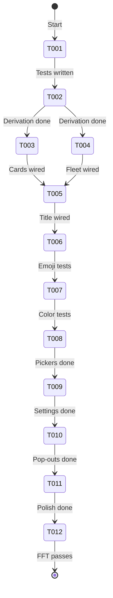
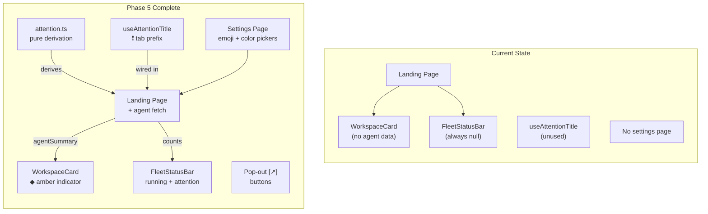

# Flight Plan: Phase 5 — Attention System & Polish

**Phase**: [tasks.md](./tasks.md)
**Plan**: [file-browser-plan.md](../../file-browser-plan.md)
**Status**: Ready

---

## Departure → Destination

**Where we are**: The file browser is fully functional (Phases 1-4 complete). Workspace cards, fleet status bar, and attention title hook exist as rendered components, but they receive no real agent data — FleetStatusBar always returns null, WorkspaceCard never shows the amber indicator, and useAttentionTitle is not called anywhere. The `/settings/workspaces` page doesn't exist. No pop-out buttons exist.

**Where we're going**: Agent errors are visible at every UI layer — landing page cards glow amber with ◆, fleet status bar shows "N needs attention" with click-to-navigate, and browser tabs show ❗ prefix. Users can customize workspace emoji and color from a dedicated settings page. Key items have pop-out buttons for opening in new tabs. All pages verified responsive.

**Concrete outcomes**:
1. Landing page shows live agent status per workspace
2. Fleet status bar is visible when agents are running/errored
3. Browser tab title updates dynamically with attention state
4. `/settings/workspaces` page with emoji/color pickers
5. Pop-out buttons on file viewer + agent list

---

## Domain Context

### Domains We're Changing

| Domain | Relationship | What Changes | Key Files |
|--------|-------------|-------------|-----------|
| file-browser | modify | Attention derivation service, settings page, pop-out buttons, wiring existing components | `services/attention.ts`, `app/settings/workspaces/page.tsx`, `components/emoji-picker.tsx`, `components/color-picker.tsx` |

### Domains We Depend On

| Domain | Contract | Usage |
|--------|----------|-------|
| _platform/notifications | `toast()` | Settings mutation feedback |
| _platform/workspace-url | `workspaceHref()` | Pop-out URLs, firstAttentionHref |
| Agent system (informal) | `IAgentManagerService.getAgents()` | Agent data for attention derivation |

---

## Flight Status

---

## Stages

- [ ] **Attention derivation** (T001-T002): Pure functions for agent status analysis
- [ ] **Wire attention into UI** (T003-T005): Connect real data to existing components
- [ ] **Picker components** (T006-T008): EmojiPicker + ColorPicker with TDD
- [ ] **Settings page** (T009): `/settings/workspaces` with pickers and workspace management
- [ ] **Pop-out + polish** (T010-T011): External link buttons, responsive verification
- [ ] **Validation** (T012): Full `just fft` pass

---

## Architecture: Before & After

---

## Acceptance Criteria

- [ ] AC-31: Workspace cards show amber ◆ when agents have errors
- [ ] AC-32: Fleet status bar shows "◆ N needs attention" — clickable
- [ ] AC-33: Browser tab title prefixed with ❗ when workspace needs attention
- [ ] AC-34: Attention indicators are state-driven, auto-clear when resolved
- [ ] AC-5: Star toggle wired (already works — verify still functional)
- [ ] AC-15: Settings page for emoji/color management
- [ ] Pop-out buttons on key items
- [ ] All pages responsive at 375/768/1440px
- [ ] `just fft` passes

---

## Goals & Non-Goals

**Goals**: Wire attention data, settings page, pop-out buttons, responsive polish

**Non-Goals**: SSE live-update, full phone layout redesign, agent interaction from workspace pages

---

## Checklist

| ID | Task | CS |
|----|------|----|
| T001 | Test attention derivation | 1 |
| T002 | Implement attention derivation | 1 |
| T003 | Wire attention into landing page | 2 |
| T004 | Wire emoji into sidebar | 2 |
| T005 | Wire useAttentionTitle | 1 |
| T006 | Test EmojiPicker | 2 |
| T007 | Test ColorPicker | 2 |
| T008 | Implement pickers | 2 |
| T009 | Settings page | 3 |
| T010 | Pop-out buttons | 1 |
| T011 | Responsive polish | 2 |
| T012 | Full test suite | 1 |
