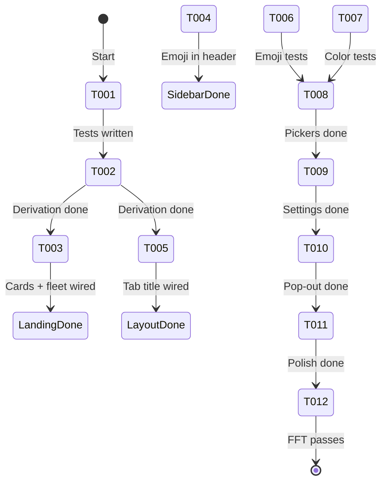
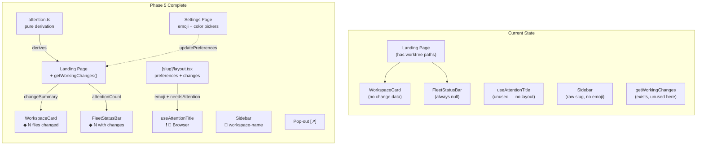

# Flight Plan: Phase 5 — Attention System & Polish

**Phase**: [tasks.md](./tasks.md)
**Plan**: [file-browser-plan.md](../../file-browser-plan.md)
**Status**: Ready
**Refreshed**: 2026-02-24 — Attention source pivoted from agents to file changes

---

## Departure → Destination

**Where we are**: The file browser is fully functional (Phases 1-4 + Plans 043, 044, 046 complete). Workspace cards, fleet status bar, and attention title hook exist as rendered components, but they receive no real data — FleetStatusBar always returns null, WorkspaceCard never shows the amber indicator, and useAttentionTitle is not called anywhere. `getWorkingChanges()` (Plan 043) returns `ChangedFile[]` per worktree. No `[slug]/layout.tsx` exists. The `/settings/workspaces` page doesn't exist. No pop-out buttons exist. Sidebar shows raw decoded slug instead of emoji + workspace name.

**Where we're going**: Uncommitted file changes are visible at every UI layer — landing page cards show "◆ N files changed" with amber border, fleet status bar shows "◆ N workspaces with changes" with click-to-navigate, and browser tabs show ❗ prefix when changes exist. Users can customize workspace emoji and color from a dedicated settings page. The file viewer has a pop-out button. All pages verified responsive.

**Concrete outcomes**:
1. Landing page shows per-workspace change status via `getWorkingChanges()` per worktree
2. Fleet status bar is visible when any workspace has uncommitted changes
3. Browser tab title updates dynamically with emoji + attention state (via new `[slug]/layout.tsx`)
4. Sidebar header shows workspace emoji + name (Phase 3 debt FT-006)
5. `/settings/workspaces` page with emoji/color pickers
6. Pop-out button on file viewer header

---

## Domain Context

### Domains We're Changing

| Domain | Relationship | What Changes | Key Files |
|--------|-------------|-------------|-----------|
| file-browser | modify | Attention derivation from file changes, workspace layout, settings page, pop-out button, changeSummary prop on WorkspaceCard | `services/attention.ts`, `app/workspaces/[slug]/layout.tsx`, `app/settings/workspaces/page.tsx`, `components/emoji-picker.tsx`, `components/color-picker.tsx`, `components/workspace-card.tsx` |

### Domains We Depend On

| Domain | Contract | Usage |
|--------|----------|-------|
| _platform/events | `toast()` | Settings mutation feedback |
| _platform/workspace-url | `workspaceHref()` | Pop-out URLs, firstAttentionHref |
| file-browser (own) | `getWorkingChanges()`, `ChangedFile` | Data source for attention derivation |
| @chainglass/workflow | `IWorkspaceService`, `WorkspacePreferences`, palette constants | Workspace data, emoji/color palettes |

---

## Flight Status

---

## Stages

- [ ] **Attention derivation** (T001-T002): Pure functions for file change aggregation
- [ ] **Wire attention into landing page** (T003): Connect `getWorkingChanges()` → cards + fleet bar
- [ ] **Wire sidebar + layout** (T004-T005): Emoji in sidebar header, workspace layout with useAttentionTitle
- [ ] **Picker components** (T006-T008): EmojiPicker + ColorPicker with TDD
- [ ] **Settings page** (T009): `/settings/workspaces` with pickers and workspace management
- [ ] **Pop-out + polish** (T010-T011): External link button, responsive verification
- [ ] **Validation** (T012): Full `just fft` pass

---

## Architecture: Before & After

---

## Acceptance Criteria

- [ ] AC-31 (adapted): Workspace cards show amber ◆ when workspace has uncommitted changes
- [ ] AC-32 (adapted): Fleet status bar shows "◆ N workspaces with changes" — clickable
- [ ] AC-33: Browser tab title prefixed with ❗ when workspace has changes
- [ ] AC-34: Attention indicators are state-driven, reflect current git status
- [ ] AC-5: Star toggle wired (already works — verify still functional)
- [ ] AC-15: Settings page for emoji/color management
- [ ] Sidebar header shows workspace emoji + name
- [ ] Pop-out button on file viewer
- [ ] All pages responsive at 375/768/1440px
- [ ] `just fft` passes

---

## Goals & Non-Goals

**Goals**: Wire file-change attention data, workspace layout, emoji sidebar, settings page, pop-out button, responsive polish

**Non-Goals**: Agent status wiring (future), SSE live-update on landing page, full phone layout redesign, agent interaction

---

## Checklist

| ID | Task | CS |
|----|------|----|
| T001 | Test attention derivation (file changes) | 1 |
| T002 | Implement attention derivation | 1 |
| T003 | Wire change data into landing page | 2 |
| T004 | Wire emoji into sidebar | 2 |
| T005 | Workspace layout + useAttentionTitle | 2 |
| T006 | Test EmojiPicker | 2 |
| T007 | Test ColorPicker | 2 |
| T008 | Implement pickers | 2 |
| T009 | Settings page | 3 |
| T010 | Pop-out button | 1 |
| T011 | Responsive polish | 2 |
| T012 | Full test suite | 1 |
