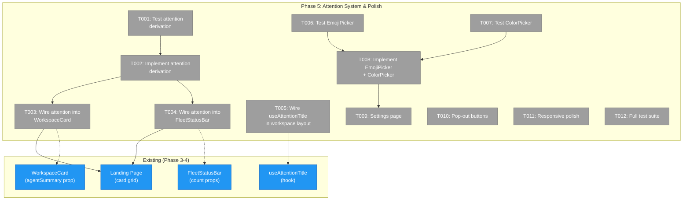
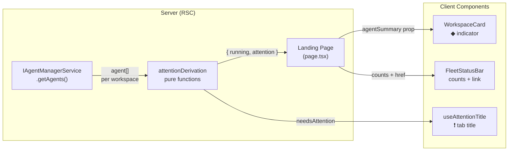
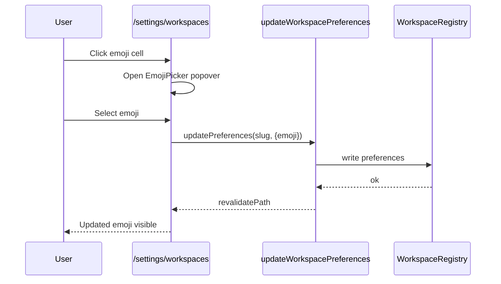

# Phase 5: Attention System & Polish — Tasks

**Plan**: [file-browser-plan.md](../../file-browser-plan.md)
**Phase**: 5 of 6
**Testing Approach**: Full TDD
**Created**: 2026-02-24

---

## Executive Briefing

**Purpose**: Wire the attention system end-to-end — deriving agent attention state per workspace and bubbling it through the UI layers (workspace card → fleet status bar → browser tab title). Also deliver the workspace settings page with emoji/color pickers and pop-out buttons.

**What We're Building**:
- Server-side attention derivation functions that query agent status per workspace
- Wiring real agent data into WorkspaceCard and FleetStatusBar components (props already exist but unused)
- Activating useAttentionTitle hook in workspace layout pages
- A `/settings/workspaces` page with emoji picker, color picker, star toggle, remove action
- Pop-out `[↗]` buttons on agent list items and file viewer header
- Final responsive polish pass across all pages

**Goals**:
- ✅ Agent errors/questions are visible at a glance on the landing page
- ✅ Fleet status bar shows running count + attention count with navigation
- ✅ Browser tab title reflects attention state with ❗ prefix
- ✅ Users can customize workspace emoji and color from settings
- ✅ Key items have pop-out buttons for opening in new tabs

**Non-Goals**:
- ❌ SSE live-update of agent status on landing page (OOS — polling or manual refresh is fine for now)
- ❌ Full workspace CRUD (add/remove from settings — add is already on landing page)
- ❌ Responsive phone layout (bottom tab bar etc. — Phase 5 does a polish pass, not a full phone rebuild)
- ❌ Agent chat/interaction from workspace pages

---

## Prior Phase Context

### Phase 3: UI Overhaul — Landing Page & Sidebar (COMPLETE)

**A. Deliverables**:
- `workspace-card.tsx` — Server Component, accepts optional `agentSummary` prop (NOT wired)
- `fleet-status-bar.tsx` — Server Component, accepts optional counts (NOT wired, renders null)
- `worktree-picker.tsx` — Client Component, searchable workspace picker
- `use-attention-title.ts` — Hook for browser tab title with ❗ prefix (NOT wired in workspace layout)
- Landing page `page.tsx` — Workspace card grid, starred-first, direct DI service calls
- Sidebar restructured — workspace-scoped sections, dev section collapsed

**B. Dependencies Exported**:
- `WorkspaceCardProps.agentSummary?: { running: number; attention: number }` — ready to consume
- `FleetStatusBarProps: { runningCount?, attentionCount?, firstAttentionHref? }` — ready to consume
- `useAttentionTitle({ emoji, pageName, workspaceName, needsAttention })` — ready to call
- `WORKSPACE_NAV_ITEMS`, `DEV_NAV_ITEMS`, `LANDING_NAV_ITEMS` — navigation constants

**C. Gotchas & Debt**:
- `workspaceHref(slug)` without subPath appends "undefined" — must pass `''`
- Sidebar header shows decoded slug only — emoji/display name not yet wired (FT-006)
- `useAttentionTitle` not wired into workspace layout yet (FT-007)
- `toggleWorkspaceStar` is silent on failure — no toast feedback

**D. Incomplete Items**: None — all 14 tasks complete.

**E. Patterns to Follow**: Server Components by default, form actions for mutations, props-only presentational components, direct DI in Server Components, `workspaceHref()` for all URL construction.

### Phase 4: File Browser (COMPLETE)

**A. Deliverables**:
- File tree, code editor, file viewer panel, browser page (two-panel layout)
- Server actions: readFile, saveFile, fetchGitDiff, fetchChangedFiles
- API route: `GET /api/workspaces/[slug]/files` for lazy directory listing
- Context menus, clipboard operations, download, toast wiring

**B. Dependencies Exported**:
- File browser URL params (`fileBrowserParams`, `fileBrowserPageParamsCache`)
- `CodeEditor` — lazy-loaded CodeMirror wrapper
- `FileViewerPanel` — Edit/Preview/Diff modes
- Toast pattern via sonner for save operations

**C. Gotchas & Debt**:
- `navigator.clipboard.writeText` requires HTTPS — fallback with setTimeout(0) + textarea
- Radix portals steal focus — async/setTimeout pattern for clipboard in onSelect
- CodeMirror must be lazy-loaded (jsdom can't instantiate)

**D. Incomplete Items**: None — all 22 tasks complete.

**E. Patterns to Follow**: Hybrid server/client boundary, atomic writes, mtime conflict detection, lazy component imports, callback pattern for context menu.

---

## Pre-Implementation Check

| File | Exists? | Domain Check | Notes |
|------|---------|-------------|-------|
| `features/041-file-browser/services/attention.ts` | No — create | file-browser | New: attention derivation functions |
| `features/041-file-browser/components/emoji-picker.tsx` | No — create | file-browser | New: palette grid component |
| `features/041-file-browser/components/color-picker.tsx` | No — create | file-browser | New: color swatch component |
| `app/(dashboard)/settings/workspaces/page.tsx` | No — create | file-browser | New: settings route |
| `app/(dashboard)/page.tsx` | Yes — modify | file-browser | Wire agent data into cards + fleet bar |
| `features/041-file-browser/components/workspace-card.tsx` | Yes — modify | file-browser | Amber border styling already exists |
| `features/041-file-browser/components/fleet-status-bar.tsx` | Yes — modify | file-browser | Props already defined |
| `features/041-file-browser/hooks/use-attention-title.ts` | Yes — no change | file-browser | Already implemented |
| `app/(dashboard)/workspaces/[slug]/layout.tsx` | May not exist — check/create | file-browser | Wire useAttentionTitle |
| `components/dashboard-sidebar.tsx` | Yes — modify | file-browser | Wire emoji in header |
| `features/041-file-browser/components/file-viewer-panel.tsx` | Yes — modify | file-browser | Add pop-out button |
| `packages/workflow/src/constants/workspace-palettes.ts` | Yes — no change | _platform | Already has EMOJI_PALETTE + COLOR_PALETTE |

---

## Architecture Map



---

## Tasks

| Status | ID | Task | Domain | Path(s) | Done When | Notes |
|--------|-----|------|--------|---------|-----------|-------|
| [ ] | T001 | Write tests for attention derivation — `workspaceNeedsAttention(agents)`, `attentionCount(agents)`, `runningCount(agents)` | file-browser | `test/unit/web/features/041-file-browser/attention.test.ts` | Tests: no agents=false, all stopped=false, one error=true, one working=running, count matches agent list | Agent status: `'working'`, `'stopped'`, `'error'` per AgentInstanceStatus |
| [ ] | T002 | Implement attention derivation functions | file-browser | `apps/web/src/features/041-file-browser/services/attention.ts` | All T001 tests pass. Pure functions, no side effects. | Input: array of `{ status: AgentInstanceStatus }`. attention = status === 'error'. |
| [ ] | T003 | Wire real agent data into landing page — fetch agents per workspace, pass `agentSummary` to WorkspaceCard, pass counts to FleetStatusBar | file-browser | `apps/web/app/(dashboard)/page.tsx` | Cards show amber ◆ when workspace has errored agents. Fleet bar shows running + attention counts. firstAttentionHref links to first affected workspace. | Server Component — call `GET /api/agents` or use DI directly. Derive summary using T002 functions. |
| [ ] | T004 | Wire emoji into sidebar header — show workspace emoji before name | file-browser | `apps/web/src/components/dashboard-sidebar.tsx` | Sidebar header shows emoji + workspace name when scoped to workspace. Falls back to first letter when no emoji. | Phase 3 debt item FT-006. Need to fetch workspace preferences in sidebar. |
| [ ] | T005 | Wire `useAttentionTitle` in workspace layout — pass emoji + workspace name + needsAttention from agent data | file-browser | `apps/web/app/(dashboard)/workspaces/[slug]/layout.tsx` or nearest client wrapper | Tab title shows "🔮 Browser" format. Shows "❗ 🔮 Browser" when workspace has attention. | Phase 3 debt item FT-007. useAttentionTitle is client-only — need client component wrapper or layout context. |
| [ ] | T006 | Write tests for EmojiPicker — renders palette grid, click selects, current highlighted, curated set from WORKSPACE_EMOJI_PALETTE | file-browser | `test/unit/web/features/041-file-browser/emoji-picker.test.tsx` | Tests: renders 30 emojis, click calls onSelect, current emoji visually distinguished, no custom emoji input | Simple popover with grid layout |
| [ ] | T007 | Write tests for ColorPicker — renders color swatches, click selects, current highlighted, works in light+dark mode | file-browser | `test/unit/web/features/041-file-browser/color-picker.test.tsx` | Tests: renders 10 color swatches, click calls onSelect, current color visually distinguished, swatches use palette hex values | Use WORKSPACE_COLOR_PALETTE light/dark values |
| [ ] | T008 | Implement EmojiPicker and ColorPicker components | file-browser | `apps/web/src/features/041-file-browser/components/emoji-picker.tsx`, `apps/web/src/features/041-file-browser/components/color-picker.tsx` | All T006+T007 tests pass. Grid layout, popover-based, accessible. | Client Components — use Popover from shadcn. Import palette constants. |
| [ ] | T009 | Implement `/settings/workspaces` page — table with: emoji (clickable picker), color (clickable picker), name, path, star toggle, remove button | file-browser | `apps/web/app/(dashboard)/settings/workspaces/page.tsx` | Page renders workspace table. Clicking emoji opens picker, saves via server action. Same for color. Star toggle works. Remove with confirmation. Deep-linkable at `/settings/workspaces`. | Server Component wrapper + Client table for interactivity. Use updateWorkspacePreferences server action. Add "Settings" to sidebar nav. |
| [ ] | T010 | Add pop-out `[↗]` buttons to file viewer header and agent list items | file-browser | `apps/web/src/features/041-file-browser/components/file-viewer-panel.tsx`, `apps/web/app/(dashboard)/workspaces/[slug]/agents/` | Pop-out button opens deep-linked URL in new tab via `window.open()`. File viewer: opens current file in new tab. Agent list: opens agent detail in new tab. | Use workspaceHref() for URL construction. Small button, minimal footprint. |
| [ ] | T011 | Responsive polish pass — verify all pages at 375px, 768px, 1440px | file-browser | Various | All pages render correctly at 3 breakpoints. No horizontal overflow, no cut-off content, touch targets ≥44px on mobile. | Use browser MCP for screenshots. Focus on landing page, file browser, settings page. |
| [ ] | T012 | Run `just fft` — full lint, format, typecheck, test | file-browser | — | Zero failures. All new + existing tests pass. | Final gate before commit. |

---

## Context Brief

### Key findings from plan

- **Finding: AgentInstanceStatus is 3-state** (`working` | `stopped` | `error`). "Needs attention" maps to `status === 'error'`. No "asks question" status exists in the type — questions come via SSE events, not agent status. For Phase 5, attention = error status only.
- **Finding: Components already accept props** — WorkspaceCard takes `agentSummary`, FleetStatusBar takes counts, useAttentionTitle takes `needsAttention`. The UI rendering is done — Phase 5 just wires the data.
- **Finding: Agent API exists** — `GET /api/agents?workspace=<slug>` returns agents filtered by workspace. Server-side DI: `IAgentManagerService.getAgents({ workspace })`.
- **Finding: Palette constants exist** — `WORKSPACE_EMOJI_PALETTE` (30 emojis), `WORKSPACE_COLOR_PALETTE` (10 colors with light/dark hex). Validation in service layer via `WORKSPACE_EMOJI_SET` / `WORKSPACE_COLOR_NAMES`.
- **Finding: updateWorkspacePreferences server action exists** — already wired for partial preference updates. Used by `toggleWorkspaceStar` form action.

### Domain dependencies

- `_platform/notifications`: `toast()` — feedback on settings mutations
- `_platform/workspace-url`: `workspaceHref()` — URL construction for pop-out buttons and firstAttentionHref
- `_platform/file-ops`: None directly (attention is about agents, not files)
- Agent system (not formalized as domain): `IAgentManagerService.getAgents()`, `AgentInstanceStatus` type

### Domain constraints

- All new UI components go in `features/041-file-browser/`
- Settings page route goes in `app/(dashboard)/settings/workspaces/`
- Attention derivation is pure business logic — no side effects, easily testable
- Import palette constants from `packages/workflow/src/constants/workspace-palettes.ts`

### Reusable from prior phases

- **WorkspaceCard** (Phase 3): Already renders `agentSummary` — just need to pass real data
- **FleetStatusBar** (Phase 3): Already renders counts — just need to pass real data
- **useAttentionTitle** (Phase 3): Already implemented — just need to call it
- **Existing tests** (Phase 3): 34 tests for card/fleet/attention — they test component rendering, we test data derivation
- **Toast pattern** (Phase 4 / Plan 042): `toast.success()` / `toast.error()` for settings mutations
- **Server action pattern** (Phase 3): `toggleWorkspaceStar` shows form action + revalidation pattern

### Data flow diagram



### Settings page flow



---

## Discoveries & Learnings

_Populated during implementation by plan-6._

| Date | Task | Type | Discovery | Resolution | References |
|------|------|------|-----------|------------|------------|

---

## Directory Layout

```
docs/plans/041-file-browser/
  ├── file-browser-plan.md
  └── tasks/phase-5-attention-system-polish/
      ├── tasks.md              ← this file
      ├── tasks.fltplan.md      ← generated next
      └── execution.log.md      # created by plan-6
```
